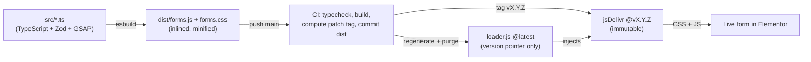
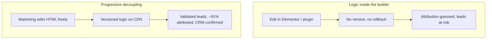

> [!tip] In 30 seconds
> - **Who this is for:** Engineers and marketing leads on WordPress/Elementor sites where the forms *are* the revenue surface, and a form-builder plugin can't carry the validation, attribution, and CRM logic the business actually needs.
> - **Problem it solves:** Conversion-critical logic trapped inside a page builder: no versioning, no rollback, no real Salesforce integration, attribution silently dropped. One bad publish costs real leads.
> - **What changes if you apply this:** Elementor keeps only the HTML; a versioned library on a CDN owns validation (Zod), attribution, and the Salesforce handoff. Immutable releases with one-pointer rollback. In a recent 90-day window the surface carried **5,827 real leads across ~10 LATAM markets**, with **webinar registration the single largest source (2,237 leads)** and **~91% of leads carrying UTM attribution**.

A prospect in Bogotá fills out a webinar form on the ATFX LATAM site and clicks register. A Zoom tab opens, but only ==after Salesforce confirms the lead was saved.== If Salesforce had failed, the tab would have closed and the form would have shown the error inline.

Nothing about that interaction lives in the page builder. Elementor rendered the `<form>` and its fields, and that is all it owns. Validation, marketing attribution, the POST to WordPress, the Salesforce handoff, and the decision to open Zoom are a ==versioned TypeScript library served from a CDN,== mounted by a single attribute. The page builder cannot break the logic, and the logic does not care how the page builder renders.

This is the third piece in a trilogy about one regulated brokerage's data. The [MCP connector](/en/projects/salesforce-connector-without-admin-access) is the *read* side: query the CRM safely. This is the *write* side: get correct leads *into* the CRM. Same org, same data model, opposite direction.

## The stakes: these forms are the pipeline

> **In plain terms:** For this business the forms are not a detail; they are where most marketing leads enter the CRM, so a bug is lost revenue, not a cosmetic glitch.
ATFX LATAM runs lead generation across roughly ten markets: Mexico, Colombia, Peru, Ecuador, Argentina, Chile, Bolivia, Paraguay, Costa Rica, and Uruguay. In a recent 90-day window the forms surface carried ==5,827 real leads== (only 101 test records, so the data is clean). The single largest source was not paid social or partnerships. It was ==webinar registration: 2,237 leads,== about 38% of the total, and webinar registration is exactly what this library powers.

A form-builder plugin is the wrong place to put logic that moves that much revenue. ==When the form is the pipeline, "it published" is not the same as "it works."==

## Why not no-code, and why not a form plugin

> **In plain terms:** Fully no-code tools fix the technical problem but not the team problem; native form plugins can't do the hard parts. The answer is to pull only the critical layers out of the CMS.
The tempting answer is "move it all to Webflow or Framer." That fixes the *technical* problem and creates an *organizational* one: marketing operates Elementor every day, and taking the page builder away to hand it to engineers is a bottleneck, not a fix. The other tempting answer, a native form plugin (WPForms, Gravity, Elementor's own widget), can't do the parts that matter here.

What this needs is a known pattern with a name: ==progressive decoupling.== Not full headless; just lifting the critical layers out of the CMS while the CMS keeps doing what it is good at. The same instinct as shipping a design system as an independent package instead of burying it in the product repo: same philosophy, different stack.

| Capability | No-code (Webflow/Framer) | Native form plugin | Elementor + versioned library |
|------------|--------------------------|--------------------|-------------------------------|
| Marketing edits the form without a dev | Yes | Yes | Yes (HTML only) |
| Complex validation (Zod, cross-field) | No | Limited | Yes, versioned in a repo |
| Real Salesforce integration | Plugin/Zapier only | Plugin/Zapier only | Own code |
| Open Zoom only if the CRM confirms | No | No | Conditional logic |
| Full attribution (UTMs, gclid, GA) | Partial | Partial | Total control |
| Versioning and rollback of logic | No | No | Semver + immutable CDN |

The teams that work this way are usually agencies and in-house teams serving enterprise or performance-marketing clients, ==where marketing and engineering move at different speeds over the same form.== This is the pattern that lets both keep their pace.

## The decoupling contract

> **In plain terms:** A written agreement about who owns what, so marketing can change the form freely and the logic never breaks. Only one thing has to stay stable.
The whole system rests on one contract, written into the repo's README:

| Layer | Owner | Can change without breaking |
|-------|-------|-----------------------------|
| Semantics (HTML, labels, order) | Elementor / Marketing | Yes |
| Validation, logic, submission | The library (`src/`) | Yes |
| State styles (error, loading) | The library (`src/styles`) | Yes |
| Field → Salesforce mapping | `src/forms/*.ts` | Absorbs name changes |

The only thing that must stay stable is the ==`name` attribute of each input.== Marketing can rename a label, reorder fields, restyle the page, even rebuild the layout, and the logic holds. If a `name` does change, you update one `fields` map, not the rest of the system. Elementor provides a mount point and the field names; the library provides everything that decides whether a lead is correct.

```html The entire Elementor footprint: a mount + a loader
<div data-atfx-form-mount="lead"
     data-lang="es"
     data-theme="light"
     data-zoom-link="https://atfx.zoom.us/webinar/register/..."
     data-lead-source="Webinar"></div>

<script data-cfasync="false"
  src="https://cdn.jsdelivr.net/.../loader.js"></script>
```

Behavior is driven by attributes, not by forking code. A `data-zoom-link` turns on webinar mode; `data-lang` switches `es | en | pt` across labels, options, validation messages, and Salesforce codes; `data-theme` swaps token sets. One loader script serves every form on the page.

## Versioned delivery: the pipeline

> **In plain terms:** Every change to the logic ships as an immutable, numbered release, so you always know what is live and can roll back by changing one line.
The logic is not pasted into the site; it is *released*. A push to `main` triggers CI that typechecks, builds, computes the next semver patch, tags it, and purges the CDN.



The detail I like most is the ==loader trick.== Elementor loads only `loader.js` at `@latest`, but `@latest` on a CDN caches aggressively and unpredictably. So `loader.js` carries no logic at all: it is a one-line version pointer that injects the *immutable* `@vX.Y.Z` tag for the real CSS and JS.

```javascript loader.js — generated by CI, never hand-edited
(function () {
  var v = "1.0.8";
  var base = "https://cdn.jsdelivr.net/.../at_forms";
  var css = document.createElement("link");
  css.rel = "stylesheet";
  css.href = base + "@" + v + "/dist/forms.css";
  document.head.appendChild(css);
  var js = document.createElement("script");
  js.type = "module";
  js.setAttribute("data-cfasync", "false"); // exclude from Cloudflare Rocket Loader
  js.src = base + "@" + v + "/dist/forms.js";
  document.head.appendChild(js);
})();
```

That buys two things. ==Cache safety:== the immutable tag is never re-fetched stale. And ==rollback as a one-line change:== point the pointer at the previous tag and the whole site reverts, with no marketing involvement and no redeploy of the WordPress site. `data-cfasync="false"` keeps Cloudflare's Rocket Loader from reordering the module and breaking the boot.

## Validation as a contract, before the lead exists

> **In plain terms:** The form checks the data against strict rules before anything is sent, so bad or incomplete leads never reach the CRM.
A lead is only worth capturing if it is correct. Validation is a Zod schema that runs ==before the submit ever leaves the browser,== and the same schema drives both the live field feedback and the final gate.

The live-validation rule is deliberately gentle: a field validates on blur (it has been "touched"), and after that, on every keystroke, so the user is corrected as they fix it but not nagged before they have typed. On submit, the engine disables native validation and owns the whole flow.

```typescript src/core/form-engine.ts — the engine owns submit, not the browser
export function bindForm(form: HTMLFormElement, instance: FormInstance): void {
  form.setAttribute("novalidate", "true");
  const touched = new Set<string>();
  bindLiveValidation(form, instance, touched);
  form.addEventListener("submit", (e) => {
    e.preventDefault();
    void handleSubmit(form, instance, touched);
  });
}
```

A failed field doesn't just turn red; the control ==shakes,== replayed cleanly each time by forcing a reflow so the animation restarts from zero. Small touch, but it is the difference between "something is wrong somewhere" and "this field, right here."

## Atomic design, tokens, and three languages

> **In plain terms:** The form is built from small reusable parts with a shared style system, so it stays consistent and works in Spanish, English, and Portuguese with light and dark themes.
This is where my design-systems habit shows. The form is not one HTML blob; it is rendered from ==atoms (label, input, select, acceptance, button), molecules (field groups), and an organism (the form itself),== over a token-based design system. The same render produces a searchable country combobox, dialling-code selects, and brand checkboxes, all from the same primitives.

Three things ride on that structure. ==i18n:== `data-lang` switches `es | en | pt` across every label, option, validation message, and the Salesforce codes the lead is mapped to. ==Theming:== `data-theme` swaps token sets through a single attribute, never re-creating CSS. ==Consistency:== because every field is the same molecule, a new form is a config object, not a new layout. Adding a form is three small files (a Zod schema, a `FormConfig`, and a side-effect import), then one `data-atfx-form-mount` in Elementor.

## Motion that respects the user

> **In plain terms:** Subtle animation that never assumes a library is present and turns itself off for people who prefer less motion.
On the Webflow hybrids I could lean on GSAP already being on the page. Here the library ==bundles its own GSAP== and assumes nothing about the host. Every animation checks `prefers-reduced-motion` first and simply skips if the user asked for less.

```typescript src/ui/motion.ts — motion is opt-out by the user, by default
export function revealForm(form: HTMLFormElement): void {
  if (reducedMotion()) return;
  const groups = form.querySelectorAll(".atfx-field");
  gsap.from(groups, { opacity: 0, y: 12, duration: 0.4, stagger: 0.04, ease: "power2.out" });
}
```

The fields reveal with a staggered fade, the thank-you state pops its confirmation icon, and a failed field shakes. Motion is the polish, never the gate: with reduced motion on, every element is simply visible and fully functional.

## The Salesforce handoff and the attribution finding

> **In plain terms:** The hardest, highest-value part: getting attribution right (which is money) and never telling the user "success" unless the CRM actually saved the lead.
This is where the work earns its keep, and where I found the thing no documentation would have told me.

**Attribution is money, and it does not work the way you would guess.** I verified against production that the async pipeline feeding Salesforce derives `Landing_Page_Id__c` and the UTM fields from one top-level field: the ==`referrer`.== Sending `utm_source__c`, `Landing_Page_Id__c`, and friends as explicit form fields does *nothing*; the pipeline ignores them. The only move that enriches a lead is setting the referrer to the real landing URL, query string and all.

```typescript src/core/attribution.ts — the one field the pipeline actually reads
// Sending utm_*/Landing_Page_Id as form fields does NOT work: the async
// pipeline ignores them. The only action that enriches a lead is setting
// `referrer` to the real landing URL (UTMs live in its query string).
export function applyLandingUrl(params: URLSearchParams): void {
  params.set("referrer", window.location.href);
}
```

That one line is why, in the same 90-day window, ==~91% of real leads carry UTM attribution (5,282 of 5,827),== and the webinar funnel this library powers sits at ==89% (1,994 of 2,237).== The explicit-fields approach most builders take would have left most of that blank.

**The CRM confirms before the user is told anything.** In webinar mode the Zoom tab is opened *inside the submit gesture* (so the browser allows the popup), then ==closed if Salesforce does not confirm.== The success state, the thank-you, the calendar link: none of it appears on optimism.

```typescript src/core/submit-elementor.ts — retry the network, never the business outcome
// Retries only on network/timeout failures. Does NOT retry when the server
// responds, even with success:false: that is a business decision, not a glitch.
for (let attempt = 0; attempt <= MAX_RETRIES; attempt++) {
  // ... fetch with AbortController timeout ...
}
```

The retry policy encodes the same discipline. A dropped connection is retried; a server that *answers* with a rejection is not, because a `success:false` is a real outcome, not a transient blip. ==The system never converts a real "no" into a hopeful "yes."==

## The outcome

> **In plain terms:** What the business got: scale handled, attribution captured, leads trustworthy, and changes that ship and roll back safely.
- ==Scale, safely:== 5,827 real leads in 90 days across ~10 LATAM markets, on a surface where each release is immutable and reversible by one pointer change.
- ==The biggest channel, owned:== webinar registration, the single largest lead source at 2,237 leads, runs on logic that opens Zoom only when the CRM confirms.
- ==Attribution captured:== ~91% of real leads carry UTM attribution, because the library sets the one field the pipeline reads instead of the fields it ignores.
- ==Marketing kept its tool:== the team edits Elementor daily without a dev ticket per change, while validation and the Salesforce handoff stay under engineering review.



## The load-bearing decisions

> **In plain terms:** The choices the whole system rests on, and the work still ahead.
Four decisions carry the architecture:

- Decouple by *contract*, not by rewrite. ==The stable `name` attribute is the whole interface;== everything else is free to move.
- Validate with a schema that runs before the lead exists, so the CRM never receives garbage.
- Ship logic as immutable, versioned releases with one-pointer rollback, never as pasted code.
- Verify attribution against production instead of trusting the field names. ==The pipeline reads the referrer; believe the data, not the docs.==

On the roadmap:

- A typed event log for submit outcomes (network fail vs `success:false` vs confirmed) so attribution and error rates are observable, not inferred.
- Per-form schema snapshots in CI so a field rename in Elementor surfaces as a failing check, not a silent drop.
- A small visual regression pass on the atoms across the three locales and both themes.

## How it connects to the rest of the work

> **In plain terms:** Where this sits next to my other pieces on the same client and the same idea.
| Piece | Role |
|-------|------|
| [Salesforce MCP connector](/en/projects/salesforce-connector-without-admin-access) | The *read* side: query the CRM safely, no new credential |
| **atfx-forms (here)** | The *write* side: get validated, attributed leads *into* the CRM |
| [Webflow in production](/en/articulos/context-driven-visual-development) | Same decoupling principle, a different page builder |

Same discipline, three surfaces: read the data, write the data correctly, and keep the page builder on the side of the line where it belongs.

## References

> **In plain terms:** The patterns and tools behind the architecture.
| Topic | Source |
|-------|--------|
| Progressive decoupling (pattern) | [WP Engine — Progressive decoupling](https://wpengine.com/resources/decoupled-wordpress/) |
| Immutable, versioned CDN delivery | [jsDelivr — GitHub & version pinning](https://www.jsdelivr.com/documentation) |
| Schema validation | [Zod](https://zod.dev/) |
| Motion + reduced-motion | [GSAP](https://gsap.com/) · [MDN — prefers-reduced-motion](https://developer.mozilla.org/en-US/docs/Web/CSS/@media/prefers-reduced-motion) |
| Atomic design | [Brad Frost — Atomic Design](https://atomicdesign.bradfrost.com/) |

## The real lesson

> **In plain terms:** Put the page builder where it is strong and the critical logic where it can be trusted, and the seam between them is the design.
The mistake is to ask whether the forms should live in Elementor or somewhere else. The useful question is *which layer* belongs where. The page builder is genuinely good at letting marketing publish; it is genuinely bad at owning logic that costs leads when it breaks. So you draw a line: semantics on one side, validation and attribution and the CRM handoff on the other, with one stable `name` attribute as the only thing that has to cross it.

==Progressive decoupling is not half a migration. It is choosing the seam on purpose.== The forms feed the pipeline, so the pipeline logic gets versioning, validation, and a CRM that confirms before anyone is told yes. The page builder keeps the part it does well. And the one number that proves the seam was drawn in the right place is the boring one: ~91% of real leads, correctly attributed, because the library set the field the pipeline actually reads.
