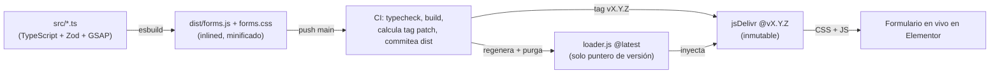
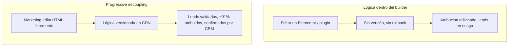

> [!tip] En 30 segundos
> - **Para quién es:** Ingenieros y líderes de marketing en sitios WordPress/Elementor donde los formularios *son* la superficie de revenue, y un plugin de forms no puede cargar la validación, la atribución y la lógica de CRM que el negocio de verdad necesita.
> - **Qué problema resuelve:** Lógica crítica de conversión atrapada dentro del page builder: sin versionado, sin rollback, sin integración real con Salesforce, atribución que se pierde en silencio. Un publish malo cuesta leads reales.
> - **Qué cambia si aplicas esto:** Elementor conserva solo el HTML; una librería versionada en CDN posee validación (Zod), atribución y el handoff a Salesforce. Releases inmutables con rollback de un solo puntero. En una ventana reciente de 90 días la superficie cargó **5,827 leads reales en ~10 mercados de LATAM**, con **el registro de webinar como la fuente #1 (2,237 leads)** y **~91% de los leads con atribución UTM**.

Un prospecto en Bogotá llena un formulario de webinar en el sitio de ATFX LATAM y da clic en registrarse. Se abre una pestaña de Zoom, pero solo ==después de que Salesforce confirma que el lead se guardó.== Si Salesforce hubiera fallado, la pestaña se habría cerrado y el formulario habría mostrado el error inline.

Nada de esa interacción vive en el page builder. Elementor renderizó el `<form>` y sus campos, y eso es todo lo que posee. Validación, atribución de marketing, el POST a WordPress, el handoff a Salesforce y la decisión de abrir Zoom son una ==librería de TypeScript versionada servida desde un CDN,== montada por un solo atributo. El page builder no puede romper la lógica, y a la lógica no le importa cómo renderice el page builder.

Esta es la tercera pieza de una trilogía sobre los datos de una brokerage regulada. El [conector MCP](/es/projects/salesforce-connector-without-admin-access) es el lado de *lectura*: consultar el CRM con seguridad. Este es el lado de *escritura*: meter leads correctos *al* CRM. Misma org, mismo data model, dirección opuesta.

## Lo que está en juego: estos formularios son el pipeline

> **En pocas palabras:** Para este negocio los formularios no son un detalle; son por donde entra la mayoría de los leads de marketing al CRM, así que un bug es revenue perdido, no un glitch cosmético.
ATFX LATAM corre generación de leads en cerca de diez mercados: México, Colombia, Perú, Ecuador, Argentina, Chile, Bolivia, Paraguay, Costa Rica y Uruguay. En una ventana reciente de 90 días la superficie de formularios cargó ==5,827 leads reales== (solo 101 registros de prueba, así que la data está limpia). La fuente más grande no fue paid social ni partnerships. Fue el ==registro de webinar: 2,237 leads,== alrededor del 38% del total, y el registro de webinar es justo lo que esta librería potencia.

Un plugin de formularios es el peor lugar para poner lógica que mueve tanto revenue. ==Cuando el formulario es el pipeline, "se publicó" no es lo mismo que "funciona".==

## Por qué no no-code, y por qué no un plugin de forms

> **En pocas palabras:** Las herramientas no-code completas arreglan el problema técnico pero no el de equipo; los plugins de forms nativos no pueden con lo difícil. La respuesta es sacar solo las capas críticas del CMS.
La respuesta tentadora es "muévelo todo a Webflow o Framer". Eso arregla el problema *técnico* y crea uno *organizacional*: marketing opera Elementor todos los días, y quitarle el page builder para dárselo a ingeniería es un cuello de botella, no una solución. La otra respuesta tentadora, un plugin nativo (WPForms, Gravity, el widget de Elementor), no puede con las partes que aquí importan.

Lo que esto necesita es un patrón con nombre conocido: ==progressive decoupling.== No headless completo; solo levantar las capas críticas fuera del CMS mientras el CMS sigue haciendo lo que hace bien. El mismo instinto de enviar un design system como paquete independiente en vez de enterrarlo en el repo del producto: misma filosofía, distinto stack.

| Capacidad | No-code (Webflow/Framer) | Plugin de forms nativo | Elementor + librería versionada |
|-----------|--------------------------|------------------------|----------------------------------|
| Marketing edita el form sin dev | Sí | Sí | Sí (solo HTML) |
| Validación compleja (Zod, cross-field) | No | Limitada | Sí, versionada en un repo |
| Integración real con Salesforce | Solo plugin/Zapier | Solo plugin/Zapier | Código propio |
| Abrir Zoom solo si el CRM confirma | No | No | Lógica condicional |
| Atribución completa (UTMs, gclid, GA) | Parcial | Parcial | Control total |
| Versionado y rollback de la lógica | No | No | Semver + CDN inmutable |

Los equipos que trabajan así suelen ser agencias y equipos in-house que sirven a clientes enterprise o de performance marketing, ==donde marketing e ingeniería se mueven a velocidades distintas sobre el mismo formulario.== Este es el patrón que deja a ambos conservar su ritmo.

## El contrato de desacople

> **En pocas palabras:** Un acuerdo escrito de quién posee qué, para que marketing pueda cambiar el form libremente y la lógica nunca se rompa. Solo una cosa debe quedarse estable.
Todo el sistema descansa en un contrato, escrito en el README del repo:

| Capa | Dueño | Cambia sin romper |
|------|-------|-------------------|
| Semántica (HTML, labels, orden) | Elementor / Marketing | Sí |
| Validación, lógica, envío | La librería (`src/`) | Sí |
| Estilos de estado (error, loading) | La librería (`src/styles`) | Sí |
| Mapping campo → Salesforce | `src/forms/*.ts` | Absorbe cambios de names |

Lo único que debe quedarse estable es el ==atributo `name` de cada input.== Marketing puede renombrar un label, reordenar campos, reestilizar la página, incluso reconstruir el layout, y la lógica se sostiene. Si un `name` sí cambia, actualizas un solo `fields` map, no el resto del sistema. Elementor aporta un punto de montaje y los nombres de campo; la librería aporta todo lo que decide si un lead es correcto.

```html Toda la huella en Elementor: un mount + un loader
<div data-atfx-form-mount="lead"
     data-lang="es"
     data-theme="light"
     data-zoom-link="https://atfx.zoom.us/webinar/register/..."
     data-lead-source="Webinar"></div>

<script data-cfasync="false"
  src="https://cdn.jsdelivr.net/.../loader.js"></script>
```

El comportamiento lo manejan los atributos, no un fork de código. Un `data-zoom-link` enciende el modo webinar; `data-lang` cambia `es | en | pt` en labels, opciones, mensajes de validación y códigos de Salesforce; `data-theme` intercambia sets de tokens. Un solo script loader sirve todos los formularios de la página.

## Entrega versionada: el pipeline

> **En pocas palabras:** Cada cambio a la lógica se envía como un release inmutable y numerado, así siempre sabes qué está en vivo y puedes hacer rollback cambiando una línea.
La lógica no se pega al sitio; se *publica como release*. Un push a `main` dispara un CI que hace typecheck, build, calcula el siguiente patch semver, lo taggea y purga el CDN.



El detalle que más me gusta es el ==truco del loader.== Elementor carga solo `loader.js` en `@latest`, pero `@latest` en un CDN cachea de forma agresiva e impredecible. Así que `loader.js` no lleva lógica alguna: es un puntero de versión de una línea que inyecta el tag *inmutable* `@vX.Y.Z` para el CSS y el JS reales.

```javascript loader.js — generado por CI, nunca editado a mano
(function () {
  var v = "1.0.8";
  var base = "https://cdn.jsdelivr.net/.../at_forms";
  var css = document.createElement("link");
  css.rel = "stylesheet";
  css.href = base + "@" + v + "/dist/forms.css";
  document.head.appendChild(css);
  var js = document.createElement("script");
  js.type = "module";
  js.setAttribute("data-cfasync", "false"); // excluye de Cloudflare Rocket Loader
  js.src = base + "@" + v + "/dist/forms.js";
  document.head.appendChild(js);
})();
```

Eso compra dos cosas. ==Seguridad de cache:== el tag inmutable nunca se re-fetchea viejo. Y ==rollback como cambio de una línea:== apunta el puntero al tag anterior y todo el sitio revierte, sin involucrar a marketing y sin redeploy del sitio de WordPress. `data-cfasync="false"` evita que el Rocket Loader de Cloudflare reordene el módulo y rompa el boot.

## Validación como contrato, antes de que el lead exista

> **En pocas palabras:** El formulario valida los datos contra reglas estrictas antes de enviar nada, así que leads malos o incompletos nunca llegan al CRM.
Un lead solo vale la pena capturarlo si es correcto. La validación es un schema de Zod que corre ==antes de que el submit salga del navegador,== y el mismo schema maneja tanto el feedback en vivo por campo como la puerta final.

La regla de live-validation es deliberadamente amable: un campo valida en blur (ya fue "tocado"), y de ahí en adelante, en cada tecla, así que se corrige al usuario mientras arregla pero no se le molesta antes de que escriba. En submit, el engine deshabilita la validación nativa y se adueña de todo el flujo.

```typescript src/core/form-engine.ts — el engine posee el submit, no el navegador
export function bindForm(form: HTMLFormElement, instance: FormInstance): void {
  form.setAttribute("novalidate", "true");
  const touched = new Set<string>();
  bindLiveValidation(form, instance, touched);
  form.addEventListener("submit", (e) => {
    e.preventDefault();
    void handleSubmit(form, instance, touched);
  });
}
```

Un campo fallido no solo se pone rojo; el control ==tiembla,== replayado limpio cada vez forzando un reflow para que la animación reinicie desde cero. Toque chico, pero es la diferencia entre "algo está mal en algún lado" y "este campo, justo aquí".

## Atomic design, tokens y tres idiomas

> **En pocas palabras:** El formulario se construye con piezas chicas reutilizables y un sistema de estilos compartido, así se mantiene consistente y funciona en español, inglés y portugués con temas claro y oscuro.
Aquí se nota mi hábito de design systems. El formulario no es un blob de HTML; se renderiza desde ==atoms (label, input, select, acceptance, button), molecules (grupos de campo) y un organism (el formulario mismo),== sobre un design system por tokens. El mismo render produce un combobox de país con búsqueda, selects de código de marcación y checkboxes de marca, todo desde las mismas primitivas.

Tres cosas montan sobre esa estructura. ==i18n:== `data-lang` cambia `es | en | pt` en cada label, opción, mensaje de validación y los códigos de Salesforce a los que se mapea el lead. ==Theming:== `data-theme` intercambia sets de tokens por un solo atributo, sin recrear CSS. ==Consistencia:== como cada campo es la misma molécula, un formulario nuevo es un objeto de config, no un layout nuevo. Agregar un form son tres archivos chicos (un schema Zod, un `FormConfig` y un import side-effect), luego un `data-atfx-form-mount` en Elementor.

## Motion que respeta al usuario

> **En pocas palabras:** Animación sutil que nunca asume que una librería está presente y se apaga sola para quien prefiere menos movimiento.
En los híbridos de Webflow podía apoyarme en que GSAP ya estuviera en la página. Aquí la librería ==bundlea su propio GSAP== y no asume nada del host. Cada animación chequea `prefers-reduced-motion` primero y simplemente se salta si el usuario pidió menos.

```typescript src/ui/motion.ts — el motion es opt-out por el usuario, por default
export function revealForm(form: HTMLFormElement): void {
  if (reducedMotion()) return;
  const groups = form.querySelectorAll(".atfx-field");
  gsap.from(groups, { opacity: 0, y: 12, duration: 0.4, stagger: 0.04, ease: "power2.out" });
}
```

Los campos aparecen con un fade escalonado, el estado de thank-you hace pop con su ícono de confirmación, y un campo fallido tiembla. El motion es el pulido, nunca la puerta: con reduced motion activo, cada elemento simplemente está visible y completamente funcional.

## El handoff a Salesforce y el hallazgo de atribución

> **En pocas palabras:** La parte más difícil y de mayor valor: acertar la atribución (que es dinero) y nunca decirle "éxito" al usuario a menos que el CRM de verdad haya guardado el lead.
Aquí el trabajo se gana su sueldo, y aquí encontré lo que ninguna documentación me habría dicho.

**La atribución es dinero, y no funciona como adivinarías.** Verifiqué contra producción que el pipeline asíncrono que alimenta Salesforce deriva `Landing_Page_Id__c` y los campos UTM de un solo campo top-level: el ==`referrer`.== Mandar `utm_source__c`, `Landing_Page_Id__c` y compañía como campos explícitos del form *no hace nada*; el pipeline los ignora. La única acción que enriquece un lead es poner el referrer con la URL real de aterrizaje, query string incluido.

```typescript src/core/attribution.ts — el único campo que el pipeline sí lee
// Mandar utm_*/Landing_Page_Id como campos del form NO funciona: el pipeline
// asíncrono los ignora. La única acción que enriquece un lead es poner el
// `referrer` con la URL real de aterrizaje (los UTMs viven en su query string).
export function applyLandingUrl(params: URLSearchParams): void {
  params.set("referrer", window.location.href);
}
```

Esa sola línea es por qué, en la misma ventana de 90 días, ==~91% de los leads reales cargan atribución UTM (5,282 de 5,827),== y el funnel de webinar que esta librería potencia se sienta en ==89% (1,994 de 2,237).== El enfoque de campos explícitos que toman la mayoría de los builders habría dejado casi todo eso en blanco.

**El CRM confirma antes de decirle nada al usuario.** En modo webinar la pestaña de Zoom se abre *dentro del gesto de submit* (para que el navegador permita el popup), y luego se ==cierra si Salesforce no confirma.== El estado de éxito, el thank-you, el link de calendario: nada de eso aparece por optimismo.

```typescript src/core/submit-elementor.ts — reintenta la red, nunca el resultado de negocio
// Reintenta solo en fallos de red/timeout. NO reintenta cuando el servidor
// responde, incluso con success:false: eso es decisión de negocio, no un glitch.
for (let attempt = 0; attempt <= MAX_RETRIES; attempt++) {
  // ... fetch con timeout vía AbortController ...
}
```

La política de retry codifica la misma disciplina. Una conexión caída se reintenta; un servidor que *responde* con un rechazo no, porque un `success:false` es un resultado real, no un parpadeo transitorio. ==El sistema nunca convierte un "no" real en un "sí" esperanzado.==

## El outcome

> **En pocas palabras:** Lo que el negocio ganó: escala manejada, atribución capturada, leads confiables, y cambios que se envían y revierten con seguridad.
- ==Escala, con seguridad:== 5,827 leads reales en 90 días en ~10 mercados de LATAM, en una superficie donde cada release es inmutable y reversible con un cambio de puntero.
- ==El canal más grande, propio:== el registro de webinar, la fuente de leads más grande con 2,237 leads, corre sobre lógica que abre Zoom solo cuando el CRM confirma.
- ==Atribución capturada:== ~91% de los leads reales cargan atribución UTM, porque la librería pone el único campo que el pipeline lee en vez de los campos que ignora.
- ==Marketing conservó su herramienta:== el equipo edita Elementor a diario sin un ticket de dev por cambio, mientras la validación y el handoff a Salesforce quedan bajo revisión de ingeniería.



## Las decisiones que lo sostienen

> **En pocas palabras:** Las elecciones sobre las que descansa todo el sistema, y el trabajo que falta.
Cuatro decisiones sostienen la arquitectura:

- Desacoplar por *contrato*, no por reescritura. ==El atributo `name` estable es toda la interfaz;== todo lo demás es libre de moverse.
- Validar con un schema que corre antes de que el lead exista, para que el CRM nunca reciba basura.
- Enviar la lógica como releases inmutables y versionados con rollback de un puntero, nunca como código pegado.
- Verificar la atribución contra producción en vez de confiar en los nombres de campo. ==El pipeline lee el referrer; cree a la data, no a los docs.==

En el roadmap:

- Un log tipado de outcomes de submit (fallo de red vs `success:false` vs confirmado) para que la atribución y las tasas de error sean observables, no inferidas.
- Snapshots de schema por formulario en CI para que un rename de campo en Elementor salga como un check fallido, no como un drop silencioso.
- Un pase chico de regresión visual de los atoms en los tres locales y los dos temas.

## Cómo conecta con el resto del trabajo

> **En pocas palabras:** Dónde se sitúa esto junto a mis otras piezas sobre el mismo cliente y la misma idea.
| Pieza | Rol |
|-------|-----|
| [Conector MCP de Salesforce](/es/projects/salesforce-connector-without-admin-access) | El lado de *lectura*: consultar el CRM con seguridad, sin credencial nueva |
| **atfx-forms (aquí)** | El lado de *escritura*: meter leads validados y atribuidos *al* CRM |
| [Webflow en producción](/es/articulos/context-driven-visual-development) | El mismo principio de desacople, otro page builder |

La misma disciplina, tres superficies: leer la data, escribir la data correctamente, y mantener al page builder del lado de la línea donde pertenece.

## Referencias

> **En pocas palabras:** Los patrones y herramientas detrás de la arquitectura.
| Tema | Fuente |
|------|--------|
| Progressive decoupling (patrón) | [WP Engine — Progressive decoupling](https://wpengine.com/resources/decoupled-wordpress/) |
| Entrega versionada e inmutable por CDN | [jsDelivr — GitHub & version pinning](https://www.jsdelivr.com/documentation) |
| Validación por schema | [Zod](https://zod.dev/) |
| Motion + reduced-motion | [GSAP](https://gsap.com/) · [MDN — prefers-reduced-motion](https://developer.mozilla.org/en-US/docs/Web/CSS/@media/prefers-reduced-motion) |
| Atomic design | [Brad Frost — Atomic Design](https://atomicdesign.bradfrost.com/) |

## La lección real

> **En pocas palabras:** Pon al page builder donde es fuerte y a la lógica crítica donde se le puede confiar, y la costura entre ambos es el diseño.
El error es preguntar si los formularios deben vivir en Elementor o en otro lado. La pregunta útil es *qué capa* va dónde. El page builder es genuinamente bueno dejando que marketing publique; es genuinamente malo poseyendo lógica que cuesta leads cuando se rompe. Así que trazas una línea: semántica de un lado, validación y atribución y el handoff al CRM del otro, con un solo atributo `name` estable como lo único que tiene que cruzarla.

==Progressive decoupling no es media migración. Es elegir la costura a propósito.== Los formularios alimentan el pipeline, así que la lógica del pipeline recibe versionado, validación y un CRM que confirma antes de decirle sí a nadie. El page builder conserva la parte que hace bien. Y el número que prueba que la costura se trazó en el lugar correcto es el aburrido: ~91% de los leads reales, correctamente atribuidos, porque la librería puso el campo que el pipeline de verdad lee.
