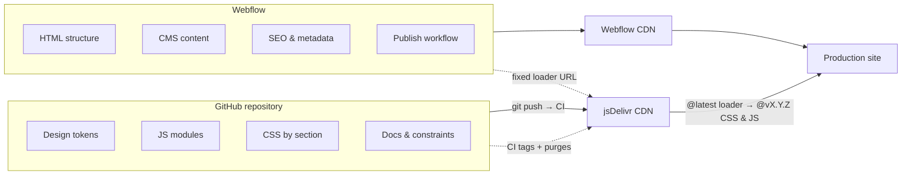
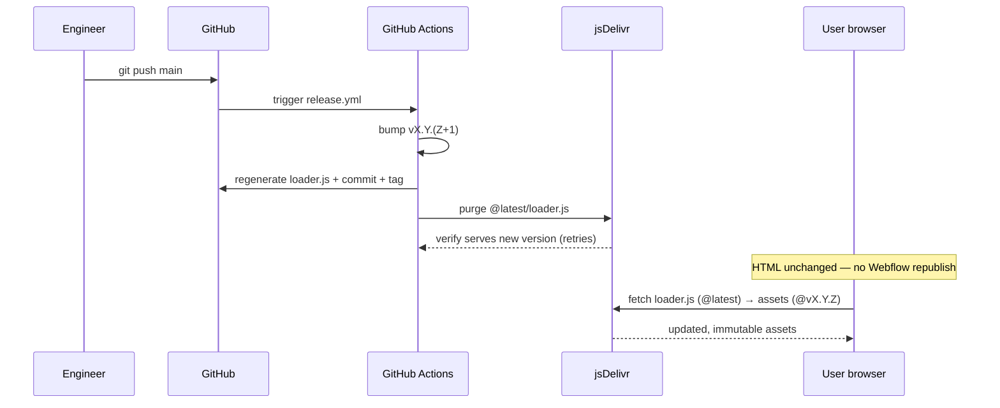

> [!tip] In 30 seconds
> - **Who this is for:** Design engineers and leads on Webflow sites that outgrew paste-in custom code (animations, modules, brand tokens) but still need marketing to publish copy alone.
> - **Problem it solves:** Production JavaScript in a Webflow text area has no git history, no environments, and every publish hits production immediately.
> - **What changes if you apply this:** Dual-control contract — Webflow owns CMS/SEO; Git owns tokens and `src/js/modules/*`. Ship JS with a single **`git push`** — CI bumps a version tag, regenerates the loader, and purges the CDN (~minutes) — instead of a full Webflow republish; copy changes never touch the repo.

There is a specific moment in nearly every Webflow project. It is not during onboarding. It is not during the first publish. It happens when someone on the team opens the site's custom code settings for the first time and pastes a block of JavaScript into a text area.

At that moment, without anyone deciding it explicitly, ==the project has just acquired technical debt.==

The code that was just pasted has no history. No author. No diff. No rollback. If something breaks, the only way to know is for a user to report it -- or for you to catch it before it reaches production. But chances are you will not catch it, because Webflow has no environments. ==The publish goes straight to production. Always.==

I spent a lot of time on this while building a client's production site — high-fidelity animations, a strict brand language, and a content team publishing without engineering on every headline. Three requirements that default Webflow contradicts. The workflow below is **reusable on any Webflow project**, not specific to that client: pasting production JavaScript into a Webflow text area should feel as wrong as deploying over FTP after you have learned git — a signal that the boundary is missing.

> [!info] Industry docs that back the workflow
> Webflow documents [custom code in head and footer](https://help.webflow.com/hc/en-us/articles/33961357265299-Custom-code-in-head-and-body-tags) and [embed limits](https://help.webflow.com/hc/en-us/articles/33961332238611-Custom-code-embed). [jsDelivr](https://www.jsdelivr.com/documentation) documents GitHub `@main` URLs and [cache purge](https://www.jsdelivr.com/documentation#id-purge-cache). Cloudflare documents [Rocket Loader](https://developers.cloudflare.com/speed/optimization/content/rocket-loader/) and [ignoring scripts with `data-cfasync="false"`](https://developers.cloudflare.com/speed/optimization/content/rocket-loader/ignore-javascripts/). The repo map below is our implementation; the reference table at the end is what I send to teams evaluating the same split.

## First, understanding why Webflow behaves this way

> **In plain terms:** Webflow is built for marketers, not for complex app logic — and that is fine until a project crosses the line.
Before talking about solutions, I want to be fair to Webflow because it has a bad reputation for reasons that are actually correct design decisions for its original use case.

Webflow was built to give autonomy to marketing and content teams. The core promise is: you can launch and update a high-quality website without depending on a developer every time you need to change a title or add a page. That promise works. It works very well, in fact, for 80% of use cases.

The problem is that ==the remaining 20%== -- projects that require complex behaviors, components with specific logic, event-driven animations, integrations with external APIs -- that 20% needs the primitives of a real codebase. And Webflow, in its default configuration, does not have them.

It is not a design flaw. It is a scope limit. The real problem is that teams reach that limit and instead of designing a solution, they improvise. They paste code. They add more custom code. They create implicit dependencies between pages. And at some point they have a site that works but that nobody fully understands -- including the person who built it.

The question I asked myself was: ==what if instead of fighting against that limit, we respected it?== What if we designed a system where Webflow does exactly what it does best, and everything else lives in its natural place?

## The core idea: dual control

> **In plain terms:** Marketing keeps the website; engineering keeps code in git — two lanes that do not block each other.
The answer is what I call a dual-control model. Two systems with completely separated responsibilities, an explicit contract between them, and no ambiguity about who owns what.



**Webflow owns:** the HTML structure and page semantics, CMS content and collections, SEO, metadata, og tags, and the publishing workflow -- marketing can publish whenever they want, without coordinating with anyone.

**The Git repository owns:** design tokens (colors, typography, spacing, animation curves), JavaScript modules (one per feature), global CSS by section and component, architecture documentation, constraints and decisions, and the deploy pipeline and versioning.

What makes this work is not the technology -- ==it is the contract.== The explicit agreement that a copy change never touches the repository, and an animation refactor never requires marketing to wait. The two systems run in parallel, deploy independently, and neither blocks the other.

The connection point between both is [jsDelivr](https://www.jsdelivr.com/documentation), a CDN that serves files directly from GitHub ([GitHub CDN docs](https://www.jsdelivr.com/documentation#id-github)). Webflow references one file from there with a URL that never changes. What does change -- after a push, with CI cutting a new version tag and [purging](https://www.jsdelivr.com/documentation#id-purge-cache) the CDN -- is the content that URL resolves to.

> [!tip] git push origin main -> CI tags, regenerates the loader, purges & verifies jsDelivr -> site updated. No Webflow republish. No coordination. Marketing does not even know it happened because they do not need to.

## Repository map — documentation that enforces the contract

> **In plain terms:** Where the written rules live so new teammates (human or AI) do not paste code into the wrong place.
The workflow is implemented in [AtomWebflow_2026Site](https://github.com/karenrebecag/AtomWebflow_2026Site). The point of the repo is not "lots of code" — it is ==written boundaries== so Webflow, jsDelivr, and agents do not fight over the same territory.

| Path | What it documents |
|------|-------------------|
| `CLAUDE.md` (root) | Dual-control contract; Webflow Site ID `6890d2a7153362eed21e1c49`; single Head embed `@latest/loader.js` with `data-cfasync="false"` |
| `.mcp.json` | Webflow MCP token + `WEBFLOW_SITE_ID` for Designer/API tasks from this repo |
| `ORCHESTRATOR.md` | Which agent skills load for CMS tasks, asset audits, safe publish |
| `.agents/skills/` | 34 skills by category (constraints referenced in the agent section below) |
| `src/css/base/tokens.css` | Brand tokens synced with the client's DS; `#000000` prohibited in text (comment in file) |
| `src/css/site.css` | Entry: imports base, sections, components |
| `src/js/site.js` | Module loader v1.2.0: `[data-module]`, `autoDetect`, `data-page` on `<body>` |
| `src/js/modules/*.js` | One file per feature (`mega-nav`, `marquee`, `button-041`, `gsap-slider`, …) |
| `loader.js` (root) | CI-generated entry — injects CSS & JS from the immutable `@vX.Y.Z` tag; never edited by hand |
| `.github/workflows/release.yml` | CI: bumps patch tag, regenerates `loader.js`, commits, tags, purges `@latest` + verifies |

**Deploy is one command** (CI does the rest — documented in-repo, not tribal knowledge):

```bash
git push origin main
# CI (release.yml): bump vX.Y.(Z+1) → regenerate loader.js → commit + tag →
# purge @latest/loader.js on jsDelivr → verify it serves the new version (with retries)
```

**Webflow-side contract** (from `CLAUDE.md` — Site Settings > Custom Code, Head):

```html
<script data-cfasync="false"
  src="https://cdn.jsdelivr.net/gh/karenrebecag/AtomWebflow_2026Site@latest/loader.js"></script>
```

One tag, fixed forever. `loader.js` injects the CSS `<link>` and the `type="module"` script, both pinned to the immutable `@vX.Y.Z` tag the CI just published. Footer Code stays empty. `data-cfasync="false"` opts the loader out of Cloudflare Rocket Loader deferral (GSAP still needs `waitForGSAP` for Webflow's own GSAP tag). HTML and CMS publish stay in Webflow; ==behavior changes trace to a CI-cut git tag, not a Designer publish.==

**Why `autoDetect` exists** (documented in `CLAUDE.md`): Webflow strips `data-*` on component *roots* after publish. Skills and orchestrator rules tell agents to bind on inner selectors like `[data-css-marquee]` instead — that detail is the kind of production-only fact we stopped leaving in Slack threads.

## How CDN references actually work: @latest loader, immutable assets

> **In plain terms:** A boring CDN choice that, after one production lesson, became the opposite of what I first shipped.
This is one of those details that seems trivial until you learn it the hard way -- and then learn it a second time, harder. The first version of this article confidently told you to use `@main` and never `@latest`. Production disagreed. Here is what actually happened, because the wrong version of this rule is still the most-repeated advice on the internet.

The original reasoning was sound on paper. jsDelivr has two ways to reference GitHub files: **@latest** resolves to the last npm release (undefined without releases, and cached aggressively), while **@main** resolves to the latest commit and a purge should clear it. So v1 of this site referenced assets with `@main` and purged after every push.

Then production taught the lesson: ==jsDelivr does not just cache the *file* -- it caches the *resolution of the mutable ref*.== For a branch, `@main → commit` is cached for up to 12 hours (`s-maxage=43200`), and purging the file does **not** re-resolve the ref. So `@main` kept serving an old commit for hours after a clean push and purge. The advice I had repeated was, in my own production, wrong.

The fix is a two-file strategy where each file uses the reference type that fits its job:

- **`loader.js` is referenced with `@latest`.** This is the only URL Webflow ever sees, and it must never change. `@latest` resolves to the highest **SemVer tag** -- and because CI cuts a fresh tag on every deploy, tags are a stronger, better-refreshed signal for jsDelivr than a branch ref. The loader is tiny and only points at immutable tags, so `@latest`'s cache aggressiveness is harmless here.
- **The assets (`site.css`, `site.js`) are referenced with an immutable tag `@vX.Y.Z`.** The loader writes these URLs at deploy time. A version tag never mutates, so it is always fresh and never needs purging.

The rule inverted, but for a precise reason:

| Reference | Use it for | Never for |
|-----------|-----------|-----------|
| `@latest` | the tiny `loader.js` (fixed Webflow URL) | assets -- caches content aggressively |
| `@vX.Y.Z` (tag) | `site.css` / `site.js` -- immutable, always fresh | — |
| `@main` | avoid -- branch resolution caches up to 12h, purge does not re-resolve | anything in production |
| `@{commit}` | urgent debug / rollback | the steady state |

> [!warning] Do not reference assets with @latest, and do not trust @main + purge in production -- purging the file does not re-resolve a branch ref, so @main can serve a stale commit for hours. Pin assets to an immutable @vX.Y.Z tag and let a tiny @latest loader point at it.

And the best part: ==none of this is manual anymore.== A `git push` triggers CI, which bumps the patch tag, regenerates `loader.js` to point at it, purges `@latest`, and verifies with retries that jsDelivr is actually serving the new version. If something breaks, `git revert` and push -- CI cuts a new tag and re-points the loader; or pin the loader to a known-good `@vX.Y.Z` for an instant rollback. The immutable tag is always fresh as a fallback.



## Design tokens: the only shared artifact

> **In plain terms:** Colors and spacing both sides agree on — the handshake between design and the live site.
If the dual-control model is the architecture, ==design tokens are the shared language== between the two systems.

Tokens are not "CSS variables with nice names." They are the contract that guarantees what the designer configures in Webflow and what the external code produces are exactly the same thing. Without that contract, drift between systems is inevitable -- and it is subtle, which is the worst part. Colors that approximate but do not match. Spacing that looks similar but is different. Animations with slightly different timing depending on who touched what.

```css tokens.css — header comment in repo
/* Webflow — Design Tokens
   Synced with the client's DS. Pure black #000000 prohibited in text. */

:root {
  --color-brand:        #FF6600;
  --color-brand-hover:  #e65c00;
  --color-violet:       #8023FF;
  --gradient-brand:     linear-gradient(90deg, #8023FF, #FF6600);

  /* Texto — #000000 prohibido, usar estos */
  --color-text-heading: #222020;
  --color-text-body:    #27272A;
  --color-text-muted:   #71717A;

  /* Spacing */
  --space-1:  0.25rem;
  --space-2:  0.5rem;
  --space-4:  1rem;
  --space-8:  2rem;
  --space-16: 4rem;

  /* Motion */
  --ease-out:        cubic-bezier(0.16, 1, 0.3, 1);
  --duration-fast:   200ms;
  --duration-normal: 400ms;
}
```

What I love about this file is that ==every constraint is encoded, not documented somewhere else.== The comment "orange is accent only, never background or CTA" is not in a Figma that someone forgot to update. It is in the same file that any developer will open the first time they touch the project.

## The module loader: elegant by necessity

> **In plain terms:** How the site loads only the JavaScript each page needs instead of one giant script everywhere.
Webflow has no native way to tell JavaScript "initialize this component when it appears on the page." The common solution is one massive file that runs everything on every page -- which is both inefficient and fragile.

The solution I built is a 54-line entry point that does one thing: scans the DOM, identifies which modules the current page needs, and dynamically imports them. Only those. Only when needed.

```javascript site.js — entry v1.2.0 (production repo)
const modules = {
  'nav': () => import('./modules/nav.js'),
  'animations': () => import('./modules/animations.js'),
  'scroll-animations': () => import('./modules/scroll-animations.js'),
  'faq': () => import('./modules/faq.js'),
  'button-041': () => import('./modules/button-041.js'),
};

document.querySelectorAll('[data-module]').forEach(el => {
  const name = el.dataset.module;
  if (modules[name]) {
    modules[name]().then(m => m.init && m.init(el));
  }
});

const autoDetect = {
  '[data-button-041]': () => import('./modules/button-041.js'),
  '[data-css-marquee]': () => import('./modules/marquee.js'),
  '[data-menu-wrap]': () => import('./modules/mega-nav.js'),
  '[data-tabs-init]': () => import('./modules/tabs.js'),
  '[data-gsap-slider-init]': () => import('./modules/gsap-slider.js'),
};

Object.entries(autoDetect).forEach(([selector, loader]) => {
  if (document.querySelector(selector)) {
    loader().then(m => m.init && m.init(document));
  }
});
```

No bundler. No build step. ==No JavaScript traveling to pages where it is not used.== The browser resolves ESM imports natively.

The distinction between the two patterns has a very specific reason: ==Webflow does not publish data-* attributes on the root element of reusable components.== If you put `data-module="my-component"` on the root of a Webflow component, that attribute simply disappears after publish. The autoDetect pattern solves this by looking for selectors deeper in the DOM tree, where Webflow does preserve them.

## GSAP + Cloudflare Rocket Loader: the bug that only exists in production

> **In plain terms:** A real launch story: animations worked in staging and broke live because of a hosting feature nobody remembered.
I want to talk about this problem with some affection because it was the most frustrating to solve and also the one that taught me the most about what it means to do production engineering.

The setup: Webflow loads GSAP automatically from its own CDN. Our external JS modules depend on `window.gsap` existing to initialize. In local, in staging, in any test environment -- everything works perfectly.

In production, under certain network conditions with [Cloudflare Rocket Loader](https://developers.cloudflare.com/speed/optimization/content/rocket-loader/) active, ==animations silently fail on approximately 30% of page loads.== Cloudflare's own guidance is to mark scripts that must run in order with [`data-cfasync="false"`](https://developers.cloudflare.com/speed/optimization/content/rocket-loader/ignore-javascripts/) — we use that on our module entry *and* still poll for `window.gsap` because Webflow's GSAP tag is a separate script Rocket Loader can defer.

No console error. No message. The animations simply do not appear.

> [!caution] Rocket Loader defers execution of all external scripts unpredictably. If your module looks for window.gsap on load, it will find it empty 30% of the time.

The solution, once you understand the cause, is completely obvious:

```javascript button-041.js — Rocket Loader + Webflow GSAP 3.15
function waitForGSAP(timeout = 5000) {
  return new Promise((resolve, reject) => {
    if (window.gsap) return resolve(window.gsap);
    const start = Date.now();
    const check = setInterval(() => {
      if (window.gsap) { clearInterval(check); resolve(window.gsap); }
      else if (Date.now() - start > timeout) {
        clearInterval(check);
        reject(new Error('[ds] gsap not found — Webflow GSAP may be disabled'));
      }
    }, 50);
  });
}
```

What matters about this example is not the polling function -- that is trivial. What matters is that this function, and the explanation of why it exists, lives in the repository's CLAUDE.md. Not in a Slack message from eight months ago. ==Documenting hard decisions inside the codebase is the difference between a project that scales and one that only works while the original person is available.==

## The agent system: AI with explicit constraints

> **In plain terms:** How AI helpers get a rulebook so they improve the repo instead of improvising in Webflow.
The repository includes an agent orchestration system -- a set of 34 skills organized by category with an ORCHESTRATOR that decides which skills to load based on the task type.

But before talking about the implementation, I need to talk about the philosophy behind it.

The first time I let an AI agent operate on the project without explicit constraints, it made reasonable decisions. Clean code, good general practices, output that worked. And it was still wrong.

Not wrong as in "broken" -- ==wrong as in "out of context."== The agent used #000000 for text because it is the standard black. It put `@latest` on an *asset* URL -- the one place it caches too aggressively -- because it is the most common pattern. It modified a page that was not specified because it assumed it was the main page.

None of that is an agent error. It is a system design error -- specifically, a failure to design the system with explicit constraints from the start.

| Constraint | Where it is enforced |
| --- | --- |
| No pure black in text | Encoded in tokens.css |
| Orange only as accent | Documented in CLAUDE.md, validated by agent |
| @latest only for the loader, never for assets | Rule in orchestrator, blocked in review |
| GSAP must check prefers-reduced-motion | Required in every animation module |
| Never publish without safe-publish | Orchestrator rule, not optional |
| Never modify unspecified page | Scope enforcement, asks before acting |

The result is an agent I can let run on CMS tasks, asset audits, and controlled deploys without reviewing every output line by line -- not because I trust it blindly, but because ==the constraint system makes errors detectable, reversible, and most of the time, impossible.==

## What the team gains

> **In plain terms:** The organizational win: fewer emergencies, clearer ownership, faster campaigns.
Without this workflow, every week there are interruptions of the kind "hey, can you change this text in Webflow?" that are not actually text changes -- they are changes someone does not dare to make alone because the last time they touched something in Webflow, something else broke. The developer becomes the site's guardian not because it is necessary but because nobody has confidence in the system's boundaries.

With this workflow, ==that category of interruption disappears.== Marketing knows exactly what they can touch -- the Designer, the CMS, the pages -- and knows their changes will not break anything in the repository because the repository is a separate system with its own lifecycle. Engineering knows they can iterate on code with full confidence because they have git history, code review, and immediate rollback. Nobody blocks anyone.

In the first two weeks after we drew the boundary explicitly, those pings stopped showing up in standup -- not because we ran a formal time study, but because the fear category simply went away. Copy updates shipped from the CMS without a Slack thread asking for a "quick sanity check." Animation fixes went out via git and jsDelivr without a Webflow republish. The argument does not need a hours-saved spreadsheet to be credible; you notice when the coordination tax is gone.

## How to replicate it on your next project

> **In plain terms:** A practical checklist if you want the same split on another Webflow site.
- **Repository with clear structure.** `src/css/` and `src/js/`. Inside CSS: `base/` for tokens, reset and utilities; `sections/` for nav, hero, footer; `components/` for components with their own logic. A `site.css` as entry point that imports everything. A `site.js` with the module loader pattern. If you skip this split, every new feature becomes an ad-hoc negotiation about whether it lives in Webflow or Git -- until someone breaks production and nobody can say who owns the fix.

```tree Repository structure
{
  "root": "repository/",
  "folders": [
    { "category": "base", "path": "src/css/base/", "files": ["tokens.css", "reset.css", "utilities.css"] },
    { "category": "sections", "path": "src/css/sections/", "files": ["nav.css", "hero.css", "footer.css"] },
    { "category": "components", "path": "src/css/components/", "files": ["button.css", "marquee.css", "faq.css"] },
    { "category": "modules", "path": "src/js/modules/", "files": ["nav.js", "animations.js", "faq.js", "mega-nav.js"] }
  ],
  "entries": [
    { "category": "entry", "path": "src/css/", "files": ["site.css"] },
    { "category": "entry", "path": "src/js/", "files": ["site.js"] },
    { "category": "entry", "path": "", "files": ["loader.js (CI-generated)"] },
    { "category": "ci", "path": ".github/workflows/", "files": ["release.yml"] },
    { "category": "docs", "path": "", "files": ["CLAUDE.md", "ORCHESTRATOR.md", ".agents/skills/"] }
  ]
}
```

- **tokens.css first, always.** Before writing any other CSS, define your tokens. All design values live here and only here. Include comments that explain the constraints, not just the values. If tokens live in three places (Figma notes, Webflow styles, and a CSS file), drift is guaranteed; the first redesign will ship two slightly different oranges and nobody will know which one is canonical.

- **A tiny loader on @latest, assets on immutable tags.** Point Webflow once at `@latest/loader.js` and never touch that field again. The loader injects CSS/JS pinned to a `@vX.Y.Z` tag. Do not reference assets with `@main` -- purging the file does not re-resolve the branch, so it serves stale commits for hours -- and never with `@latest`, which caches asset content aggressively. The reference type is a per-file decision, not a global rule.

- **Automate the release in CI.** A GitHub Action turns deploy into a single `git push`: it bumps the patch tag, regenerates `loader.js` to point at it, commits, tags, purges `@latest`, and verifies with retries that jsDelivr serves the new version. Without it, every deploy is a manual purge you will eventually forget -- and a teammate will "fix" something that was already fixed but stuck in cache.

- **CLAUDE.md at the root.** Document the contract between Webflow and the repository, naming conventions, prohibited patterns with their justification, the deploy workflow, and architectural decisions with the context of why they were made that way. Without it, the next person -- or the next agent -- will re-decide every boundary from scratch, and you will become the living README again.

- **data-* as the only activation mechanism.** Never use Webflow classes as selectors in JavaScript. Classes change on redesigns. `data-*` attributes are explicit contracts that Webflow preserves -- but remember: put your attributes on inner elements, not on the component root. If you bind to class names, the first time someone reorganizes the Designer you will spend an hour tracing why the nav module stopped firing.

> [!tip] The entire external codebase for this production site is under 400 lines of CSS and 300 lines of JavaScript. The architecture is deliberately minimal. Complexity lives in the constraints and the workflow, not in the code.

## References (external — worth bookmarking)

> **In plain terms:** Vendor docs for teams validating the approach.
| Topic | Source |
|-------|--------|
| Custom code in site head/footer | [Webflow Help — Custom code in head and body](https://help.webflow.com/hc/en-us/articles/33961357265299-Custom-code-in-head-and-body-tags) |
| Embed / custom code limits | [Webflow Help — Custom code embed](https://help.webflow.com/hc/en-us/articles/33961332238611-Custom-code-embed) |
| Higher custom-code character limits (context) | [Webflow Updates](https://webflow.com/updates/increased-custom-code-character-limit) |
| jsDelivr + GitHub (`@main`) | [jsDelivr — GitHub documentation](https://www.jsdelivr.com/documentation#id-github) |
| Purge CDN cache after deploy | [jsDelivr — Purge cache](https://www.jsdelivr.com/documentation#id-purge-cache) |
| Rocket Loader behavior | [Cloudflare — Rocket Loader](https://developers.cloudflare.com/speed/optimization/content/rocket-loader/) |
| Exclude a script from Rocket Loader | [Cloudflare — Ignore JavaScripts](https://developers.cloudflare.com/speed/optimization/content/rocket-loader/ignore-javascripts/) |
| Automating deploys in CI | [GitHub Actions documentation](https://docs.github.com/en/actions) |
| shadcn-style registry (parallel for DS teams) | [shadcn/ui — Registry](https://ui.shadcn.com/docs/registry) |
| Design tokens standard (shared language with DS) | [W3C Design Tokens — first stable version](https://www.w3.org/community/design-tokens/2025/10/28/design-tokens-specification-reaches-first-stable-version/) |
| Webflow MCP (Designer/API automation) | [Webflow Developers](https://developers.webflow.com/) |

## The real takeaway

> **In plain terms:** Respect Webflow’s strength; put engineering work where git and review already exist.
Software projects fail at the boundaries between tools, not inside them. Webflow works. Git works. jsDelivr works. AI agents work. ==The point of failure is when it is not clear who owns what==, and two systems end up competing over the same territory without explicit rules.

Designing that boundary from the start is not overengineering. It is exactly the work that makes everything else predictable -- that marketing can publish with confidence, that engineering can iterate with confidence, that an AI agent can operate with confidence, and that you can go on vacation without leaving your phone number "in case something breaks."

There is a phrase I use as a standard for evaluating whether a system is well designed: ==if the system requires you to be available for it to work, it is not a system yet -- it is a personal dependency.==

A workflow is replicable when it is documented with enough context that someone who never worked on the project can extend it without breaking it. Knowledge lives in the repository, in the tokens, in the CLAUDE.md. The next person inherits the system, not a debt of unanswered questions.
