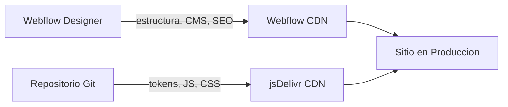

Hay un momento especifico en casi todos los proyectos Webflow. No esta en el onboarding. No esta en el primer publish. Aparece cuando alguien del equipo abre los custom code settings del sitio por primera vez y pega un bloque de JavaScript en un area de texto.

En ese momento, sin que nadie lo decida explicitamente, ==el proyecto acaba de adquirir deuda tecnica.==

El codigo que acaba de pegarse no tiene historial. No tiene author. No tiene diff. No se puede hacer rollback. Si algo se rompe, la unica forma de saberlo es que un usuario lo reporte -- o que tu, con suerte, lo notes antes de que llegue a produccion. Pero lo mas probable es que no lo notes, porque Webflow no tiene entornos. ==El publish es directo a produccion. Siempre.==

Pase bastante tiempo pensando en este problema mientras trabajaba en el sitio de Atomchat -- un producto de AI que necesitaba un sitio con animaciones de alta fidelidad, un lenguaje visual muy especifico de marca y un equipo de contenido que pudiera publicar de forma autonoma sin coordinar con desarrollo cada vez. Tres requisitos que, dentro de Webflow por default, se contradicen.

Este articulo documenta lo que construi para resolverlo. No es una solucion especifica de Atomchat -- es un workflow que cualquier engineer o design engineer puede llevar a su proximo proyecto con Webflow. Y prometo que despues de leerlo nunca mas vas a pegar codigo en un area de texto.

## Primero, entender por que Webflow se comporta asi

Antes de hablar de soluciones, quiero ser justa con Webflow porque tiene muy mala reputacion por razones que en realidad son decisiones de diseno correctas para su caso de uso original.

Webflow fue construido para dar autonomia a equipos de marketing y contenido. La promesa central es: puedes lanzar y actualizar un sitio web de alta calidad sin depender de un developer cada vez que necesitas cambiar un titulo o agregar una pagina. Esa promesa funciona. Funciona muy bien, de hecho, para el 80% de los casos de uso.

El problema es que ==el 20% restante== -- proyectos que requieren comportamientos complejos, componentes con logica especifica, animaciones que dependen de eventos, integraciones con APIs externas -- ese 20% necesita las primitivas de un codebase de verdad. Y Webflow, en su configuracion default, no las tiene.

No es un fallo de diseno. Es un limite de scope. El problema real es que los equipos llegan a ese limite y en lugar de disenar una solucion, improvisan. Pegan codigo. Agregan mas custom code. Crean dependencias implicitas entre paginas. Y en algun momento tienen un sitio que funciona pero que nadie entiende completamente -- incluyendo la persona que lo construyo.

La pregunta que me hice fue: ==que pasa si en lugar de luchar contra ese limite, lo respetamos?== Si disenamos un sistema donde Webflow haga exactamente lo que mejor sabe hacer, y todo lo demas viva en su lugar natural?

## La idea central: control dual

La respuesta es lo que llamo un modelo de control dual. Dos sistemas con responsabilidades completamente separadas, un contrato explicito entre ellos, y ninguna area de ambiguedad sobre quien es dueno de que.



**Webflow es dueno de:** la estructura HTML y la semantica de paginas, el contenido CMS y las colecciones, SEO, metadata, og tags, y el workflow de publicacion -- marketing puede hacer publish cuando quiera, sin coordinar con nadie.

**El repositorio Git es dueno de:** design tokens (colores, tipografia, espaciado, curvas de animacion), modulos de JavaScript (uno por feature), CSS global por seccion y por componente, documentacion de arquitectura, restricciones y decisiones, y el pipeline de deploy y el versionado.

Lo que hace que esto funcione no es la tecnologia -- ==es el contrato.== El acuerdo explicito de que un cambio de copy nunca toca el repositorio, y un refactor de animacion nunca requiere que marketing espere. Los dos sistemas corren en paralelo, se despliegan de forma independiente, y ninguno bloquea al otro.

El punto de conexion entre ambos es jsDelivr, un CDN que sirve archivos directamente desde GitHub. Webflow referencia los assets desde ahi con una URL que nunca cambia. Lo que si cambia -- despues de un push y un purge de cache -- es el contenido que esa URL resuelve.

> [!tip] git push origin main -> curl purge jsDelivr cache -> sitio actualizado. Sin republish de Webflow. Sin coordinacion. Marketing ni sabe que ocurrio porque no necesita saberlo.

## Por que @main y no @latest

Este es uno de esos detalles que parece trivial hasta que lo aprendes de la manera dificil.

jsDelivr tiene dos formas de referenciar archivos de GitHub que parecen equivalentes y no lo son en absoluto:

- **@latest** resuelve al ultimo release publicado con npm. Si no tienes releases configurados, el comportamiento es undefined. Y jsDelivr cachea agresivamente -- lo que significa que aunque subas un cambio, jsDelivr puede seguir sirviendo la version anterior por horas o dias.

- **@main** resuelve al ultimo commit de la rama principal. Despues de un purge explicito del cache, resuelve inmediatamente al SHA mas reciente.

> [!warning] Nunca uses @latest en produccion. jsDelivr cachea agresivamente y el comportamiento sin npm releases es undefined.

La regla es simple: en produccion, siempre @main mas purge manual. Nunca @latest. Y esta regla vive documentada en el repositorio, no en la memoria de nadie.

```bash
# Despues de cada push
curl -s https://purge.jsdelivr.net/gh/user/repo@main/src/css/site.css
curl -s https://purge.jsdelivr.net/gh/user/repo@main/src/js/site.js
```

Dos lineas. El sitio esta actualizado. Y si algo sale mal, `git revert` y otro purge. ==Rollback completo en menos de dos minutos.==

## Design tokens: el unico artefacto compartido

Si el modelo de control dual es la arquitectura, ==los design tokens son el lenguaje compartido== entre los dos sistemas.

Los tokens no son "variables de CSS con nombres bonitos." Son el contrato que garantiza que lo que el disenador configura en Webflow y lo que el codigo externo produce son exactamente la misma cosa. Sin ese contrato, la deriva entre sistemas es inevitable -- y es sutil, que es lo peor. Colores que se aproximan pero no coinciden. Espaciados que se parecen pero son distintos. Animaciones que tienen timing ligeramente diferente dependiendo de quien toco que.

```css tokens.css
:root {
  /* Marca -- naranja es solo acento, nunca fondo ni CTA */
  --color-brand:        #FF6600;
  --color-brand-hover:  #e65c00;
  --color-violet:       #8023FF;

  /* Texto -- negro puro (#000) esta prohibido */
  --color-text-heading: #222020;
  --color-text-body:    #27272A;
  --color-text-muted:   #71717A;

  /* Espaciado */
  --space-1:  0.25rem;
  --space-2:  0.5rem;
  --space-4:  1rem;
  --space-8:  2rem;
  --space-16: 4rem;

  /* Movimiento */
  --ease-out:        cubic-bezier(0.16, 1, 0.3, 1);
  --duration-fast:   200ms;
  --duration-normal: 400ms;
}
```

Lo que me encanta de este archivo es que ==cada restriccion esta codificada, no documentada en otro lado.== El comentario "naranja es solo acento, nunca fondo ni CTA" no esta en un Figma que alguien olvido actualizar. Esta en el mismo archivo que cualquier developer va a abrir la primera vez que toque el proyecto.

## El module loader: elegante por necesidad

Webflow no tiene una forma nativa de decirle a JavaScript "inicializa este componente cuando aparezca en la pagina." La solucion comun es un archivo enorme que ejecuta todo en cada pagina -- lo cual es tanto ineficiente como fragil.

La solucion que construi es un entry point de 54 lineas que hace una sola cosa: escanea el DOM, identifica que modulos necesita la pagina actual, y los importa dinamicamente. Solo esos. Solo cuando los necesita.

```javascript site.js
// Patron 1: modulos activados por data-module
const modules = {
  'nav':              () => import('./modules/nav.js'),
  'animations':       () => import('./modules/animations.js'),
  'scroll-animations':() => import('./modules/scroll-animations.js'),
  'faq':              () => import('./modules/faq.js'),
};

// Patron 2: auto-deteccion por selector del componente
const autoDetect = {
  '[data-button-041]':      () => import('./modules/button-041.js'),
  '[data-css-marquee]':     () => import('./modules/marquee.js'),
  '[data-menu-wrap]':       () => import('./modules/mega-nav.js'),
  '[data-tabs-init]':       () => import('./modules/tabs.js'),
};

// Solo carga lo que existe en el DOM
for (const [sel, loader] of Object.entries(autoDetect)) {
  if (document.querySelector(sel)) loader();
}
```

Sin bundler. Sin build step. ==Sin JavaScript viajando a paginas donde no se usa.== El navegador resuelve los imports ESM nativamente.

La distincion entre los dos patrones tiene una razon muy especifica: ==Webflow no publica atributos data-* en el elemento raiz de componentes reutilizables.== Si pones `data-module="mi-componente"` en el root de un componente de Webflow, ese atributo simplemente desaparece despues del publish. El patron de autoDetect resuelve esto buscando selectores mas adentro del arbol del DOM, donde Webflow si los preserva.

## GSAP + Cloudflare Rocket Loader: el bug que solo existe en produccion

Quiero hablar de este problema con algo de carino porque fue el mas frustrante de resolver y tambien el que mas me enseno sobre lo que significa hacer ingenieria de produccion.

El setup es el siguiente: Webflow carga GSAP automaticamente desde su propio CDN. Nuestros modulos JS externos dependen de que `window.gsap` exista para inicializar. En local, en staging, en cualquier ambiente de prueba -- todo funciona perfectamente.

En produccion, bajo ciertas condiciones de red con Cloudflare Rocket Loader activo, ==las animaciones fallan silenciosamente en aproximadamente el 30% de las cargas de pagina.==

Sin error en consola. Sin mensaje. Las animaciones simplemente no aparecen.

> [!caution] Rocket Loader difiere la ejecucion de todos los scripts externos de forma impredecible. Si tu modulo busca window.gsap al cargar, lo encontrara vacio el 30% de las veces.

La solucion, una vez que entiendes la causa, es completamente obvia:

```javascript
function waitForGSAP(timeout = 5000) {
  return new Promise((resolve, reject) => {
    if (window.gsap) return resolve(window.gsap);
    const start = Date.now();
    const check = setInterval(() => {
      if (window.gsap) {
        clearInterval(check);
        resolve(window.gsap);
      } else if (Date.now() - start > timeout) {
        clearInterval(check);
        reject(new Error('[atom] gsap not found'));
      }
    }, 50);
  });
}
```

Lo que me importa de este ejemplo no es la funcion de polling -- eso es trivial. Lo que me importa es que esa funcion, y la explicacion de por que existe, vive en el CLAUDE.md del repositorio. No en un mensaje de Slack de hace ocho meses. ==Documentar las decisiones dificiles dentro del codebase es la diferencia entre un proyecto que escala y uno que solo funciona mientras la persona original esta disponible.==

## El sistema de agentes: IA con restricciones explicitas

El repositorio incluye un sistema de orquestacion de agentes -- un conjunto de 34 skills organizadas en categorias con un ORCHESTRATOR que decide que skills cargar segun el tipo de tarea.

Pero antes de hablar de la implementacion, necesito hablar de la filosofia detras de ella.

La primera vez que deje un agente de IA operar sobre el proyecto sin restricciones explicitas, tomo decisiones razonables. Codigo limpio, buenas practicas generales, output que funcionaba. Y aun asi estaba mal.

No mal como "roto" -- ==mal como "fuera de contexto."== El agente uso #000000 en un texto porque es el negro estandar. Uso @latest en una referencia de jsDelivr porque es la forma mas comun. Modifico una pagina que no era la especificada porque asumio que era la principal.

Nada de eso es un error del agente. Es un error de diseno del sistema -- especificamente, un error de no haber disenado el sistema con restricciones explicitas desde el inicio.

| Restriccion | Donde se aplica |
| --- | --- |
| Sin negro puro en texto | Codificado en tokens.css |
| Naranja solo como acento | Documentado en CLAUDE.md, validado por agente |
| jsDelivr nunca con @latest | Regla en orquestador, bloqueado en review |
| GSAP debe verificar prefers-reduced-motion | Requerido en cada modulo de animacion |
| Nunca publicar sin safe-publish | Regla del orquestador, no opcional |
| Nunca modificar pagina no especificada | Scope enforcement, pregunta antes de actuar |

El resultado es un agente que puedo dejar correr en tareas de CMS, auditorias de assets y deploys controlados sin revisar cada output linea por linea -- no porque confie ciegamente, sino porque ==el sistema de restricciones hace que los errores sean detectables, reversibles y, la mayoria de las veces, imposibles.==

## Que gana el equipo

Sin este workflow, cada semana hay entre tres y cinco interrupciones del tipo "oye, puedes cambiar este texto en Webflow?" que en realidad no son cambios de texto -- son cambios que alguien no se atreve a hacer solo porque la ultima vez que toco algo en Webflow se rompio otra cosa. El developer se convierte en el guardian del sitio no porque sea necesario sino porque nadie tiene confianza en los limites del sistema.

Con este workflow, ==esa categoria de interrupcion desaparece.== Marketing sabe exactamente que puede tocar -- el Designer, el CMS, las paginas -- y sabe que sus cambios no van a romper nada del repositorio porque el repositorio es un sistema separado con su propio ciclo de vida. Engineering sabe que puede iterar en codigo con total confianza porque tiene git history, code review y rollback inmediato. Nadie bloquea a nadie.

En tiempo concreto: en un proyecto activo con equipo mixto, esto elimina entre 3 y 5 horas semanales de coordinacion que antes eran friccion pura. En las primeras dos semanas, el sistema se paga. A partir de ahi es ahorro neto.

## Como replicarlo en tu proximo proyecto

- **Repositorio con estructura clara.** `src/css/` y `src/js/`. Dentro de CSS: `base/` para tokens, reset y utilidades; `sections/` para nav, hero, footer; `components/` para componentes con logica propia. Un `site.css` como entry point que importa todo. Un `site.js` con el patron de module loader.

- **tokens.css primero, siempre.** Antes de escribir cualquier otro CSS, define tus tokens. Todos los valores de diseno viven aqui y solo aqui. Incluye comentarios que expliquen las restricciones, no solo los valores.

- **jsDelivr con @main + purge script.** Configura las referencias en Webflow una sola vez apuntando a @main. Crea un script de purge y ejecutalo despues de cada push.

- **CLAUDE.md en la raiz.** Documenta el contrato entre Webflow y el repositorio, las convenciones de naming, los patrones prohibidos con su justificacion, el workflow de deploy, y las decisiones arquitectonicas con el contexto de por que se tomaron asi.

- **data-* como unico mecanismo de activacion.** Nunca uses clases de Webflow como selectores en JavaScript. Las clases cambian en redesigns. Los atributos `data-*` son contratos explicitos que Webflow preserva -- pero recuerda: pon tus atributos en elementos internos, no en el root del componente.

> [!tip] Todo el codebase externo de este sitio en produccion tiene menos de 400 lineas de CSS y 300 de JavaScript. La arquitectura es deliberadamente minima. La complejidad vive en las restricciones y el workflow, no en el codigo.

## El aprendizaje real

Los proyectos de software fallan en los limites entre herramientas, no dentro de ellas. Webflow funciona. Git funciona. jsDelivr funciona. Los agentes de IA funcionan. ==El punto de falla es cuando no esta claro quien es dueno de que==, y dos sistemas terminan compitiendo sobre el mismo territorio sin reglas explicitas.

Disenar ese limite desde el inicio no es sobreingenieria. Es exactamente el trabajo que hace que todo lo demas sea predecible -- que marketing pueda publicar con confianza, que engineering pueda iterar con confianza, que un agente de IA pueda operar con confianza, y que tu puedas irte de vacaciones sin dejar tu numero de telefono "por si algo se rompe."

Hay una frase que uso como estandar para evaluar si un sistema esta bien disenado: ==si el sistema requiere que estes disponible para que funcione, no es un sistema todavia -- es una dependencia personal.==

Un workflow es replicable cuando esta documentado con suficiente contexto para que alguien que nunca trabajo en el proyecto pueda extenderlo sin romperlo. El conocimiento vive en el repositorio, en los tokens, en el CLAUDE.md. La siguiente persona hereda el sistema, no una deuda de preguntas sin responder.
