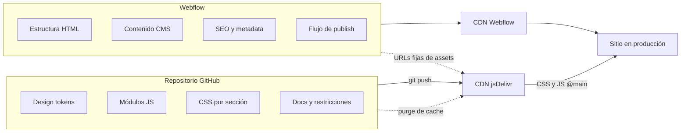
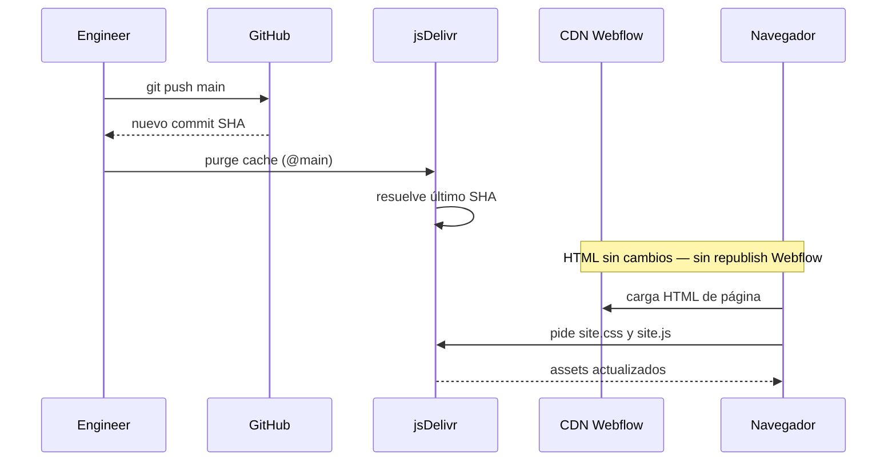

Hay un momento específico en casi todos los proyectos Webflow. No está en el onboarding. No está en el primer publish. Aparece cuando alguien del equipo abre los custom code settings del sitio por primera vez y pega un bloque de JavaScript en un área de texto.

En ese momento, sin que nadie lo decida explícitamente, ==el proyecto acaba de adquirir deuda técnica.==

El código que acaba de pegarse no tiene historial. No tiene author. No tiene diff. No se puede hacer rollback. Si algo se rompe, la única forma de saberlo es que un usuario lo reporte -- o que tú, con suerte, lo notes antes de que llegue a producción. Pero lo más probable es que no lo notes, porque Webflow no tiene entornos. ==El publish es directo a producción. Siempre.==

Pasé bastante tiempo pensando en este problema mientras trabajaba en el sitio de Atomchat -- un producto de AI que necesitaba un sitio con animaciones de alta fidelidad, un lenguaje visual muy específico de marca y un equipo de contenido que pudiera publicar de forma autónoma sin coordinar con desarrollo cada vez. Tres requisitos que, dentro de Webflow por default, se contradicen.

Este artículo documenta lo que construí para resolverlo. No es una solución específica de Atomchat -- es un workflow que cualquier engineer o design engineer puede llevar a su próximo proyecto con Webflow. Después de leerlo, pegar JavaScript de producción en un área de texto de Webflow debería sentirse tan mal como desplegar por FTP después de haber aprendido git -- no como un chiste, sino como señal de que el límite entre sistemas no existe.

> [!info] Documentación de industria que respalda el workflow
> Webflow documenta [custom code en head y footer](https://help.webflow.com/hc/en-us/articles/33961357265299-Custom-code-in-head-and-body-tags) y [límites de embed](https://help.webflow.com/hc/en-us/articles/33961332238611-Custom-code-embed). [jsDelivr](https://www.jsdelivr.com/documentation) documenta URLs de GitHub `@main` y [purge de cache](https://www.jsdelivr.com/documentation#id-purge-cache). Cloudflare documenta [Rocket Loader](https://developers.cloudflare.com/speed/optimization/content/rocket-loader/) y [`data-cfasync="false"`](https://developers.cloudflare.com/speed/optimization/content/rocket-loader/ignore-javascripts/). El mapa del repo es nuestra implementación; la tabla al final es lo que envío a equipos que evalúan el mismo split.

## Primero, entender por qué Webflow se comporta así

Antes de hablar de soluciones, quiero ser justa con Webflow porque tiene muy mala reputación por razones que en realidad son decisiones de diseño correctas para su caso de uso original.

Webflow fue construido para dar autonomía a equipos de marketing y contenido. La promesa central es: puedes lanzar y actualizar un sitio web de alta calidad sin depender de un developer cada vez que necesitas cambiar un título o agregar una página. Esa promesa funciona. Funciona muy bien, de hecho, para el 80% de los casos de uso.

El problema es que ==el 20% restante== -- proyectos que requieren comportamientos complejos, componentes con lógica específica, animaciones que dependen de eventos, integraciones con APIs externas -- ese 20% necesita las primitivas de un codebase de verdad. Y Webflow, en su configuración default, no las tiene.

No es un fallo de diseño. Es un límite de scope. El problema real es que los equipos llegan a ese límite y en lugar de diseñar una solución, improvisan. Pegan código. Agregan más custom code. Crean dependencias implícitas entre páginas. Y en algún momento tienen un sitio que funciona pero que nadie entiende completamente -- incluyendo la persona que lo construyó.

La pregunta que me hice fue: ==qué pasa si en lugar de luchar contra ese límite, lo respetamos?== Si diseñamos un sistema donde Webflow haga exactamente lo que mejor sabe hacer, y todo lo demás viva en su lugar natural?

## La idea central: control dual

La respuesta es lo que llamo un modelo de control dual. Dos sistemas con responsabilidades completamente separadas, un contrato explícito entre ellos, y ninguna área de ambigüedad sobre quién es dueño de qué.



**Webflow es dueño de:** la estructura HTML y la semántica de páginas, el contenido CMS y las colecciones, SEO, metadata, og tags, y el workflow de publicación -- marketing puede hacer publish cuando quiera, sin coordinar con nadie.

**El repositorio Git es dueño de:** design tokens (colores, tipografía, espaciado, curvas de animación), módulos de JavaScript (uno por feature), CSS global por sección y por componente, documentación de arquitectura, restricciones y decisiones, y el pipeline de deploy y el versionado.

Lo que hace que esto funcione no es la tecnología -- ==es el contrato.== El acuerdo explícito de que un cambio de copy nunca toca el repositorio, y un refactor de animación nunca requiere que marketing espere. Los dos sistemas corren en paralelo, se despliegan de forma independiente, y ninguno bloquea al otro.

El punto de conexión entre ambos es [jsDelivr](https://www.jsdelivr.com/documentation), un CDN que sirve archivos desde GitHub ([documentación GitHub en jsDelivr](https://www.jsdelivr.com/documentation#id-github)). Webflow referencia los assets con una URL fija. Lo que cambia -- tras push y [purge de cache](https://www.jsdelivr.com/documentation#id-purge-cache) -- es el contenido que resuelve esa URL.

> [!tip] git push origin main -> curl purge jsDelivr cache -> sitio actualizado. Sin republish de Webflow. Sin coordinación. Marketing ni sabe que ocurrió porque no necesita saberlo.

## Mapa del repositorio — documentación que hace cumplir el contrato

El workflow de este artículo vive en [AtomWebflow_2026Site](https://github.com/karenrebecag/AtomWebflow_2026Site). El repo no existe para "mucho código" — existe para ==límites escritos== para que Webflow, jsDelivr y agentes no peleen el mismo territorio.

| Ruta | Qué documenta |
|------|----------------|
| `CLAUDE.md` (raíz) | Contrato dual-control; Webflow Site ID `6890d2a7153362eed21e1c49`; embed Head/Footer con `@main` y `data-cfasync="false"` en el script |
| `.mcp.json` | Token Webflow MCP + `WEBFLOW_SITE_ID` para tareas Designer/API desde este repo |
| `ORCHESTRATOR.md` | Qué skills del agente cargar para CMS, auditorías de assets, safe publish |
| `.agents/skills/` | 34 skills por categoría (constraints citados en la sección de agentes más abajo) |
| `src/css/base/tokens.css` | Tokens sincronizados con ATOM DS; `#000000` prohibido en texto (comentario en archivo) |
| `src/css/site.css` | Entry: importa base, sections, components |
| `src/js/site.js` | Module loader v1.2.0: `[data-module]`, `autoDetect`, `data-page` en `<body>` |
| `src/js/modules/*.js` | Un archivo por feature (`mega-nav`, `marquee`, `button-041`, `gsap-slider`, …) |

**Comandos de deploy documentados en el repo** (no conocimiento tribal):

```bash
git push origin main
curl -s "https://purge.jsdelivr.net/gh/karenrebecag/AtomWebflow_2026Site@main/src/css/site.css"
curl -s "https://purge.jsdelivr.net/gh/karenrebecag/AtomWebflow_2026Site@main/src/js/site.js"
```

**Contrato lado Webflow** (`CLAUDE.md` — Site Settings > Custom Code):

```html
<link rel="stylesheet" href="https://cdn.jsdelivr.net/gh/karenrebecag/AtomWebflow_2026Site@main/src/css/site.css">
<script type="module" data-cfasync="false"
  src="https://cdn.jsdelivr.net/gh/karenrebecag/AtomWebflow_2026Site@main/src/js/site.js"></script>
```

`data-cfasync="false"` excluye el módulo del defer de Rocket Loader en el script del repo (GSAP sigue necesitando `waitForGSAP` para el tag GSAP de Webflow). HTML y publish del CMS siguen en Webflow; ==el comportamiento rastrea a SHA de git + purge, no a un publish del Designer.==

**Por qué existe `autoDetect`** (documentado en `CLAUDE.md`): Webflow elimina `data-*` en la *raíz* del componente tras publicar. Las skills y el orchestrator dicen a los agentes que enlacen selectores internos como `[data-css-marquee]` — ese detalle es el tipo de hecho de producción que dejamos de dejar solo en Slack.

## Por qué @main y no @latest

Este es uno de esos detalles que parece trivial hasta que lo aprendes de la manera difícil.

jsDelivr tiene dos formas de referenciar archivos de GitHub que parecen equivalentes y no lo son en absoluto:

- **@latest** resuelve al último release publicado con npm. Si no tienes releases configurados, el comportamiento es undefined. Y jsDelivr cachea agresivamente -- lo que significa que aunque subas un cambio, jsDelivr puede seguir sirviendo la versión anterior por horas o días.

- **@main** resuelve al último commit de la rama principal. Después de un purge explícito del cache, resuelve inmediatamente al SHA más reciente.

> [!warning] Nunca uses @latest en producción. jsDelivr cachea agresivamente y el comportamiento sin npm releases es undefined.

La regla es simple: en producción, siempre @main más purge manual. Nunca @latest. Y esta regla vive documentada en el repositorio, no en la memoria de nadie.

```bash
# Después de cada push
curl -s https://purge.jsdelivr.net/gh/user/repo@main/src/css/site.css
curl -s https://purge.jsdelivr.net/gh/user/repo@main/src/js/site.js
```

Dos líneas. El sitio está actualizado. Y si algo sale mal, `git revert` y otro purge. ==Rollback completo en menos de dos minutos.==



## Design tokens: el único artefacto compartido

Si el modelo de control dual es la arquitectura, ==los design tokens son el lenguaje compartido== entre los dos sistemas.

Los tokens no son "variables de CSS con nombres bonitos." Son el contrato que garantiza que lo que el diseñador configura en Webflow y lo que el código externo produce son exactamente la misma cosa. Sin ese contrato, la deriva entre sistemas es inevitable -- y es sutil, que es lo peor. Colores que se aproximan pero no coinciden. Espaciados que se parecen pero son distintos. Animaciones que tienen timing ligeramente diferente dependiendo de quién tocó qué.

```css tokens.css — comentario de cabecera en repo
/* ATOM Webflow — Design Tokens
   Sincronizan con ATOM DS. Negro puro #000000 prohibido en texto. */

:root {
  --color-brand:        #FF6600;
  --color-brand-hover:  #e65c00;
  --color-violet:       #8023FF;
  --gradient-brand:     linear-gradient(90deg, #8023FF, #FF6600);

  /* Texto — #000000 prohibido, usar estos */
  --color-text-heading: #222020;
  --color-text-body:    #27272A;
  --color-text-muted:   #71717A;

  /* Espaciado */
  --space-1:  0.25rem;
  --space-2:  0.5rem;
  --space-4:  1rem;
  --space-8:  2rem;
  --space-16: 4rem;

  /* Movimiento */
  --ease-out:        cubic-bezier(0.16, 1, 0.3, 1);
  --duration-fast:   200ms;
  --duration-normal: 400ms;
}
```

Lo que me encanta de este archivo es que ==cada restricción está codificada, no documentada en otro lado.== El comentario "naranja es solo acento, nunca fondo ni CTA" no está en un Figma que alguien olvidó actualizar. Está en el mismo archivo que cualquier developer va a abrir la primera vez que toque el proyecto.

## El module loader: elegante por necesidad

Webflow no tiene una forma nativa de decirle a JavaScript "inicializa este componente cuando aparezca en la página." La solución común es un archivo enorme que ejecuta todo en cada página -- lo cual es tanto ineficiente como frágil.

La solución que construí es un entry point de 54 líneas que hace una sola cosa: escanea el DOM, identifica qué módulos necesita la página actual, y los importa dinámicamente. Solo esos. Solo cuando los necesita.

```javascript site.js — entry v1.2.0 (repo de producción)
const modules = {
  'nav': () => import('./modules/nav.js'),
  'animations': () => import('./modules/animations.js'),
  'scroll-animations': () => import('./modules/scroll-animations.js'),
  'faq': () => import('./modules/faq.js'),
  'button-041': () => import('./modules/button-041.js'),
};

document.querySelectorAll('[data-module]').forEach(el => {
  const name = el.dataset.module;
  if (modules[name]) {
    modules[name]().then(m => m.init && m.init(el));
  }
});

const autoDetect = {
  '[data-button-041]': () => import('./modules/button-041.js'),
  '[data-css-marquee]': () => import('./modules/marquee.js'),
  '[data-menu-wrap]': () => import('./modules/mega-nav.js'),
  '[data-tabs-init]': () => import('./modules/tabs.js'),
  '[data-gsap-slider-init]': () => import('./modules/gsap-slider.js'),
};

Object.entries(autoDetect).forEach(([selector, loader]) => {
  if (document.querySelector(selector)) {
    loader().then(m => m.init && m.init(document));
  }
});
```

Sin bundler. Sin build step. ==Sin JavaScript viajando a páginas donde no se usa.== El navegador resuelve los imports ESM nativamente.

La distinción entre los dos patrones tiene una razón muy específica: ==Webflow no publica atributos data-* en el elemento raíz de componentes reutilizables.== Si pones `data-module="mi-componente"` en el root de un componente de Webflow, ese atributo simplemente desaparece después del publish. El patrón de autoDetect resuelve esto buscando selectores más adentro del árbol del DOM, donde Webflow sí los preserva.

## GSAP + Cloudflare Rocket Loader: el bug que solo existe en producción

Quiero hablar de este problema con algo de cariño porque fue el más frustrante de resolver y también el que más me enseñó sobre lo que significa hacer ingeniería de producción.

El setup es el siguiente: Webflow carga GSAP automáticamente desde su propio CDN. Nuestros módulos JS externos dependen de que `window.gsap` exista para inicializar. En local, en staging, en cualquier ambiente de prueba -- todo funciona perfectamente.

En producción, con [Cloudflare Rocket Loader](https://developers.cloudflare.com/speed/optimization/content/rocket-loader/) activo, ==las animaciones fallan silenciosamente en ~30% de las cargas.== La guía de Cloudflare pide marcar scripts críticos con [`data-cfasync="false"`](https://developers.cloudflare.com/speed/optimization/content/rocket-loader/ignore-javascripts/) — lo usamos en nuestro entry *y* seguimos con `waitForGSAP` porque el tag GSAP de Webflow es otro script que Rocket Loader puede diferir.

Sin error en consola. Sin mensaje. Las animaciones simplemente no aparecen.

> [!caution] Rocket Loader difiere la ejecución de todos los scripts externos de forma impredecible. Si tu módulo busca window.gsap al cargar, lo encontrará vacío el 30% de las veces.

La solución, una vez que entiendes la causa, es completamente obvia:

```javascript button-041.js — Rocket Loader + GSAP 3.15 de Webflow
function waitForGSAP(timeout = 5000) {
  return new Promise((resolve, reject) => {
    if (window.gsap) return resolve(window.gsap);
    const start = Date.now();
    const check = setInterval(() => {
      if (window.gsap) { clearInterval(check); resolve(window.gsap); }
      else if (Date.now() - start > timeout) {
        clearInterval(check);
        reject(new Error('[atom] gsap not found — Webflow GSAP may be disabled'));
      }
    }, 50);
  });
}
```

Lo que me importa de este ejemplo no es la función de polling -- eso es trivial. Lo que me importa es que esa función, y la explicación de por qué existe, vive en el CLAUDE.md del repositorio. No en un mensaje de Slack de hace ocho meses. ==Documentar las decisiones difíciles dentro del codebase es la diferencia entre un proyecto que escala y uno que solo funciona mientras la persona original está disponible.==

## El sistema de agentes: IA con restricciones explícitas

El repositorio incluye un sistema de orquestación de agentes -- un conjunto de 34 skills organizadas en categorías con un ORCHESTRATOR que decide qué skills cargar según el tipo de tarea.

Pero antes de hablar de la implementación, necesito hablar de la filosofía detrás de ella.

La primera vez que dejé un agente de IA operar sobre el proyecto sin restricciones explícitas, tomó decisiones razonables. Código limpio, buenas prácticas generales, output que funcionaba. Y aun así estaba mal.

No mal como "roto" -- ==mal como "fuera de contexto."== El agente usó #000000 en un texto porque es el negro estándar. Usó @latest en una referencia de jsDelivr porque es la forma más común. Modificó una página que no era la especificada porque asumió que era la principal.

Nada de eso es un error del agente. Es un error de diseño del sistema -- específicamente, un error de no haber diseñado el sistema con restricciones explícitas desde el inicio.

| Restricción | Dónde se aplica |
| --- | --- |
| Sin negro puro en texto | Codificado en tokens.css |
| Naranja solo como acento | Documentado en CLAUDE.md, validado por agente |
| jsDelivr nunca con @latest | Regla en orquestador, bloqueado en review |
| GSAP debe verificar prefers-reduced-motion | Requerido en cada módulo de animación |
| Nunca publicar sin safe-publish | Regla del orquestador, no opcional |
| Nunca modificar página no especificada | Scope enforcement, pregunta antes de actuar |

El resultado es un agente que puedo dejar correr en tareas de CMS, auditorías de assets y deploys controlados sin revisar cada output línea por línea -- no porque confíe ciegamente, sino porque ==el sistema de restricciones hace que los errores sean detectables, reversibles y, la mayoría de las veces, imposibles.==

## Qué gana el equipo

Sin este workflow, cada semana aparecen interrupciones del tipo "oye, puedes cambiar este texto en Webflow?" que en realidad no son cambios de texto -- son cambios que alguien no se atreve a hacer solo porque la última vez que tocó algo en Webflow se rompió otra cosa. El developer se convierte en el guardián del sitio no porque sea necesario sino porque nadie tiene confianza en los límites del sistema.

Con este workflow, ==esa categoría de interrupción desaparece.== Marketing sabe exactamente qué puede tocar -- el Designer, el CMS, las páginas -- y sabe que sus cambios no van a romper nada del repositorio porque el repositorio es un sistema separado con su propio ciclo de vida. Engineering sabe que puede iterar en código con total confianza porque tiene git history, code review y rollback inmediato. Nadie bloquea a nadie.

En las primeras dos semanas después de dibujar el límite con claridad, esos pings dejaron de aparecer en standup -- no porque corrimos un estudio de tiempo formal, sino porque la categoría de miedo simplemente desapareció. Los cambios de copy salieron desde el CMS sin un hilo en Slack pidiendo una "revisión rápida." Los fixes de animación salieron por git y jsDelivr sin republish de Webflow. El argumento no necesita una hoja de horas ahorradas para ser creíble; se nota cuando el impuesto de coordinación ya no está.

## Cómo replicarlo en tu próximo proyecto

- **Repositorio con estructura clara.** `src/css/` y `src/js/`. Dentro de CSS: `base/` para tokens, reset y utilidades; `sections/` para nav, hero, footer; `components/` para componentes con lógica propia. Un `site.css` como entry point que importa todo. Un `site.js` con el patrón de module loader. Si te saltas esta separación, cada feature nueva se vuelve una negociación ad-hoc sobre si vive en Webflow o en Git -- hasta que alguien rompe producción y nadie puede decir quién es dueño del fix.

```tree Estructura del repositorio
{
  "root": "repository/",
  "folders": [
    { "category": "base", "path": "src/css/base/", "files": ["tokens.css", "reset.css", "utilities.css"] },
    { "category": "sections", "path": "src/css/sections/", "files": ["nav.css", "hero.css", "footer.css"] },
    { "category": "components", "path": "src/css/components/", "files": ["button.css", "marquee.css", "faq.css"] },
    { "category": "modules", "path": "src/js/modules/", "files": ["nav.js", "animations.js", "faq.js", "mega-nav.js"] }
  ],
  "entries": [
    { "category": "entry", "path": "src/css/", "files": ["site.css"] },
    { "category": "entry", "path": "src/js/", "files": ["site.js"] },
    { "category": "docs", "path": "", "files": ["CLAUDE.md", "ORCHESTRATOR.md", ".agents/skills/"] }
  ]
}
```

- **tokens.css primero, siempre.** Antes de escribir cualquier otro CSS, define tus tokens. Todos los valores de diseño viven aquí y solo aquí. Incluye comentarios que expliquen las restricciones, no solo los valores. Si los tokens viven en tres lugares (notas de Figma, estilos de Webflow y un CSS suelto), la deriva es inevitable; el primer redesign mandará dos naranjas ligeramente distintas y nadie sabrá cuál es la canónica.

- **jsDelivr con @main + purge script.** Configura las referencias en Webflow una sola vez apuntando a @main. Crea un script de purge y ejecútalo después de cada push. Si usas @latest, subirás un fix, esperarás horas, te preguntarás por qué no cambió nada, y aprenderás sobre npm releases y el cache agresivo del CDN de la manera difícil.

- **CLAUDE.md en la raíz.** Documenta el contrato entre Webflow y el repositorio, las convenciones de naming, los patrones prohibidos con su justificación, el workflow de deploy, y las decisiones arquitectónicas con el contexto de por qué se tomaron así. Sin eso, la siguiente persona -- o el siguiente agente -- volverá a decidir cada límite desde cero, y tú serás el README viviente otra vez.

- **data-* como único mecanismo de activación.** Nunca uses clases de Webflow como selectores en JavaScript. Las clases cambian en redesigns. Los atributos `data-*` son contratos explícitos que Webflow preserva -- pero recuerda: pon tus atributos en elementos internos, no en el root del componente. Si amarras el JS a nombres de clase, la primera vez que alguien reorganice el Designer pasarás una hora rastreando por qué el módulo de nav dejó de disparar.

> [!tip] Todo el codebase externo de este sitio en producción tiene menos de 400 líneas de CSS y 300 de JavaScript. La arquitectura es deliberadamente mínima. La complejidad vive en las restricciones y el workflow, no en el código.

## Referencias (externas — para guardar)

| Tema | Fuente |
|------|--------|
| Custom code en head/footer del sitio | [Webflow Help — Custom code in head and body](https://help.webflow.com/hc/en-us/articles/33961357265299-Custom-code-in-head-and-body-tags) |
| Límites de embed / custom code | [Webflow Help — Custom code embed](https://help.webflow.com/hc/en-us/articles/33961332238611-Custom-code-embed) |
| Límites de caracteres (contexto) | [Webflow Updates](https://webflow.com/updates/increased-custom-code-character-limit) |
| jsDelivr + GitHub (`@main`) | [jsDelivr — GitHub](https://www.jsdelivr.com/documentation#id-github) |
| Purge de cache tras deploy | [jsDelivr — Purge cache](https://www.jsdelivr.com/documentation#id-purge-cache) |
| Comportamiento Rocket Loader | [Cloudflare — Rocket Loader](https://developers.cloudflare.com/speed/optimization/content/rocket-loader/) |
| Excluir script de Rocket Loader | [Cloudflare — Ignore JavaScripts](https://developers.cloudflare.com/speed/optimization/content/rocket-loader/ignore-javascripts/) |
| Registry estilo shadcn (paralelo con DS) | [shadcn/ui — Registry](https://ui.shadcn.com/docs/registry) |
| Estándar design tokens | [W3C — Design Tokens stable](https://www.w3.org/community/design-tokens/2025/10/28/design-tokens-specification-reaches-first-stable-version/) |
| Webflow para desarrolladores / API | [Webflow Developers](https://developers.webflow.com/) |

## El aprendizaje real

Los proyectos de software fallan en los límites entre herramientas, no dentro de ellas. Webflow funciona. Git funciona. jsDelivr funciona. Los agentes de IA funcionan. ==El punto de falla es cuando no está claro quién es dueño de qué==, y dos sistemas terminan compitiendo sobre el mismo territorio sin reglas explícitas.

Diseñar ese límite desde el inicio no es sobreingeniería. Es exactamente el trabajo que hace que todo lo demás sea predecible -- que marketing pueda publicar con confianza, que engineering pueda iterar con confianza, que un agente de IA pueda operar con confianza, y que tú puedas irte de vacaciones sin dejar tu número de teléfono "por si algo se rompe."

Hay una frase que uso como estándar para evaluar si un sistema está bien diseñado: ==si el sistema requiere que estés disponible para que funcione, no es un sistema todavía -- es una dependencia personal.==

Un workflow es replicable cuando está documentado con suficiente contexto para que alguien que nunca trabajó en el proyecto pueda extenderlo sin romperlo. El conocimiento vive en el repositorio, en los tokens, en el CLAUDE.md. La siguiente persona hereda el sistema, no una deuda de preguntas sin responder.
