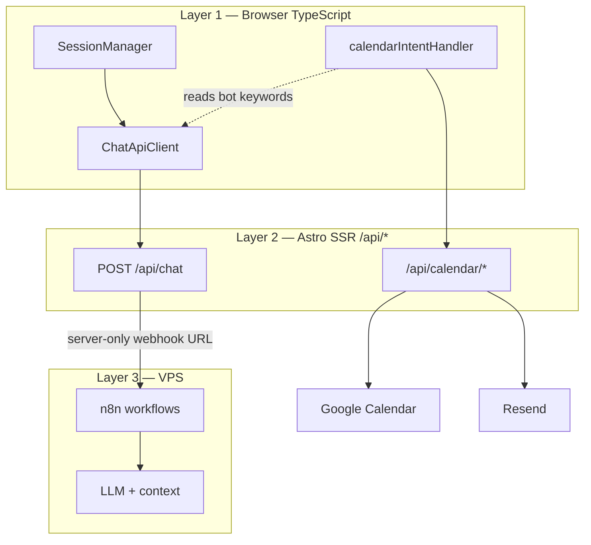
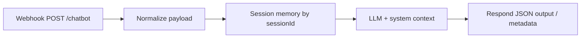

You paste a script tag. The widget loads. The conversation starts. Booking, if it exists at all, happens inside someone else's dashboard. Your site becomes a host for a black box that does not share state with your APIs, your calendar, or your content model.

That trade-off is acceptable for a landing page with a FAQ. It is not acceptable when the chatbot is supposed to ==qualify leads, explain services, and book calls on Google Calendar== -- on a site you fully own, in Spanish and English, with a brand voice you control.

For [aurin.mx](https://aurin.mx), I needed exactly that: a conversational agent embedded in the product surface, not bolted on as SaaS chrome. This article documents the three-layer stack that runs in production today -- Astro SSR on the edge, TypeScript on the client, and self-hosted n8n on a VPS orchestrated with Docker via Dockploy/Coolify -- and the architectural decisions that only make sense when those layers stay separate.

> [!info] Grounded in public docs, not only our repo
> The patterns below match what vendors and frameworks document: [n8n production webhooks](https://docs.n8n.io/integrations/builtin/core-nodes/n8n-nodes-base.webhook/), [Astro server endpoints](https://docs.astro.build/en/guides/endpoints/) for hiding secrets, and the [Model Context Protocol](https://modelcontextprotocol.io/specification/latest) idea of separating *tools the client may call* from *data the server owns*. Our code illustrates one implementation; the references at the end are what I cite when justifying the architecture to clients.

## First, why embedded chatbots break the stack

Intercom, Tidio, and similar tools optimize for speed of installation, not integration depth. You get a conversation UI and an admin panel. You do not get:

- A webhook URL you fully control, with secrets that never ship to the browser
- Side effects on *your* APIs (availability, booking, confirmation emails) driven by conversation state
- Two conversation modes (short service search vs full dialog) enforced at the product layer, not left to prompt luck
- Session history bounded and persisted in a way that matches your SSR model

The moment booking enters the picture, the chatbot stops being "messaging" and becomes ==distributed application logic.== Someone has to own session IDs, call [Google Calendar](https://developers.google.com/calendar/api/guides/overview), send transactional email, and decide when the user is in `confirm_time` vs `request_details`. SaaS widgets can call external APIs, but the orchestration model is still theirs -- not yours. That is the same class of problem as putting a third-party script on a page without a [backend-for-frontend](https://learn.microsoft.com/en-us/azure/architecture/patterns/backends-for-frontends) layer: the browser sees integration endpoints you do not control.

So the goal was not "add AI to the site." It was: ==build an agent that lives inside the same architecture as the rest of aurin.mx== (Payload CMS for content, Vercel for the Astro app, VPS for automation).

## The three-layer model



**Layer 1** handles UX state: sessions, retries, and calendar side effects triggered by *bot* wording.

**Layer 2** is the trust boundary: credentials, mode injection, and calendar mutations never exposed to the client bundle.

**Layer 3** is the reasoning engine: long context, tool-style steps, and workflow changes without redeploying the frontend.

> [!info] The frontend never calls n8n directly. Every message goes to `/api/chat`, which forwards to the webhook configured in `N8N_WEBHOOK_URL`. n8n's own docs distinguish [test vs production webhook URLs](https://docs.n8n.io/integrations/builtin/core-nodes/n8n-nodes-base.webhook/workflow-development/) and require the workflow to be **Active** before the production URL answers — which is exactly the 404 class we handle in `chat.ts`.

## Repository map — files that back this article

Everything below is in [AurinWebsite](https://github.com/AurinExperience/AurinWebsite) unless noted. The split with [aurin-cms](https://github.com/AurinExperience/aurin-cms) is intentional: editorial content vs runtime agent.

| Path | Layer | What it documents |
|------|-------|-------------------|
| `src/pages/api/chat.ts` | 2 | Validation, search-mode prefix, 30s timeout, n8n forward, 404 when workflow inactive |
| `src/lib/chatbot/sessionManager.ts` | 1 | `sess_*` IDs, `sessionStorage`, 50-message cap, 1h rollover, SSR fallback |
| `src/lib/chatbot/apiClient.ts` | 1 | `/api/chat` client, 30s abort, retry with backoff |
| `src/lib/chatbot/calendarIntentHandler.ts` | 1 | Bot-output keywords → calendar API calls |
| `src/lib/calendar/intentDetector.ts` | 1 | User-message regex (`PATTERNS`, confidence) → `select_time` / `provide_details` |
| `src/lib/calendar/googleCalendar.ts` | 2 | Google Calendar API (server-only credentials) |
| `src/lib/calendar/types.ts` | 2 | `PendingBooking`, `CalendarMetadata`, shared shapes |
| `src/pages/api/calendar/availability.ts` | 2 | Slots query |
| `src/pages/api/calendar/book.ts` | 2 | Create event |
| `src/pages/api/calendar/confirm.ts` | 2 | Confirm flow |
| `src/pages/api/calendar/select-time.ts` | 2 | User picks slot |
| `src/pages/api/calendar/send-confirmation.ts` | 2 | Resend email after n8n creates event |
| `src/lib/payload.ts` | — | CMS fetch for Astro pages (not per chat message) |
| `Docs/API_Calendar.md` | 2–3 | End-to-end booking arc, confirmation tokens (HMAC + TTL), n8n webhook names |
| `src/i18n/translations.ts` | 1 | Widget copy per locale (`chatbot`, `chatbotSearch`) |

**Server env vars the proxy depends on** (never exposed to the browser):

| Variable | Role |
|----------|------|
| `N8N_WEBHOOK_URL` | Production chat webhook (overrides dev default in `chat.ts`) |
| Google Calendar + Resend secrets | Used only under `src/pages/api/calendar/*` and mailing helpers |

The long-form calendar spec in `Docs/API_Calendar.md` matches what we implemented — including separate n8n paths such as `confirm-appointment` so booking side effects do not share the main chat graph:

```text Docs/API_Calendar.md — architecture sketch
Usuario → Chatbot → n8n Calendar Agent → Google Calendar
                                      ↓
                            Vercel API → Resend → Email
```

When debugging production, we read that doc first, then `chat.ts` logs (`Sending to n8n webhook`), then n8n execution history — ==not the widget bundle.==

## Layer 2 — SSR proxy as security and product logic

The proxy is not a thin pass-through. It validates `message` and `sessionId`, applies a 30s `AbortController` timeout, and implements ==search mode vs full mode== before the payload reaches n8n:

```typescript Search mode injection in /api/chat
const isSearchMode = mode === 'search';

let enhancedMessage = message;
if (isSearchMode) {
  enhancedMessage =
    `[MODO BÚSQUEDA: Responde en máximo 2-3 oraciones, solo sobre servicios de Aurin, sin mencionar agendamiento de citas]\n\nPregunta: ${message}`;
}

const n8nPayload = {
  message: enhancedMessage,
  sessionId,
  fileUrl: fileUrl || null,
  metadata: { ...metadata, mode: mode || 'full' },
};
```

That is deliberate product design. The marketing search bar and the full-screen assistant should not share the same response shape or the same instructions -- but they *can* share the same n8n workflow, because the SSR layer normalizes intent before the LLM sees the text.

The proxy also returns n8n `metadata` unchanged — the frontend can read workflow hints without the server rewriting them:

```typescript chat.ts — metadata passthrough
return new Response(JSON.stringify({
  success: true,
  output: data.output || data.response || data.message || 'Respuesta recibida',
  sessionId: data.sessionId || sessionId,
  metadata: data.metadata || {},  // ← pass through; do not inject fields here
}), { status: 200, headers: { 'Content-Type': 'application/json' } });
```

The webhook URL defaults in development but production uses env vars only on the server. If the workflow is inactive, n8n returns 404 and the API surfaces a clear error -- ==failures stay debuggable without opening the browser network tab to a third-party domain.==

## Layer 1 — Session, resilience, and SSR safety

`SessionManager` generates `sess_` IDs with nanoid, persists to `sessionStorage`, caps history at 50 messages, and returns a fresh session during SSR (`typeof window === 'undefined'`). Sessions older than one hour roll over automatically.

`ChatApiClient` mirrors server timeouts (30s), uses `AbortController`, and implements `sendMessageWithRetry` with exponential backoff (2 retries by default). Client errors 400/401/403 skip retry -- ==there is no point hammering a validation failure.==

```typescript Retry with backoff
for (let attempt = 0; attempt <= maxRetries; attempt++) {
  const result = await this.sendMessage(message, sessionId, metadata);
  if (result.success) return result;
  if (result.error?.includes('400') || result.error?.includes('401') || result.error?.includes('403')) {
    return result;
  }
  if (attempt < maxRetries) {
    await this.sleep(Math.pow(2, attempt) * 1000);
  }
}
```

This layer is boring on purpose. Production chat is mostly failure modes: slow LLM, dropped Wi‑Fi, tab backgrounding. The client owns recovery; n8n owns reasoning.

## Distributed intent detection — booking state in the frontend

The unusual part of this architecture is where ==conversation state for booking lives.==

n8n runs the dialog: tone, steps, when to ask for name and email. But the frontend watches *bot output* for keywords and drives calendar APIs:

```typescript Intent detection from bot text
export function detectCalendarIntent(botResponse: string) {
  const lower = botResponse.toLowerCase();

  if (lower.includes('disponibilidad') || lower.includes('horarios disponibles')) {
    return { isCalendar: true, intent: 'show_availability' };
  }
  if (lower.includes('¡perfecto!') && (lower.includes('cita para') || lower.includes('nombre completo'))) {
    return { isCalendar: true, intent: 'confirm_time' };
  }
  // ...
}
```

When the model says "¡perfecto!" and mentions a slot, the UI knows we are in `confirm_time` and can call `/api/calendar/availability` or `/api/calendar/book` with parsed day/time and customer data from regex -- without teaching the LLM your internal enum names.

User messages use a **second detector** in `intentDetector.ts` (regex + confidence), separate from bot keywords:

```typescript intentDetector.ts — user-side PATTERNS
const PATTERNS = {
  request_appointment: [/agendar.*cita/i, /disponibilidad/i, /horarios?\s+disponibles?/i],
  select_time: [/(lunes|martes|…|viernes)\s+a\s+las?\s+\d+/i],
  provide_details: [/^[^,]+,\s*[\w._%+-]+@[\w.-]+\.[a-zA-Z]{2,}/i],
};
export function detectIntent(message: string, hasExistingBooking = false): IntentDetectionResult
```

`calendarIntentHandler.handleUserMessage` then maps `dayName` + `time` to `POST /api/calendar/select-time`, or `Name, email, reason` to `POST /api/calendar/book` when `pendingBooking` exists in metadata.

That split is a trade-off:

- **Pros:** Change calendar providers or email templates in Astro without redeploying n8n graphs; keep LLM prompts human in Spanish; side effects stay typed TypeScript.
- **Cons:** Keyword contracts must stay in sync with copy changes in the workflow. Document the phrases; treat them like API versions.

> [!warning] If marketing rewrites bot confirmation copy without updating `detectCalendarIntent`, availability UI stops firing. This is coupling -- but explicit coupling you control, not a vendor schema.

### The production bug that made the warning real

This is not theoretical. In staging, someone tuned the n8n copy to sound friendlier: the bot stopped saying ==`¡perfecto!` + `cita para`== and started with variations like "Excelente" or shorter confirmations without the phrase `horarios disponibles`. The chat still looked fine in the UI -- messages flowed, the LLM was polite -- but ==the calendar rail went silent.==

`detectCalendarIntent` returned `{ intent: 'none' }`. No call to `/api/calendar/availability`. From the user's perspective: they asked for a meeting, the bot answered, and nothing actionable appeared. No stack trace in the browser, because nothing failed at the HTTP layer; the chat endpoint returned 200.

The debug path was unglamorous and fast once you know where to look:

1. Read the **bot message string** in the network response, not the user's input.
2. Grep that string against `calendarIntentHandler.ts`.
3. Compare with the **live n8n workflow** copy (export or editor), not with what marketing thought they changed.

The fix was a three-way sync: restore the trigger phrases in n8n *or* extend the matcher in TypeScript *or* both -- then smoke-test the path "ask for availability → see slots → pick time → confirm". We added an informal contract note next to the keywords so the next copy edit does not ship blind.

That incident is the same class of bug as GSAP under Rocket Loader on the Webflow project: ==a non-obvious coupling between layers that only shows up in production behavior, not in a linter.==

The calendar path continues through Google Calendar (`googleapis`), confirmation tokens, and Resend -- all Astro API routes, documented in the repo under `Docs/API_Calendar.md`.

## Layer 3 — Self-hosted n8n on a VPS

n8n.cloud would have been faster to start ([n8n hosting options](https://docs.n8n.io/hosting/) compare cloud vs self-hosted). We chose a VPS with Docker and Dockploy/Coolify instead because:

- No per-execution billing anxiety on high-traffic chat
- Full workflow export, custom nodes, and private networking to webhooks
- Same region and ops model as other internal automations

The trade-off is operational: you own upgrades, backups, and workflow activation discipline.

### How the workflow is structured (without exposing the graph)

You do not need the JSON to understand the arc. The production chat workflow is a straight pipeline:



**Webhook** receives `message`, `sessionId`, optional `fileUrl`, and `metadata` (including `mode: search | full`).

**Memory** keeps continuity per `sessionId` so the model does not reset on every turn.

**LLM** applies Aurin's service context and tone (see Payload section below -- that context lives here, not in the Astro bundle).

**Respond** returns `output` / `response` / `message` plus optional `metadata` the frontend may read without the proxy rewriting it.

Calendar confirmation and cron-style cleanup use **separate webhooks** (for example `confirm-appointment`), so booking side effects do not compete with the main chat graph.

### When the workflow is inactive: 404 end to end

n8n only exposes a webhook while the workflow is **Active**. If someone deactivates it after an edit, or a deploy leaves the wrong version live, the next message hits a 404 from the webhook URL.

The SSR layer catches that explicitly:

```typescript n8n 404 handling in /api/chat
if (response.status === 404) {
  throw new Error('Webhook not found. Please ensure the n8n workflow is ACTIVE.');
}
```

The client receives a failed `/api/chat` response and surfaces the generic error copy from translations (`errorResponse`) -- the user sees a polite failure, not a blank widget. In logs you see the 404 immediately; ==the fix is operational (toggle Active), not a code deploy.==

### Upgrades without pretending there is zero downtime

Self-hosted n8n on Docker via Dockploy means you own the image, the volume, and the restart. Our practice:

- **Export the workflow JSON** before any n8n version bump or node change.
- **Duplicate the workflow** on the same instance, point a test webhook at it, send synthetic payloads from `/api/chat` in dev.
- **Activate the new graph only after** a manual conversation test (search mode + full mode + one booking phrase).
- **Restart the container** in a low-traffic window; expect a short window where chat returns 503/timeout -- monitor Vercel function logs and the first real user message after boot.

We do not run blue-green for n8n today; honesty about a minutes-long blip is cheaper than surprise during a demo.

## Spanish and English on the same stack

The intro promised a site in Spanish and English with a controlled brand voice. Here is how that actually splits across layers.

**UI layer (Astro + React):** Routes follow locale -- Spanish at `/`, English under `/en`. `ChatbotContainer.astro` reads `getLangFromUrl` and passes `lang` plus `translations[lang].chatbot` into the widget: welcome message, placeholders, errors. The hero **search bar** uses the same pattern with `chatbotSearch.services` per locale for the typewriter placeholders.

**Proxy layer:** Search mode prepends a Spanish instruction block today (`[MODO BÚSQUEDA: ...]`) regardless of page locale. Full chat does not inject language -- the user's message language drives the reply. ==One n8n workflow serves both locales;== we did not fork graphs per language.

**Reasoning layer:** The model is prompted to answer in the language the user writes. English pages still hit the same webhook with the same `sessionId` format.

**Booking layer (the caveat):** `detectCalendarIntent` and `intentDetector` keywords are ==Spanish-first== (`disponibilidad`, `¡perfecto!`, weekday names in Spanish). That matches the primary booking market; an English-only bot phrase would not trigger availability until the matcher is extended. Product copy in n8n is kept in Spanish for the booking happy path even on `/en`, by discipline, not by automatic detection.

**Search mode on `/en`:** Instructions are Spanish in the SSR prefix, but the user query is English -- the model usually replies in English anyway. A future improvement is `metadata.locale` from Astro and a bilingual prefix in `/api/chat`.

## Payload CMS and what the agent actually knows

[Payload CMS](https://payloadcms.com/docs) is the editorial source for projects, categories, and site content — our admin runs at [aurin-payload-cms.vercel.app](https://aurin-payload-cms.vercel.app). `lib/payload.ts` fetches that API for Astro pages at build/request time -- the portfolio and service pages reflect what editors publish.

The chat path is different. **`/api/chat` does not call Payload on every message.** The forward to n8n is only `message`, `sessionId`, `fileUrl`, and `metadata`. There is no RAG hop in the Astro proxy today — a deliberate split between [headless CMS content](https://payloadcms.com/docs/getting-started/what-is-payload) and runtime agent context, similar to how many teams keep marketing copy out of the LLM prompt until they opt into sync jobs.

So how does the bot know Aurin's real services?

- **Ground truth for pages:** Payload → Astro (what you see on the site).
- **Ground truth for conversation:** the n8n workflow system prompt and memory (what the model is allowed to say in chat).

When marketing updates a service in Payload, the website updates on deploy; the agent updates when someone refreshes the n8n prompt or knowledge block to match. ==That is intentional product engineering: decouple fast editorial deploys from a workflow you do not want to auto-trigger on every CMS publish.==

The longer-term upgrade is a scheduled n8n job or an HTTP node that pulls `/api/...` from Payload and refreshes context -- we have not needed it yet because service cardinality is small and changes are infrequent.

Repos stay split on purpose:

- [AurinWebsite](https://github.com/AurinExperience/AurinWebsite) -- Astro, chat, calendar APIs
- [aurin-cms](https://github.com/AurinExperience/aurin-cms) -- Payload admin and API

## What I would do again (and what I would tighten)

**Would repeat:**

- SSR proxy as the only public integration point
- Mode flags (`search` / `full`) applied server-side
- Client retry + session caps
- Self-hosted n8n for cost and control

**Would tighten next:**

- Formalize the keyword contract (shared doc + CI grep) after the copy-change incident
- Pass `locale` into `/api/chat` and bilingual search-mode prefixes
- Structured `metadata.calendarIntent` from n8n instead of parsing bot prose
- Payload → n8n context sync on publish for services
- Correlate `sessionId` with n8n execution IDs in logs

## References (external — worth bookmarking)

| Topic | Source |
|-------|--------|
| n8n Webhook node (production vs test, activation) | [n8n Docs — Webhook](https://docs.n8n.io/integrations/builtin/core-nodes/n8n-nodes-base.webhook/) |
| Webhook workflow development | [n8n Docs — workflow development](https://docs.n8n.io/integrations/builtin/core-nodes/n8n-nodes-base.webhook/workflow-development/) |
| Self-hosted vs cloud hosting | [n8n Docs — hosting](https://docs.n8n.io/hosting/) |
| Webhook URL / reverse proxy config | [n8n Docs — webhook URL configuration](https://docs.n8n.io/hosting/configuration/configuration-examples/webhook-url/) |
| Astro API routes (SSR proxy pattern) | [Astro — Endpoints](https://docs.astro.build/en/guides/endpoints/) |
| Server-only secrets in Astro | [Astro — Environment variables](https://docs.astro.build/en/guides/environment-variables/) |
| BFF / hide third-party integration from browser | [Microsoft Azure — Backends for Frontends](https://learn.microsoft.com/en-us/azure/architecture/patterns/backends-for-frontends) |
| Google Calendar API | [Google — Calendar API overview](https://developers.google.com/calendar/api/guides/overview) |
| Headless CMS vs runtime agent context | [Payload — What is Payload?](https://payloadcms.com/docs/getting-started/what-is-payload) |
| MCP: tools vs opaque backends | [Model Context Protocol specification](https://modelcontextprotocol.io/specification/latest) |
| MCP remote servers + auth (industry pattern) | [Kapa.ai — Remote MCP hosting & authentication](https://www.kapa.ai/blog/remote-mcp-servers-hosting-authentication-best-practices) |

## Closing

Embedded chatbots optimize for installation. This stack optimizes for ==ownership==: your URLs, your calendar, your modes, your VPS workflows. The interesting engineering is not the widget -- it is the boundary lines: what the browser may know, what the server must hide, and what the automation layer is allowed to decide.

If you are evaluating Intercom for a site that already has Astro SSR and real booking requirements, ask whether the black box will ever be as flexible as three explicit layers you control. On aurin.mx, the answer was no -- so we built the layers instead.