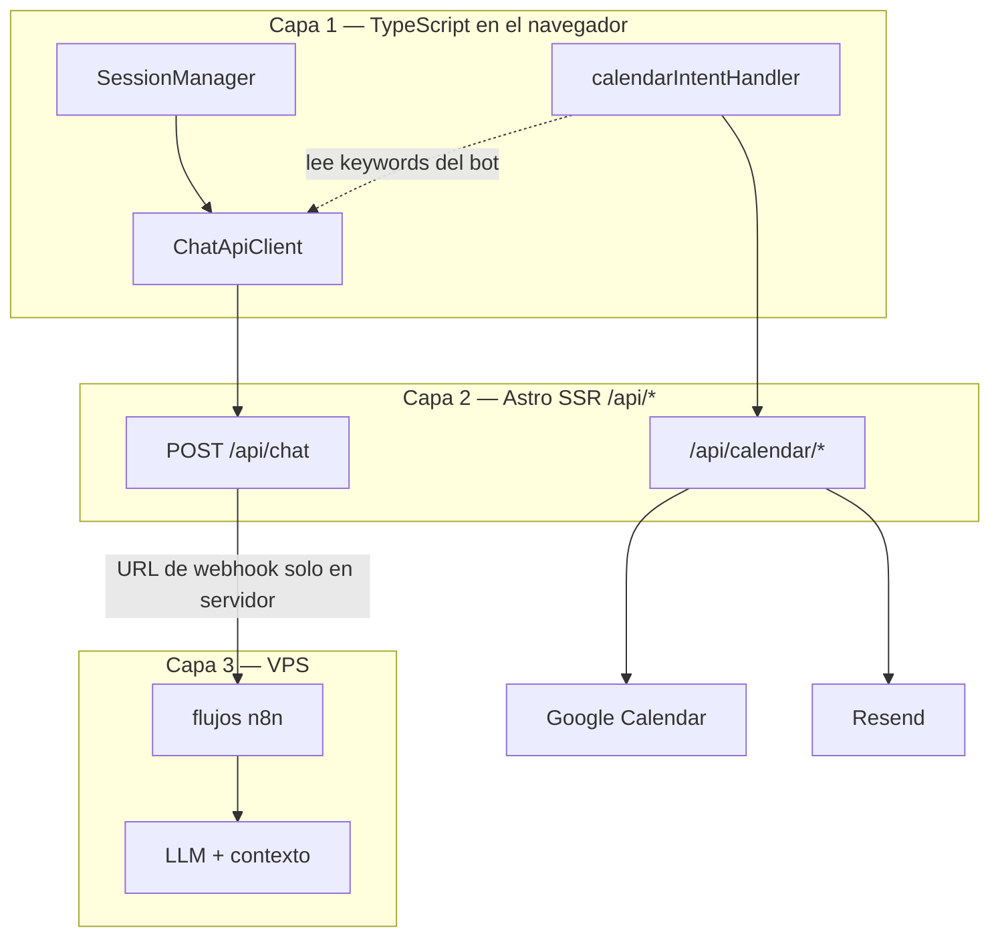
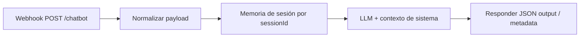

Pegas un script. El widget carga. La conversación arranca. El agendamiento, si existe, vive en el dashboard de otro proveedor. Tu sitio se convierte en anfitrión de una caja negra que no comparte estado con tus APIs, tu calendario ni tu modelo de contenido.

Ese intercambio sirve para una landing con FAQ. No sirve cuando el chatbot debe ==calificar leads, explicar servicios y agendar llamadas en Google Calendar== -- en un sitio que controlas por completo, en español e inglés, con una voz de marca propia.

Para [aurin.mx](https://aurin.mx) necesitaba exactamente eso: un agente conversacional dentro de la superficie del producto, no pegado como chrome de un SaaS. Este artículo documenta el stack en tres capas que corre en producción hoy -- Astro SSR en el edge, TypeScript en el cliente y n8n self-hosted en un VPS con Docker vía Dockploy/Coolify -- y las decisiones de arquitectura que solo tienen sentido cuando esas capas permanecen separadas.

> [!info] Sustentado en documentación pública, no solo en nuestro repo
> Los patrones coinciden con lo que documentan los proveedores: [webhooks de producción en n8n](https://docs.n8n.io/integrations/builtin/core-nodes/n8n-nodes-base.webhook/), [endpoints de servidor en Astro](https://docs.astro.build/es/guides/endpoints/) para ocultar secretos, y el [Model Context Protocol](https://modelcontextprotocol.io/specification/latest) como marco de *herramientas que el cliente puede invocar* frente a *datos que solo posee el servidor*. Nuestro código es una implementación; las referencias al final son las que cito al justificar la arquitectura con clientes.

## Primero: por qué los chatbots embebidos rompen el stack

Intercom, Tidio y herramientas similares optimizan velocidad de instalación, no profundidad de integración. Obtienes UI de chat y un panel admin. No obtienes:

- Una URL de webhook que controlas, con secretos que nunca van al bundle del navegador
- Efectos secundarios en *tus* APIs (disponibilidad, reserva, emails de confirmación) gobernados por el estado de la conversación
- Dos modos de conversación (búsqueda corta de servicios vs diálogo completo) aplicados en la capa de producto, no dejados al azar del prompt
- Historial acotado y persistido de forma coherente con tu modelo SSR

En el momento en que entra el booking, el chatbot deja de ser "mensajería" y pasa a ser ==lógica de aplicación distribuida.== Alguien debe poseer los session IDs, llamar a [Google Calendar](https://developers.google.com/calendar/api/guides/overview), enviar correo transaccional y decidir cuándo el usuario está en `confirm_time` vs `request_details`. Los widgets SaaS pueden llamar APIs externas, pero el modelo de orquestación sigue siendo de ellos -- no tuyo. Es el mismo tipo de problema que integrar un script de terceros sin una capa [backend-for-frontend](https://learn.microsoft.com/es-es/azure/architecture/patterns/backends-for-frontends): el navegador ve endpoints que tú no controlas.

El objetivo no fue "añadir IA al sitio". Fue: ==construir un agente que viva en la misma arquitectura que el resto de aurin.mx== (Payload CMS para contenido, Vercel para la app Astro, VPS para automatización).

## El modelo de tres capas



**Capa 1:** estado de UX -- sesiones, reintentos y efectos de calendario disparados por el *texto del bot*.

**Capa 2:** frontera de confianza -- credenciales, inyección de modo y mutaciones de calendario fuera del cliente.

**Capa 3:** motor de razonamiento -- contexto largo, pasos tipo herramienta y cambios de workflow sin redesplegar el frontend.

> [!info] El frontend nunca llama a n8n directamente. Cada mensaje va a `/api/chat`, que reenvía al webhook configurado en `N8N_WEBHOOK_URL`. La documentación de n8n separa [URLs de test vs producción](https://docs.n8n.io/integrations/builtin/core-nodes/n8n-nodes-base.webhook/workflow-development/) y exige el workflow **Active** antes de que responda la URL de producción — la misma clase de 404 que manejamos en `chat.ts`.

## Mapa del repositorio — archivos que sustentan este artículo

Todo lo siguiente está en [AurinWebsite](https://github.com/AurinExperience/AurinWebsite) salvo que se indique otro. El split con [aurin-cms](https://github.com/AurinExperience/aurin-cms) es intencional: contenido editorial vs agente en runtime.

| Ruta | Capa | Qué documenta |
|------|------|----------------|
| `src/pages/api/chat.ts` | 2 | Validación, prefijo modo búsqueda, timeout 30s, forward a n8n, 404 si el workflow está inactivo |
| `src/lib/chatbot/sessionManager.ts` | 1 | IDs `sess_*`, `sessionStorage`, tope 50 mensajes, rollover 1h, fallback SSR |
| `src/lib/chatbot/apiClient.ts` | 1 | Cliente `/api/chat`, abort 30s, retry con backoff |
| `src/lib/chatbot/calendarIntentHandler.ts` | 1 | Keywords del texto del bot → APIs de calendario |
| `src/lib/calendar/intentDetector.ts` | 1 | Regex del mensaje del usuario (`PATTERNS`, confidence) → `select_time` / `provide_details` |
| `src/lib/calendar/googleCalendar.ts` | 2 | Google Calendar API (credenciales solo en servidor) |
| `src/lib/calendar/types.ts` | 2 | `PendingBooking`, `CalendarMetadata`, shapes compartidos |
| `src/pages/api/calendar/availability.ts` | 2 | Consulta de slots |
| `src/pages/api/calendar/book.ts` | 2 | Crear evento |
| `src/pages/api/calendar/confirm.ts` | 2 | Flujo de confirmación |
| `src/pages/api/calendar/select-time.ts` | 2 | Usuario elige horario |
| `src/pages/api/calendar/send-confirmation.ts` | 2 | Email Resend tras crear evento en n8n |
| `src/lib/payload.ts` | — | Fetch CMS para páginas Astro (no por mensaje de chat) |
| `Docs/API_Calendar.md` | 2–3 | Arco de booking, tokens de confirmación (HMAC + TTL), nombres de webhooks n8n |
| `src/i18n/translations.ts` | 1 | Copy del widget por locale (`chatbot`, `chatbotSearch`) |

**Variables de entorno del servidor que usa el proxy** (nunca al browser):

| Variable | Rol |
|----------|------|
| `N8N_WEBHOOK_URL` | Webhook de chat en producción (reemplaza el default de dev en `chat.ts`) |
| Secretos Google Calendar + Resend | Solo bajo `src/pages/api/calendar/*` y helpers de mailing |

La spec larga en `Docs/API_Calendar.md` coincide con lo implementado — incluyendo paths n8n separados como `confirm-appointment` para que los side effects de booking no compartan el grafo principal de chat:

```text Docs/API_Calendar.md — boceto de arquitectura
Usuario → Chatbot → n8n Calendar Agent → Google Calendar
                                      ↓
                            Vercel API → Resend → Email
```

Para depurar producción leemos ese doc primero, luego los logs de `chat.ts` (`Sending to n8n webhook`), luego el historial de ejecución en n8n — ==no el bundle del widget.==

## Capa 2 — Proxy SSR como seguridad y lógica de producto

El proxy no es un pass-through delgado. Valida `message` y `sessionId`, aplica timeout de 30s con `AbortController` e implementa ==modo búsqueda vs modo completo== antes de que el payload llegue a n8n:

```typescript Inyeccion de modo search en /api/chat
const isSearchMode = mode === 'search';

let enhancedMessage = message;
if (isSearchMode) {
  enhancedMessage =
    `[MODO BÚSQUEDA: Responde en máximo 2-3 oraciones, solo sobre servicios de Aurin, sin mencionar agendamiento de citas]\n\nPregunta: ${message}`;
}

const n8nPayload = {
  message: enhancedMessage,
  sessionId,
  fileUrl: fileUrl || null,
  metadata: { ...metadata, mode: mode || 'full' },
};
```

Es diseño de producto deliberado. La barra de búsqueda del marketing y el asistente a pantalla completa no deben compartir la misma forma de respuesta ni las mismas instrucciones -- pero *sí* pueden compartir el mismo workflow de n8n, porque la capa SSR normaliza la intención antes de que el LLM lea el texto.

El proxy también devuelve el `metadata` de n8n sin reescribirlo — el frontend puede leer pistas del workflow sin que el servidor las inyecte:

```typescript chat.ts — passthrough de metadata
return new Response(JSON.stringify({
  success: true,
  output: data.output || data.response || data.message || 'Respuesta recibida',
  sessionId: data.sessionId || sessionId,
  metadata: data.metadata || {},
}), { status: 200, headers: { 'Content-Type': 'application/json' } });
```

La URL del webhook vive solo en variables de entorno del servidor. Si el workflow está inactivo, n8n devuelve 404 y la API expone un error claro -- ==los fallos se depuran sin abrir la pestaña Network hacia un dominio de terceros.==

## Capa 1 — Sesión, resiliencia y seguridad SSR

`SessionManager` genera IDs `sess_` con nanoid, persiste en `sessionStorage`, limita el historial a 50 mensajes y devuelve sesión nueva durante SSR (`typeof window === 'undefined'`). Sesiones de más de una hora rotan solas.

`ChatApiClient` replica los timeouts del servidor (30s), usa `AbortController` e implementa `sendMessageWithRetry` con backoff exponencial (2 reintentos por defecto). Errores 400/401/403 no reintentan -- ==no tiene sentido martillar un fallo de validación.==

```typescript Reintento con backoff
for (let attempt = 0; attempt <= maxRetries; attempt++) {
  const result = await this.sendMessage(message, sessionId, metadata);
  if (result.success) return result;
  if (result.error?.includes('400') || result.error?.includes('401') || result.error?.includes('403')) {
    return result;
  }
  if (attempt < maxRetries) {
    await this.sleep(Math.pow(2, attempt) * 1000);
  }
}
```

Esta capa es aburrida a propósito. El chat en producción es sobre todo modos de fallo: LLM lento, Wi‑Fi inestable, pestaña en segundo plano. El cliente recupera; n8n razona.

## Detección de intents distribuida — el estado del booking en el frontend

La parte inusual de esta arquitectura es *dónde vive el estado de conversación para booking*.

n8n conduce el diálogo: tono, pasos, cuándo pedir nombre y email. Pero el frontend observa la *salida del bot* por keywords y dispara las APIs de calendario:

```typescript Deteccion de intent desde texto del bot
export function detectCalendarIntent(botResponse: string) {
  const lower = botResponse.toLowerCase();

  if (lower.includes('disponibilidad') || lower.includes('horarios disponibles')) {
    return { isCalendar: true, intent: 'show_availability' };
  }
  if (lower.includes('¡perfecto!') && (lower.includes('cita para') || lower.includes('nombre completo'))) {
    return { isCalendar: true, intent: 'confirm_time' };
  }
  // ...
}
```

Cuando el modelo dice "¡perfecto!" y menciona un horario, la UI sabe que estamos en `confirm_time` y puede llamar a `/api/calendar/availability` o `/api/calendar/book` con día/hora y datos del usuario parseados por regex -- sin enseñar al LLM los nombres internos de tus enums.

Los mensajes del **usuario** usan un segundo detector en `intentDetector.ts` (regex + confidence), separado de las keywords del bot:

```typescript intentDetector.ts — PATTERNS del lado usuario
const PATTERNS = {
  request_appointment: [/agendar.*cita/i, /disponibilidad/i, /horarios?\s+disponibles?/i],
  select_time: [/(lunes|martes|…|viernes)\s+a\s+las?\s+\d+/i],
  provide_details: [/^[^,]+,\s*[\w._%+-]+@[\w.-]+\.[a-zA-Z]{2,}/i],
};
export function detectIntent(message: string, hasExistingBooking = false): IntentDetectionResult
```

`handleUserMessage` en `calendarIntentHandler.ts` mapea `dayName` + `time` a `POST /api/calendar/select-time`, o el formato `Nombre, email, motivo` a `POST /api/calendar/book` cuando hay `pendingBooking` en metadata.

El reparto es un trade-off:

- **A favor:** cambiar proveedor de calendario o plantillas de email en Astro sin redesplegar grafos de n8n; prompts del LLM humanos en español; efectos secundarios en TypeScript tipado.
- **En contra:** el contrato de keywords debe mantenerse alineado con los cambios de copy en el workflow. Documentar las frases; tratarlas como versión de API.

> [!warning] Si marketing reescribe la confirmación del bot sin actualizar `detectCalendarIntent`, deja de dispararse la UI de disponibilidad. Es acoplamiento -- pero acoplamiento explícito que controlas tú, no un esquema del vendor.

### El bug de producción que volvió creíble el warning

No es teórico. En staging, alguien afinó el copy en n8n para sonar más amable: el bot dejó de decir ==`¡perfecto!` + `cita para`== y pasó a variantes como "Excelente" o confirmaciones más cortas sin la frase `horarios disponibles`. El chat se veía bien -- mensajes fluidos, tono correcto -- pero ==el riel de calendario se quedó mudo.==

`detectCalendarIntent` devolvía `{ intent: 'none' }`. Sin llamada a `/api/calendar/availability`. Para el usuario: pidió cita, el bot respondió, y no apareció nada accionable. Sin stack trace en el navegador, porque el HTTP no fallaba; `/api/chat` respondía 200.

El debug fue poco glamuroso y rápido cuando sabes dónde mirar:

1. Leer el **string de la respuesta del bot** en network, no el input del usuario.
2. Hacer grep contra `calendarIntentHandler.ts`.
3. Comparar con el copy del **workflow en n8n** (export o editor), no con lo que marketing cree que cambió.

El fix fue sincronizar en tres vías: restaurar frases en n8n *o* ampliar el matcher en TypeScript *o* ambos -- y smoke-test "pedir disponibilidad → ver slots → elegir hora → confirmar". Dejamos una nota de contrato junto a las keywords para que el próximo cambio de copy no salga a ciegas.

Es la misma clase de bug que GSAP bajo Rocket Loader en el proyecto Webflow: ==acoplamiento no obvio entre capas que solo se ve en comportamiento de producción, no en el linter.==

El flujo sigue por Google Calendar (`googleapis`), tokens de confirmación y Resend -- todo en rutas API de Astro, documentado en el repo en `Docs/API_Calendar.md`.

## Capa 3 — n8n self-hosted en VPS

n8n.cloud habría sido más rápido para arrancar ([opciones de hosting en n8n](https://docs.n8n.io/hosting/) comparan cloud vs self-hosted). Elegimos VPS con Docker y Dockploy/Coolify porque:

- Sin ansiedad de facturación por ejecución en chat con tráfico real
- Exportación completa de workflows, nodos custom y red privada hacia webhooks
- Mismo modelo operativo que otras automatizaciones internas

El trade-off es operativo: upgrades, backups y disciplina de activación de workflows.

### Cómo está estructurado el workflow (sin exponer el grafo)

No necesitas el JSON para entender el arco. El workflow de chat en producción es un pipeline directo:



**Webhook** recibe `message`, `sessionId`, `fileUrl` opcional y `metadata` (incluye `mode: search | full`).

**Memoria** mantiene continuidad por `sessionId` para que el modelo no reinicie en cada turno.

**LLM** aplica contexto de servicios y tono de Aurin (ver sección Payload -- ese contexto vive aquí, no en el bundle de Astro).

**Respond** devuelve `output` / `response` / `message` y `metadata` opcional que el frontend lee sin que el proxy lo reescriba.

Confirmación de citas y tareas cron usan **webhooks separados** (por ejemplo `confirm-appointment`), para que los efectos de booking no compitan con el grafo principal de chat.

### Cuando el workflow está inactivo: 404 de punta a punta

n8n solo expone webhook mientras el workflow está **Active**. Si alguien lo desactiva tras un edit, o un deploy deja la versión equivocada, el siguiente mensaje recibe 404 en la URL del webhook.

La capa SSR lo captura explícitamente:

```typescript Manejo de 404 de n8n en /api/chat
if (response.status === 404) {
  throw new Error('Webhook not found. Please ensure the n8n workflow is ACTIVE.');
}
```

El cliente recibe fallo en `/api/chat` y muestra el copy de error de las traducciones (`errorResponse`) -- el usuario ve fallo amable, no widget vacío. En logs aparece el 404 al instante; ==el fix es operativo (activar el workflow), no un deploy de código.==

### Upgrades sin fingir cero downtime

n8n self-hosted en Docker vía Dockploy implica imagen, volumen y restart propios. Nuestra práctica:

- **Exportar el JSON del workflow** antes de subir versión de n8n o cambiar nodos.
- **Duplicar el workflow** en la misma instancia, apuntar un webhook de prueba, mandar payloads desde `/api/chat` en dev.
- **Activar el grafo nuevo solo después** de probar conversación manual (modo search + full + una frase de booking).
- **Reiniciar el contenedor** en ventana de bajo tráfico; esperar minutos donde el chat devuelve 503/timeout -- monitorear logs de Vercel y el primer mensaje real post-boot.

Hoy no hay blue-green en n8n; ser honestos sobre el blip de minutos sale más barato que una sorpresa en demo.

## Español e inglés en el mismo stack

La intro prometía sitio en español e inglés con voz de marca controlada. Así se reparte en la práctica.

**Capa UI (Astro + React):** Rutas por locale -- español en `/`, inglés en `/en`. `ChatbotContainer.astro` usa `getLangFromUrl` y pasa `lang` y `translations[lang].chatbot` al widget: bienvenida, placeholders, errores. La **barra de búsqueda** del hero usa `chatbotSearch.services` por idioma en el typewriter.

**Capa proxy:** El modo search antepone hoy un bloque de instrucciones en español (`[MODO BÚSQUEDA: ...]`) aunque la página sea `/en`. El chat completo no inyecta idioma -- el mensaje del usuario guía la respuesta. ==Un solo workflow de n8n para ambos locales;== no duplicamos grafos por idioma.

**Capa de razonamiento:** El modelo responde en el idioma en que escribe el usuario. Las páginas en inglés pegan al mismo webhook con el mismo formato de `sessionId`.

**Capa booking (matiz):** `detectCalendarIntent` e `intentDetector` son ==primero español== (`disponibilidad`, `¡perfecto!`, días de la semana en español). Encaja con el mercado principal; una frase solo en inglés no dispararía disponibilidad hasta extender el matcher. El copy de booking en n8n se mantiene en español en el happy path incluso en `/en`, por disciplina, no por detección automática.

**Search en `/en`:** El prefijo SSR es español pero la consulta suele ser inglés -- el modelo casi siempre responde en inglés. Mejora futura: `metadata.locale` desde Astro y prefijo bilingüe en `/api/chat`.

## Payload CMS y qué sabe realmente el agente

[Payload CMS](https://payloadcms.com/docs) es la fuente editorial de proyectos, categorías y contenido — nuestro admin en [aurin-payload-cms.vercel.app](https://aurin-payload-cms.vercel.app). `lib/payload.ts` consume esa API en páginas Astro en build/request -- portfolio y servicios reflejan lo que publica el equipo.

El chat es otro canal. **`/api/chat` no llama a Payload en cada mensaje.** El reenvío a n8n es solo `message`, `sessionId`, `fileUrl` y `metadata`. No hay salto RAG en el proxy Astro hoy — un split deliberado entre [contenido headless](https://payloadcms.com/docs/getting-started/what-is-payload) y contexto del agente en runtime.

¿Cómo sabe el bot los servicios reales de Aurin?

- **Verdad en páginas:** Payload → Astro (lo que ves en el sitio).
- **Verdad en conversación:** system prompt y memoria del workflow n8n (lo que el modelo puede decir en chat).

Cuando marketing actualiza un servicio en Payload, el sitio se actualiza al deploy; el agente se actualiza cuando alguien refresca el prompt o bloque de conocimiento en n8n. ==Es ingeniería de producto a propósito: desacoplar deploys editoriales rápidos de un workflow que no quieres disparar en cada publish del CMS.==

La mejora a medio plazo es un job en n8n o un nodo HTTP que tire de `/api/...` de Payload y refresque contexto -- aún no hace falta porque el catálogo de servicios es pequeño y cambia poco.

Los repos siguen separados:

- [AurinWebsite](https://github.com/AurinExperience/AurinWebsite) -- Astro, chat, APIs de calendario
- [aurin-cms](https://github.com/AurinExperience/aurin-cms) -- admin Payload y API

## Qué repetiría (y qué apretaría)

**Repetiría:**

- Proxy SSR como único punto de integración público
- Flags de modo (`search` / `full`) aplicados en servidor
- Reintento en cliente + tope de sesión
- n8n self-hosted por costo y control

**Apretaría después:**

- Formalizar el contrato de keywords (doc compartido + grep en CI) tras el incidente de copy
- Pasar `locale` a `/api/chat` y prefijos bilingües en modo search
- `metadata.calendarIntent` estructurado desde n8n en lugar de parsear prosa del bot
- Sync Payload → contexto n8n al publicar servicios
- Correlacionar `sessionId` con IDs de ejecución en logs de n8n

## Referencias (externas — para guardar)

| Tema | Fuente |
|------|--------|
| Nodo Webhook n8n (producción vs test, activación) | [n8n Docs — Webhook](https://docs.n8n.io/integrations/builtin/core-nodes/n8n-nodes-base.webhook/) |
| Desarrollo de workflows con webhook | [n8n Docs — workflow development](https://docs.n8n.io/integrations/builtin/core-nodes/n8n-nodes-base.webhook/workflow-development/) |
| Self-hosted vs cloud | [n8n Docs — hosting](https://docs.n8n.io/hosting/) |
| Configuración de URL de webhook | [n8n Docs — webhook URL](https://docs.n8n.io/hosting/configuration/configuration-examples/webhook-url/) |
| Rutas API en Astro (proxy SSR) | [Astro — Endpoints](https://docs.astro.build/es/guides/endpoints/) |
| Secretos solo en servidor | [Astro — Variables de entorno](https://docs.astro.build/es/guides/environment-variables/) |
| BFF / ocultar integraciones al navegador | [Azure — Backends for Frontends](https://learn.microsoft.com/es-es/azure/architecture/patterns/backends-for-frontends) |
| Google Calendar API | [Google — Calendar API overview](https://developers.google.com/calendar/api/guides/overview) |
| CMS headless vs contexto del agente | [Payload — What is Payload?](https://payloadcms.com/docs/getting-started/what-is-payload) |
| MCP: herramientas vs backends opacos | [Model Context Protocol specification](https://modelcontextprotocol.io/specification/latest) |
| MCP remoto + autenticación | [Kapa.ai — Remote MCP hosting & authentication](https://www.kapa.ai/blog/remote-mcp-servers-hosting-authentication-best-practices) |

## Cierre

Los chatbots embebidos optimizan la instalación. Este stack optimiza la ==propiedad==: tus URLs, tu calendario, tus modos, tus workflows en VPS. La ingeniería interesante no es el widget -- son las líneas de frontera: qué puede saber el navegador, qué debe ocultar el servidor y qué puede decidir la capa de automatización.

Si estás evaluando Intercom para un sitio que ya tiene Astro SSR y booking real, pregúntate si la caja negra será tan flexible como tres capas explícitas que controlas. En aurin.mx la respuesta fue no -- así que construimos las capas.