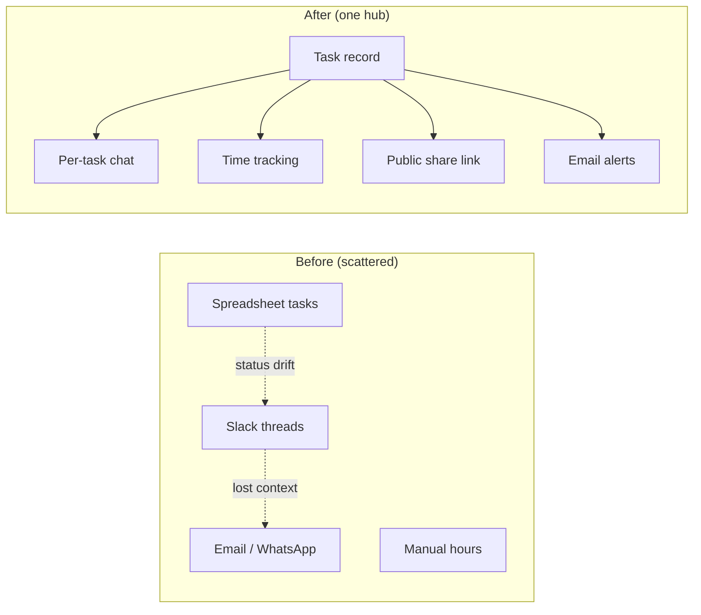
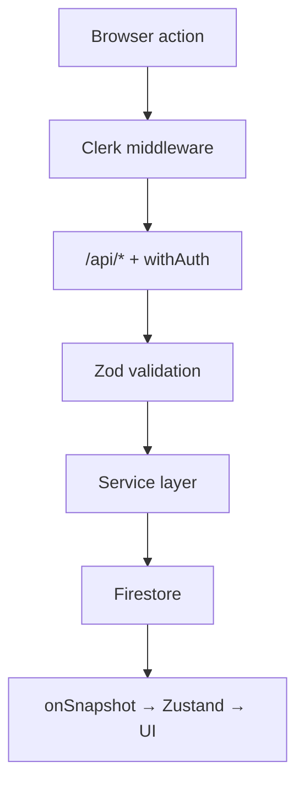
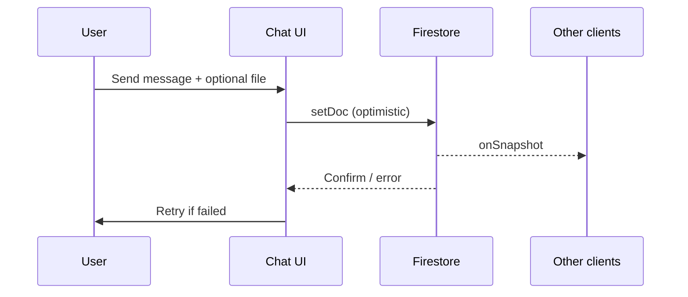

> [!tip] In 30 seconds
> - **Who this is for:** Product engineers and design leads building internal ops tools for distributed teams — not a generic todo app, but agency-grade coordination across clients, time zones, and external stakeholders.
> - **Problem it solves:** Task status lived in spreadsheets, context in Slack, and client updates in email — no single place where assignment, conversation, time, and visibility stayed attached to the same work unit.
> - **What changes if you apply this:** One Firestore-backed hub with **per-task chat**, **Kanban + table views**, **built-in time tracking**, **token-based client share links**, and an **n8n admin assistant** — remote-first ops without renting a black-box PM suite.

You open three tabs to answer one question: *Where is that deliverable, who owns it, and what did the client last say?*

The task list is a spreadsheet someone updates on Fridays. The thread is in Slack — but only if you remember which channel. The client pinged on WhatsApp. Nobody logged the hours on the right row. ==The work exists; the system does not.==

That is the shape of agency operations when the team goes remote-first faster than the tooling. Aurin — a distributed product and design studio — hit that wall in 2023–2024. The fix was not “buy another SaaS project manager.” It was ==build one hub where task, conversation, time, and client visibility share the same object== — and wire AI where it reduces triage, not where it replaces judgment.

I led UX engineering on [Aurin Task Manager](https://aurin-task-manager.vercel.app): a full-stack Next.js platform on Firestore and Clerk, deployed on Vercel, with **357+ commits** of active iteration. Public repo: [KarenRebecaOrtiz/Aurin-Task-Manager](https://github.com/KarenRebecaOrtiz/Aurin-Task-Manager). This essay is the product story: architecture, features, and the decisions that held.

> [!info] External grounding
> Patterns below align with documented practice: [Firestore real-time listeners](https://firebase.google.com/docs/firestore/query-data/listen), [Clerk Next.js middleware](https://clerk.com/docs/references/nextjs/clerk-middleware), [Next.js Route Handlers](https://nextjs.org/docs/app/building-your-application/routing/route-handlers) as API boundaries, and [n8n webhooks](https://docs.n8n.io/integrations/builtin/core-nodes/n8n-nodes-base.webhook/) for server-side automation. The [Aurin marketing chatbot](/en/articulos/conversational-agent-three-layer-stack) is a separate product surface — this platform is internal ops.

## The wrong first question: which PM tool?

> **In plain terms:** Picking Notion or Asana first skips the real question — what must stay attached to each piece of work when the team is in five time zones.
Most teams start with a vendor comparison: Notion, Asana, Monday, ClickUp. That optimizes for **installation speed**, not **integration depth** for how agencies actually work:

- Tasks are scoped **per client account**, not per generic “project”
- Context lives in **conversation**, not a comment field bolted on later
- **Hours** must accumulate somewhere finance can trust
- **Clients** need visibility without a full seat license
- **Admins** need bulk triage — sometimes in natural language, not drag-and-drop only

SaaS PM tools solve the first bullet adequately. They rarely solve the second and fourth without expensive per-seat pricing — and they never share state with *your* n8n workflows, *your* email templates, or *your* Firestore security rules.

The architectural bet was therefore: ==real-time first, modular features, owned stack.== Firebase Firestore for sync, Next.js App Router for UI + API routes, Clerk for identity, Zustand for UI state — not because each is fashionable, but because each maps to a boundary the agency already needed.



## Architecture at a glance

> **In plain terms:** Browser UI, Next.js APIs, and Firestore — each layer with a clear job so features can grow without rewriting the core.
The codebase follows a **hybrid modular architecture** documented in `documentation/ARCHITECTURE_SUMMARY.md`:

| Layer | Technology | Responsibility |
| --- | --- | --- |
| **UI** | React 19, Next.js 15, Tailwind 4, Framer Motion | Dashboard, Kanban, chat sidebars, forms |
| **State** | Zustand (**18+ stores**) | Tasks page, Kanban board, timer, forms, AI ops |
| **Data** | Firestore + Firebase Storage | Real-time tasks, messages, clients, users |
| **API** | Next.js Route Handlers + `withAuth()` | CRUD, uploads, Gemini summaries, webhooks |
| **Auth** | Clerk (roles incl. admin metadata) | Protected dashboard, guest/public exceptions |
| **Ops** | Sentry, Vercel | Error tracking, serverless deploy |



**Directory shape** (high level):

```text src/
app/           # App Router — dashboard, guest routes, API
modules/       # 15+ feature modules (tasks, chat, shareTask, n8n-chatbot…)
stores/        # Zustand stores
hooks/         # 40+ custom hooks
services/      # Business logic
lib/           # Firebase, API helpers
```

Each module exports a public API (`index.ts`) — tasks, chat, and share links can evolve independently. That mattered when share links and the n8n chatbot landed months after the first Kanban ship.

## Task management: two views, one source of truth

> **In plain terms:** Same tasks, two ways to see them — board for flow, table for filters — both wired to live data.
Tasks are first-class documents in Firestore with client scope, status, priority, assignees, and archive support.

**Views:**

- **Table** — filter by status, priority, client; sort for triage mornings
- **Kanban** — `@dnd-kit` drag across columns (`Por Iniciar`, `En Proceso`, `Backlog`, …)

Both views subscribe to the same `onSnapshot` listeners. ==Drag a card on Kanban and the table updates for everyone online — no refresh button, no “sync conflict” email.==

**Lifecycle notifications** fire through the `mailer` module when tasks are created, reassigned, change status/priority/dates, archive, or delete. Templates share one HTML layout (responsive, badge styling for priority/status) — non-throwing by design so a failed email does not roll back the task write.

## Per-task chat: context that stays with the work

> **In plain terms:** Every task gets its own thread — files, replies, read status — so you never hunt Slack for “what did we decide?”
Slack optimizes for channels. Agencies optimize for **deliverables**. Attaching chat to the task object means:

- New assignees read history **in place**
- File uploads land on the **same record** the client will later see
- Read receipts and replies behave like a lightweight ticket system

**Implementation highlights** (from `modules/chat` and `dataStore`):

- Real-time Firestore messages with **IndexedDB persistence** for resilience
- Virtualized message lists (`react-virtuoso`) for long threads
- **Gemini-generated summaries** for long conversations — triage without reading 200 messages
- Optimistic send with **resend on failure** (`useMessageActions`)



> [!warning] Chat without ownership boundaries becomes noise
> Per-task threads only work if **creating a task is the default** when work enters the system. Otherwise Slack wins by habit. We aligned onboarding and header UX so “new task” was faster than “new channel.”

## Time tracking: hours that follow the task

> **In plain terms:** Start a timer on the task you are doing; hours accumulate and sync — no separate timesheet app.
Agencies bill or plan capacity in hours. A second app for time tracking guarantees drift.

`timerStore` runs a **Web Worker** for accurate elapsed time, syncs periodically to Firestore, and finalizes on pause/close. Multi-tab coordination avoids double-counting when someone leaves a dashboard tab open.

==The timer is not a global clock — it binds to `taskId`.== Finance and PMs can trust that the hours on a row match the conversation and deliverable on the same row.

## Client visibility without a seat license

> **In plain terms:** Share a secure link; the client sees progress and can comment — no Clerk account, no extra SaaS bill.
The `shareTask` module implements **capability URLs** (`/p/[token]`) with OWASP-minded patterns:

| Concern | Approach |
| --- | --- |
| Token entropy | `nanoid` — high-entropy tokens, not sequential IDs |
| Data exposure | DTOs strip internal fields (budget, internal IDs) |
| Guest identity | `localStorage` display name — comment without signup |
| Revocation | Toggle off / regenerate token / optional expiry |
| Abuse | Rate limits on public comment endpoints |

**Admin flow:** open ShareDialog from task header → toggle public → copy URL → client opens sanitized `PublicTaskView` with guest chat.

**Guest flow:** validate token → load safe task snapshot → prompt name once → comment in real time.

This is the agency pattern SaaS PM tools charge per external user for — implemented as ==first-party routes you control==.

## AI in two speeds: Gemini summaries and the n8n admin assistant

> **In plain terms:** AI helps in two ways — short summaries on busy threads, and a chatbot for admins who want to create tasks by typing in Spanish.
AI appears twice — deliberately different jobs:

### 1. Gemini summaries (in-thread)

Long task threads get an AI summary message (`isSummary`) so leads catch up in seconds. Powered by Firebase AI / Gemini via API routes — ==summarization, not autonomous status changes.==

### 2. n8n chatbot (admin-only widget)

`modules/n8n-chatbot` exposes a floating assistant for users with Clerk `admin` metadata. Natural language commands create, edit, query, and assign tasks; optional file uploads (images, PDFs) flow to Cloud Storage and through n8n + ChatGPT vision.

**Payload to n8n** (documented in module README):

```json
{
  "userId": "user_xxxxx",
  "message": "Crea una tarea para revisar código",
  "sessionId": "unique-session-id",
  "fileUrl": "https://storage.googleapis.com/.../file.jpg",
  "timestamp": "2024-01-01T12:00:00.000Z"
}
```

The browser calls `POST /api/n8n-chatbot` — **never** the raw webhook URL. Same trust boundary pattern as the [marketing site chatbot](/en/articulos/conversational-agent-three-layer-stack), applied to **internal CRUD** instead of calendar booking.

> [!info] Admin-only by design
> Natural-language task mutation is powerful and dangerous. The widget does not render unless `isAdmin` — regular contributors use Kanban, forms, and chat.

## Teams, notes, and the “who is around” layer

> **In plain terms:** Lightweight social signals so a remote team still feels present — without another social network.
Remote-first teams lose hallway context. Two features address that without scope creep:

**Notes tray** (`modules/notes`) — Instagram-style public notes in the header, **120 characters**, **24-hour expiry**, one active note per user. Firestore-backed marquesina; replaces an admin-only “advices” module with something everyone can use.

**Teams** (`modules/teams`) — team chat dialogs, member management, notifications. Group conversations when work spans multiple accounts.

Neither feature blocks shipping tasks. Both reduce “is anyone online?” friction — ==social presence without leaving the ops hub.==

## Repository map (where to read the code)

> **In plain terms:** A table of modules and paths — skip if you only care about outcomes.
| Path | What it owns |
| --- | --- |
| `modules/data-views/` | Table + Kanban task views |
| `modules/task-crud/` | Create / edit task flows |
| `modules/chat/` | Per-task messaging UI + hooks |
| `modules/shareTask/` | Public links, guest chat, DTOs |
| `modules/n8n-chatbot/` | Admin NL assistant widget |
| `modules/mailer/` | Transactional email facade + templates |
| `modules/notes/` | Ephemeral team notes tray |
| `modules/teams/` | Team chat + management |
| `stores/dataStore.ts` | Tasks, messages, clients, users |
| `stores/timerStore.ts` | Timer + Firestore sync |
| `app/api/tasks/` | Task CRUD endpoints |
| `documentation/ARCHITECTURE_*.md` | Full architecture reference |

## Security and failure modes

> **In plain terms:** Login required for internal work; public links show only safe fields; APIs validate every write.
- **Clerk middleware** on dashboard routes; `withAuth()` on API handlers
- **Zod** on request bodies — standardized `{ success, data }` / `{ success: false, error }` responses
- **Firestore security rules** + user-scoped queries
- **Public routes** (`/p/[token]`, guest team views) explicitly allowed in middleware — with sanitized DTOs
- **Sentry** on production for errors and performance
- **Mailer** fails soft — task writes succeed even if SMTP hiccups

## What changed in practice

> **In plain terms:** The business outcome — one place for status, talk, hours, and client updates.
After adoption:

- **Status** stopped living only in spreadsheets updated on Fridays
- **Context** stayed on the task — onboarding a new assignee meant opening one thread, not archaeology in Slack
- **Clients** followed progress via share links instead of screenshot chains on WhatsApp
- **Admins** triaged faster with Gemini summaries and occasional NL commands through n8n
- **Remote-first** became operational default — the tool matched how the team already worked geographically

## The load-bearing decisions

> **In plain terms:** What paid off, and what I would formalize next.
**Decisions that held:**

- Firestore real-time as the spine — agency ops are collaborative, not batch
- Modular `src/modules/*` — shipped share links and chatbot without monolith rewrite
- Per-task chat as the context model
- Server-only n8n proxy — same lesson as the marketing chat stack
- Zustand per domain — simpler than one global Redux tree for 18 concerns

**On the roadmap:**

- Formal ADR for public DTO fields (shareTask) — document what can never leak
- Locale-aware n8n prompts (Spanish-first today)
- Payload-style CMS sync for client account metadata if cardinality grows
- E2E tests for share-link revoke + guest comment rate limits
- Correlate `sessionId` with n8n execution IDs in logs (ops debugging)

## References (external)

> **In plain terms:** Official docs for readers who want to verify or brief an engineering team.
| Topic | Source |
| --- | --- |
| Firestore real-time listeners | [Firebase — Listen to realtime updates](https://firebase.google.com/docs/firestore/query-data/listen) |
| Clerk + Next.js App Router | [Clerk — Next.js quickstart](https://clerk.com/docs/quickstarts/nextjs) |
| Next.js Route Handlers | [Next.js — Route Handlers](https://nextjs.org/docs/app/building-your-application/routing/route-handlers) |
| n8n webhooks | [n8n — Webhook node](https://docs.n8n.io/integrations/builtin/core-nodes/n8n-nodes-base.webhook/) |
| Capability URLs / token security | [OWASP — Authorization Cheat Sheet](https://cheatsheetseries.owasp.org/cheatsheets/Authorization_Cheat_Sheet.html) |
| Firebase AI (Gemini) | [Firebase — AI Logic](https://firebase.google.com/docs/ai-logic) |
| Related: Aurin marketing chatbot | [Conversational agent — three-layer stack](/en/articulos/conversational-agent-three-layer-stack) |

## Closing

> **In plain terms:** The takeaway — own the ops hub instead of renting one that will never match how your agency works.
Agency tooling fails when it optimizes for generic “projects” instead of **client-bound deliverables with conversation, hours, and external visibility attached**. Aurin Task Manager is the hub we built when spreadsheets and Slack stopped scaling — ==real-time, modular, and owned end to end.==

If you are evaluating another seat-based PM suite for a distributed studio, ask whether it will ever attach chat, time, client links, and admin NL triage to the **same task object** on **your** infrastructure. For Aurin, the answer was no — so we built the object model instead.

**Live:** [aurin-task-manager.vercel.app](https://aurin-task-manager.vercel.app) · **Code:** [github.com/KarenRebecaOrtiz/Aurin-Task-Manager](https://github.com/KarenRebecaOrtiz/Aurin-Task-Manager)