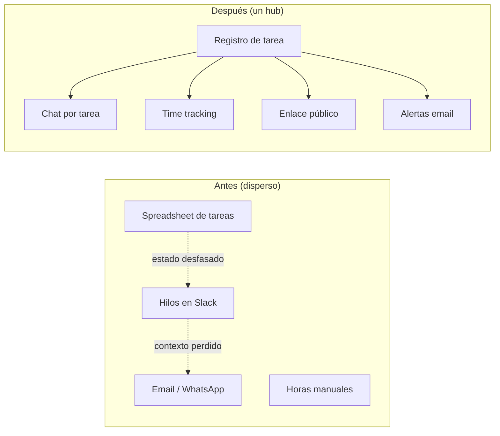
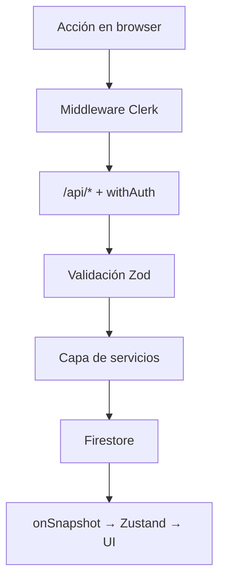
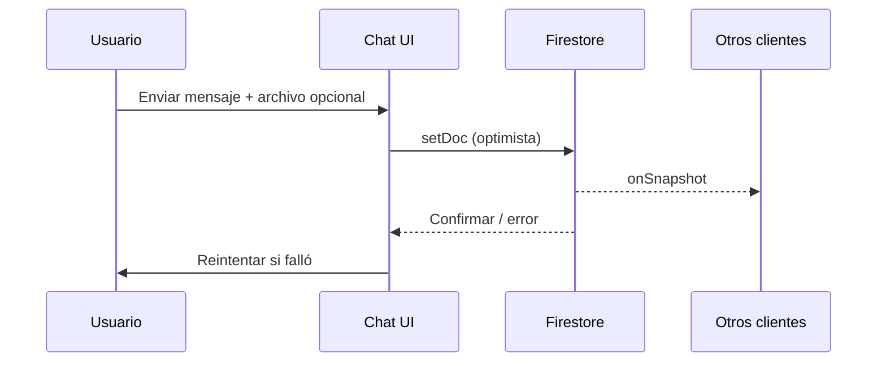

> [!tip] En 30 segundos
> - **Para quién es:** Ingeniería de producto y diseño que construyen herramientas internas para equipos distribuidos — no un todo genérico, sino coordinación de agencia entre clientes, zonas horarias y stakeholders externos.
> - **Problema que resuelve:** El estado vivía en spreadsheets, el contexto en Slack y las actualizaciones al cliente en email — ningún lugar donde asignación, conversación, tiempo y visibilidad compartieran la misma unidad de trabajo.
> - **Qué cambia si lo aplicas:** Un hub en Firestore con **chat por tarea**, **vistas Kanban y tabla**, **time tracking integrado**, **enlaces públicos con token** y **asistente n8n para admins** — operación remote-first sin rentar un PM en caja negra.

Abres tres pestañas para responder una pregunta: *¿Dónde está ese entregable, quién lo tiene, y qué dijo el cliente al final?*

La lista de tareas es un spreadsheet que alguien actualiza los viernes. El hilo está en Slack — si recuerdas el canal. El cliente escribió por WhatsApp. Nadie registró las horas en la fila correcta. ==El trabajo existe; el sistema no.==

Esa es la forma de operar una agencia cuando el equipo se vuelve remote-first más rápido que las herramientas. Aurin — estudio de producto y diseño distribuido — chocó con eso en 2023–2024. La salida no fue “comprar otro SaaS de proyectos.” Fue ==construir un hub donde tarea, conversación, tiempo y visibilidad al cliente compartan el mismo objeto== — e integrar IA donde reduce triage, no donde reemplaza criterio.

Lideré UX engineering en [Aurin Task Manager](https://aurin-task-manager.vercel.app): plataforma full-stack en Next.js, Firestore y Clerk, desplegada en Vercel, con **357+ commits** de iteración activa. Repo público: [KarenRebecaOrtiz/Aurin-Task-Manager](https://github.com/KarenRebecaOrtiz/Aurin-Task-Manager). Este ensayo es la historia de producto — arquitectura, features y qué repetiría.

> [!info] Fundamento externo
> Los patrones siguen práctica documentada: [listeners en tiempo real de Firestore](https://firebase.google.com/docs/firestore/query-data/listen), [middleware de Clerk en Next.js](https://clerk.com/docs/references/nextjs/clerk-middleware), [Route Handlers de Next.js](https://nextjs.org/docs/app/building-your-application/routing/route-handlers) como frontera de API, y [webhooks de n8n](https://docs.n8n.io/integrations/builtin/core-nodes/n8n-nodes-base.webhook/) para automatización server-side. El [chatbot de marketing de Aurin](/es/articulos/conversational-agent-three-layer-stack) es otra superficie — esta plataforma es operación interna.

## La pregunta equivocada: ¿qué herramienta de PM?

> **En términos simples:** Elegir Notion o Asana primero evita la pregunta real — qué debe quedar pegado a cada pieza de trabajo cuando el equipo está en cinco zonas horarias.
La mayoría empieza comparando vendors: Notion, Asana, Monday, ClickUp. Eso optimiza **velocidad de instalación**, no **profundidad de integración** para cómo operan las agencias:

- Las tareas se organizan **por cuenta de cliente**, no por “proyecto” genérico
- El contexto vive en la **conversación**, no en un campo de comentarios añadido después
- Las **horas** deben acumularse donde finanzas confíe
- Los **clientes** necesitan visibilidad sin licencia completa
- Los **admins** necesitan triage masivo — a veces en lenguaje natural, no solo drag-and-drop

Los PM SaaS cubren el primer punto. Rara vez el segundo y el cuarto sin cobrar por asiento — y nunca comparten estado con *tus* flujos n8n, *tus* plantillas de email ni *tus* reglas de Firestore.

La apuesta arquitectónica fue: ==tiempo real primero, features modulares, stack propio.== Firestore para sync, Next.js App Router para UI + APIs, Clerk para identidad, Zustand para estado de UI — no por moda, sino porque cada pieza traza una frontera que la agencia ya necesitaba.



## Arquitectura en una vista

> **En términos simples:** UI en el navegador, APIs en Next.js y Firestore — cada capa con un trabajo claro para que crezcan features sin reescribir el núcleo.
El codebase sigue una **arquitectura modular híbrida** documentada en `documentation/ARCHITECTURE_SUMMARY.md`:

| Capa | Tecnología | Responsabilidad |
| --- | --- | --- |
| **UI** | React 19, Next.js 15, Tailwind 4, Framer Motion | Dashboard, Kanban, sidebars de chat, formularios |
| **Estado** | Zustand (**18+ stores**) | Página de tareas, tablero Kanban, timer, forms, IA |
| **Datos** | Firestore + Firebase Storage | Tareas, mensajes, clientes, usuarios en tiempo real |
| **API** | Route Handlers + `withAuth()` | CRUD, uploads, resúmenes Gemini, webhooks |
| **Auth** | Clerk (roles incl. metadata admin) | Dashboard protegido, excepciones guest/público |
| **Ops** | Sentry, Vercel | Errores, deploy serverless |



**Forma del directorio** (alto nivel):

```text src/
app/           # App Router — dashboard, rutas guest, API
modules/       # 15+ módulos (tasks, chat, shareTask, n8n-chatbot…)
stores/        # Stores Zustand
hooks/         # 40+ hooks
services/      # Lógica de negocio
lib/           # Firebase, helpers API
```

Cada módulo exporta API pública (`index.ts`) — tareas, chat y share links evolucionan por separado. Eso importó cuando enlaces públicos y el chatbot n8n llegaron meses después del primer Kanban.

## Gestión de tareas: dos vistas, una fuente de verdad

> **En términos simples:** Las mismas tareas, dos formas de verlas — tablero para flujo, tabla para filtros — ambas con datos vivos.
Las tareas son documentos en Firestore con scope de cliente, estado, prioridad, asignados y archivo.

**Vistas:**

- **Tabla** — filtrar por estado, prioridad, cliente; ordenar para triage matutino
- **Kanban** — drag con `@dnd-kit` entre columnas (`Por Iniciar`, `En Proceso`, `Backlog`, …)

Ambas vistas escuchan los mismos `onSnapshot`. ==Mueves una tarjeta en Kanban y la tabla se actualiza para todos en línea — sin botón de refresh ni email de “conflicto de sync”.==

**Notificaciones de ciclo de vida** pasan por el módulo `mailer` al crear, reasignar, cambiar estado/prioridad/fechas, archivar o borrar. Las plantillas comparten layout HTML (responsive, badges de prioridad/estado) — diseño *non-throwing* para que un email fallido no revierta el write de la tarea.

## Chat por tarea: contexto que no se despega del trabajo

> **En términos simples:** Cada tarea tiene su hilo — archivos, replies, lectura — para no buscar en Slack “¿qué decidimos?”.
Slack optimiza canales. Las agencias optimizan **entregables**. Pegar chat al objeto tarea implica:

- Nuevos asignados leen historial **en el lugar**
- Archivos quedan en el **mismo registro** que verá el cliente
- Lectura y replies como ticket ligero

**Destacados de implementación** (`modules/chat`, `dataStore`):

- Mensajes Firestore en tiempo real con **persistencia IndexedDB**
- Listas virtualizadas (`react-virtuoso`) en hilos largos
- **Resúmenes Gemini** en conversaciones extensas — triage sin leer 200 mensajes
- Envío optimista con **reenvío si falla** (`useMessageActions`)



> [!warning] Chat sin límites de ownership se vuelve ruido
> Los hilos por tarea solo funcionan si **crear tarea es el default** cuando entra trabajo. Si no, Slack gana por hábito. Alineamos onboarding y header para que “nueva tarea” fuera más rápido que “nuevo canal”.

## Time tracking: horas que siguen a la tarea

> **En términos simples:** Arrancas timer en la tarea que haces; las horas se acumulan y sincronizan — sin app aparte de timesheet.
Las agencias facturan o planean capacidad en horas. Una segunda app garantiza desfase.

`timerStore` usa **Web Worker** para tiempo preciso, sincroniza a Firestore y finaliza al pausar/cerrar. Coordinación multi-tab evita doble conteo con el dashboard abierto.

==El timer no es reloj global — se ata a `taskId`.== Finanzas y PM confían en que las horas de la fila coinciden con la conversación y el entregable de la misma fila.

## Visibilidad al cliente sin licencia por asiento

> **En términos simples:** Compartes enlace seguro; el cliente ve avance y comenta — sin cuenta Clerk ni factura SaaS extra.
El módulo `shareTask` implementa **capability URLs** (`/p/[token]`) con patrones alineados a OWASP:

| Riesgo | Enfoque |
| --- | --- |
| Entropía del token | `nanoid` — tokens de alta entropía, no IDs secuenciales |
| Exposición de datos | DTOs quitan campos internos (presupuesto, IDs) |
| Identidad guest | Nombre en `localStorage` — comentar sin registro |
| Revocación | Toggle off / regenerar token / expiración opcional |
| Abuso | Rate limits en endpoints públicos de comentarios |

**Flujo admin:** ShareDialog desde header de tarea → activar público → copiar URL → cliente abre `PublicTaskView` sanitizada con chat guest.

**Flujo guest:** validar token → snapshot seguro → pedir nombre una vez → comentar en tiempo real.

Es el patrón de agencia por el que los PM SaaS cobran por usuario externo — implementado como ==rutas propias que controlas==.

## IA en dos velocidades: resúmenes Gemini y asistente n8n para admins

> **En términos simples:** La IA ayuda de dos formas — resúmenes cortos en hilos cargados, y chatbot para admins que crean tareas escribiendo en español.
La IA aparece dos veces — trabajos distintos a propósito:

### 1. Resúmenes Gemini (en el hilo)

Hilos largos reciben mensaje de resumen (`isSummary`) para que leads se pongan al día en segundos. Firebase AI / Gemini vía API routes — ==resumen, no cambios de estado autónomos.==

### 2. Chatbot n8n (widget solo admin)

`modules/n8n-chatbot` expone asistente flotante para usuarios con metadata `admin` en Clerk. Comandos en lenguaje natural crean, editan, consultan y asignan tareas; archivos opcionales (imágenes, PDFs) van a Cloud Storage y por n8n + ChatGPT vision.

**Payload a n8n** (documentado en README del módulo):

```json
{
  "userId": "user_xxxxx",
  "message": "Crea una tarea para revisar código",
  "sessionId": "unique-session-id",
  "fileUrl": "https://storage.googleapis.com/.../file.jpg",
  "timestamp": "2024-01-01T12:00:00.000Z"
}
```

El browser llama `POST /api/n8n-chatbot` — **nunca** la URL cruda del webhook. Misma frontera de confianza que el [chatbot del sitio de marketing](/es/articulos/conversational-agent-three-layer-stack), aplicada a **CRUD interno** en lugar de booking de calendario.

> [!info] Solo admin por diseño
> Mutar tareas en lenguaje natural es poderoso y peligroso. El widget no renderiza sin `isAdmin` — el resto usa Kanban, formularios y chat.

## Equipos, notas y la capa de “quién está”

> **En términos simples:** Señales sociales ligeras para que un equipo remoto siga sintiéndose presente — sin otra red social.
Los equipos remote-first pierden contexto de pasillo. Dos features lo compensan sin inflar scope:

**Notes tray** (`modules/notes`) — notas públicas tipo Instagram en el header, **120 caracteres**, **expiran en 24 h**, una nota activa por usuario. Marquesina en Firestore; reemplaza módulo “advices” solo-admin por algo para todos.

**Teams** (`modules/teams`) — diálogos de chat de equipo, miembros, notificaciones. Conversaciones grupales cuando el trabajo cruza cuentas.

Ninguna feature bloquea entregar tareas. Ambas reducen “¿hay alguien en línea?” — ==presencia social sin salir del hub de ops.==

## Mapa del repositorio (dónde leer código)

> **En términos simples:** Tabla de módulos y rutas — sáltala si solo te importan resultados.
| Ruta | Qué cubre |
| --- | --- |
| `modules/data-views/` | Vistas tabla + Kanban |
| `modules/task-crud/` | Flujos crear / editar tarea |
| `modules/chat/` | UI de mensajería por tarea + hooks |
| `modules/shareTask/` | Enlaces públicos, chat guest, DTOs |
| `modules/n8n-chatbot/` | Asistente NL para admins |
| `modules/mailer/` | Fachada de email transaccional + plantillas |
| `modules/notes/` | Bandeja de notas efímeras |
| `modules/teams/` | Chat y gestión de equipos |
| `stores/dataStore.ts` | Tareas, mensajes, clientes, usuarios |
| `stores/timerStore.ts` | Timer + sync Firestore |
| `app/api/tasks/` | Endpoints CRUD de tareas |
| `documentation/ARCHITECTURE_*.md` | Referencia arquitectónica completa |

## Seguridad y modos de fallo

> **En términos simples:** Login para trabajo interno; enlaces públicos solo muestran campos seguros; las APIs validan cada write.
- **Middleware Clerk** en dashboard; `withAuth()` en APIs
- **Zod** en bodies — respuestas `{ success, data }` / `{ success: false, error }`
- **Reglas Firestore** + queries por usuario
- **Rutas públicas** (`/p/[token]`, vistas guest de equipo) permitidas en middleware — con DTOs sanitizados
- **Sentry** en producción
- **Mailer** falla suave — los writes de tarea siguen aunque SMTP falle

## Qué cambió en la práctica

> **En términos simples:** El resultado de negocio — un solo lugar para estado, conversación, horas y updates al cliente.
Tras adopción:

- El **estado** dejó de vivir solo en spreadsheets de viernes
- El **contexto** quedó en la tarea — incorporar a alguien nuevo era abrir un hilo, no arqueología en Slack
- Los **clientes** siguieron avance por enlaces en lugar de cadenas de screenshots en WhatsApp
- Los **admins** hicieron triage más rápido con resúmenes Gemini y comandos NL ocasionales vía n8n
- **Remote-first** pasó a ser default operativo — la herramienta coincidió con cómo el equipo ya trabajaba en geografía

## Qué repetiría (y qué apretaría después)

> **En términos simples:** Retrospectiva honesta — qué funcionó y qué formalizaría después.
**Repetiría:**

- Firestore en tiempo real como columna vertebral — ops de agencia son colaborativas, no batch
- `src/modules/*` modular — share links y chatbot sin reescribir monolito
- Chat por tarea como modelo de contexto
- Proxy n8n solo server — misma lección que el stack del chat de marketing
- Zustand por dominio — más simple que un Redux global para 18 preocupaciones

**Apretaría después:**

- ADR formal para campos del DTO público (shareTask) — documentar qué nunca puede filtrarse
- Prompts n8n conscientes de locale (hoy español-first)
- Sync tipo CMS para metadata de cuentas si crece la cardinalidad
- E2E para revocar enlace + rate limits de comentarios guest
- Correlacionar `sessionId` con ejecuciones n8n en logs (debug de ops)

## Referencias (externas)

> **En términos simples:** Docs oficiales para verificar o briefear al equipo de ingeniería.
| Tema | Fuente |
| --- | --- |
| Listeners Firestore | [Firebase — Escuchar actualizaciones](https://firebase.google.com/docs/firestore/query-data/listen) |
| Clerk + Next.js App Router | [Clerk — Quickstart Next.js](https://clerk.com/docs/quickstarts/nextjs) |
| Route Handlers Next.js | [Next.js — Route Handlers](https://nextjs.org/docs/app/building-your-application/routing/route-handlers) |
| Webhooks n8n | [n8n — Nodo Webhook](https://docs.n8n.io/integrations/builtin/core-nodes/n8n-nodes-base.webhook/) |
| Capability URLs / tokens | [OWASP — Authorization Cheat Sheet](https://cheatsheetseries.owasp.org/cheatsheets/Authorization_Cheat_Sheet.html) |
| Firebase AI (Gemini) | [Firebase — AI Logic](https://firebase.google.com/docs/ai-logic) |
| Relacionado: chatbot marketing Aurin | [Agente conversacional — stack de tres capas](/es/articulos/conversational-agent-three-layer-stack) |

## Cierre

> **En términos simples:** La moraleja — ser dueño del hub de ops en lugar de rentar uno que nunca calzará con tu agencia.
Las herramientas de agencia fallan cuando optimizan “proyectos” genéricos en lugar de **entregables ligados a cliente con conversación, horas y visibilidad externa pegadas**. Aurin Task Manager es el hub que construimos cuando spreadsheets y Slack dejaron de escalar — ==tiempo real, modular y propio de punta a punta.==

Si evalúas otro PM por asientos para un estudio distribuido, pregunta si algún día unirá chat, tiempo, enlaces de cliente y triage NL de admin en el **mismo objeto tarea** en **tu** infraestructura. Para Aurin, la respuesta fue no — así que construimos el modelo de objeto.

**Live:** [aurin-task-manager.vercel.app](https://aurin-task-manager.vercel.app) · **Código:** [github.com/KarenRebecaOrtiz/Aurin-Task-Manager](https://github.com/KarenRebecaOrtiz/Aurin-Task-Manager)