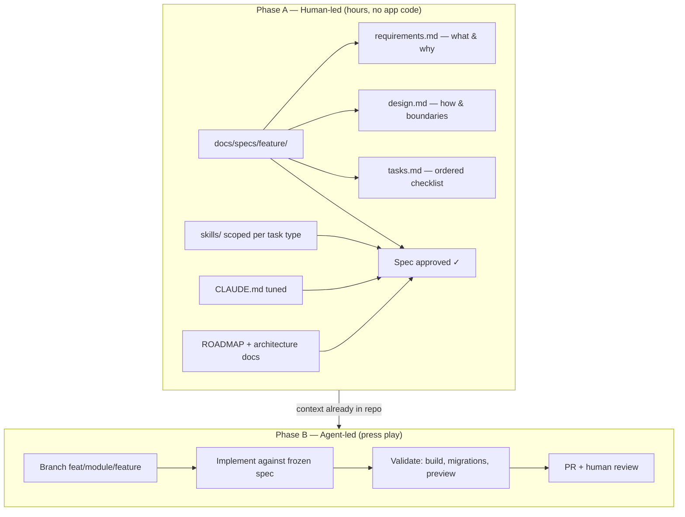
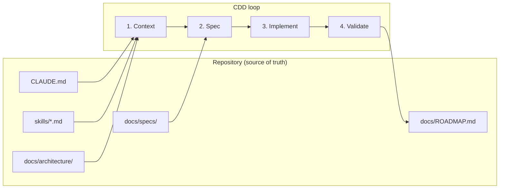

> [!tip] In 30 seconds
> - **Who this is for:** Instructors and mixed teams (product, growth, ops) at client companies where vibecoding is already the default but production handoff keeps breaking.
> - **Problem it solves:** Fast codegen with **context trapped in the chat** — Tuesday's decisions vanish Wednesday; scope explosions and plausible-but-wrong auth/RLS patterns follow.
> - **What changes if you apply this:** Versioned specs and `CLAUDE.md` in git (**hours on orchestration before codegen** → less token burn and fewer blind rewrites); explicit **explore vs ship** modes; a reference repo cohorts can rebuild against without pretending migrations do not exist.

The first workshop exercise in vibecoding is always exciting. Someone describes a dashboard in plain language, the model generates files, the browser refreshes, and for a moment it feels like the old gate around software has disappeared.

Then week two arrives. The same person asks for "a small fix" and the assistant rewrites three unrelated modules, drops a `service_role` key into a client component, or adds a migration that will never apply cleanly on the team's Supabase history. The demo still runs on their laptop. ==Production would not survive the afternoon.==

That gap — fast generation versus durable engineering — is not a flaw in the models. It is what happens when ==context lives only in the chat window.== The industry spent the last year naming the problem and shipping tools. The missing piece in client work is ==upskilling inside the company== so vibecoding stays fast *and* survivable: 2026 references, managed context artifacts in git, and a reference repo for mixed teams rebuilding a real internal dashboard without pretending migrations and RLS do not exist.

## What the industry taught me about developing with AI

> **In plain terms:** How the conversation moved from “fun demos” to “who owns the rules when everyone codes with AI.”
I did not arrive at "context-driven development" as a branding exercise. I arrived tired of cleaning up the same failure modes across client engagements.

In several companies I have worked with — product-led SaaS, growth teams, AI-native startups — ==vibecoding is already the default.== Marketing ships landings, product prototypes features, ops scripts automations. That culture delivers speed. From the engineering side I kept seeing the other face: UI that needed rescue, touchpoints that drifted apart, TypeScript that compiled in the editor but broke under real data, and repos where nobody could explain what last Tuesday's chat session changed.

Part of my job became ==enablement, not gatekeeping.== I am not there to ban AI; I am there to give teams a workflow that survives handoff to production. For *brand and UI* when non-engineers generate surfaces, I documented one answer in [The Design System an AI Can't Hallucinate](/en/articulos/design-system-that-ships-itself) — tokens and MCP boundaries so agents do not invent colors or components.

Workshops on *full-stack internal tools* tackle a harder layer: ==state, auth, webhooks, migrations, and RLS.== Here, "make it pretty" is not the risk. "Make it plausible" is.

Three public conversations shaped how I train and build:

**1. Karpathy named the vibe — and drew a boundary.** In February 2025, [Andrej Karpathy coined "vibe coding"](https://twitter.com/karpathy/status/1886192184808149383): you accept the model output, barely read diffs, paste errors back until something runs. He was explicit that it is for throwaway experiments, not for systems you maintain. The term went viral; many people now call *any* AI-assisted coding "vibe coding," which blurs the lesson.

**2. Willison sharpened the distinction.** [Simon Willison](https://simonwillison.net/2025/Mar/19/vibe-coding/) argues that responsible AI-assisted programming is the opposite: you read every line, you can explain it, you verify before merge. Vibe coding is valuable for learning and prototypes; production is a different contract. That matches what I see with clients: vibecoding is a superpower for exploration, a liability when it becomes the only workflow and nobody owns verification.

**3. Google and Anthropic productized context.** In December 2025, Google launched [Conductor for Gemini CLI](https://developers.googleblog.com/conductor-introducing-context-driven-development-for-gemini-cli/) — specs and plans as Markdown in the repo, "measure twice, code once," brownfield setup for existing codebases. Anthropic's [Claude Code best practices](https://code.claude.com/docs/en/best-practices) push the same physics: the context window is finite, performance degrades as it fills, so put durable rules in `CLAUDE.md`, domain knowledge in [skills](https://code.claude.com/docs/en/skills), and verification in tests or commands the agent can run.

When those ideas clicked together, my client work stopped being "better prompts for your team" and became ==managed context artifacts in git== — the same move I had already made for Webflow hybrids in [The Problem with Webflow in Production](/en/articulos/atom-webflow), but now for Next.js monoliths and cohorts where half the room has never opened a migration file.

## The problem with vibecoding without context

> **In plain terms:** Symptoms hiring managers recognize: repeated rework, mysterious breakages, nobody sure what changed last week.
Embedded chatbots fail when the integration boundary is wrong. Vibecoding fails when the ==knowledge boundary== is wrong.

Typical symptoms in workshops and in production teams:

- **Amnesia between sessions.** Decisions from Tuesday's chat are gone Wednesday; the model re-invents folder structure.
- **Stack hallucination.** Someone asks for "Supabase auth" and gets patterns from a blog post that does not match *this* client's Clerk + RLS plan.
- **Scope explosions.** A one-line request becomes five files because nothing in the repo says "max 300 lines per file" or "webhooks live in `app/api/webhooks/`."
- **False confidence.** `pnpm build` passes once; migrations are broken; RLS is off in the documented production schema and nobody notices until staging.

None of that is fixed by a smarter model alone. It is fixed by ==treating context like code: versioned, reviewed, and scoped.== That is what I install when I capacitate teams — not a lecture on models, a **repo contract** the whole company can reuse.

## Enabling vibecoding inside client companies

> **In plain terms:** What changes when product and growth can ship inside guardrails instead of throwing work over the wall to engineering.
The pattern repeats across clients:

| Without enablement | With context-driven upskilling |
|--------------------|--------------------------------|
| Each person has private chat lore | Shared `CLAUDE.md`, skills, specs in git |
| "It worked on my machine" | Documented validate step (build, migration list, preview) |
| Engineering is a bottleneck for every tweak | Product and growth ship within guardrails |
| Fear of AI or blind trust in AI | Two modes: explore (vibe) vs ship (CDD) |

I run this as ==live working sessions==, not slide decks: we rebuild a real internal tool while narrating why the spec comes before the prompt. People leave with habits they can apply Monday — and a template repo they can fork for their own domain.

## The spec-and-orchestration phase (hours before a single line of code)

> **In plain terms:** The unglamorous planning hours that prevent expensive AI rewrites later.
The part that does not fit in a 30-second demo is the ==front-loaded work.== On a typical client rebuild I spend **hours** — sometimes a full day — adjusting spec documents, the ROADMAP, architecture notes, `CLAUDE.md`, and which skills the agent should load for which kind of task. **No application code until that layer is stable.**

That is not procrastination. It is the job shifting from *typing* to *architecting and orchestrating.*



### What lives in a spec (and why three files)

Naive vibecoding stuffs everything into one chat message. A proper spec ==splits concerns== so the agent does not re-negotiate scope on every turn:

| File | Holds | Prevents |
|------|--------|----------|
| `requirements.md` | User goal, acceptance criteria, out-of-scope | Feature creep mid-implementation |
| `design.md` | Files touched, API shape, data model, constraints | Wrong folder, wrong auth pattern |
| `tasks.md` | Phases and checkboxes the agent ticks off | "Done" without migrations or RLS |

The `spec-driven-workflow` skill forces a human gate: present Goal, Files, API surface, and Constraints, ==wait for approval==, then code. In workshops I model that gate explicitly — participants comment on the spec in the PR *before* anyone says "now implement task 3."

### Where vibecoding actually fits

This is the nuance teams miss:

- **Karpathy-style vibe** belongs in Phase A for *discovery* — spike a UI idea, try a query shape, throw away the branch. Low stakes, chat is fine.
- **Production vibecoding** belongs in Phase B only *after* the spec exists — the model is not "figuring out what to build," it is ==executing a contract already in git.==

So vibecoding is not the opposite of specs. Specs are what make vibecoding ==cheap and safe== in Phase B.

### "Press play" — and why token spend collapses

Without specs, every implementation session re-discovers the stack: folder layout, migration rules, Clerk vs Supabase auth, webhook HMAC. That burns context on repetition. Anthropic's own guidance is blunt: [the context window degrades as it fills](https://code.claude.com/docs/en/best-practices) — rediscovery is expensive twice (tokens + mistakes).

After orchestration, a session looks boring on purpose:

1. Open the approved spec under `docs/specs/<feature>/`.
2. `CLAUDE.md` and the right skills are already in the repo — no pasted essay in the prompt.
3. One instruction: ==implement tasks.md in order; stop if a task violates design.md.==
4. Agent runs; human reviews the diff against the spec, not against vibes.

It feels like ==pressing play.== The creative and political work already happened in the documents. Implementation becomes execution — which is exactly what LLMs are good at when the boundary is clear.

I routinely see **far fewer round-trips** and shorter sessions than "chat until it works." The savings are not mystical: you are not paying the model to re-read your org chart every time.

### What I do with the time I do not spend patching

When I'm not hand-editing JSX line by line, the hours go to things that actually move client outcomes:

- **Architecture** — module boundaries, where webhooks live, when to cache KPIs, what must stay in Server Actions.
- **Orchestration** — which skill loads for a migration vs a UI module, when to spawn a review subagent, when to `/clear` and start a fresh implementer session with only the spec attached.
- **Visual design** — layout, density, dashboard hierarchy in Figma or in the browser; the agent implements *to* a picture, not instead of one.
- **Review and teaching** — PR comments, workshop narration, updating the spec when production teaches us something new.

==Patching mystery diffs was the old bottleneck.== Context-driven vibecoding moves the bottleneck to "did we write a spec good enough to trust?"

That is what I teach client teams: the glamorous AI moment is Phase B; the professional work is Phase A. Skip Phase A and you are back to burning tokens on arguments the repo should have settled.

> [!info] Buy vs build in Phase A
> The same rule applies to dependencies: **if it is not core to what you ship, integrate it.** Auth with Clerk instead of six months of login and compliance from scratch. Payments with Stripe. Email with Resend. Students often want to "learn auth" inside a Growth dashboard course — fair, but the learning goal is *product delivery under guardrails*, not becoming an identity provider. Specs should name the integration and the constraints (JWT claims, RLS, webhook shape), not reinvent OIDC because the model suggested it.

The reference implementation I use today — **DataHub Growth** (private teaching kit, originally scaffolded from a client's legacy dashboard) — turns a ==single HTML file (~13k lines)== into a modular monolith: Next.js 15 App Router, TypeScript strict, Tailwind, Supabase (local Docker first), Clerk, Zod, TanStack Query, Vercel deploy.

The cohort usually already knows the business domain (events, CRM sync, segments, pipeline metrics). The goal is not "learn React from zero." It is: ==learn to extend this product correctly while AI acts as a senior pair that must follow your house rules.==



### CLAUDE.md — what every session loads

`CLAUDE.md` is the non-negotiable brief I help clients adapt on day one: stack table, directory map, Supabase migration workflow (iterate in Studio, commit with `db pull`, never pollute history with `apply_migration` locally), branching (`main` / `develop`, conventional commits, no direct push to `main`), security rules (`service_role` never in client, Zod on all external input), and the development sequence:

```
1. Spec   -> docs/specs/<feature>/requirements.md + design.md + tasks.md
2. Branch -> feat/<module>/<feature>
3. Code   -> Claude Code with CLAUDE.md + spec
4. Test   -> Supabase local, Vercel preview
5. PR     -> review + checklist
6. Merge  -> production deploy
```

That mirrors Google's Conductor tracks — product context, tech stack, workflow — except we start from a real brownfield schema in `docs/architecture/` (dozens of production tables sampled and documented). Participants see ==why== the next migration enables RLS, not just how to click through Studio.

### Skills — context packs, not prompt stuffing

Under `skills/` we keep focused packs the agent loads when relevant — the same pattern I recommend clients copy into their own repos:

| Skill | Role in upskilling |
|-------|---------------------|
| `spec-driven-workflow` | Context → Spec → Implement → Validate → Report |
| `code-standards` | TypeScript, file size, naming |
| `git-conventions` | Branches, PRs, changelog |
| `framework-patterns` | App Router, Server Components |
| `security-review` | Secrets, RLS, webhook HMAC |
| `architecture-patterns` | Modules, bounded contexts |
| `redis-patterns` | Cache-aside when KPIs get expensive |

The `spec-driven-workflow` skill encodes Phase A vs Phase B above — for any change touching more than one file or public API, ==no implementation until the three spec files are approved.== If the spec drifts during Phase B, stop and re-spec; do not patch forward in chat.

That is the antidote to vibe coding in Willison's narrow sense in production: natural language to *author* the spec; natural language to *execute* it — but not to blur the two in one thread.

### ROADMAP — phased truth for live builds

`docs/ROADMAP.md` is the build order the room watches on screen: Phase 0 foundations (Next + Supabase Docker + layout shell), Phase 1 schema and seeds, then modules (import, events, lists, metrics, webhooks, auth, cache). Each phase depends on the last — so when someone asks to "skip to CRM webhooks," we open the roadmap and show the missing RLS and profiles table, not a subjective "not yet."

## A workshop story: the migration that looked fine

> **In plain terms:** A true classroom moment: green checkmarks in the UI hid a database history mess.
In an early cohort, a participant used an MCP helper to "apply" SQL locally. The UI showed success. `supabase migration list` did not match what Studio displayed — the history was polluted. The fix was not reverting one table; it was replaying the ==documented workflow== from `CLAUDE.md`: iterate without writing migration entries, then `supabase db pull` with a clean name, then verify with `migration list --local`.

We turned the incident into a checklist item on every PR at that client: "How was this migration produced?" That is context-driven development in practice: ==the failure mode is named in the repo, so the next agent session does not repeat it.== I have since reused that checklist verbatim at two other companies.

## How this differs from my other context pieces

> **In plain terms:** Where this article sits next to Webflow and design-system work — different problem, same discipline.
| Piece | Focus |
|-------|--------|
| [Webflow in production](/en/articulos/atom-webflow) | Context for *visual* delivery — tokens, jsDelivr, dual control with marketing |
| [Design system that ships itself](/en/articulos/design-system-that-ships-itself) | Context for *brand* — MCP read vs write, HTTP for vibecoded landings |
| **Full-stack CDD (here)** | Context for *product* and **upskilling client teams** — specs, DB, auth, webhooks, shared governance |

Same philosophy, different altitude.

## What I would do again (and what I am tightening)

> **In plain terms:** Lessons for leaders budgeting workshops and engineering oversight.
**Would repeat:**

- Blocking Phase B until Phase A is signed off — even when it feels slow; it is what makes "press play" real
- Spec-before-code for multi-file work, even when a client wants speed on a workshop recording
- `CLAUDE.md` kept short; skills for depth (Anthropic's own advice)
- Local Supabase in Docker before touching the client's org projects
- Branch + PR discipline so participants experience real team gates, not solo chat sessions
- Naming two modes explicitly: **explore** (Karpathy-style vibe, low stakes) vs **ship** (CDD, production stakes)

**Tightening next:**

- A sanitized public fork of the teaching kit (today it stays private per client NDAs)
- Client-specific `CLAUDE.md` starters by industry (B2B SaaS, e-commerce ops, etc.)
- More exercises that *require* a failing test before implementation (Claude Code's "give Claude a way to verify its work")
- Handoff doc template: "what we put in git so your team keeps vibecoding safely after I leave"

## References (current, worth bookmarking)

> **In plain terms:** Sources I cite when teaching or defending the approach to executives.
| Topic | Source |
|-------|--------|
| Origin of "vibe coding" | [Karpathy, X/Twitter, Feb 2025](https://twitter.com/karpathy/status/1886192184808149383) |
| Vibe coding vs responsible AI coding | [Willison, Mar 2025](https://simonwillison.net/2025/Mar/19/vibe-coding/) |
| Using LLMs for code (deeper series) | [Willison, Mar 2025](https://simonwillison.net/2025/Mar/11/using-llms-for-code/) |
| Context-driven development (Conductor) | [Google Developers Blog, Dec 2025](https://developers.googleblog.com/conductor-introducing-context-driven-development-for-gemini-cli/) |
| Conductor extension repo | [github.com/gemini-cli-extensions/conductor](https://github.com/gemini-cli-extensions/conductor) |
| Claude Code: context, CLAUDE.md, skills | [Anthropic best practices](https://code.claude.com/docs/en/best-practices) |
| Agent skills (Anthropic) | [Introduction to Agent Skills](https://anthropic.skilljar.com/introduction-to-agent-skills) |
| Wikipedia (cultural footprint) | [Vibe coding](https://en.wikipedia.org/wiki/Vibe_coding) |

## Closing

> **In plain terms:** Fast AI coding plus shared rules beats either extreme: ban AI or trust it blindly.
The industry did not teach me to replace engineering with prompts. It taught me to ==relocate engineering into artifacts the model can reload==: specs, roadmaps, architecture samples, skills, and verification hooks — then use conversation for judgment, not for memory.

Vibecoding is still worth celebrating for discovery inside client companies. ==Capacitating teams== is different: they need the same discipline I use in production chat stacks and marketing-engineering hybrids, but here the layers are **orchestration (specs + skills), execution (press play), and proof** — not widget, proxy, and n8n.

If you lead product, growth, or engineering at a company where everyone already vibecodes, the question is not "which model?" It is: ==are you willing to invest in Phase A so Phase B stops eating your calendar and your token budget?== Build the repo contract first. Then — only then — press play. The vibes work better when they have a script.