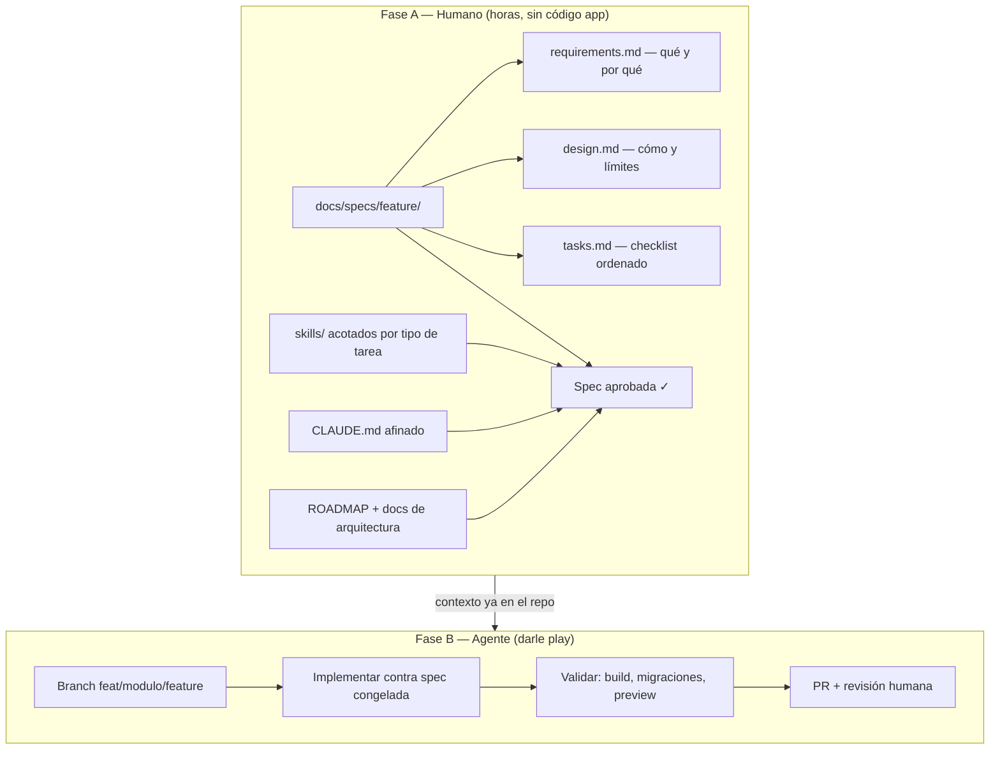
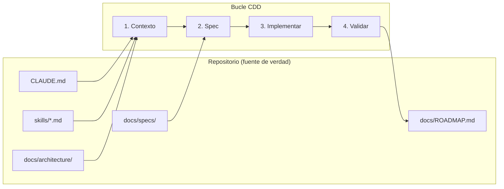

> [!tip] En 30 segundos
> - **Para quién es:** Instructoras y equipos mixtos (producto, growth, ops) en empresas cliente donde vibecodear ya es el default pero el handoff a producción sigue rompiéndose.
> - **Qué problema resuelve:** Generación rápida con **contexto atrapado en el chat** — lo decidido el martes desaparece el miércoles; explosiones de scope y patrones de auth/RLS creíbles pero incorrectos.
> - **Qué cambia si aplicas esto:** Specs versionadas y `CLAUDE.md` en git (**horas de orquestación antes del codegen** → menos tokens quemados y menos reescrituras a ciegas); modos explícitos **explorar vs ship**; repo de referencia para cohortes sin fingir que las migraciones no existen.

El primer ejercicio en un taller de vibecoding siempre emociona. Alguien describe un dashboard en lenguaje natural, el modelo genera archivos, el navegador refresca y por un momento parece que el muro alrededor del software desapareció.

Luego llega la semana dos. La misma persona pide "un fix chico" y el asistente reescribe tres módulos que no tocaban, mete una `service_role` en un client component o agrega una migración que nunca va a aplicar limpio sobre el historial de Supabase del equipo. El demo sigue corriendo en su laptop. ==Producción no sobreviviría la tarde.==

Esa brecha — generación rápida versus ingeniería durable — no es un defecto de los modelos. Pasa cuando ==el contexto vive solo en la ventana del chat.== La industria llevó el último año nombrando el problema y lanzando herramientas. La pieza que falta en trabajo con clientes es ==capacitar dentro de la empresa== para que el vibecoding siga siendo rápido *y* sobrevivable: referencias 2026, artefactos de contexto en git, y un repo de referencia para equipos mixtos que reconstruyen un dashboard interno real sin fingir que migraciones y RLS no existen.

## Lo que la industria me enseñó sobre desarrollar con IA

> **En pocas palabras:** Cómo pasó la conversación de “demos divertidos” a “quién posee las reglas cuando todos codean con IA”.
No llegué al "desarrollo guiado por contexto" como ejercicio de marca. Llegué cansada de limpiar los mismos modos de fallo en distintos clientes.

En varias empresas donde he trabajado — SaaS product-led, equipos de growth, startups AI-first — ==vibecodear ya es el default.== Marketing publica landings, producto prototipa features, ops automatiza con scripts. Esa cultura da velocidad. Del lado ingeniería seguía viendo la otra cara: UI que necesitaba rescate, touchpoints desalineados, TypeScript que compilaba en el editor pero se rompía con datos reales, y repos donde nadie podía explicar qué cambió el chat del martes pasado.

Parte de mi rol pasó a ser ==habilitación, no cerrar la puerta.== No estoy para prohibir la IA; estoy para dar un flujo que sobreviva el handoff a producción. Para *marca y UI* cuando quien genera no es ingeniería, documenté una respuesta en [El design system que un agente de IA no puede alucinar](/es/articulos/design-system-that-ships-itself) — tokens y límites MCP para que el agente no invente colores ni componentes.

Los talleres sobre *herramientas internas full-stack* atacan una capa más dura: ==estado, auth, webhooks, migraciones y RLS.== Aquí el riesgo no es "que se vea bonito". Es "que suene creíble".

Tres conversaciones públicas moldearon cómo entreno y construyo:

**1. Karpathy nombró el vibe — y marcó un límite.** En febrero de 2025, [Andrej Karpathy acuñó "vibe coding"](https://twitter.com/karpathy/status/1886192184808149383): aceptas la salida del modelo, casi no lees diffs, pegas errores hasta que algo corre. Fue explícito: es para experimentos desechables, no para sistemas que mantienes. El término se volvió viral; mucha gente ahora llama "vibe coding" a *cualquier* programación asistida por IA, y ahí se pierde la lección.

**2. Willison afiló la distinción.** [Simon Willison](https://simonwillison.net/2025/Mar/19/vibe-coding/) sostiene que la programación responsable con IA es lo contrario: lees cada línea, puedes explicarla, verificas antes del merge. El vibe coding sirve para aprender y prototipar; producción es otro contrato. Coincide con lo que veo en clientes: vibecodear es superpoder para explorar, responsabilidad cuando es el único workflow y nadie valida.

**3. Google y Anthropic productizaron el contexto.** En diciembre de 2025, Google lanzó [Conductor para Gemini CLI](https://developers.googleblog.com/conductor-introducing-context-driven-development-for-gemini-cli/) — specs y planes en Markdown en el repo, "measure twice, code once", setup brownfield para codebases existentes. Las [mejores prácticas de Claude Code](https://code.claude.com/docs/en/best-practices) de Anthropic empujan la misma física: la ventana de contexto es finita, el rendimiento cae al llenarse, así que reglas duraderas en `CLAUDE.md`, conocimiento de dominio en [skills](https://code.claude.com/docs/en/skills) y verificación en tests o comandos que el agente pueda ejecutar.

Cuando esas ideas encajaron, el trabajo con clientes dejó de ser "mejores prompts para tu equipo" y pasó a ser ==artefactos de contexto en git== — el mismo movimiento que ya había hecho para híbridos Webflow en [El problema con Webflow en producción](/es/articulos/webflow-in-production), pero ahora para monolitos Next.js y cohortes donde la mitad del salón nunca abrió un archivo de migración.

## El problema con vibecodear sin contexto

> **En pocas palabras:** Síntomas que reconocen hiring managers: retrabajo, roturas misteriosas, nadie seguro de qué cambió la semana pasada.
Los chatbots embebidos fallan cuando el límite de integración está mal. El vibecoding falla cuando el ==límite del conocimiento== está mal.

Síntomas típicos en talleres y en equipos en producción:

- **Amnesia entre sesiones.** Lo decidido el martes en el chat desaparece el miércoles; el modelo reinventa carpetas.
- **Alucinación de stack.** Piden "auth con Supabase" y salen patrones de un blog que no coincide con el plan Clerk + RLS de *ese* cliente.
- **Explosión de alcance.** Un cambio de una línea se convierte en cinco archivos porque en el repo no dice "máximo 300 líneas por archivo" ni "webhooks en `app/api/webhooks/`."
- **Falsa confianza.** `pnpm build` pasa una vez; las migraciones están rotas; el schema documentado tiene RLS apagado y nadie lo nota hasta staging.

Eso no se arregla solo con un modelo más listo. Se arregla ==tratando el contexto como código: versionado, revisado y acotado.== Eso es lo que instalo al capacitar equipos — no una charla sobre modelos, un **contrato en el repo** que toda la empresa pueda reutilizar.

## Habilitar el vibecoding dentro de empresas cliente

> **En pocas palabras:** Qué cambia cuando producto y growth publican dentro de barandillas en lugar de tirar todo a ingeniería.
El patrón se repite en clientes:

| Sin habilitación | Con upskilling guiado por contexto |
|------------------|-------------------------------------|
| Cada quien tiene lore privado en el chat | `CLAUDE.md`, skills y specs compartidos en git |
| "En mi máquina funcionó" | Paso de validación documentado (build, lista de migraciones, preview) |
| Ingeniería es cuello de botella en cada ajuste | Producto y growth entregan dentro de guardrails |
| Miedo a la IA o confianza ciega | Dos modos: explorar (vibe) vs entregar (CDD) |

Lo hago como ==sesiones de trabajo en vivo==, no diapositivas: reconstruimos una herramienta interna real mientras narramos por qué la spec va antes del prompt. La gente sale con hábitos para el lunes — y un repo plantilla que pueden forkear con su propio dominio.

## La fase de specs y orquestación (horas antes de la primera línea de código)

> **En pocas palabras:** Las horas de planificación poco glamorosas que evitan reescrituras caras de IA después.
Lo que no entra en un demo de 30 segundos es el ==trabajo adelantado.== En un rebuild típico con cliente paso **horas** — a veces un día entero — ajustando documentos de spec, el ROADMAP, notas de arquitectura, `CLAUDE.md` y qué skills debe cargar el agente según el tipo de tarea. **Cero código de aplicación hasta que esa capa esté estable.**

No es procrastinar. Es que el rol pasa de *teclear* a *arquitectar y orquestar.*



### Qué va en una spec (y por qué tres archivos)

El vibecoding ingenuo mete todo en un mensaje de chat. Una spec bien hecha ==separa responsabilidades== para que el agente no renegocie alcance en cada turno:

| Archivo | Contiene | Evita |
|---------|----------|--------|
| `requirements.md` | Objetivo, criterios de aceptación, fuera de alcance | Scope creep a mitad de implementación |
| `design.md` | Archivos, forma de API, modelo de datos, restricciones | Carpeta equivocada, patrón de auth incorrecto |
| `tasks.md` | Fases y checkboxes que el agente marca | "Listo" sin migraciones ni RLS |

El skill `spec-driven-workflow` impone un gate humano: presentar Goal, Files, API surface y Constraints, ==esperar aprobación==, luego codificar. En talleres modelamos ese gate en el PR de la spec *antes* de que alguien diga "ahora implementa la tarea 3."

### Dónde encaja el vibecoding de verdad

Aquí está el matiz que los equipos pierden:

- **Vibe al estilo Karpathy** va en la Fase A para *descubrir* — probar una UI, una query, tirar la rama. Bajo riesgo, el chat sirve.
- **Vibecoding de producción** va en la Fase B solo *después* de la spec — el modelo no está "descubriendo qué construir", está ==ejecutando un contrato que ya está en git.==

El vibecoding no es lo opuesto a las specs. Las specs son lo que hacen el vibecoding ==barato y seguro== en la Fase B.

### "Darle play" — y por qué se desploman los tokens

Sin specs, cada sesión de implementación redescubre el stack: carpetas, reglas de migración, Clerk vs auth de Supabase, HMAC en webhooks. Eso quema contexto en repetición. La guía de Anthropic es directa: [la ventana de contexto degrada al llenarse](https://code.claude.com/docs/en/best-practices) — redescubrir cuesta dos veces (tokens + errores).

Después de orquestar, una sesión se ve aburrida a propósito:

1. Abrir la spec aprobada en `docs/specs/<feature>/`.
2. `CLAUDE.md` y los skills correctos ya están en el repo — sin pegar un ensayo en el prompt.
3. Una instrucción: ==implementar `tasks.md` en orden; parar si una tarea viola `design.md`.==
4. El agente corre; el humano revisa el diff contra la spec, no contra sensaciones.

Se siente como ==darle play.== El trabajo creativo y político ya pasó en los documentos. La implementación es ejecución — lo que los LLM hacen bien cuando el límite es claro.

Veo **muchísimos menos idas y vueltas** y sesiones más cortas que "chatear hasta que funcione." El ahorro no es magia: no le pagas al modelo por releer tu organigrama cada vez.

### En qué invierto el tiempo que ya no paso parchando

Cuando no edito JSX línea por línea, las horas van a lo que mueve resultados en el cliente:

- **Arquitectura** — límites de módulos, dónde viven webhooks, cuándo cachear KPIs, qué debe quedarse en Server Actions.
- **Orquestación** — qué skill cargar para una migración vs un módulo UI, cuándo lanzar un subagente de review, cuándo `/clear` y abrir sesión nueva de implementación solo con la spec adjunta.
- **Diseño visual** — layout, densidad, jerarquía del dashboard en Figma o en el browser; el agente implementa *hacia* una imagen, no en lugar de una.
- **Revisión y enseñanza** — comentarios en PR, narración en taller, actualizar la spec cuando producción enseña algo nuevo.

==Parchar diffs misteriosos era el cuello de botella viejo.== El vibecoding guiado por contexto mueve el cuello de botella a "¿escribimos una spec lo bastante buena como para confiar?"

Eso es lo que enseño a equipos cliente: el momento glamoroso de la IA es la Fase B; el trabajo profesional es la Fase A. Saltarse la Fase A es volver a quemar tokens en discusiones que el repo debió cerrar.

> [!info] Comprar vs construir en la Fase A
> La misma regla aplica a dependencias: **si no es core de lo que vendes, intégralo.** Auth con Clerk en lugar de seis meses de login y compliance desde cero. Pagos con Stripe. Email con Resend. Los alumnos a veces quieren "aprender auth" dentro de un curso de dashboard — válido, pero el objetivo es *entregar producto con guardrails*, no convertirse en proveedor de identidad. La spec debe nombrar la integración y sus restricciones (claims JWT, RLS, forma del webhook), no reinventar OIDC porque el modelo lo sugirió.

La implementación de referencia que uso hoy — **DataHub Growth** (kit de enseñanza privado, armado a partir del dashboard legacy de un cliente) — convierte un ==único HTML (~13k líneas)== en monolito modular: Next.js 15 App Router, TypeScript strict, Tailwind, Supabase (Docker local primero), Clerk, Zod, TanStack Query, deploy en Vercel.

La cohorte suele conocer ya el dominio de negocio (eventos, sync con CRM, segmentos, métricas de pipeline). El objetivo no es "aprender React desde cero". Es: ==aprender a extender este producto bien mientras la IA actúa como par senior que debe obedecer las reglas de la casa.==



### CLAUDE.md — lo que carga cada sesión

`CLAUDE.md` es el brief no negociable que ayudo a adaptar el día uno en cada cliente: tabla del stack, mapa de directorios, workflow de migraciones Supabase (iterar en Studio, commitear con `db pull`, no ensuciar el historial con `apply_migration` local), branching (`main` / `develop`, conventional commits, sin push directo a `main`), reglas de seguridad (`service_role` nunca en cliente, Zod en todo input externo) y la secuencia de desarrollo:

```
1. Spec   -> docs/specs/<feature>/requirements.md + design.md + tasks.md
2. Branch -> feat/<modulo>/<feature>
3. Code   -> Claude Code con CLAUDE.md + spec
4. Test   -> Supabase local, preview Vercel
5. PR     -> review + checklist
6. Merge  -> deploy producción
```

Refleja los tracks de Conductor de Google — contexto de producto, stack, workflow — salvo que partimos de un schema brownfield real en `docs/architecture/` (decenas de tablas de producción muestreadas y documentadas). Los participantes ven ==por qué== la siguiente migración activa RLS, no solo cómo hacer clic en Studio.

### Skills — paquetes de contexto, no prompts inflados

En `skills/` guardamos packs que el agente carga cuando aplican — el mismo patrón que recomiendo copiar en repos propios del cliente:

| Skill | Rol en la capacitación |
|-------|------------------------|
| `spec-driven-workflow` | Contexto → Spec → Implementar → Validar → Reportar |
| `code-standards` | TypeScript, tamaño de archivo, naming |
| `git-conventions` | Branches, PRs, changelog |
| `framework-patterns` | App Router, Server Components |
| `security-review` | Secrets, RLS, HMAC en webhooks |
| `architecture-patterns` | Módulos, bounded contexts |
| `redis-patterns` | Cache-aside cuando los KPIs pesan |

El skill `spec-driven-workflow` codifica la Fase A vs Fase B de arriba — para cambios que tocan más de un archivo o API pública, ==sin implementación hasta que los tres archivos de spec estén aprobados.== Si la spec se desvía en la Fase B, parar y re-especificar; no parchar hacia adelante en el chat.

Es el antídoto al vibe coding en sentido estricto de Willison en producción: lenguaje natural para *escribir* la spec; lenguaje natural para *ejecutarla* — pero sin mezclar ambos en un solo hilo.

### ROADMAP — verdad por fases en builds en vivo

`docs/ROADMAP.md` es el orden de construcción que ven en pantalla: Fase 0 cimientos (Next + Supabase Docker + layout shell), Fase 1 schema y seeds, luego módulos (import, events, lists, metrics, webhooks, auth, cache). Cada fase depende de la anterior — si alguien pide "saltar a webhooks del CRM", abrimos el roadmap y mostramos la tabla `profiles` y RLS faltantes, no un "todavía no" subjetivo.

## Historia de taller: la migración que se veía bien

> **En pocas palabras:** Momento real en taller: palomitas en la UI escondían un desorden en el historial de base de datos.
En una cohorte temprana, un participante usó un helper MCP para "aplicar" SQL local. La UI mostró éxito. `supabase migration list` no coincidía con Studio — el historial estaba contaminado. El arreglo no fue revertir una tabla; fue repetir el ==workflow documentado== en `CLAUDE.md`: iterar sin escribir entradas de migración, luego `supabase db pull` con nombre limpio, luego verificar con `migration list --local`.

Convertimos el incidente en ítem de checklist en cada PR en ese cliente: "¿Cómo se produjo esta migración?" Eso es desarrollo guiado por contexto en práctica: ==el modo de fallo está nombrado en el repo para que la siguiente sesión del agente no lo repita.== Desde entonces reutilicé ese checklist casi igual en otras dos empresas.

## Cómo se diferencia de mis otras piezas de contexto

> **En pocas palabras:** Dónde encaja esta pieza junto al trabajo Webflow y design system — problema distinto, misma disciplina.
| Pieza | Enfoque |
|-------|---------|
| [Webflow en producción](/es/articulos/webflow-in-production) | Contexto para entrega *visual* — tokens, jsDelivr, control dual con marketing |
| [Design system que se despliega solo](/es/articulos/design-system-that-ships-itself) | Contexto para *marca* — MCP lectura vs escritura, HTTP para landings vibecodeadas |
| **CDD full-stack (aquí)** | Contexto para *producto* y **capacitar equipos cliente** — specs, DB, auth, webhooks, gobernanza compartida |

Misma filosofía, distinta altitud.

## Qué repetiría (y qué estoy apretando)

> **En pocas palabras:** Lecciones para quienes presupuestan talleres y supervisión de ingeniería.
**Repetiría:**

- Bloquear la Fase B hasta firmar la Fase A — aunque se sienta lento; es lo que hace real el "darle play"
- Spec antes de código en trabajo multi-archivo, aunque el cliente quiera velocidad en la grabación del taller
- `CLAUDE.md` corto; profundidad en skills (consejo de Anthropic)
- Supabase local en Docker antes de tocar proyectos de la org del cliente
- Branch + PR para que vivan gates reales de equipo, no sesiones de chat en solitario
- Nombrar dos modos: **explorar** (vibe al estilo Karpathy, bajo riesgo) vs **entregar** (CDD, riesgo producción)

**Apretando:**

- Fork público sanitizado del kit (hoy sigue privado por NDAs)
- Plantillas de `CLAUDE.md` por industria (B2B SaaS, ops e-commerce, etc.)
- Más ejercicios que *exijan* un test rojo antes de implementar
- Plantilla de handoff: "qué dejamos en git para que sigan vibecodeando con seguridad cuando me vaya"

## Referencias (actuales, para guardar)

> **En pocas palabras:** Fuentes que cito al enseñar o defender el enfoque ante ejecutivos.
| Tema | Fuente |
|------|--------|
| Origen de "vibe coding" | [Karpathy, X/Twitter, feb 2025](https://twitter.com/karpathy/status/1886192184808149383) |
| Vibe coding vs IA responsable | [Willison, mar 2025](https://simonwillison.net/2025/Mar/19/vibe-coding/) |
| Usar LLMs para código (serie) | [Willison, mar 2025](https://simonwillison.net/2025/Mar/11/using-llms-for-code/) |
| Desarrollo guiado por contexto (Conductor) | [Google Developers Blog, dic 2025](https://developers.googleblog.com/conductor-introducing-context-driven-development-for-gemini-cli/) |
| Repo de la extensión Conductor | [github.com/gemini-cli-extensions/conductor](https://github.com/gemini-cli-extensions/conductor) |
| Claude Code: contexto, CLAUDE.md, skills | [Mejores prácticas Anthropic](https://code.claude.com/docs/en/best-practices) |
| Agent skills (Anthropic) | [Introduction to Agent Skills](https://anthropic.skilljar.com/introduction-to-agent-skills) |
| Wikipedia (huella cultural) | [Vibe coding](https://en.wikipedia.org/wiki/Vibe_coding) |

## Cierre

> **En pocas palabras:** Codificación rápida con IA más reglas compartidas vence los extremos: prohibir IA o confiar a ciegas.
La industria no me enseñó a reemplazar ingeniería con prompts. Me enseñó a ==reubicar la ingeniería en artefactos que el modelo puede recargar==: specs, roadmaps, muestras de arquitectura, skills y ganchos de verificación — y usar la conversación para criterio, no para memoria.

El vibecoding sigue valiendo la pena para descubrir dentro de empresas cliente. ==Capacitar equipos== es otra cosa: necesitan la misma disciplina que uso en chatbots en producción y híbridos marketing-ingeniería, pero aquí las capas son **orquestación (specs + skills), ejecución (darle play) y prueba** — no widget, proxy y n8n.

Si lideras producto, growth o ingeniería en una empresa donde todos ya vibecodean, la pregunta no es "¿qué modelo?". Es: ==¿estás dispuesto a invertir en la Fase A para que la Fase B deje de comerse tu calendario y tu presupuesto de tokens?== Construye el contrato en el repo primero. Después — solo después — dale play. Los vibes funcionan mejor cuando tienen guion.