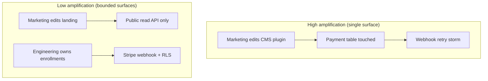
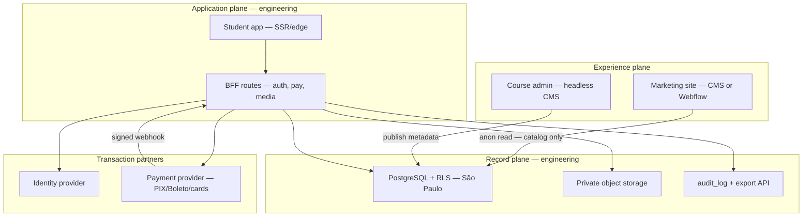

> [!tip] In 30 seconds
> - **Who this is for:** Architects and senior engineers scoping greenfield products or escaping plugin-heavy CMS setups where marketing and compliance both need to move fast.
> - **Problem it solves:** When experience edits and payment/audit changes share one deployable surface, every headline tweak risks touching Stripe webhooks, identity, or LGPD/GDPR evidence.
> - **What changes if you apply this:** Three planes (experience / transaction / record) with **non-overlapping integration paths** — a CMS publish does not redeploy enrollment logic; BFF + RLS so the experience plane **cannot invoke** transaction primitives; ADRs that survive team churn.

Most architecture discussions start with a framework poll: monolith or microservices, WordPress or Next.js, build or buy. That is the wrong first question.

The right first question is organizational and technical at once: ==which changes must non-technical people make without asking engineering, and which changes must engineering be able to prove in an audit?== When those two sets overlap in one deployable unit, you do not have "a stack" — you have a bottleneck dressed as a platform.

Below is **decoupled architecture by ownership**: split systems so marketing, education, and operations publish autonomously while engineering retains money, identity, and data contracts. [aurin.mx](https://aurin.mx) and the public [ATFX Educacao proposal](https://atfxeducacao-porposal.vercel.app/) illustrate the pattern; the models stand alone without those case names.

> [!info] External grounding
> Concepts below cite published material: [Conway's Law](https://martinfowler.com/bliki/ConwaysLaw.html), [Team Topologies](https://teamtopologies.com/key-concepts), [Architecture Decision Records](https://cognitect.com/blog/2011/11/15/documenting-architecture-decisions), [Backends for Frontends](https://learn.microsoft.com/en-us/azure/architecture/patterns/backends-for-frontends), [defense in depth](https://csrc.nist.gov/glossary/term/defense_in_depth), and data-protection law ([GDPR Art. 20](https://gdpr-info.eu/art-20-gdpr/), [LGPD Art. 18](https://www.planalto.gov.br/ccivil_03/_ato2015-2018/2018/lei/l13709.htm#art18)). Case details come from [aurin.mx](https://aurin.mx) and the public [ATFX Educacao proposal](https://atfxeducacao-porposal.vercel.app/).

## Decoupling is not the same as "more services"

> **In plain terms:** More microservices is not automatically more freedom — the goal is fewer surprise side effects.
In engineering literature, **decoupling** means reducing *change amplification*: a modification in one area should not force redeploys, migrations, or compliance rewrites in unrelated areas.

That is different from:

- **Distribution** — running more processes or vendors (which can increase operational coupling through networking, versioning, and observability debt).
- **Abstraction for its own sake** — interfaces nobody owns become stale the week after launch.

[Martin Fowler's summary of Conway's Law](https://martinfowler.com/bliki/ConwaysLaw.html) is the anchor: organizations ship system designs that mirror their communication structures. If marketing and engineering must coordinate for every headline change, you will eventually ship a system where headline changes require engineering — regardless of what your diagram labels say.

The design goal is therefore **intentional mirroring**: shape team boundaries and software boundaries together, using the [inverse Conway maneuver](https://www.thoughtworks.com/en-us/insights/blog/customer-experience/inverse-conway-maneuver-product-development-teams) (design the system you want the organization to become).



## The ownership model: three planes

> **In plain terms:** Three zones: what marketing edits, what money touches, what lawyers care about — kept apart on purpose.
A practical way to teach this in architecture reviews is to name **three planes**. Each plane has one primary owner and one integration contract.

| Plane | Typical non-technical owner | Engineering must own |
| --- | --- | --- |
| **Experience** | Copy, layout, campaigns, course structure in CMS | Auth boundaries, API routes, feature flags with audit |
| **Transaction** | (usually none — finance observes dashboards) | Prices, payments, entitlements, idempotency, webhooks |
| **Record** | Legal/privacy defines policies; DPO governs process | Schema, residency, export/delete APIs, audit logs |

Non-technical ownership is **credible** only when people in the experience plane literally cannot invoke transaction or record primitives from their tool — not because you asked them nicely, but because the integration path does not exist.

> [!warning] "They won't touch that button" is not architecture
> Relying on training alone fails at scale. [OWASP's authorization guidance](https://cheatsheetseries.owasp.org/cheatsheets/Authorization_Cheat_Sheet.html) applies to internal roles too: enforce on server and database, not in UI discipline.

### Surface contract (the artifact architects should produce)

Before selecting vendors, write a one-page **surface contract** per role:

```text Surface contract template
Role: Marketing editor
May change: hero copy, blog posts, public catalog fields exposed via read API
May not change: price, SKU, user record, webhook secret, RLS policy
Deploy path: CMS publish → CDN/HTML (no app server deploy)
Rollback: revert CMS revision (no DB migration)
On-call when broken: marketing lead first; engineering if API contract violated
```

This is how ADRs become operational. Michael Nygard's [Architecture Decision Records](https://cognitect.com/blog/2011/11/15/documenting-architecture-decisions) format (context, decision, consequences) was meant for exactly these trade-offs — not for recording that you picked React.

## Team Topologies mapped to software boundaries

> **In plain terms:** How org chart and system diagram should rhyme so teams do not step on each other.
[Team Topologies](https://teamtopologies.com/key-concepts) (Skelton & Pais) names four team types. You do not need the book to apply the mapping:

| Team type | Software they should align with | Anti-pattern |
| --- | --- | --- |
| **Stream-aligned** | End-to-end student/buyer journey in the product app | One team per layer (frontend team, DB team) |
| **Platform** | Shared auth, payments, observability, export APIs | Every product team rebuilding Stripe webhooks |
| **Enabling** | Temporary help migrating off WordPress/plugin soup | Permanent dependency on consultants |
| **Complicated-subsystem** | Video pipeline, fraud rules, tax engine | Hiding complexity inside a CMS plugin |

When a non-technical department needs autonomy, you are usually creating a **stream-aligned experience** for them (their CMS, their Webflow site) that connects to a **platform** core through narrow APIs — not giving them SSH to production.

## Patterns that implement ownership decoupling

> **In plain terms:** Concrete patterns (headless CMS, API middle layer, row-level security) in plain business language.
### 1. Backends for Frontends (BFF)

The [BFF pattern](https://learn.microsoft.com/en-us/azure/architecture/patterns/backends-for-frontends) keeps each client type behind a dedicated server-side API shaped for that client. The browser for a marketing site should not hold n8n webhook URLs, Stripe secrets, or service-role database keys.

Engineering owns the BFF. Editors own the CMS. The contract between them is a small set of documented endpoints — often read-heavy for marketing, write-heavy only inside the product app.

### 2. Headless CMS as experience plane

A [headless CMS](https://payloadcms.com/docs/getting-started/what-is-payload) separates **content structure** from **delivery code**. Editors work in an admin UI; the product application fetches content at build time or request time.

Critical architectural rule: ==the CMS is not the system of record for money or identity.== If enrollments live in the same tables editors can query, you have collapsed planes.

### 3. Policy at the data layer (RLS and beyond)

Application checks are necessary but not sufficient. [PostgreSQL Row Level Security](https://supabase.com/docs/guides/database/postgres/row-level-security), used by Supabase and others, enforces tenant and role boundaries even when a bug ships in application code or a read-only key leaks.

Pair RLS with **least-privilege keys**: a marketing integration should use an anonymous or scoped key that physically cannot `SELECT` from `payments` — verified in CI, not in a wiki.

### 4. Webhooks as transaction handoff

Payment and identity providers ([Stripe webhooks](https://stripe.com/docs/webhooks), [Clerk webhooks](https://clerk.com/docs/guides/development/webhooks/overview)) are the industry-standard way to move from "user clicked pay" to "our database reflects entitlement."

Architectural requirements:

- Verify signatures on every inbound webhook ([Stripe signing secrets](https://stripe.com/docs/webhooks/signatures)).
- Make handlers **idempotent** (duplicate events must not double-enroll).
- Never let the experience plane call webhook endpoints directly.

### 5. Short-lived credentials for media

For video or downloads, public buckets are an ownership failure. [Google Cloud signed URLs](https://cloud.google.com/storage/docs/access-control/signed-urls) (and equivalents) tie access to a server decision after entitlement checks — typically minutes, not days.

### 6. Architecture Decision Records for buy-vs-build

When evaluating WordPress + LMS plugins vs a custom core, record an ADR. The [ATFX Educacao proposal](https://atfxeducacao-porposal.vercel.app/) is essentially a stakeholder-facing ADR pack: alternatives, rejected options with evidence, compliance checklist, cost envelope.

Rejecting WordPress for the LMS core there rests on engineering facts many architects recognize:

1. **Plugin composition** — course, membership, and commerce data live in incompatible schemas ([LearnDash](https://www.learndash.com/), WooCommerce, membership plugins), raising migration and export cost.
2. **Access-control plugins vs multisite** — [MemberPress multisite support is not official](https://memberpress.com/docs/multisite/); architecture that assumes network-wide membership fights the tool.
3. **Compliance evidence** — [LGPD Art. 18](https://www.planalto.gov.br/ccivil_03/_ato2015-2018/2018/lei/l13709.htm#art18) portability is trivial only with a unified subject record — analogous to [GDPR Art. 20](https://gdpr-info.eu/art-20-gdpr/) data portability in the EU.

WordPress can still win the **experience plane** for a marketing landing — especially when editors already know Elementor — as long as it consumes **public** catalog data through a read-only integration and stores no learner PII.

## Failure modes architects should recognize

> **In plain terms:** Red flags in reviews — when “decoupled” still means one team blocks another.
| Symptom | Likely cause | Fix direction |
| --- | --- | --- |
| "Small copy change broke checkout" | Experience and transaction planes share DB or deploy | Split deploy paths; BFF + CMS |
| "We need engineering for every campaign" | No owned marketing surface | Headless or Webflow + fixed CDN contract |
| "Export for lawyer took 3 weeks" | Data fragmented across plugins | Unified record plane + export API |
| "Microservices but one shared DB" | Distributed monolith | Split schema ownership per plane |
| "Only Alex knows why prod broke" | Missing ADRs and surface contracts | Document boundaries; automate key scoping tests |

## Compliance as an architectural constraint (not a legal footnote)

> **In plain terms:** Privacy law shapes where data lives — not something you paste on at the end.
Privacy law turns vague "we should own our data" into testable requirements.

| Requirement (examples) | Architectural implication |
| --- | --- |
| [LGPD Art. 18](https://www.planalto.gov.br/ccivil_03/_ato2015-2018/2018/lei/l13709.htm#art18) / [GDPR Art. 20](https://gdpr-info.eu/art-20-gdpr/) portability | Single subject view + machine-readable export endpoint |
| Data residency | Region-pinned database and object storage ([Supabase regions](https://supabase.com/docs/guides/platform/regions)) |
| Consent versioning | Append-only `audit_log` tied to policy version, not a checkbox in a page builder |
| PCI for cards | Use [Stripe Elements / Payment Intents](https://stripe.com/docs/payments/payment-intents); card data never touches your CMS |

[ANPD](https://www.gov.br/anpd/pt-br) and EU supervisory guidance increasingly ask *how* you prove controls — which favors architectures where evidence is a query, not a forensic plugin audit.

> [!tip] Decoupling reduces legal rebuild cost
> The ATFX proposal estimates **$25k–$40k and 6–8 months** to migrate if the wrong LMS architecture is chosen first. That number is illustrative of **change amplification** in regulated domains — not a universal quote.

## Reference architecture: regulated LMS (from proposal)

> **In plain terms:** Example: financial education in Brazil — marketing site separate from enrollments and payments.
The following compresses a modern LMS split suitable for LATAM financial education — useful even if you never work on ATFX.



**Purchase path (server-owned business logic):**

```text Regulated LMS — purchase sequence
Client → BFF: create payment intent (JWT verified)
BFF → DB: read authoritative price (never from DOM)
BFF → Payment API: create intent (BRL, local methods)
Client → Payment UI: confirm in-page
Payment API → BFF webhook: payment succeeded (signature verified)
BFF → DB: enrollment + audit row (idempotent)
DB → Client: entitlement visible via RLS / realtime
```

**Access path ([defense in depth](https://csrc.nist.gov/glossary/term/defense_in_depth)):**

1. Identity middleware validates session.
2. Application middleware checks enrollment row.
3. Media route re-checks and mints short-lived signed URL.

Marketing changing a hero image does not appear in that sequence — by design.

## Reference architecture: editorial vs automation (production site)

> **In plain terms:** Example: live marketing site where editors publish copy and automation handles chat separately.
On a services marketing site, the same three planes appear with different vendors:

- **Experience:** headless CMS drives pages (projects, services, legal).
- **Application:** SSR proxy exposes `/api/chat` and calendar routes; secrets stay server-side ([Astro endpoints](https://docs.astro.build/en/guides/endpoints/) pattern).
- **Automation:** workflow engine ([n8n webhooks](https://docs.n8n.io/integrations/builtin/core-nodes/n8n-nodes-base.webhook/)) owns dialog copy and LLM context — decoupled from CMS publish cadence.

The engineering lesson from operating keyword-driven side effects: ==decoupling does not remove coupling; it documents where coupling lives.== When bot copy and client-side intent detectors diverge, booking fails with HTTP 200 — a class of bug architects should plan for with contract tests between planes, not by merging everything into one admin panel.

## Checklist: architecture review before build

> **In plain terms:** Questions to ask in the room before anyone commits to a vendor stack.
Use this in design reviews without referencing any proprietary repo:

1. **Planes** — Can you name experience, transaction, and record owners in one sentence each?
2. **Surface contracts** — Does every non-technical role have a written may/may-not list?
3. **Keys** — Does each integration use the narrowest credential that still works? Who rotates it?
4. **Deploy independence** — Can marketing ship while app version is frozen for a payment audit?
5. **Export** — Can legal get a subject bundle in one API call? Which tables are excluded and why?
6. **Webhook discipline** — Signature verification, idempotency keys, dead-letter visibility?
7. **ADR trail** — Are rejected alternatives captured with consequences (plugin soup, multisite, residency)?
8. **Conway check** — Does the diagram require daily cross-team chat for routine work? ([Conway's Law](https://martinfowler.com/bliki/ConwaysLaw.html))

## What to measure after launch

> **In plain terms:** Simple metrics executives can track — not only uptime charts for engineers.
| Metric | Healthy signal | Ownership failure signal |
| --- | --- | --- |
| Median time for copy publish without engineering | Hours | Multi-day tickets |
| % checkout changes touching CMS | Near zero | Any price change via page builder |
| Webhook error budget | <1% after retries | Silent entitlement drift |
| Subject export SLA | Automated < minutes | Manual SQL per request |
| On-call pages for marketing deploys | Rare | Every campaign |

## References (external — core reading)

> **In plain terms:** Foundational reading if you want to go deeper with your architecture team.
| Topic | Source |
| --- | --- |
| Conway's Law | [Martin Fowler — Conway's Law](https://martinfowler.com/bliki/ConwaysLaw.html) |
| Inverse Conway maneuver | [Thoughtworks — Inverse Conway](https://www.thoughtworks.com/en-us/insights/blog/customer-experience/inverse-conway-maneuver-product-development-teams) |
| Team Topologies | [teamtopologies.com — Key concepts](https://teamtopologies.com/key-concepts) |
| Team Topologies (overview) | [Martin Fowler — Team Topologies](https://martinfowler.com/bliki/TeamTopologies.html) |
| Architecture Decision Records | [Michael Nygard — ADR](https://cognitect.com/blog/2011/11/15/documenting-architecture-decisions) |
| ADR collection practices | [adr.github.io](https://adr.github.io/) |
| Backends for Frontends | [Azure — BFF pattern](https://learn.microsoft.com/en-us/azure/architecture/patterns/backends-for-frontends) |
| Headless CMS pattern | [Payload — What is Payload?](https://payloadcms.com/docs/getting-started/what-is-payload) |
| Row Level Security | [Supabase — RLS](https://supabase.com/docs/guides/database/postgres/row-level-security) |
| Defense in depth | [NIST — Defense in depth](https://csrc.nist.gov/glossary/term/defense_in_depth) |
| Authorization on server | [OWASP — Authorization Cheat Sheet](https://cheatsheetseries.owasp.org/cheatsheets/Authorization_Cheat_Sheet.html) |
| LGPD (Brazil) | [Lei 13.709/2018](https://www.planalto.gov.br/ccivil_03/_ato2015-2018/2018/lei/l13709.htm) |
| LGPD Art. 18 portability | [Art. 18](https://www.planalto.gov.br/ccivil_03/_ato2015-2018/2018/lei/l13709.htm#art18) |
| GDPR Art. 20 portability | [GDPR Art. 20](https://gdpr-info.eu/art-20-gdpr/) |
| ANPD | [gov.br/anpd](https://www.gov.br/anpd/pt-br) |
| Stripe Payment Intents | [Stripe Docs](https://stripe.com/docs/payments/payment-intents) |
| Stripe webhooks | [Stripe — Webhooks](https://stripe.com/docs/webhooks) |
| Clerk webhooks | [Clerk — Webhooks overview](https://clerk.com/docs/guides/development/webhooks/overview) |
| GCS signed URLs | [Google Cloud — Signed URLs](https://cloud.google.com/storage/docs/access-control/signed-urls) |
| Astro server endpoints / BFF | [Astro — Endpoints](https://docs.astro.build/en/guides/endpoints/) |
| n8n production webhooks | [n8n — Webhook node](https://docs.n8n.io/integrations/builtin/core-nodes/n8n-nodes-base.webhook/) |
| ATFX Educacao proposal (LMS ADR example) | [atfxeducacao-porposal.vercel.app](https://atfxeducacao-porposal.vercel.app/) |
| Aurin (editorial/automation split example) | [aurin.mx](https://aurin.mx) |

## Closing

> **In plain terms:** Pick boundaries by who must change what — frameworks come second.
Decoupled architecture for engineering is not maximizing the number of boxes. It is **minimizing the blast radius of routine work** by aligning software boundaries with who actually owns change — editors, marketers, finance, platform engineers, and compliance.

Frameworks are interchangeable. Ownership is not. Start with planes, surface contracts, and ADRs; choose WordPress, Next.js, or microservices only after you know which plane each tool is allowed to own. When non-technical teams can ship on their surface and engineering can prove every other surface in code and queries, you have built something teachable — not a closing slide that only makes sense if the audience read five other case studies first.