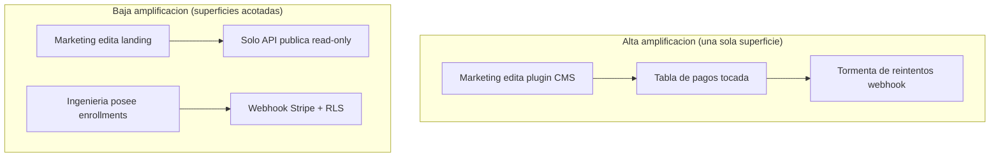
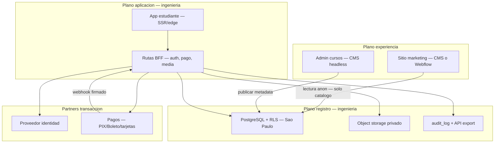

La mayoría de discusiones de arquitectura empiezan con una encuesta de frameworks: monolito o microservicios, WordPress o Next.js, build o buy. Esa es la primera pregunta equivocada.

La primera pregunta correcta es organizacional y técnica a la vez: ==¿qué cambios deben poder hacer personas no técnicas sin pedirle a ingeniería, y qué cambios debe poder demostrar ingeniería en una auditoría?== Cuando esos dos conjuntos se solapan en una sola unidad desplegable, no tienes "un stack" — tienes un cuello de botella disfrazado de plataforma.

Este artículo es una guía de **arquitectura desacoplada por ownership**: cómo partir sistemas para que marketing, educación y operaciones publiquen con autonomía mientras ingeniería conserva el control del dinero, la identidad y los contratos de datos. Está escrito para arquitectos e ingeniería senior que definen productos greenfield o salidas de CMS cargados de plugins. Dos trabajos reales ilustran el patrón — un sitio de marketing en producción con agente conversacional y una propuesta ejecutiva de LMS para educación financiera regulada en Brasil — pero los modelos valen por sí solos.

> [!info] Sustento externo
> Los conceptos citan material publicado: [Ley de Conway](https://martinfowler.com/bliki/ConwaysLaw.html), [Team Topologies](https://teamtopologies.com/key-concepts), [Architecture Decision Records](https://cognitect.com/blog/2011/11/15/documenting-architecture-decisions), [Backends for Frontends](https://learn.microsoft.com/es-es/azure/architecture/patterns/backends-for-frontends), [defense in depth](https://csrc.nist.gov/glossary/term/defense_in_depth) y ley de protección de datos ([GDPR Art. 20](https://gdpr-info.eu/art-20-gdpr/), [LGPD Art. 18](https://www.planalto.gov.br/ccivil_03/_ato2015-2018/2018/lei/l13709.htm#art18)). Los casos provienen de [aurin.mx](https://aurin.mx) y la [propuesta pública ATFX Educacao](https://atfxeducacao-porposal.vercel.app/).

## Desacoplar no es lo mismo que "más servicios"

En literatura de ingeniería, **desacoplar** significa reducir la *amplificación del cambio*: una modificación en un área no debería forzar redespliegues, migraciones ni reescrituras de compliance en áreas no relacionadas.

Eso es distinto de:

- **Distribución** — más procesos o vendors (que pueden aumentar acoplamiento operativo: red, versionado, observabilidad).
- **Abstracción por moda** — interfaces sin dueño que quedan obsoletas la semana del lanzamiento.

El resumen de [Conway's Law por Martin Fowler](https://martinfowler.com/bliki/ConwaysLaw.html) es la base: las organizaciones producen diseños que reflejan cómo se comunican. Si marketing e ingeniería deben coordinar cada titular, terminarás con un sistema donde cambiar titulares requiere ingeniería — sin importar cómo etiquetes el diagrama.

El objetivo de diseño es **reflejo intencional**: alinear límites de equipo y límites de software, con la [maniobra inversa de Conway](https://www.thoughtworks.com/en-us/insights/blog/customer-experience/inverse-conway-maneuver-product-development-teams) (diseñar el sistema que quieres que la organización se convierta).



## El modelo de ownership: tres planos

Una forma práctica de enseñarlo en revisiones de arquitectura es nombrar **tres planos**. Cada plano tiene un dueño principal y un contrato de integración.

| Plano | Dueño no técnico típico | Ingeniería debe poseer |
| --- | --- | --- |
| **Experiencia** | Copy, layout, campañas, estructura de cursos en CMS | Límites de auth, rutas API, flags con auditoría |
| **Transacción** | (casi nadie — finanzas observa dashboards) | Precios, pagos, derechos, idempotencia, webhooks |
| **Registro** | Legal/privacidad define políticas; DPO el proceso | Schema, residencia, APIs export/delete, audit logs |

El ownership no técnico es **creíble** solo cuando quienes están en experiencia no pueden invocar primitivas de transacción o registro desde su herramienta — no porque se lo pidieron amablemente, sino porque el camino de integración no existe.

> [!warning] "No van a tocar ese botón" no es arquitectura
> Confiar solo en capacitación falla a escala. La guía de [autorización OWASP](https://cheatsheetseries.owasp.org/cheatsheets/Authorization_Cheat_Sheet.html) aplica a roles internos: aplicar en servidor y base, no en disciplina de UI.

### Contrato de superficie (el artefacto que debe producir arquitectura)

Antes de elegir vendors, escribe un **contrato de superficie** de una página por rol:

```text Plantilla de contrato de superficie
Rol: Editor de marketing
Puede cambiar: copy hero, posts, campos publicos del catalogo via API read
No puede cambiar: precio, SKU, registro de usuario, secreto webhook, politica RLS
Ruta de deploy: publish CMS → CDN/HTML (sin deploy de app server)
Rollback: revertir revision CMS (sin migracion DB)
On-call si falla: lead de marketing primero; ingenieria si se viola contrato API
```

Así los ADR se vuelven operativos. El formato de [Architecture Decision Records de Michael Nygard](https://cognitect.com/blog/2011/11/15/documenting-architecture-decisions) (contexto, decisión, consecuencias) existe para estos trade-offs — no para registrar que elegiste React.

## Team Topologies aplicado a límites de software

[Team Topologies](https://teamtopologies.com/key-concepts) (Skelton & Pais) define cuatro tipos de equipo. No necesitas el libro para el mapeo:

| Tipo | Software con el que debe alinearse | Anti-patrón |
| --- | --- | --- |
| **Stream-aligned** | Journey estudiante/comprador en la app producto | Un equipo por capa (solo frontend, solo DB) |
| **Platform** | Auth, pagos, observabilidad, APIs de export compartidas | Cada producto reimplementando webhooks Stripe |
| **Enabling** | Ayuda temporal para salir de WordPress/plugins | Dependencia permanente de consultores |
| **Complicated-subsystem** | Pipeline de video, fraude, impuestos | Ocultar complejidad en un plugin CMS |

Cuando un área no técnica necesita autonomía, sueles crear una **experiencia stream-aligned** para ellos (su CMS, su Webflow) conectada a un núcleo **platform** por APIs estrechas — no darles SSH a producción.

## Patrones que implementan desacoplamiento por ownership

### 1. Backends for Frontends (BFF)

El [patrón BFF](https://learn.microsoft.com/es-es/azure/architecture/patterns/backends-for-frontends) pone cada tipo de cliente detrás de una API server-side adaptada a ese cliente. El navegador de marketing no debe cargar URLs de webhook n8n, secretos Stripe ni service-role de base de datos.

Ingeniería posee el BFF. Editores poseen el CMS. El contrato entre ambos es un conjunto pequeño de endpoints documentados — a menudo lectura para marketing, escritura solo dentro de la app producto.

### 2. CMS headless como plano de experiencia

Un [CMS headless](https://payloadcms.com/docs/getting-started/what-is-payload) separa **estructura de contenido** de **código de entrega**. Editores trabajan en admin; la app consume contenido en build o request.

Regla arquitectónica crítica: ==el CMS no es la fuente de verdad del dinero ni de la identidad.== Si los enrollments viven en tablas que editores pueden consultar, colapsaste planos.

### 3. Política en la capa de datos (RLS y más)

Los checks en aplicación son necesarios pero no suficientes. [Row Level Security en PostgreSQL](https://supabase.com/docs/guides/database/postgres/row-level-security) aplica límites aunque un bug salga a producción o filtre una key de solo lectura.

Combina RLS con **keys de mínimo privilegio**: la integración de marketing usa una key anónima o acotada que físicamente no puede `SELECT` en `payments` — verificado en CI, no en un wiki.

### 4. Webhooks como handoff de transacción

Proveedores de pago e identidad ([webhooks Stripe](https://stripe.com/docs/webhooks), [webhooks Clerk](https://clerk.com/docs/guides/development/webhooks/overview)) son la forma estándar de pasar de "el usuario pagó" a "nuestra base refleja el derecho".

Requisitos arquitectónicos:

- Verificar firmas en cada webhook entrante ([firmas Stripe](https://stripe.com/docs/webhooks/signatures)).
- Handlers **idempotentes** (eventos duplicados no deben enrollar dos veces).
- El plano de experiencia nunca llama webhooks directamente.

### 5. Credenciales de vida corta para media

Para video o descargas, buckets públicos son fallo de ownership. [URLs firmadas en Google Cloud](https://cloud.google.com/storage/docs/access-control/signed-urls) atan acceso a una decisión en servidor tras verificar derecho — típicamente minutos.

### 6. ADR para buy vs build

Al evaluar WordPress + plugins LMS vs núcleo a medida, registra un ADR. La [propuesta ATFX Educacao](https://atfxeducacao-porposal.vercel.app/) es básicamente un pack ADR para stakeholders: alternativas, rechazos con evidencia, checklist compliance, costos.

Rechazar WordPress como núcleo LMS allí apoya hechos que muchos arquitectos reconocen:

1. **Composición de plugins** — datos de curso, membresía y comercio en schemas incompatibles, subiendo costo de migración y export.
2. **Plugins de acceso vs multisite** — el soporte multisite de MemberPress no es el modelo principal; arquitecturas que asumen membresía en red pelean con la herramienta.
3. **Evidencia de compliance** — portabilidad [LGPD Art. 18](https://www.planalto.gov.br/ccivil_03/_ato2015-2018/2018/lei/l13709.htm#art18) es trivial solo con registro unificado del titular — análogo al [Art. 20 GDPR](https://gdpr-info.eu/art-20-gdpr/) en la UE.

WordPress puede ganar el **plano de experiencia** de una landing — sobre todo si editores ya dominan Elementor — si consume datos **públicos** del catálogo por integración read-only y no guarda PII de alumnos.

## Modos de fallo que el arquitecto debe reconocer

| Síntoma | Causa probable | Dirección de arreglo |
| --- | --- | --- |
| "Un cambio de copy rompió checkout" | Planos experiencia y transacción comparten DB o deploy | Separar deploy; BFF + CMS |
| "Cada campaña necesita ingeniería" | Sin superficie de marketing propia | Headless o Webflow + contrato CDN fijo |
| "El export para legal tardó 3 semanas" | Datos fragmentados en plugins | Plano registro unificado + API export |
| "Microservicios pero una sola DB" | Monolito distribuido | Ownership de schema por plano |
| "Solo Alex sabe por qué cayó prod" | Sin ADR ni contratos de superficie | Documentar límites; tests de scope de keys |

## Compliance como restricción arquitectónica (no nota legal al pie)

La ley de privacidad convierte el "debemos ser dueños de los datos" en requisitos verificables.

| Requisito (ejemplos) | Implicación arquitectónica |
| --- | --- |
| [LGPD Art. 18](https://www.planalto.gov.br/ccivil_03/_ato2015-2018/2018/lei/l13709.htm#art18) / [GDPR Art. 20](https://gdpr-info.eu/art-20-gdpr/) portabilidad | Vista única del titular + endpoint export machine-readable |
| Residencia de datos | DB y object storage en región fija ([regiones Supabase](https://supabase.com/docs/guides/platform/regions)) |
| Versionado de consentimiento | `audit_log` append-only ligado a versión de política |
| PCI en tarjetas | [Stripe Elements / Payment Intents](https://stripe.com/docs/payments/payment-intents); datos de tarjeta nunca en el CMS |

[ANPD](https://www.gov.br/anpd/pt-br) y supervisores en la UE piden cada vez más *cómo* demuestras controles — lo que favorece arquitecturas donde la evidencia es una query, no auditoría forense de plugins.

> [!tip] Desacoplar reduce costo legal de rehacer
> La propuesta ATFX estima **USD 25k–40k y 6–8 meses** para migrar si se elige mal el LMS al inicio. Es ilustrativo de **amplificación del cambio** en dominios regulados — no una cifra universal.

## Arquitectura de referencia: LMS regulado (desde propuesta)

Compresión de un split LMS moderno para educación financiera LATAM — útil aunque no trabajes en ATFX.



**Secuencia de compra (lógica de negocio en servidor):**

```text LMS regulado — secuencia de compra
Cliente → BFF: crear payment intent (JWT verificado)
BFF → DB: leer precio autoritativo (nunca del DOM)
BFF → API pago: crear intent (BRL, metodos locales)
Cliente → UI pago: confirmar en pagina
API pago → webhook BFF: pago exitoso (firma verificada)
BFF → DB: enrollment + fila audit (idempotente)
DB → Cliente: derecho visible via RLS / realtime
```

**Acceso ([defense in depth](https://csrc.nist.gov/glossary/term/defense_in_depth)):**

1. Middleware de identidad valida sesión.
2. Middleware de app verifica fila de enrollment.
3. Ruta de media re-verifica y emite URL firmada de vida corta.

Cambiar imagen del hero en marketing no aparece en esa secuencia — por diseño.

## Arquitectura de referencia: editorial vs automatización (sitio en producción)

En un sitio de servicios aparecen los mismos tres planos con vendors distintos:

- **Experiencia:** CMS headless alimenta páginas (proyectos, servicios, legales).
- **Aplicación:** proxy SSR expone `/api/chat` y calendario; secretos solo en servidor ([endpoints Astro](https://docs.astro.build/es/guides/endpoints/)).
- **Automatización:** motor de workflows ([webhooks n8n](https://docs.n8n.io/integrations/builtin/core-nodes/n8n-nodes-base.webhook/)) posee copy del diálogo y contexto LLM — desacoplado del cadence de publish del CMS.

La lección operativa con side effects por keywords del bot: ==desacoplar no elimina acoplamiento; documenta dónde vive.== Cuando copy del bot y detectores en cliente divergen, el booking falla con HTTP 200 — clase de bug que el arquitecto debe anticipar con contract tests entre planos, no fusionando todo en un solo admin.

## Checklist: revision de arquitectura antes de construir

Úsalo en design reviews sin depender de repos propietarios:

1. **Planos** — ¿Puedes nombrar dueños de experiencia, transacción y registro en una frase cada uno?
2. **Contratos de superficie** — ¿Cada rol no técnico tiene lista escrita de puede / no puede?
3. **Keys** — ¿Cada integración usa la credencial más estrecha que funciona? ¿Quién la rota?
4. **Independencia de deploy** — ¿Marketing puede publicar con la app congelada por auditoría de pagos?
5. **Export** — ¿Legal obtiene bundle del titular en una llamada API? ¿Qué tablas quedan fuera y por qué?
6. **Disciplina webhook** — ¿Verificación de firma, idempotencia, dead-letter visible?
7. **Rastro ADR** — ¿Alternativas rechazadas con consecuencias (plugin soup, multisite, residencia)?
8. **Chequeo Conway** — ¿El diagrama exige chat diario entre equipos para trabajo rutinario? ([Conway's Law](https://martinfowler.com/bliki/ConwaysLaw.html))

## Qué medir después del lanzamiento

| Métrica | Señal sana | Señal de fallo de ownership |
| --- | --- | --- |
| Tiempo mediano de publish de copy sin ingeniería | Horas | Tickets de varios días |
| % cambios de checkout que tocan CMS | Casi cero | Cambio de precio desde page builder |
| Error budget de webhooks | <1% tras retries | Deriva silenciosa de derechos |
| SLA export del titular | Automático en minutos | SQL manual por pedido |
| Páginas on-call por deploy de marketing | Raras | Cada campaña |

## Referencias (externas — lectura núcleo)

| Tema | Fuente |
| --- | --- |
| Conway's Law | [Martin Fowler — Conway's Law](https://martinfowler.com/bliki/ConwaysLaw.html) |
| Maniobra inversa de Conway | [Thoughtworks — Inverse Conway](https://www.thoughtworks.com/en-us/insights/blog/customer-experience/inverse-conway-maneuver-product-development-teams) |
| Team Topologies | [teamtopologies.com — Key concepts](https://teamtopologies.com/key-concepts) |
| Team Topologies (overview) | [Martin Fowler — Team Topologies](https://martinfowler.com/bliki/TeamTopologies.html) |
| Architecture Decision Records | [Michael Nygard — ADR](https://cognitect.com/blog/2011/11/15/documenting-architecture-decisions) |
| Prácticas ADR | [adr.github.io](https://adr.github.io/) |
| Backends for Frontends | [Azure — BFF](https://learn.microsoft.com/es-es/azure/architecture/patterns/backends-for-frontends) |
| CMS headless | [Payload — What is Payload?](https://payloadcms.com/docs/getting-started/what-is-payload) |
| Row Level Security | [Supabase — RLS](https://supabase.com/docs/guides/database/postgres/row-level-security) |
| Defense in depth | [NIST — Defense in depth](https://csrc.nist.gov/glossary/term/defense_in_depth) |
| Autorización en servidor | [OWASP — Authorization Cheat Sheet](https://cheatsheetseries.owasp.org/cheatsheets/Authorization_Cheat_Sheet.html) |
| LGPD (Brasil) | [Lei 13.709/2018](https://www.planalto.gov.br/ccivil_03/_ato2015-2018/2018/lei/l13709.htm) |
| LGPD Art. 18 | [Art. 18](https://www.planalto.gov.br/ccivil_03/_ato2015-2018/2018/lei/l13709.htm#art18) |
| GDPR Art. 20 | [GDPR Art. 20](https://gdpr-info.eu/art-20-gdpr/) |
| ANPD | [gov.br/anpd](https://www.gov.br/anpd/pt-br) |
| Stripe Payment Intents | [Stripe Docs](https://stripe.com/docs/payments/payment-intents) |
| Webhooks Stripe | [Stripe — Webhooks](https://stripe.com/docs/webhooks) |
| Webhooks Clerk | [Clerk — Webhooks](https://clerk.com/docs/guides/development/webhooks/overview) |
| URLs firmadas GCS | [Google Cloud — Signed URLs](https://cloud.google.com/storage/docs/access-control/signed-urls) |
| Endpoints servidor / BFF Astro | [Astro — Endpoints](https://docs.astro.build/es/guides/endpoints/) |
| Webhooks producción n8n | [n8n — Webhook](https://docs.n8n.io/integrations/builtin/core-nodes/n8n-nodes-base.webhook/) |
| Propuesta ATFX (ejemplo ADR LMS) | [atfxeducacao-porposal.vercel.app](https://atfxeducacao-porposal.vercel.app/) |
| Aurin (ejemplo split editorial/automation) | [aurin.mx](https://aurin.mx) |

## Cierre

Arquitectura desacoplada para ingeniería no es maximizar cajas en un diagrama. Es **minimizar el radio de explosión del trabajo rutinario** alineando límites de software con quién realmente posee el cambio — editores, marketers, finanzas, plataforma y compliance.

Los frameworks son intercambiables. El ownership no. Empieza por planos, contratos de superficie y ADR; elige WordPress, Next.js o microservicios solo cuando sepas qué plano puede poseer cada herramienta. Cuando equipos no técnicos publican en su superficie e ingeniería puede demostrar el resto en código y queries, construiste algo enseñable — no una diapositiva de cierre que solo se entiende si la audiencia leyó otros cinco casos antes.