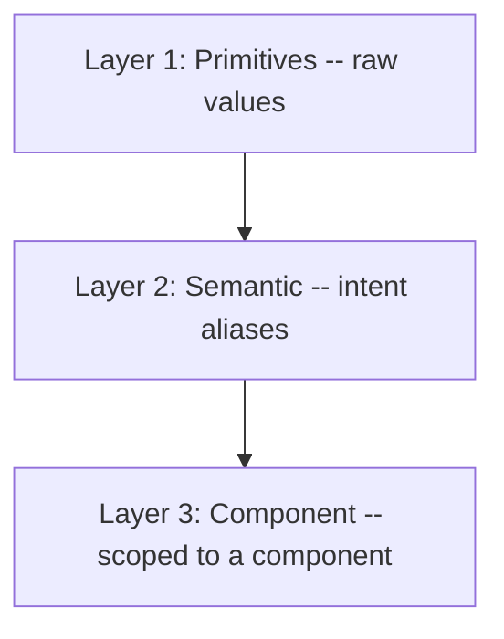
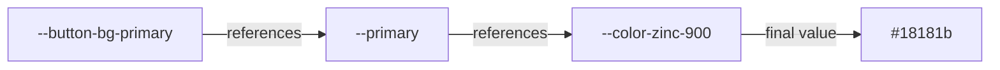
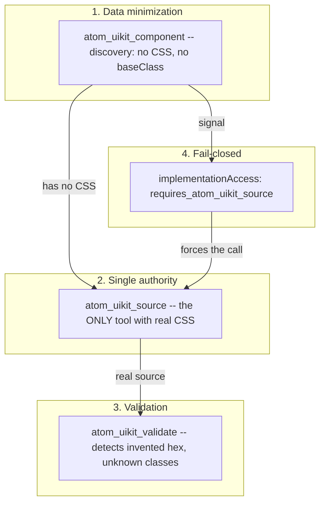

An AI agent generates a button. It compiles. It renders. It looks right. The background violet is `#534AB7` -- a color that exists nowhere in the design system.

Nobody decided that. The agent had the component's metadata -- it knew a variant existed, it knew it took a size -- but it didn't have the real code. So ==it made up the rest.== A plausible hex. A 36px padding where the system uses 40px. A font-size that approximates but doesn't match. The result passes human code review because it looks correct. And it ships to production as a subtle lie about the system.

This article is about how I built a design system that an AI agent can't hallucinate. But the honest version of that story doesn't start with the solution -- it starts with three problems I discovered in order, where each one only became visible after solving the previous one. First I took an existing design system and reinterpreted it to be read by a machine. Then I connected agents and found they hallucinated anyway. Then, while fixing that, I discovered my own architecture had the source of truth duplicated in three places. What follows is that journey, and what it taught me about the relationship between design systems and AI.

## Where this started: a company that vibecodes

I joined Atom at a precise moment. The product team -- a group of very talented people -- was finishing the first stage of their design system: a system with shadcn's aesthetic, built for Atom's platform. Good work, solid base. But it lived inside the product.

Atom is a multimodal-AI-agents-for-WhatsApp company. AI-first isn't a slogan there -- it's how everyone works, and that includes a practice that defines the culture: ==everyone vibecodes.== Marketing, product, founders. Generating code with AI is the norm, not the exception.

I owned the entire web pipeline, and from there I saw the other side of that culture. Vibecoded pages kept landing on my desk that needed style fixes, homogeneity across touchpoints, or that simply had badly broken code. The product design system solved consistency inside the platform -- but across the marketing touchpoints (landings, campaigns, microsites) there was nothing holding the brand together. Every generated page was a slightly different interpretation of the same thing.

I had two paths. Become the bottleneck reviewing and fixing every page by hand. Or build something that gave non-technical people the power to generate correct from the start -- and, along the way, take that work off my plate.

I took the product design system as a base and reinterpreted it. Not to replace it, but to extend it to a terrain where whoever writes the code isn't always an engineer. It started as a side project. It grew too big. And in the end ==it didn't just work for me.==

## First: a design system designed for non-human readers

The ATOM UIKit is not a copy of the product system. It's a reinterpretation -- same visual language, different architecture -- optimized for two readers at once: the developer and the LLM.

The original system had ~500 tokens. Per-platform variants, CRM tokens, interactive states mixed into the semantic layer, linear scales with steps nobody could tell apart by eye. I reduced it to ~350 tokens across three strict layers, ==without losing a single visual capability.==

The reason isn't minimalism for aesthetics. It's that a system with fewer options is easier to generate correctly -- for a human and, above all, for a model.

- Fewer tokens = fewer decisions = fewer errors. An LLM doesn't have to choose between 27 spacings when 13 cover every case.
- `bg` / `foreground` pairs for every surface = the model always knows which text color goes on which background.
- Consistent naming (BEM, kebab-case) = patterns the model learns fast.
- Pure CSS, no CSS-in-JS = the model doesn't need to understand runtime abstractions.

> [!info] The result is visually identical to the original system. The difference is in how easily a builder -- human or AI -- produces correct code on the first try.

That phrase -- "designed so AI generates correct code" -- sounds like marketing until you turn it into concrete architecture decisions. The first is how the code is distributed.

## shadcn distribution, not npm

The UIKit components are not on npm. This is written, verbatim, in the first line of the monorepo's CLAUDE.md:

> [!note] "Distributes via private registry (shadcn model) -- source copied to consumer projects, not installed as npm dependencies."

The decision has a philosophy behind it. An npm dependency is a black box: you install it, you import it, and the code lives in `node_modules` where nobody reads or modifies it. For an AI agent, a black box is exactly the worst case -- it can see the package's signature but not its inside, so ==it fills the gaps with guesses.==

The shadcn model inverts that. The source is copied into the consumer's project. The code is yours, in plain sight, modifiable. And for an agent it means the real source is always available -- not as an opaque import, but as files it can read before writing.

The monorepo is organized into six independent packages:

```tree Monorepo structure
{
  "root": "atom-uikit-ds/packages/",
  "folders": [
    { "category": "tokens", "path": "tokens/", "files": ["primitives/", "semantic/", "components/"] },
    { "category": "css", "path": "css/", "files": ["pure-CSS components + foundation"] },
    { "category": "animations", "path": "animations/", "files": ["GSAP modules, init(): CleanupFn"] },
    { "category": "react", "path": "components-react/", "files": ["~60 React 19 components"] },
    { "category": "astro", "path": "components-astro/", "files": ["Astro components"] },
    { "category": "whatsapp", "path": "whatsapp/", "files": ["WCI widget as self-contained IIFE"] }
  ]
}
```

Six packages, but a single source of values. The tokens aren't tied to any framework -- they're values in a standard format, agnostic to whatever technology consumes them. That's why the same system produces components in pure CSS, in React, in Astro, and even a WhatsApp widget as a self-contained IIFE. ==That agnostic layer is what makes it special:== it's not a set of React components, it's a source many stacks derive their own from. And it's consumed two ways, designed for how Atom actually works: over MCP for agents inside the editor, and over HTTP for anyone vibecoding.

## Tokens as a contract, not as pretty variables

If shadcn distribution is the form, ==the three-layer tokens are the contract.== And a contract only works if nobody can break it by accident.

The three layers reference backward, never sideways:



**Primitives** are literals: a hex, a pixel number, an easing curve. 271 colors across 26 families, base-4 spacing in 13 steps, a Major Third typographic scale. They mean nothing on their own -- they just have a value.

**Semantic** tokens give the primitive intent. They don't say "use zinc-900", they say "this is the primary color". Here lives the central convention: every surface has a `-foreground` companion.

**Component** tokens scope a semantic token to a specific component, only when a state is needed that the semantic layer doesn't cover (hover, pressed, disabled).

The rule that holds the whole building up is a single one: ==a component token never references a primitive directly.== It always goes through the semantic layer. And it's not pedantry -- it's what makes dark mode work.



```css The chain in CSS
:root {
  /* Primitive: literal, references nothing */
  --color-zinc-900: #18181b;

  /* Semantic: references the primitive, changes with the theme */
  --primary: var(--color-zinc-900);
  --primary-foreground: var(--color-zinc-50);
}

[data-theme="dark"] {
  /* Same names, inverted values */
  --primary: var(--color-zinc-50);
  --primary-foreground: var(--color-zinc-900);
}

:root {
  /* Component: references the semantic, never the primitive */
  --button-bg-primary: var(--primary);
}
```

The button's CSS says `var(--button-bg-primary)`, which resolves to `var(--primary)`, which resolves to `#18181b`. When you switch themes, only the semantic token changes -- and the button updates without touching a single line of its own CSS.

> [!warning] If a component token references a primitive directly, skipping the semantic layer, dark mode breaks for that component. The primitive doesn't change with the theme. Only the semantic tokens do.

All of this follows the W3C DTCG format (`{ "$value": "...", "$type": "..." }`), which isn't cosmetic: it's a standard format external tools can read. The token is a machine-readable contract, not a convention living in someone's head.

## Second problem: the agents hallucinated anyway

I had built a deliberately predictable system. Fewer tokens, consistent naming, source always available. And still, the first time I let an agent generate interfaces, the opening scene happened.

Not wrong as in "broken". ==Wrong as in "out of context."== The agent used a made-up violet because it seemed reasonable. It used 36px because it's a common value. It picked a font-size that almost matched. Each decision, in isolation, was defensible. Together, they were a different system impersonating mine.

The cause was structural, not the model's. I was giving the agent the component's **metadata** -- name, variants, sizes, props -- and expecting it to produce the **implementation**. But metadata doesn't contain CSS values. So the agent did the only thing it could: it invented them.

The problem wasn't that the agent knew too little. It was that ==I was asking it to do something I hadn't given it the source for.== And worse: nothing in the system stopped it from trying.

## The core idea: separate what an agent can know from what it can do

The solution is an MCP server that exposes the design system with a deliberate separation between two classes of tools. The exact phrasing lives in the DS's CLAUDE.md:

> [!note] "This split enforces the anti-hallucination pattern: LLMs see enough to discover components but must call atom_uikit_source for actual implementation details."

Each registry item has two sections. One is visible to discovery tools. The other only to implementation tools.

```typescript registry-schema.ts
// atom.discovery -- what the agent can KNOW
{
  name, description, category,
  variants, sizes, defaultVariant, defaultSize,
  props,          // name, type, required, default
  hasAnimation
  // no CSS, no baseClass, no source
}

// atom.implementation -- what the agent needs to DO
{
  baseClass,      // real root class, e.g. "button"
  cssClasses,     // all BEM names
  peerDeps,       // e.g. "gsap"
  hasCss, hasReact
  // accessible ONLY via atom_uikit_source
}
```

The **discovery** tools (`atom_uikit_context`, `atom_uikit_component`, `atom_uikit_search`) return metadata only. An agent can list components, read their props, understand what exists -- but it never sees a line of real CSS.

The **implementation** tools (`atom_uikit_source`, `atom_uikit_validate`, `atom_uikit_audit`, `atom_uikit_patch_plan`) are the only ones with access to the code. `atom_uikit_source` is the single tool in the whole system that returns the real source.

What closes the pattern is that discovery doesn't stay quiet about what it hides. It emits an explicit signal:

```typescript Fail-closed signal
// component.ts -- discovery instructs the agent
implementationAccess: 'requires_atom_uikit_source'

// and in the output, verbatim:
"**To implement:** call atom_uikit_source(\"button\") -- this is
the ONLY way to get the actual CSS, tokens, classes, and React
code. Do NOT invent CSS values, colors, or classes."
```

The complete system is a four-layer defense:



The change was measurable. ==Before: the agent generated `#534AB7`, 36px, wrong font-sizes. After: it uses the real zinc scale, 40px, 13px -- because it's forced to call `atom_uikit_source` before writing.== Not because the model got smarter. Because the system no longer lets it guess.

> [!tip] The right metaphor isn't "the agent knows more". It's "the agent has nowhere left to invent". The anti-hallucination pattern doesn't improve the model -- it removes the surface where the error was possible.

## Third problem: my own architecture had the truth duplicated

This is where the story stops being about the agent and becomes about me.

The first version of the MCP worked, but inside it was fragile in a way I was slow to see. The component metadata lived in the DS. But the MCP re-embedded it at build time with a script (`embed-source.ts`), generated a manifest, and on top of that applied a `component-overrides.ts` file to patch fields the extractor didn't yet produce. ==The source of truth was in three places at once.==

That's exactly the kind of drift the token system was designed to prevent -- and I had reintroduced it in the distribution layer. If the DS said one thing, the embedded manifest said another, and the override a third, which one was the truth? The honest answer was: depends which you read first.

The consolidation was a four-wave process over three days. It wasn't a redesign -- it was migrating, with regression tests at every step, toward a single source.

**Wave 1 -- Enrich the registry (DS).** Make the DS registry the source of truth for metadata. An extractor (`extract-component-metadata.ts`) that pulls discovery + implementation straight from the source. 61 items enriched, 27 unit tests, 0 errors.

**Wave 2 -- Migrate the MCP tools.** Move every tool from the embedded manifest to the registry over HTTP. A three-function adapter (`getAllDiscovery`, `getComponentInfo`, `getImplementationData`). 41 regression assertions validating the anti-hallucination pattern: ==10 of 10 components verified, zero implementation-field leaks.==

**Wave 3A -- Delete the old path.** Remove the feature flag, the legacy handlers, the dead code. Seven files deleted, ~3,800 lines -- including `embed-source.ts`. The build went from an embed step to `tsc` only.

**Wave 3C -- Sync the docs site.** Replace 62 registry JSONs committed in the repo with a build-time sync from the DS. `/public/r/` added to `.gitignore`.

**Wave 4 -- Migrate the overrides.** Move the last four fields from `component-overrides.ts` into the registry + extractor. The overrides file was deleted entirely. ==Zero override debt.==

| Metric | Before (Wave 1) | After (Wave 4) |
| --- | --- | --- |
| Override entries | 10 | **0** |
| Legacy files (MCP) | 7 (~3,800 lines) | **0** |
| MCP data sources | 4 (manifest, embed, supabase, layouts) | **2 (registry, supabase)** |
| DS tests | 0 | **38** |
| MCP build | `embed-source && tsc` | **`tsc`** |
| Docs build | committed JSONs | **build-time sync** |

## The detail that signals maturity: build-time sync

Of all the decisions, the one I like most is the smallest. The documentation site no longer commits the registry JSONs. It syncs them from the DS every time you build.

```bash docs site package.json
"build": "tsx scripts/sync-registry.ts && tsx scripts/embed-source.ts && next build"
```

The sync script has two sources with fallback: first the filesystem (the DS as a sibling repo, ~28ms), and if it's unavailable, HTTP against a registry URL. It validates that the index has at least 50 items, that each item has its `name` field, that the discovery metadata exists. It writes atomically with `.tmp` files and rename so nothing gets corrupted halfway.

==A derived artifact isn't committed. It's derived.== If the JSONs live in git, someone eventually edits one by hand, and the source of truth fractures again. By pulling them out of the repo and generating them on every build, the system guarantees that what the site publishes is, by construction, what the DS says -- not a copy someone forgot to update.

> [!caution] Anything you can derive from the source of truth and choose to commit anyway is a second source of truth waiting to diverge. Committed JSONs look harmless until the day the repo's copy and the DS's copy disagree, and nobody knows which one won.

## What changed in how I think

I started believing a design system for AI was a normal design system with an API on top. I ended up understanding it's something else.

A design system for humans can tolerate ambiguity. A human sees two nearly-identical oranges and picks the right one by context, by taste, by having seen the Figma. An agent has none of that context -- ==it has exactly what the system exposes to it, not one bit more.== That turns every ambiguity in your architecture into a guaranteed error, not a probable one.

The three lessons chain together. Reducing the tokens wasn't about aesthetics -- it was reducing the surface where a generator can go wrong. Separating discovery from implementation wasn't about security -- it was recognizing that "knowing something exists" and "knowing how to build it" are distinct permissions that should be granted separately. And the four waves weren't cleanup -- they were the inevitable consequence of taking my own rule seriously: one source of truth, or none.

> [!tip] The anti-hallucination pattern isn't really about hallucinations. It's about authority: one source of truth, accessed one way, validated one way. The hallucination is just the symptom that shows up first when that authority doesn't exist.

And there's an effect I didn't anticipate. The same system I built so an agent wouldn't hallucinate turned out to be the one that lets someone in marketing vibecode a landing and have it come out on-brand on the first try. The constraint that protects the automated generator is the same one that empowers the non-technical human. That's why it stopped being my side project and became team infrastructure: ==when the system guarantees the correct outcome, it stops mattering who -- or what -- writes the code.==

## How to replicate it in your next design system

- **The registry is the single source of truth.** All metadata -- variants, sizes, props, classes, peer deps -- is extracted from the source, not maintained by hand in parallel. If you have a manifest, an override, and the source all saying things about the same component, you already have three versions of the truth, and the question isn't whether they'll diverge but when.

- **Separate discovery from implementation.** Give agents a metadata layer to discover what exists, and a source layer -- accessible one way only -- to build it. Have the discovery layer explicitly declare that it hides the code and how to ask for it. An agent that knows not to invent is half the solution; a system that won't let it invent is the other half.

- **Layered tokens, with one inviolable rule.** Primitives, semantic, component. The component never touches the primitive. That single rule is the difference between a dark mode that works and one that breaks in the hardest places to spot.

- **Don't commit what you can derive.** If an artifact can be generated from the source at build time, generate it. Every derived JSON living in git is an invitation to hand-edit it and fracture the truth.

- **Fail-closed by default.** The system shouldn't depend on the agent "behaving". It should make the correct outcome the only available path. The `requires_atom_uikit_source` signal doesn't ask the model to be responsible -- it takes away the option not to be.

> [!info] This system's codebase fits in your head. Six packages, one registry, an MCP with a handful of tools. The complexity doesn't live in the code -- it lives in the constraints and in who owns the truth.

## The real lesson

Design systems don't fail in the component. They fail at the question "which is the correct version of this?" when there's more than one possible answer. A human navigates that ambiguity without noticing. An AI agent turns it into `#534AB7` in production.

Building so a machine can read your system isn't an annoying constraint -- it's the exercise that forces you to make explicit everything you used to resolve with judgment. When the only possible reader is one without your context, you have no choice but to put the context into the system. And a system where the context is explicit turns out to be better for humans too.

There's a line I use to evaluate whether a design system is finished: ==if two parts of the system can say different things about the same component, you don't have a design system yet -- you have several opinions sharing a repository.==
