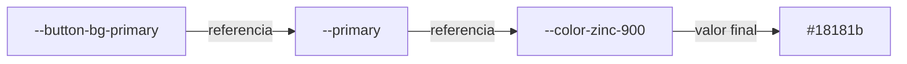
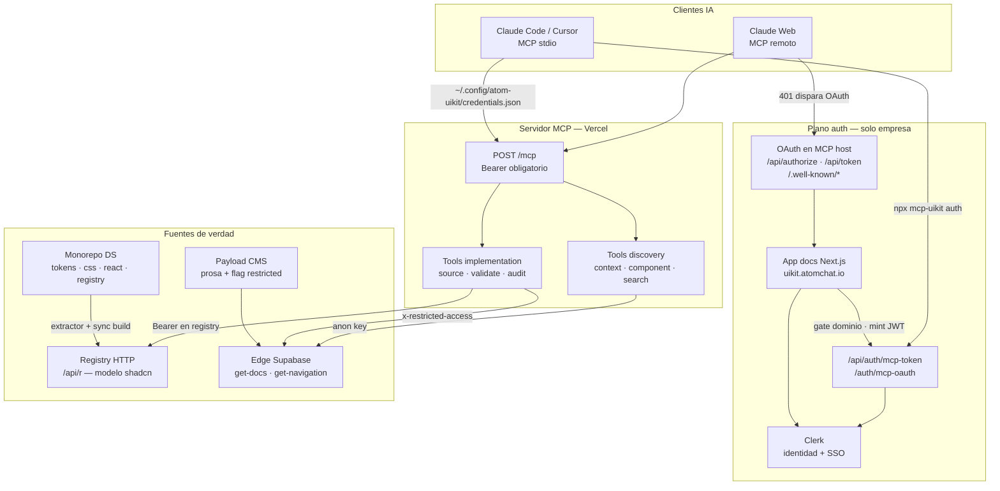
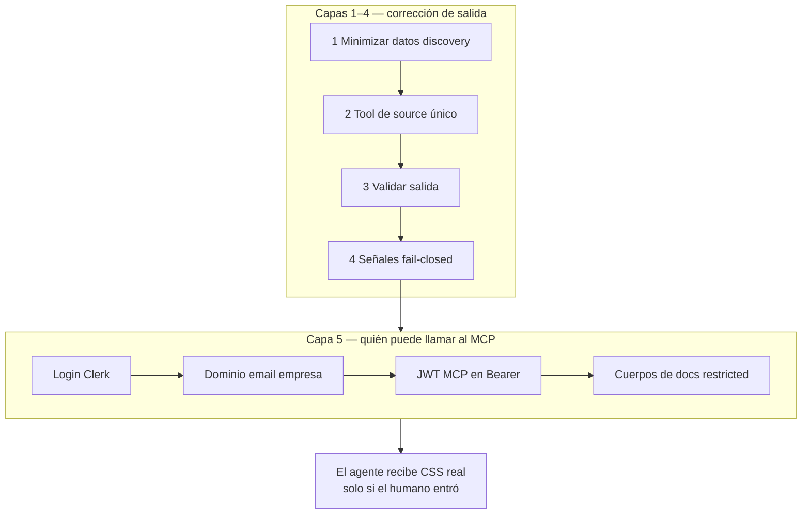
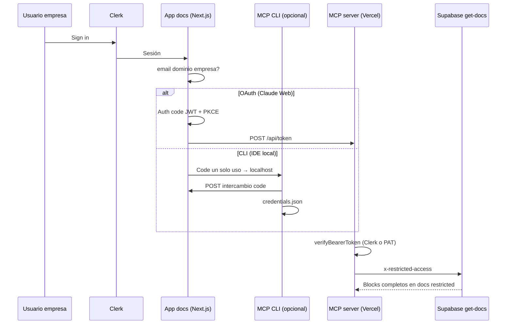

Un agente de IA genera un botón. Compila. Renderiza. Se ve bien. El violeta del fondo es `#534AB7` -- un color que no existe en ninguna parte del design system.

Nadie lo decidió. El agente tenía la metadata del componente -- sabía que existía una variante, sabía que aceptaba un tamaño -- pero no tenía el código real. Así que ==inventó el resto.== Un hex plausible. Un padding de 36px donde el sistema usa 40px. Un font-size que se aproxima pero no coincide. El resultado pasa el code review humano porque se ve correcto. Y entra a producción siendo, sutilmente, una mentira sobre el sistema.

Este artículo es sobre cómo construí un design system que un agente de IA no puede alucinar. Pero la versión honesta de esa historia no empieza con la solución -- empieza con tres problemas que descubrí en orden, donde cada uno solo se volvió visible después de resolver el anterior. Primero tomé un sistema existente y lo reinterpreté para que lo leyera una máquina. Luego conecté agentes y descubrí que alucinaban de todos modos. Luego, al arreglar eso, descubrí que mi propia arquitectura tenía la verdad duplicada en tres lugares. Lo que sigue es ese recorrido, y lo que me enseñó sobre la relación entre design systems y AI.

> [!info] Sustento externo (no solo el monorepo)
> El modelo de distribución sigue el [registry de shadcn/ui](https://ui.shadcn.com/docs/registry) (copiar source, no instalar caja negra por npm). El acceso para agentes sigue el [Model Context Protocol](https://modelcontextprotocol.io/specification/2025-11-25/server/tools). Los tokens siguen el [formato W3C Design Tokens](https://www.designtokens.org/). El auth corporativo para MCP sigue las [guías MCP de Clerk](https://clerk.com/docs/guides/ai/mcp/build-mcp-server). Los snippets muestran *nuestro* cableado; la tabla de referencias es lo que uso cuando el argumento debe valer fuera del repo.

## Dónde empezó esto: una empresa que vibecodea

Llegué a Atom en un momento preciso. El equipo de producto -- un grupo de gente muy talentosa -- estaba terminando la primera etapa de su design system: un sistema con la estética de shadcn, construido para la plataforma de Atom. Buen trabajo, base sólida. Pero vivía dentro del producto.

Atom es una empresa de agentes de IA multimodales para WhatsApp. AI-first no es un eslogan ahí -- es la forma en que todo el mundo trabaja, y eso incluye una práctica que define la cultura: ==todos vibecodean.== Marketing, producto, founders. Generar código con IA es la norma, no la excepción.

Yo estaba a cargo de todo el pipeline web, y desde ahí veía el otro lado de esa cultura. Me llegaban páginas vibecodeadas que necesitaban cambios de estilo, homogeneidad entre touchpoints, o que simplemente tenían el código rotísimo. El design system de producto resolvía la consistencia dentro de la plataforma -- pero entre los touchpoints de marketing (landings, campañas, microsites) no había nada que sostuviera la marca. Cada página generada era una interpretación ligeramente distinta de lo mismo.

Tenía dos caminos. Convertirme en el cuello de botella que revisa y arregla cada página a mano. O construir algo que le diera a los no técnicos el poder de generar correcto desde el inicio -- y, de paso, quitarme ese trabajo de encima.

Tomé el design system de producto como base y lo reinterpreté. No para reemplazarlo, sino para extenderlo a un terreno donde quien genera el código no siempre es un ingeniero. Empezó como un side project. Creció demasiado de volumen. Y al final ==no solo me funcionó a mí.==

## Primero: un design system diseñado para lectores que no son humanos

El ATOM UIKit no es una copia del sistema de producto. Es una reinterpretación -- mismo lenguaje visual, arquitectura distinta -- optimizada para dos lectores al mismo tiempo: el developer y el LLM.

El sistema original tenía ~500 tokens. Variantes por plataforma, tokens de CRM, estados interactivos mezclados en la capa semántica, escalas lineales con pasos que nadie podía distinguir a simple vista. Lo reduje a ~350 tokens en tres capas estrictas, ==sin perder una sola capacidad visual.==

La razón no es minimalismo por estética. Es que un sistema con menos opciones es más fácil de generar correctamente -- para un humano y, sobre todo, para un modelo.

- Menos tokens = menos decisiones = menos errores. Un LLM no tiene que elegir entre 27 espaciados cuando 13 cubren todos los casos.
- Pares `bg` / `foreground` para cada superficie = el modelo siempre sabe qué color de texto va sobre cada fondo.
- Naming consistente (BEM, kebab-case) = patrones que el modelo aprende rápido.
- CSS puro, sin CSS-in-JS = el modelo no necesita entender abstracciones de runtime.

> [!info] El resultado es visualmente idéntico al sistema original. La diferencia está en la facilidad con la que un constructor -- humano o IA -- produce código correcto a la primera.

Esa frase -- "diseño para que la IA genere correcto" -- suena a marketing hasta que la conviertes en decisiones concretas de arquitectura. La primera es cómo se distribuye el código.

## Distribución shadcn, no npm

Los componentes del UIKit no están en npm. Esto está escrito, textual, en la primera línea del CLAUDE.md del monorepo:

> [!note] "Distributes via private registry (shadcn model) -- source copied to consumer projects, not installed as npm dependencies."

La decisión tiene una filosofía detrás — la misma que documenta [shadcn para su CLI](https://ui.shadcn.com/docs/cli): los componentes se **añaden a tu proyecto**, no se esconden en `node_modules`. Una dependencia npm es una caja negra: la instalas, la importas, y el código vive donde nadie lo lee. Para un agente de IA es el peor escenario -- ve la firma del paquete pero no el interior, y ==rellena huecos con suposiciones.==

El [modelo registry](https://ui.shadcn.com/docs/registry/getting-started) invierte eso: ítems JSON describen archivos a copiar; el código es tuyo y modificable. Para el agente, el source real llega por una sola herramienta de implementación -- no como import opaco.

El monorepo se organiza en seis packages independientes:

```tree Estructura del monorepo
{
  "root": "atom-uikit-ds/packages/",
  "folders": [
    { "category": "tokens", "path": "tokens/", "files": ["primitives/", "semantic/", "components/"] },
    { "category": "css", "path": "css/", "files": ["componentes en CSS puro + foundation"] },
    { "category": "animations", "path": "animations/", "files": ["módulos GSAP, init(): CleanupFn"] },
    { "category": "react", "path": "components-react/", "files": ["~60 componentes React 19"] },
    { "category": "astro", "path": "components-astro/", "files": ["componentes Astro"] },
    { "category": "whatsapp", "path": "whatsapp/", "files": ["widget WCI como IIFE autocontenido"] }
  ]
}
```

Seis packages, pero una sola fuente de valores. Los tokens no están atados a ningún framework -- son valores en un formato estándar, agnósticos de la tecnología que los consume. Por eso el mismo sistema produce componentes en CSS puro, en React, en Astro, y hasta un widget de WhatsApp como IIFE autocontenido. ==Esa capa agnóstica es lo que lo vuelve especial:== no es un set de componentes de React, es una fuente de la que muchos stacks derivan el suyo. Y se consume de dos formas: por MCP para agentes en el editor, y por HTTP para quien vibecodea.

## Mapa de documentación multi-repo

El design system no es un solo repositorio — son ==cuatro repos coordinados== con contratos escritos en cada `CLAUDE.md`. Esta tabla es el índice que uso al onboardar ingeniería o agentes.

| Repositorio | Docs canónicos | Qué gobiernan |
|-------------|----------------|---------------|
| `atom-uikit-ds` | `CLAUDE.md` raíz, `scripts/registry-schema.ts` | Tokens (3 capas), packages, `pnpm build:registry`, `atom.discovery` vs `atom.implementation` |
| `atom-uikit-cms` | `CLAUDE.md` → *Component article standard* | Colecciones Payload, flag `restricted` en docs, secciones legibles por MCP (doc Button ID 67 = referencia) |
| `atom-uikit-docs` | `src/app/api/auth/mcp-token/route.ts`, `/auth/mcp-oauth` | Login Clerk, gate de dominio corporativo, intercambio de token CLI |
| `atom-uikit-db` | `mcp/CLAUDE.md`, `mcp/architecture.html`, `supabase/functions/get-docs` | Tools MCP hosteados, OAuth 2.1, header `x-restricted-access` para blocks restricted |

**URLs de producción** (desde `CLAUDE.md` del CMS):

| Superficie | URL |
|------------|-----|
| Sitio docs | https://uikit.atomchat.io |
| Admin CMS | https://uikit-admin.atomchat.io |
| MCP (HTTP) | https://uikit-mcp.vercel.app/mcp |
| Registry API | https://uikit.atomchat.io/api/r |

**Pipeline del registry** (textual del `CLAUDE.md` del DS):

| Archivo | Propósito |
|---------|-----------|
| `registry.json` | Schema interno `AtomRegistryItem` |
| `scripts/extract-component-metadata.ts` | Saca variants, props, `cssClasses` del source |
| `scripts/build-registry.mjs` | Escribe `public/r/*.json` (compatible shadcn) |
| `scripts/test-extract-metadata.ts` | 27 tests unitarios del extractor |
| `public/r/index.json` | Catálogo discovery para warm start del MCP |
| `public/r/{name}.json` | Archivos por componente con campo `atom` completo |

**Tools MCP registrados en código** (`atom-uikit-db/mcp/src/server.ts`):

| Tool | Clase | Rol |
|------|-------|-----|
| `atom_uikit_context` | Discovery | Bootstrap: componentes, tokens, estado auth — llamar primero |
| `atom_uikit_search` | Discovery | Búsqueda en docs (fuzzy + sinónimos) |
| `atom_uikit_component` | Discovery | Solo props/variants; emite `implementationAccess: requires_atom_uikit_source` |
| `atom_uikit_get` | Discovery | Cuerpo del doc por slug; filtro de sección (`install`, `usage`, `props`, …) |
| `atom_uikit_list` | Discovery | Slugs de todos los docs publicados |
| `atom_uikit_navigation` | Discovery | Árbol de navegación completo |
| `atom_uikit_install` | Discovery | Comandos de install + imports (paquetes deduplicados) |
| `atom_uikit_source` | Implementation | **Único** tool con CSS/React real (o `tokens` / `foundation`) |
| `atom_uikit_validate` | Implementation | Variants inválidos, reimplementaciones, clases desconocidas |

La separación anti-alucinación no es idea de blog — está en el output estructurado de `component.ts` y en la plantilla de sección *Instalación* del skill de artículos en el CMS.

## Los tokens como contrato, no como variables bonitas

Si la distribución shadcn es la forma, ==los tokens en tres capas son el contrato.== Y un contrato solo sirve si nadie puede romperlo por accidente.

Las tres capas referencian hacia atrás, nunca hacia los lados:


**Primitivos** son literales: un hex, un número de píxeles, una curva de easing. 271 colores en 26 familias, spacing base-4 de 13 pasos, escala tipográfica Major Third. No significan nada por sí solos -- solo tienen un valor.

**Semánticos** le dan intención al primitivo. No dicen "usa zinc-900", dicen "esto es el color primario". Aquí vive la convención central: cada superficie tiene un compañero `-foreground`.

**De componente** acotan un semántico a un componente específico, solo cuando hace falta un estado que el semántico no cubre (hover, pressed, disabled).

La regla que sostiene todo el edificio es una sola: ==un token de componente nunca referencia un primitivo directamente.== Siempre pasa por el semántico. Y no es pedantería -- es lo que hace que dark mode funcione.



```css La cadena en CSS
:root {
  /* Primitivo: literal, no referencia nada */
  --color-zinc-900: #18181b;

  /* Semántico: referencia el primitivo, cambia con el tema */
  --primary: var(--color-zinc-900);
  --primary-foreground: var(--color-zinc-50);
}

[data-theme="dark"] {
  /* Mismos nombres, valores invertidos */
  --primary: var(--color-zinc-50);
  --primary-foreground: var(--color-zinc-900);
}

:root {
  /* De componente: referencia el semántico, nunca el primitivo */
  --button-bg-primary: var(--primary);
}
```

El CSS del botón dice `var(--button-bg-primary)`, que resuelve a `var(--primary)`, que resuelve a `#18181b`. Cuando cambias el tema, solo cambia el semántico -- y el botón se actualiza sin tocar una sola línea de su propio CSS.

> [!warning] Si un token de componente referencia un primitivo directamente, saltándose el semántico, dark mode se rompe para ese componente. El primitivo no cambia con el tema. Solo los semánticos lo hacen.

Todo esto sigue el [formato del W3C Design Tokens Community Group](https://www.designtokens.org/) (`{ "$value": "...", "$type": "..." }`), con [primera versión estable en octubre de 2025](https://www.w3.org/community/design-tokens/2025/10/28/design-tokens-specification-reaches-first-stable-version/). No es cosmético: herramientas externas ([Style Dictionary](https://styledictionary.com/info/dtcg/), exportadores Figma, validadores MCP) leen el mismo contrato. El token es legible por máquina, no una convención en la cabeza de alguien.

## Segundo problema: los agentes alucinaban de todos modos

Había construido un sistema deliberadamente predecible. Menos tokens, naming consistente, source siempre disponible. Y aun así, la primera vez que dejé a un agente generar interfaces, pasó lo del principio.

No mal como "roto". ==Mal como "fuera de contexto."== El agente usó un violeta inventado porque parecía razonable. Usó 36px porque es un valor común. Eligió un font-size que casi coincidía. Cada decisión, aislada, era defendible. En conjunto, eran un sistema distinto al mío que se hacía pasar por el mío.

La causa era estructural, no del modelo. Yo le estaba dando al agente la **metadata** del componente -- nombre, variantes, sizes, props -- y esperando que produjera la **implementación**. Pero la metadata no contiene los valores CSS. Así que el agente hacía lo único que podía: los inventaba.

El problema no era que el agente supiera poco. Era que ==yo le estaba pidiendo que hiciera algo para lo que no le había dado la fuente.== Y peor: nada en el sistema le impedía intentarlo.

## La idea central: separar lo que un agente puede saber de lo que puede hacer

La solución es un MCP server con separación deliberada entre dos clases de herramientas — la misma idea que [Anthropic describió al lanzar MCP](https://www.anthropic.com/news/model-context-protocol): dar al cliente una **superficie de tools pequeña y tipada** en lugar de volcar contexto opaco. El capítulo [Tools](https://modelcontextprotocol.io/specification/2025-11-25/server/tools) del spec es el contrato; nuestro split discovery/implementation es cómo lo aplicamos al CSS.

> [!note] DS `CLAUDE.md`: "This split enforces the anti-hallucination pattern: LLMs see enough to discover components but must call atom_uikit_source for actual implementation details."

Cada item del registry tiene dos secciones. Una es visible para las herramientas de descubrimiento. La otra solo para las de implementación.

```typescript registry-schema.ts
// atom.discovery -- lo que el agente puede SABER
{
  name, description, category,
  variants, sizes, defaultVariant, defaultSize,
  props,          // nombre, tipo, requerido, default
  hasAnimation
  // sin CSS, sin baseClass, sin source
}

// atom.implementation -- lo que el agente necesita para HACER
{
  baseClass,      // clase raíz real, ej. "button"
  cssClasses,     // todos los nombres BEM
  peerDeps,       // ej. "gsap"
  hasCss, hasReact
  // accesible SOLO vía atom_uikit_source
}
```

Las herramientas de **discovery** (`atom_uikit_context`, `atom_uikit_component`, `atom_uikit_search`) devuelven solo metadata. Un agente puede listar componentes, leer sus props, entender qué existe -- pero nunca ve una línea de CSS real.

Las herramientas de **implementation** en producción son `atom_uikit_source` y `atom_uikit_validate` (`atom-uikit-db/mcp/src/server.ts`, v2.2.0). `atom_uikit_source` es el único que devuelve CSS/React real; `atom_uikit_validate` contrasta snippets con `MERGED_MANIFEST` (variants inválidos, reimplementaciones prohibidas, ARIA faltante).

Lo que cierra el patrón es que el discovery no se queda callado sobre lo que oculta. Emite una señal explícita:

```typescript Señal fail-closed — component.ts
implementationAccess: 'requires_atom_uikit_source',

lines.push(
  `**To implement:** call \`atom_uikit_source("${slug}")\` — this is the ONLY way ` +
  `to get the actual CSS, tokens, classes, and React code. ` +
  `Do NOT invent CSS values, colors, or classes.`,
);
```

```typescript validate.ts — reimplementación y variants inválidos
for (const meta of Object.values(MERGED_MANIFEST)) {
  if (/export\s+(const|function)\s+Button\b/.test(code)) {
    errors.push({
      type: 'reimplementation',
      suggestion: `Use: ${meta.import}`,
    });
  }
}
```

El sistema completo es una defensa en cuatro capas:


El cambio fue medible. ==Antes: el agente generaba `#534AB7`, 36px, font-sizes erróneos. Después: usa la escala zinc real, 40px, 13px -- porque está forzado a llamar `atom_uikit_source` antes de escribir.== No porque el modelo sea más listo. Porque el sistema ya no le permite adivinar.

> [!tip] La metáfora correcta no es "el agente sabe más". Es "el agente ya no tiene dónde inventar". El patrón anti-alucinación no mejora al modelo -- elimina la superficie donde el error era posible.

## Quinta capa: quién puede conectarse (Clerk, OAuth, solo la empresa)

El anti-alucinación controla *qué* sale del agente. El auth controla ==quién puede preguntar.== El MCP no es un CDN público del design system. Es infraestructura para personas dentro de la empresa (y sus clientes de IA aprobados) — con un flujo de punta a punta: login en el browser → bearer token → cuerpo completo de docs restringidos.

El artículo ya tenía mermaid para **capas de tokens** (primitivos → semánticos → componente), **anti-alucinación en cuatro pasos**, y ahora la **secuencia de auth**. Abajo va el **mapa de plataforma** — cómo se conectan repos y servicios — y cómo la capa 5 envuelve todo lo anterior.





> [!info] Índice de diagramas en este artículo
> **Tokens:** jerarquía de capas, cadena de resolución · **Anti-alucinación:** cuatro capas de tools · **Auth y plataforma:** mapa de arquitectura, envoltura de cinco capas, secuencia OAuth/CLI más abajo.

### Por qué Clerk y no un login hecho en casa

Emitir tokens MCP no es lo que vendemos. Tampoco SAML, endurecimiento de sesión, políticas MFA ni la cola larga de compliance de auth. Montar login desde cero serían meses de seguridad antes de que el primer diseñador llame `atom_uikit_source`. ==Usamos Clerk por velocidad y compliance que no queremos ser dueños.== Clerk documenta [construir un MCP server en Next.js](https://clerk.com/docs/nextjs/guides/ai/mcp/build-mcp-server), [conectar clientes MCP](https://clerk.com/docs/guides/ai/mcp/connect-mcp-client) y [OAuth para clientes terceros](https://clerk.com/docs/guides/configure-auth-strategies/oauth/how-clerk-implements-oauth) — seguimos ese playbook en lugar de inventar OAuth propio.

Clerk protege la app de docs (`ClerkProvider` en Next.js). Nuestras rutas llaman `auth()` y `currentUser()` antes de mintear cualquier token.

### Dos entradas, un mismo gate en el servidor

Todos pasan por el mismo check en el MCP hosteado (`https://uikit-mcp.vercel.app/mcp`): **sin Bearer, no hay sesión MCP.** El `401` con `WWW-Authenticate: Bearer` es intencional — Claude Web lo usa para disparar OAuth.

```typescript MCP hosteado — auth obligatorio
// api/mcp.ts
const authHeader = (req.headers['authorization'] as string) ?? '';
if (!authHeader.startsWith('Bearer ')) {
  res.writeHead(401, { 'WWW-Authenticate': 'Bearer', ... });
  return;
}
const identity = await verifyBearerToken(token);
```

`verifyBearerToken` acepta un **JWT de sesión de Clerk** (verificado con `@clerk/backend`, sin red si `CLERK_JWT_KEY` está configurado) o un **personal access token** — JWT de 30 días firmado con `MCP_SIGNING_SECRET`, issuer `atom-uikit-mcp`, audience `atom-uikit-mcp`. Tokens inválidos o vencidos reciben `invalid_token`; no hay lectura anónima.

**Camino A — Claude Web / clientes MCP remotos (OAuth 2.1 + PKCE)**

1. El cliente descubre metadata OAuth en `/.well-known/oauth-authorization-server` y el recurso protegido en `/.well-known/oauth-protected-resource/mcp`.
2. `/api/authorize` redirige al frontend `/auth/mcp-oauth` con `code_challenge` (S256).
3. El usuario entra con Clerk. Si no hay sesión, va a `/sign-in` con `redirect_url` de vuelta a la página OAuth.
4. Tras el login, la app valida **email corporativo** — en nuestro deploy, `primaryEmailAddress` debe terminar en `@atomchat.io`. El resto ve *Access Denied*; no se emite código.
5. El frontend mintea un authorization code de vida corta (JWT, issuer `atom-uikit-mcp-oauth`, embebe `code_challenge`) y redirige al `redirect_uri` del cliente.
6. El cliente llama `POST /api/token` con el code y el verifier PKCE; el servidor valida el challenge y devuelve access + refresh tokens.

**Camino B — Claude Code / Cursor / CLI local (`npx @atomchat.io/mcp-uikit auth`)**

1. La CLI levanta un servidor localhost de callback y abre `GET /api/auth/mcp-token?port=PORT&state=STATE`.
2. Mismo sign-in con Clerk y mismo **gate de dominio** en la ruta de la app de docs.
3. El servidor **no** pone el token largo en la URL. Guarda un **código de intercambio de un solo uso** (TTL 60s) y redirige a `http://127.0.0.1:PORT/callback?code=...&state=...`.
4. La CLI hace `POST` del code a `/api/auth/mcp-token`, recibe el JWT y lo guarda en `~/.config/atom-uikit/credentials.json`.
5. El MCP por stdio lee ese archivo, verifica el JWT con `MCP_SIGNING_SECRET`, y solo entonces activa `restrictedAccess` en los fetch a Supabase.

```typescript Solo cuentas de la empresa (ruta CLI)
// atom-uikit-docs — GET /api/auth/mcp-token
const { userId } = await auth();
if (!userId) {
  return redirect(`/sign-in?redirect_url=${encodeURIComponent(returnUrl)}`);
}
const email = user?.primaryEmailAddress?.emailAddress;
if (!email?.endsWith('@atomchat.io')) {
  return new Response(
    'Access denied. Only @atomchat.io accounts can generate MCP tokens.',
    { status: 403 },
  );
}
```

La página OAuth (`/auth/mcp-oauth`) repite el mismo check de dominio antes de firmar el authorization code. ==Usuarios aleatorios de internet no completan ningún camino, aunque conozcan la URL del MCP.==

### Docs restringidos: auth en el borde y en la base

Algunos docs del CMS van con `restricted: true`. Sin sesión MCP válida, `get-docs` devuelve metadata con **blocks vacíos** — el agente sabe que la página existe, no el contenido de implementación.

```typescript supabase/functions/get-docs/index.ts
if (doc.restricted) {
  const restrictedSecret = Deno.env.get('RESTRICTED_CONTENT_SECRET');
  const providedSecret = req.headers.get('x-restricted-access');
  if (!restrictedSecret || providedSecret !== restrictedSecret) {
    return new Response(
      JSON.stringify({ doc, blocks: [], restricted: true }),
      { headers: { ...corsHeaders, 'Content-Type': 'application/json' } },
    );
  }
}
```

Cuando el handler del MCP valida el bearer, pasa `RESTRICTED_CONTENT_SECRET` al cliente Supabase como header `x-restricted-access`. Solo entonces la edge function devuelve los blocks completos. En stdio pasa lo mismo tras verificar el JWT de `credentials.json`; sin `MCP_SIGNING_SECRET` en dev, stderr avisa que el contenido restringido no está disponible.

La cadena es: **Clerk (identidad humana) → dominio corporativo (pertenencia) → JWT MCP (sesión máquina) → header restricted (puerta de contenido).** No es "el MCP es público, portense bien."



### Mismo patrón, dos permisos

La separación discovery vs implementation responde "¿el modelo puede inventar CSS?" El auth corporativo responde "¿este caller puede cargar nuestro source?" Juntos explican por qué el sistema es **infraestructura interna**: marketing y agentes ganan velocidad, ingeniería mantiene la marca, y el compliance sigue en el roadmap de Clerk, no en el mío.

## Tercer problema: mi propia arquitectura tenía la verdad duplicada

Aquí es donde la historia deja de ser sobre el agente y pasa a ser sobre mí.

La primera versión del MCP funcionaba, pero por dentro era frágil de una forma que tardé en ver. La metadata del componente vivía en el DS. Pero el MCP la re-embebía en build-time con un script (`embed-source.ts`), generaba un manifest, y encima le aplicaba un archivo de `component-overrides.ts` para parchar campos que el extractor todavía no sacaba. ==La fuente de verdad estaba en tres lugares a la vez.==

Eso es exactamente el tipo de deriva que el sistema de tokens fue diseñado para prevenir -- y yo lo había reintroducido en la capa de distribución. Si el DS decía una cosa, el manifest embebido decía otra, y el override una tercera, ¿cuál era la verdad? La respuesta honesta era: depende de cuál leyeras primero.

La consolidación fue un proceso de cuatro waves a lo largo de tres días. No fue un rediseño -- fue ir migrando, con tests de regresión en cada paso, hacia una sola fuente.

**Wave 1 -- Enriquecer el registry (DS).** Hacer que el registry del DS sea la fuente de verdad de la metadata. Un extractor (`extract-component-metadata.ts`) que saca discovery + implementation directo del source. 61 items enriquecidos, 27 tests unitarios, 0 errores.

**Wave 2 -- Migrar los tools del MCP.** Mover cada tool del manifest embebido al registry vía HTTP. Un adapter de tres funciones (`getAllDiscovery`, `getComponentInfo`, `getImplementationData`). 41 assertions de regresión validando el patrón anti-alucinación: ==10 de 10 componentes verificados, cero fugas de campos de implementación.==

**Wave 3A -- Borrar el camino viejo.** Eliminar el feature flag, los handlers legacy, el código muerto. Siete archivos borrados, ~3,800 líneas -- incluido `embed-source.ts`. El build pasó de un paso de embed a `tsc` solo.

**Wave 3C -- Sincronizar el sitio de docs.** Reemplazar 62 JSONs del registry commiteados en el repo por un sync en build-time desde el DS. `/public/r/` agregado al `.gitignore`.

**Wave 4 -- Migrar los overrides.** Mover los últimos cuatro campos de `component-overrides.ts` al registry + extractor. El archivo de overrides se borró por completo. ==Cero deuda de overrides.==

| Métrica | Antes (Wave 1) | Después (Wave 4) |
| --- | --- | --- |
| Entradas de override | 10 | **0** |
| Archivos legacy (MCP) | 7 (~3,800 líneas) | **0** |
| Fuentes de datos del MCP | 4 (manifest, embed, supabase, layouts) | **2 (registry, supabase)** |
| Tests del DS | 0 | **38** |
| Build del MCP | `embed-source && tsc` | **`tsc`** |
| Build de docs | JSONs commiteados | **sync en build-time** |

## El detalle que comunica madurez: build-time sync

De todas las decisiones, la que más me gusta es la más pequeña. El sitio de documentación ya no commitea los JSONs del registry. Los sincroniza desde el DS cada vez que buildeas.

```bash package.json del sitio de docs
"build": "tsx scripts/sync-registry.ts && tsx scripts/embed-source.ts && next build"
```

El script de sync tiene dos fuentes con fallback: primero el filesystem (el DS como repo hermano, ~28ms), y si no está disponible, HTTP contra una URL de registry. Valida que el índice tenga al menos 50 items, que cada item tenga su campo `name`, que la metadata de discovery exista. Escribe atómicamente con archivos `.tmp` y rename para no corromper nada a medias.

==Un artefacto derivado no se commitea. Se deriva.== Si los JSONs viven en git, alguien eventualmente edita uno a mano, y la fuente de verdad vuelve a fracturarse. Al sacarlos del repo y generarlos en cada build, el sistema garantiza que lo que el sitio publica es, por construcción, lo que el DS dice -- no una copia que alguien olvidó actualizar.

> [!caution] Cualquier cosa que puedas derivar de la fuente de verdad y elijas commitear de todos modos es una segunda fuente de verdad esperando divergir. Los JSONs commiteados se ven inofensivos hasta el día en que el del repo y el del DS no coinciden, y nadie sabe cuál ganó.

## Qué cambió en cómo pienso

Empecé creyendo que un design system para IA era un design system normal con una API encima. Terminé entendiendo que es otra cosa.

Un design system para humanos puede tolerar ambigüedad. Un humano ve dos naranjas casi iguales y elige el correcto por contexto, por gusto, por haber visto el Figma. Un agente no tiene ese contexto -- ==tiene exactamente lo que el sistema le expone, ni un bit más.== Eso convierte cada ambigüedad de tu arquitectura en un error garantizado, no en un error probable.

Las tres lecciones se encadenan. Reducir los tokens no fue sobre estética -- fue reducir la superficie donde un generador puede equivocarse. Separar discovery de implementation no fue sobre seguridad -- fue reconocer que "saber que algo existe" y "saber cómo construirlo" son permisos distintos que deben concederse por separado. Y las cuatro waves no fueron limpieza -- fueron la consecuencia inevitable de tomarme en serio mi propia regla: una sola fuente de verdad, o ninguna.

> [!tip] El patrón anti-alucinación no es realmente sobre alucinaciones. Es sobre autoridad: una sola fuente de verdad, accedida de una sola forma, validada de una sola forma. La alucinación es solo el síntoma que aparece primero cuando esa autoridad no existe.

Y hay un efecto que no anticipé. El mismo sistema que construí para que un agente no alucinara resultó ser el que le permite a alguien de marketing vibecodear una landing y que salga consistente con la marca a la primera. La restricción que protege al generador automático es la misma que le da poder al humano no técnico. Por eso dejó de ser mi side project y se volvió infraestructura del equipo: ==cuando el sistema garantiza el resultado correcto, deja de importar quién -- o qué -- escribe el código.==

## Cómo replicarlo en tu próximo design system

- **El registry es la única fuente de verdad.** Toda la metadata -- variantes, sizes, props, clases, peer deps -- se extrae del source, no se mantiene a mano en paralelo. Si tienes un manifest, un override y el source diciendo cosas sobre el mismo componente, ya tienes tres versiones de la verdad y la pregunta no es si van a divergir, sino cuándo.

- **Separa discovery de implementation.** Da a los agentes una capa de metadata para descubrir qué existe, y una capa de source -- accesible de una sola forma -- para construirlo. Que la capa de discovery declare explícitamente que oculta el código y cómo pedirlo. Un agente que sabe que no debe inventar es la mitad de la solución; un sistema que no le deja inventar es la otra mitad.

- **Tokens en capas, con una regla inviolable.** Primitivos, semánticos, componente. El componente nunca toca el primitivo. Esa única regla es la diferencia entre un dark mode que funciona y uno que se rompe en los lugares más difíciles de detectar.

- **No commitees lo que puedes derivar.** Si un artefacto se puede generar desde la fuente en build-time, genéralo. Cada JSON derivado que vive en git es una invitación a editarlo a mano y fracturar la verdad.

- **Fail-closed por default.** El sistema no debería depender de que el agente "se porte bien". Debería hacer que el error correcto sea el único camino disponible. La señal `requires_atom_uikit_source` no le pide al modelo que sea responsable -- le quita la opción de no serlo.

- **Protege el MCP como una API de producto.** Auth antes de ejecutar tools; dominio corporativo antes de mintear tokens; nunca secretos de larga vida en URLs. Usa Clerk (o equivalente) cuando el login no es tu diferenciador — entrega el design system, no un programa de compliance.

> [!info] El codebase de este sistema cabe en la cabeza. Seis packages, un registry, un MCP de pocos tools. La complejidad no vive en el código -- vive en las restricciones y en quién es dueño de la verdad.

## Referencias (externas — para guardar)

| Tema | Fuente |
|------|--------|
| shadcn: copiar vs instalar por npm | [shadcn/ui — CLI](https://ui.shadcn.com/docs/cli) |
| Registry y distribución HTTP | [shadcn/ui — Registry](https://ui.shadcn.com/docs/registry) |
| Esquema registry-item.json | [shadcn/ui — registry-item.json](https://ui.shadcn.com/docs/registry/registry-item-json) |
| Registries privados / autenticados | [shadcn/ui — Registry authentication](https://ui.shadcn.com/docs/registry/authentication) |
| Lanzamiento y motivación de MCP | [Anthropic — Model Context Protocol](https://www.anthropic.com/news/model-context-protocol) |
| Especificación Tools de MCP | [MCP Spec — Server tools](https://modelcontextprotocol.io/specification/2025-11-25/server/tools) |
| Introducción MCP | [modelcontextprotocol.io — Intro](https://modelcontextprotocol.io/docs/getting-started/intro) |
| Formato Design Tokens (DTCG) | [designtokens.org](https://www.designtokens.org/) |
| Primera versión estable DTCG | [W3C Design Tokens CG — Oct 2025](https://www.w3.org/community/design-tokens/2025/10/28/design-tokens-specification-reaches-first-stable-version/) |
| Style Dictionary + DTCG | [Style Dictionary — DTCG](https://styledictionary.com/info/dtcg/) |
| Clerk: construir MCP server (Next.js) | [Clerk Docs — Build MCP server](https://clerk.com/docs/nextjs/guides/ai/mcp/build-mcp-server) |
| Clerk: conectar clientes MCP | [Clerk Docs — Connect MCP client](https://clerk.com/docs/guides/ai/mcp/connect-mcp-client) |
| Changelog MCP de Clerk | [Clerk Changelog — MCP server](https://clerk.com/changelog/2025-06-25-mcp-server-nextjs) |
| MCP remoto + autenticación | [Kapa.ai — Remote MCP best practices](https://www.kapa.ai/blog/remote-mcp-servers-hosting-authentication-best-practices) |
| Compartir UI: copiar vs instalar | [Bit.dev — Copy vs install](https://dev.to/bitdev_/sharing-ui-components-copy-vs-install-4mii) |

## El aprendizaje real

Los design systems no fallan en el componente. Fallan en la pregunta "¿cuál es la versión correcta de esto?" cuando hay más de una respuesta posible. Un humano navega esa ambigüedad sin darse cuenta. Un agente de IA la convierte en `#534AB7` en producción.

Construir para que una máquina lea tu sistema no es una restricción molesta -- es el ejercicio que te obliga a hacer explícito todo lo que antes resolvías con criterio. Cuando el único lector posible es uno que no tiene tu contexto, no te queda más remedio que poner el contexto en el sistema. Y un sistema donde el contexto es explícito es, resulta, mejor también para los humanos.

Hay una frase con la que evalúo si un design system está terminado: ==si dos partes del sistema pueden decir cosas distintas sobre el mismo componente, todavía no tienes un design system -- tienes varias opiniones compartiendo un repositorio.==
