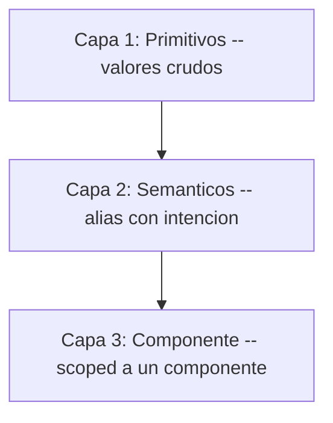
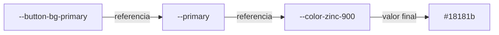
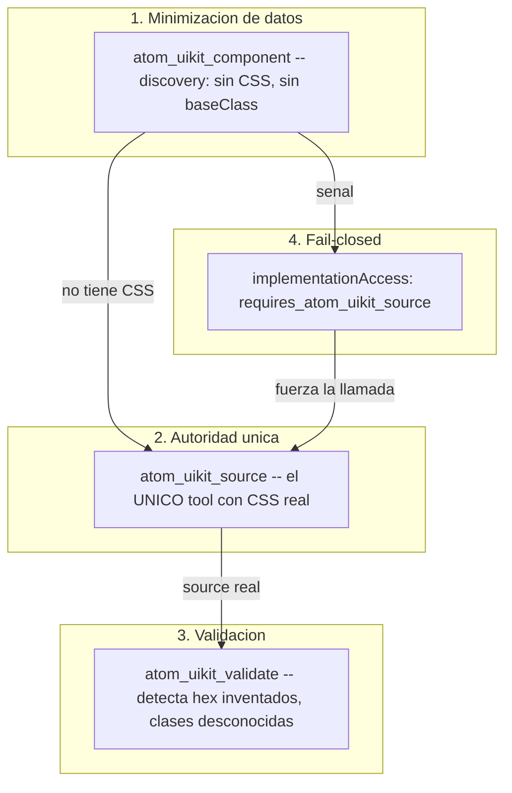

Un agente de IA genera un boton. Compila. Renderiza. Se ve bien. El violeta del fondo es `#534AB7` -- un color que no existe en ninguna parte del design system.

Nadie lo decidio. El agente tenia la metadata del componente -- sabia que existia una variante, sabia que aceptaba un tamano -- pero no tenia el codigo real. Asi que ==invento el resto.== Un hex plausible. Un padding de 36px donde el sistema usa 40px. Un font-size que se aproxima pero no coincide. El resultado pasa el code review humano porque se ve correcto. Y entra a produccion siendo, sutilmente, una mentira sobre el sistema.

Este articulo es sobre como construi un design system que un agente de IA no puede alucinar. Pero la version honesta de esa historia no empieza con la solucion -- empieza con tres problemas que descubri en orden, donde cada uno solo se volvio visible despues de resolver el anterior. Primero tome un sistema existente y lo reinterprete para que lo leyera una maquina. Luego conecte agentes y descubri que alucinaban de todos modos. Luego, al arreglar eso, descubri que mi propia arquitectura tenia la verdad duplicada en tres lugares. Lo que sigue es ese recorrido, y lo que me ensenio sobre la relacion entre design systems y AI.

## Donde empezo esto: una empresa que vibecodea

Llegue a Atom en un momento preciso. El equipo de producto -- un grupo de gente muy talentosa -- estaba terminando la primera etapa de su design system: un sistema con la estetica de shadcn, construido para la plataforma de Atom. Buen trabajo, base solida. Pero vivia dentro del producto.

Atom es una empresa de agentes de IA multimodales para WhatsApp. AI-first no es un eslogan ahi -- es la forma en que todo el mundo trabaja, y eso incluye una practica que define la cultura: ==todos vibecodean.== Marketing, producto, founders. Generar codigo con IA es la norma, no la excepcion.

Yo estaba a cargo de todo el pipeline web, y desde ahi veia el otro lado de esa cultura. Me llegaban paginas vibecodeadas que necesitaban cambios de estilo, homogeneidad entre touchpoints, o que simplemente tenian el codigo rotisimo. El design system de producto resolvia la consistencia dentro de la plataforma -- pero entre los touchpoints de marketing (landings, campanas, microsites) no habia nada que sostuviera la marca. Cada pagina generada era una interpretacion ligeramente distinta de lo mismo.

Tenia dos caminos. Convertirme en el cuello de botella que revisa y arregla cada pagina a mano. O construir algo que le diera a los no tecnicos el poder de generar correcto desde el inicio -- y, de paso, quitarme ese trabajo de encima.

Tome el design system de producto como base y lo reinterprete. No para reemplazarlo, sino para extenderlo a un terreno donde quien genera el codigo no siempre es un ingeniero. Empezo como un side project. Crecio demasiado de volumen. Y al final ==no solo me funciono a mi.==

## Primero: un design system disenado para lectores que no son humanos

El ATOM UIKit no es una copia del sistema de producto. Es una reinterpretacion -- mismo lenguaje visual, arquitectura distinta -- optimizada para dos lectores al mismo tiempo: el developer y el LLM.

El sistema original tenia ~500 tokens. Variantes por plataforma, tokens de CRM, estados interactivos mezclados en la capa semantica, escalas lineales con pasos que nadie podia distinguir a simple vista. Lo reduje a ~350 tokens en tres capas estrictas, ==sin perder una sola capacidad visual.==

La razon no es minimalismo por estetica. Es que un sistema con menos opciones es mas facil de generar correctamente -- para un humano y, sobre todo, para un modelo.

- Menos tokens = menos decisiones = menos errores. Un LLM no tiene que elegir entre 27 espaciados cuando 13 cubren todos los casos.
- Pares `bg` / `foreground` para cada superficie = el modelo siempre sabe que color de texto va sobre cada fondo.
- Naming consistente (BEM, kebab-case) = patrones que el modelo aprende rapido.
- CSS puro, sin CSS-in-JS = el modelo no necesita entender abstracciones de runtime.

> [!info] El resultado es visualmente identico al sistema original. La diferencia esta en la facilidad con la que un constructor -- humano o IA -- produce codigo correcto a la primera.

Esa frase -- "diseno para que la IA genere correcto" -- suena a marketing hasta que la conviertes en decisiones concretas de arquitectura. La primera es como se distribuye el codigo.

## Distribucion shadcn, no npm

Los componentes del UIKit no estan en npm. Esto esta escrito, textual, en la primera linea del CLAUDE.md del monorepo:

> [!note] "Distributes via private registry (shadcn model) -- source copied to consumer projects, not installed as npm dependencies."

La decision tiene una filosofia detras. Una dependencia npm es una caja negra: la instalas, la importas, y el codigo vive en `node_modules` donde nadie lo lee ni lo modifica. Para un agente de IA, una caja negra es exactamente el peor escenario -- puede ver la firma del paquete pero no su interior, asi que ==rellena los huecos con suposiciones.==

El modelo shadcn invierte eso. El source se copia al proyecto del consumidor. El codigo es tuyo, esta a la vista, es modificable. Y para un agente significa que el source real esta siempre disponible -- no como un import opaco, sino como archivos que puede leer antes de escribir.

El monorepo se organiza en seis packages independientes:

```tree Estructura del monorepo
{
  "root": "atom-uikit-ds/packages/",
  "folders": [
    { "category": "tokens", "path": "tokens/", "files": ["primitives/", "semantic/", "components/"] },
    { "category": "css", "path": "css/", "files": ["componentes en CSS puro + foundation"] },
    { "category": "animations", "path": "animations/", "files": ["modulos GSAP, init(): CleanupFn"] },
    { "category": "react", "path": "components-react/", "files": ["~60 componentes React 19"] },
    { "category": "astro", "path": "components-astro/", "files": ["componentes Astro"] },
    { "category": "whatsapp", "path": "whatsapp/", "files": ["widget WCI como IIFE autocontenido"] }
  ]
}
```

Seis packages, pero una sola fuente de valores. Los tokens no estan atados a ningun framework -- son valores en un formato estandar, agnosticos de la tecnologia que los consume. Por eso el mismo sistema produce componentes en CSS puro, en React, en Astro, y hasta un widget de WhatsApp como IIFE autocontenido. ==Esa capa agnostica es lo que lo vuelve especial:== no es un set de componentes de React, es una fuente de la que muchos stacks derivan el suyo. Y se consume de dos formas pensadas para como Atom realmente trabaja: por MCP para los agentes dentro del editor, y por HTTP para cualquiera que este vibecodeando.

## Los tokens como contrato, no como variables bonitas

Si la distribucion shadcn es la forma, ==los tokens en tres capas son el contrato.== Y un contrato solo sirve si nadie puede romperlo por accidente.

Las tres capas referencian hacia atras, nunca hacia los lados:



**Primitivos** son literales: un hex, un numero de pixeles, una curva de easing. 271 colores en 26 familias, spacing base-4 de 13 pasos, escala tipografica Major Third. No significan nada por si solos -- solo tienen un valor.

**Semanticos** le dan intencion al primitivo. No dicen "usa zinc-900", dicen "esto es el color primario". Aqui vive la convencion central: cada superficie tiene un companero `-foreground`.

**De componente** acotan un semantico a un componente especifico, solo cuando hace falta un estado que el semantico no cubre (hover, pressed, disabled).

La regla que sostiene todo el edificio es una sola: ==un token de componente nunca referencia un primitivo directamente.== Siempre pasa por el semantico. Y no es pedanteria -- es lo que hace que dark mode funcione.



```css La cadena en CSS
:root {
  /* Primitivo: literal, no referencia nada */
  --color-zinc-900: #18181b;

  /* Semantico: referencia el primitivo, cambia con el tema */
  --primary: var(--color-zinc-900);
  --primary-foreground: var(--color-zinc-50);
}

[data-theme="dark"] {
  /* Mismos nombres, valores invertidos */
  --primary: var(--color-zinc-50);
  --primary-foreground: var(--color-zinc-900);
}

:root {
  /* De componente: referencia el semantico, nunca el primitivo */
  --button-bg-primary: var(--primary);
}
```

El CSS del boton dice `var(--button-bg-primary)`, que resuelve a `var(--primary)`, que resuelve a `#18181b`. Cuando cambias el tema, solo cambia el semantico -- y el boton se actualiza sin tocar una sola linea de su propio CSS.

> [!warning] Si un token de componente referencia un primitivo directamente, saltandose el semantico, dark mode se rompe para ese componente. El primitivo no cambia con el tema. Solo los semanticos lo hacen.

Todo esto sigue el formato W3C DTCG (`{ "$value": "...", "$type": "..." }`), que no es un detalle cosmetico: es un formato estandar que herramientas externas pueden leer. El token es un contrato legible por maquina, no una convencion que vive en la cabeza de alguien.

## Segundo problema: los agentes alucinaban de todos modos

Habia construido un sistema deliberadamente predecible. Menos tokens, naming consistente, source siempre disponible. Y aun asi, la primera vez que deje a un agente generar interfaces, paso lo del principio.

No mal como "roto". ==Mal como "fuera de contexto."== El agente uso un violeta inventado porque parecia razonable. Uso 36px porque es un valor comun. Eligio un font-size que casi coincidia. Cada decision, aislada, era defendible. En conjunto, eran un sistema distinto al mio que se hacia pasar por el mio.

La causa era estructural, no del modelo. Yo le estaba dando al agente la **metadata** del componente -- nombre, variantes, sizes, props -- y esperando que produjera la **implementacion**. Pero la metadata no contiene los valores CSS. Asi que el agente hacia lo unico que podia: los inventaba.

El problema no era que el agente supiera poco. Era que ==yo le estaba pidiendo que hiciera algo para lo que no le habia dado la fuente.== Y peor: nada en el sistema le impedia intentarlo.

## La idea central: separar lo que un agente puede saber de lo que puede hacer

La solucion es un MCP server que expone el design system con una separacion deliberada entre dos clases de herramientas. La frase exacta vive en el CLAUDE.md del DS:

> [!note] "This split enforces the anti-hallucination pattern: LLMs see enough to discover components but must call atom_uikit_source for actual implementation details."

Cada item del registry tiene dos secciones. Una es visible para las herramientas de descubrimiento. La otra solo para las de implementacion.

```typescript registry-schema.ts
// atom.discovery -- lo que el agente puede SABER
{
  name, description, category,
  variants, sizes, defaultVariant, defaultSize,
  props,          // nombre, tipo, requerido, default
  hasAnimation
  // sin CSS, sin baseClass, sin source
}

// atom.implementation -- lo que el agente necesita para HACER
{
  baseClass,      // clase raiz real, ej. "button"
  cssClasses,     // todos los nombres BEM
  peerDeps,       // ej. "gsap"
  hasCss, hasReact
  // accesible SOLO via atom_uikit_source
}
```

Las herramientas de **discovery** (`atom_uikit_context`, `atom_uikit_component`, `atom_uikit_search`) devuelven solo metadata. Un agente puede listar componentes, leer sus props, entender que existe -- pero nunca ve una linea de CSS real.

Las herramientas de **implementation** (`atom_uikit_source`, `atom_uikit_validate`, `atom_uikit_audit`, `atom_uikit_patch_plan`) son las unicas con acceso al codigo. `atom_uikit_source` es el unico tool en todo el sistema que devuelve el source real.

Lo que cierra el patron es que el discovery no se queda callado sobre lo que oculta. Emite una senal explicita:

```typescript Senal fail-closed
// component.ts -- el discovery instruye al agente
implementationAccess: 'requires_atom_uikit_source'

// y en el output, textual:
"**To implement:** call atom_uikit_source(\"button\") -- this is
the ONLY way to get the actual CSS, tokens, classes, and React
code. Do NOT invent CSS values, colors, or classes."
```

El sistema completo es una defensa en cuatro capas:



El cambio fue medible. ==Antes: el agente generaba `#534AB7`, 36px, font-sizes erroneos. Despues: usa la escala zinc real, 40px, 13px -- porque esta forzado a llamar `atom_uikit_source` antes de escribir.== No porque el modelo sea mas listo. Porque el sistema ya no le permite adivinar.

> [!tip] La metafora correcta no es "el agente sabe mas". Es "el agente ya no tiene donde inventar". El patron anti-alucinacion no mejora al modelo -- elimina la superficie donde el error era posible.

## Tercer problema: mi propia arquitectura tenia la verdad duplicada

Aqui es donde la historia deja de ser sobre el agente y pasa a ser sobre mi.

La primera version del MCP funcionaba, pero por dentro era fragil de una forma que tarde en ver. La metadata del componente vivia en el DS. Pero el MCP la re-embebia en build-time con un script (`embed-source.ts`), generaba un manifest, y encima le aplicaba un archivo de `component-overrides.ts` para parchar campos que el extractor todavia no sacaba. ==La fuente de verdad estaba en tres lugares a la vez.==

Eso es exactamente el tipo de deriva que el sistema de tokens fue disenado para prevenir -- y yo lo habia reintroducido en la capa de distribucion. Si el DS decia una cosa, el manifest embebido decia otra, y el override una tercera, ¿cual era la verdad? La respuesta honesta era: depende de cual leyeras primero.

La consolidacion fue un proceso de cuatro waves a lo largo de tres dias. No fue un rediseno -- fue ir migrando, con tests de regresion en cada paso, hacia una sola fuente.

**Wave 1 -- Enriquecer el registry (DS).** Hacer que el registry del DS sea la fuente de verdad de la metadata. Un extractor (`extract-component-metadata.ts`) que saca discovery + implementation directo del source. 61 items enriquecidos, 27 tests unitarios, 0 errores.

**Wave 2 -- Migrar los tools del MCP.** Mover cada tool del manifest embebido al registry via HTTP. Un adapter de tres funciones (`getAllDiscovery`, `getComponentInfo`, `getImplementationData`). 41 assertions de regresion validando el patron anti-alucinacion: ==10 de 10 componentes verificados, cero fugas de campos de implementacion.==

**Wave 3A -- Borrar el camino viejo.** Eliminar el feature flag, los handlers legacy, el codigo muerto. Siete archivos borrados, ~3,800 lineas -- incluido `embed-source.ts`. El build paso de un paso de embed a `tsc` solo.

**Wave 3C -- Sincronizar el sitio de docs.** Reemplazar 62 JSONs del registry commiteados en el repo por un sync en build-time desde el DS. `/public/r/` agregado al `.gitignore`.

**Wave 4 -- Migrar los overrides.** Mover los ultimos cuatro campos de `component-overrides.ts` al registry + extractor. El archivo de overrides se borro por completo. ==Cero deuda de overrides.==

| Metrica | Antes (Wave 1) | Despues (Wave 4) |
| --- | --- | --- |
| Entradas de override | 10 | **0** |
| Archivos legacy (MCP) | 7 (~3,800 lineas) | **0** |
| Fuentes de datos del MCP | 4 (manifest, embed, supabase, layouts) | **2 (registry, supabase)** |
| Tests del DS | 0 | **38** |
| Build del MCP | `embed-source && tsc` | **`tsc`** |
| Build de docs | JSONs commiteados | **sync en build-time** |

## El detalle que comunica madurez: build-time sync

De todas las decisiones, la que mas me gusta es la mas pequena. El sitio de documentacion ya no commitea los JSONs del registry. Los sincroniza desde el DS cada vez que buildeas.

```bash package.json del sitio de docs
"build": "tsx scripts/sync-registry.ts && tsx scripts/embed-source.ts && next build"
```

El script de sync tiene dos fuentes con fallback: primero el filesystem (el DS como repo hermano, ~28ms), y si no esta disponible, HTTP contra una URL de registry. Valida que el indice tenga al menos 50 items, que cada item tenga su campo `name`, que la metadata de discovery exista. Escribe atomicamente con archivos `.tmp` y rename para no corromper nada a medias.

==Un artefacto derivado no se commitea. Se deriva.== Si los JSONs viven en git, alguien eventualmente edita uno a mano, y la fuente de verdad vuelve a fracturarse. Al sacarlos del repo y generarlos en cada build, el sistema garantiza que lo que el sitio publica es, por construccion, lo que el DS dice -- no una copia que alguien olvido actualizar.

> [!caution] Cualquier cosa que puedas derivar de la fuente de verdad y elijas commitear de todos modos es una segunda fuente de verdad esperando divergir. Los JSONs commiteados se ven inofensivos hasta el dia en que el del repo y el del DS no coinciden, y nadie sabe cual gano.

## Que cambio en como pienso

Empece creyendo que un design system para IA era un design system normal con una API encima. Termine entendiendo que es otra cosa.

Un design system para humanos puede tolerar ambiguedad. Un humano ve dos naranjas casi iguales y elige el correcto por contexto, por gusto, por haber visto el Figma. Un agente no tiene ese contexto -- ==tiene exactamente lo que el sistema le expone, ni un bit mas.== Eso convierte cada ambiguedad de tu arquitectura en un error garantizado, no en un error probable.

Las tres lecciones se encadenan. Reducir los tokens no fue sobre estetica -- fue reducir la superficie donde un generador puede equivocarse. Separar discovery de implementation no fue sobre seguridad -- fue reconocer que "saber que algo existe" y "saber como construirlo" son permisos distintos que deben concederse por separado. Y las cuatro waves no fueron limpieza -- fueron la consecuencia inevitable de tomarme en serio mi propia regla: una sola fuente de verdad, o ninguna.

> [!tip] El patron anti-alucinacion no es realmente sobre alucinaciones. Es sobre autoridad: una sola fuente de verdad, accedida de una sola forma, validada de una sola forma. La alucinacion es solo el sintoma que aparece primero cuando esa autoridad no existe.

Y hay un efecto que no anticipe. El mismo sistema que construi para que un agente no alucinara resulto ser el que le permite a alguien de marketing vibecodear una landing y que salga consistente con la marca a la primera. La restriccion que protege al generador automatico es la misma que le da poder al humano no tecnico. Por eso dejo de ser mi side project y se volvio infraestructura del equipo: ==cuando el sistema garantiza el resultado correcto, deja de importar quien -- o que -- escribe el codigo.==

## Como replicarlo en tu proximo design system

- **El registry es la unica fuente de verdad.** Toda la metadata -- variantes, sizes, props, clases, peer deps -- se extrae del source, no se mantiene a mano en paralelo. Si tienes un manifest, un override y el source diciendo cosas sobre el mismo componente, ya tienes tres versiones de la verdad y la pregunta no es si van a divergir, sino cuando.

- **Separa discovery de implementation.** Da a los agentes una capa de metadata para descubrir que existe, y una capa de source -- accesible de una sola forma -- para construirlo. Que la capa de discovery declare explicitamente que oculta el codigo y como pedirlo. Un agente que sabe que no debe inventar es la mitad de la solucion; un sistema que no le deja inventar es la otra mitad.

- **Tokens en capas, con una regla inviolable.** Primitivos, semanticos, componente. El componente nunca toca el primitivo. Esa unica regla es la diferencia entre un dark mode que funciona y uno que se rompe en los lugares mas dificiles de detectar.

- **No commitees lo que puedes derivar.** Si un artefacto se puede generar desde la fuente en build-time, generalo. Cada JSON derivado que vive en git es una invitacion a editarlo a mano y fracturar la verdad.

- **Fail-closed por default.** El sistema no deberia depender de que el agente "se porte bien". Deberia hacer que el error correcto sea el unico camino disponible. La senal `requires_atom_uikit_source` no le pide al modelo que sea responsable -- le quita la opcion de no serlo.

> [!info] El codebase de este sistema cabe en la cabeza. Seis packages, un registry, un MCP de pocos tools. La complejidad no vive en el codigo -- vive en las restricciones y en quien es dueno de la verdad.

## El aprendizaje real

Los design systems no fallan en el componente. Fallan en la pregunta "¿cual es la version correcta de esto?" cuando hay mas de una respuesta posible. Un humano navega esa ambiguedad sin darse cuenta. Un agente de IA la convierte en `#534AB7` en produccion.

Construir para que una maquina lea tu sistema no es una restriccion molesta -- es el ejercicio que te obliga a hacer explicito todo lo que antes resolvias con criterio. Cuando el unico lector posible es uno que no tiene tu contexto, no te queda mas remedio que poner el contexto en el sistema. Y un sistema donde el contexto es explicito es, resulta, mejor tambien para los humanos.

Hay una frase con la que evaluo si un design system esta terminado: ==si dos partes del sistema pueden decir cosas distintas sobre el mismo componente, todavia no tienes un design system -- tienes varias opiniones compartiendo un repositorio.==
