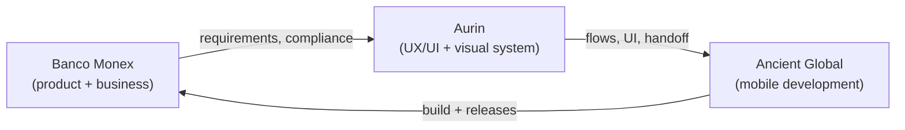
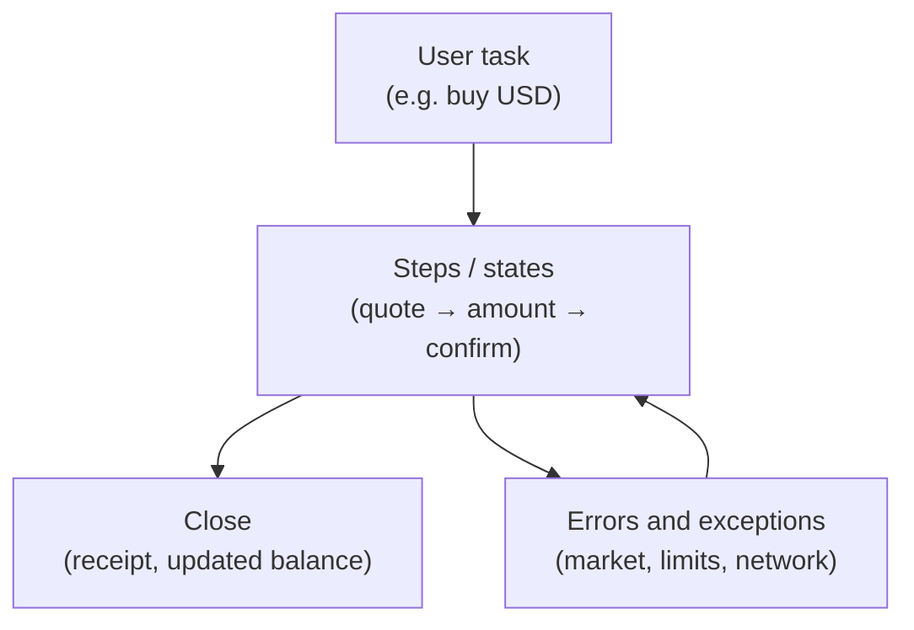
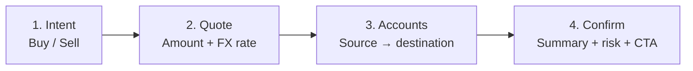
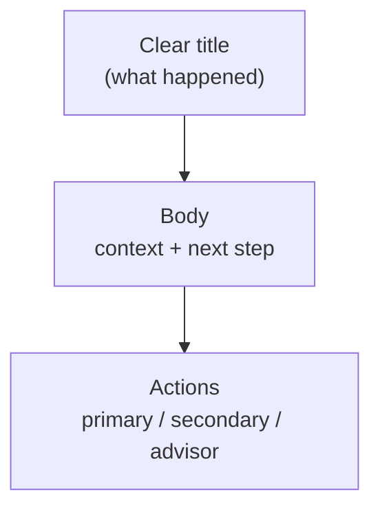
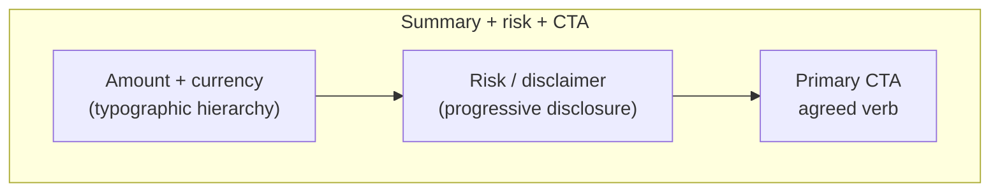

In recent years I have worked with teams living in a very different context from typical SaaS startups: ==corporate banking, multiple currencies, strict regulation, and users who do not forgive a broken flow.== Monex Móvil, Banco Monex's app for checking balances, operating movements, buying and selling FX, paying pre-registered accounts, and contacting an advisor from the phone, is where I truly understood what **product design** means in an enterprise financial environment.

This article is not about how to build a banking app from code. It is about ==how to design a complex financial experience so it makes sense before development starts.== My role was inside Aurin's design team (a product studio in Cuernavaca), coordinating with [Ancient Global](https://www.ancient.global/en) as the development partner for Banco Monex. Eight months of work: low-fidelity wireframes, flow architecture, high-fidelity UI, and handoff. One year later, the app was on the App Store.

> [!info] External grounding
> Product description follows the public listing for [Monex Móvil on the App Store](https://apps.apple.com/uy/app/monex-m%C3%B3vil/id563606880) and the [Monex One](https://www.monex.com.mx/portal/monexone) portal. Ancient documents experience in [Banking & Fintech](https://www.ancient.global/en/industries/banking-fintech) with offices in Cuernavaca and Mexico City. UX frameworks (progressive disclosure, journeys, tokens) cite standard sources in the references table at the end.

## Context: corporate banking from Cuernavaca

> **In plain terms:** Three actors (bank, local design, nearshore development) and a product that had to feel global but operate first in Mexico.

**Banco Monex** is an institution with international presence and strong Mexico operations. Its mobile division does not target users who "download an app and open an account in five minutes": it targets ==clients who already bank with Monex==, have active accounts, an assigned advisor, and need efficiency, not discovery.

**Aurin** was the studio where I worked: product design with a corporate mindset, deliverable rhythm, and coordination across disciplines. That is where I learned institutional UX more than at any other client, not because of fintech startup glamour, but because of ==real constraints at volume: compliance, legal semantics, error states that cannot be ambiguous.==

**Ancient Global** handled development. Founded in 2014, with presence in the US and Mexico (including Cuernavaca and Mexico City), focused on custom software in sectors like banking and fintech. On this project, the design → development contract had to be explicit: what we defined in Figma could not become interpretation in code.

The design team was not small: ==six UI designers, two UX designers, and a graphic design team dedicated to assets.== That changes the problem: it is not "make screens", it is **governing consistency** when many people paint at once.

## The product challenge: prestige, complexity, and Mexico-first focus

> **In plain terms:** The app had to signal institutional solidity without feeling like 2010 web banking squeezed onto an iPhone.

Monex Móvil, per its public description, enables:

- Access to Banco Monex accounts with **real-time balance and movement** queries.
- **FX buy/sell** with updated quotes.
- **Payments to pre-registered accounts** at Mexican banks and national/international payment management.
- **Contact with the assigned advisor** and connection to Monex Digital Banking as the primary channel.

That sounds like four bullets. In product design they are ==four different risk domains==: reading (low friction), trading (high attention), payments (irreversible), and human support (trust). Mixing them badly in navigation is how banking apps become "everything in a hamburger menu."

The project's central tension was positioning:

| Dimension | Business pressure | Design pressure |
| --- | --- | --- |
| **Scope** | Cover full corporate client operations | Keep daily tasks in few taps |
| **Trust** | Global brand, visible security | UI that does not shout marketing over utility |
| **Market** | Mexico operations first | Flows that scale without redesigning identity |
| **Team** | Many designers in parallel | One visual and semantic language |

In banking, ==designing well is not decorating flows; it is reducing cognitive risk in sensitive operations.== Every intermediate screen, confirmation label, and empty state is a product decision, not decoration.

## From "FX super app" to banking MVP

> **In plain terms:** The initial vision was wide; launch had to protect what clients use every day.

Early on, the conversational scope pointed to something more ambitious: a mobile experience concentrating FX, payments, and queries in one "complete" product, almost a financial super app for the Monex client. That is common in banking discovery: ==the business wish map is always larger than the first safe release.==

Product design entered when we had to **cut without amputating trust**. Not "remove features until it fits the sprint." Identify:

1. **Core journeys**: balance/movement query, FX operation, payment to registered beneficiary.
2. **Support journeys**: advisor contact, digital banking access.
3. **Deferred journeys**: features needing more regulatory validation, error states, or user education.

That cut is product design at its most honest. [Qubstudio](https://qubstudio.com/blog/banking-app-ux-design/) and banking redesign studies repeat the pattern: ==teams that retain users do not ship the whole roadmap; they ship journeys that sustain the daily relationship with the bank.==

What we protected in the MVP:

- **Money legibility**: clear balances and movements, no currency ambiguity.
- **FX with explicit steps**: buy/sell as a sequence, not a single form.
- **Payments only to registered accounts**: reduces fraud and simplifies confirmation.
- **Bridge to the advisor**: mobile does not pretend to be self-sufficient for everything.

What explicitly evolved post-launch (visible today in App Store version history: statements, credit, reinforced security, identity validation) reinforces the thesis: ==a well-designed banking MVP is not static; it is a trust platform that can grow.==

## Outcomes after launch

> **In plain terms:** I do not have the bank's public metrics; I do have qualitative signals that the flow-first approach held in production and evolution.

| Signal | What it means for product design |
| --- | --- |
| **App Store in ~12 months** after 8 months of design | Flow → UI → dev handoff was executable; it did not die in a deck |
| **Later releases without navigation rewrites** | MVP journey architecture scaled (statements, security, identity) |
| **Less back-and-forth on FX and payments** after semantics closed in wireframes | Business stopped asking for "another screen" when the issue was vocabulary |
| **Visible App Store iterations** | The product keeps growing on the same stepper and confirmation logic |

In hindsight, the most valuable outcome was not a hero screen: it was ==that sensitive operations shared the same mental model== (summary, risk, confirmation, receipt). That reduced internal friction between design, business, and development, and gave a shared language for release prioritization.

## Flow architecture and experience semantics

> **In plain terms:** Before high fidelity, we validated that each screen answered a task, not a line item in a business document.

My work started at the layer many teams skip: ==semantics and screen-to-screen connection.== Low-fidelity wireframes to agree on:

- **What task starts the flow** (query, operate, pay, get help).
- **What information is mandatory at each step**, and what can wait.
- **What states exist**: success, pending, rejected, market closed, offline, session expired.
- **How the flow closes**: confirmation, receipt, return to home.

In banking, semantics are contract. If a button says "Continue" when the user believes they already executed the operation, the problem is not copy, it is ==lost trust.== We defined consistent vocabulary across UX and UI: same verbs for same intentions in FX, payments, and service onboarding.

### Micro-story: the FX flow that was "already bought"

On buy-USD wireframes, the quote-step CTA said **"Continue"**. In internal testing with the product team, several participants said they had "already bought" and looked for a receipt. The layout was fine; the semantic contract was not.

What we changed:

- CTA to **"Review operation"** on the quote step.
- Explicit **step 2 of 4** indicator on the stepper.
- **Sticky summary** with amount, currency pair, and FX rate before the final tap.

Business accepted the change when we framed it as ==fewer advisor calls from post-screen confusion==, not "design preference." That conversation taught me that in corporate banking, copy is infrastructure.

The **Transfer money** flow shows what that architecture looked like in UX artifacts: MonexONE contact, data review, confirmation, movement detail, and error branches (no access, authentication, new account). Anonymized data; the logic is what matters.

### Access: login, OTP token, and recovery

Before operating money, users cross an authentication layer that cannot feel like gratuitous friction. We documented three scenarios in UI: **returning login** (second session onward), **OTP token verification** (with timer and error states like "Token does not match"), and **app reinstallation**, when the user deletes Monex Móvil and must reactivate credentials without losing trust in the bank.

The pattern matches payments or FX: legible steps, actionable errors, and clear closure. Security does not compete with usability; the sequence aligns both.

**Card requests, identity verification, and token activation**, flows that appeared or strengthened in later releases, follow the same pattern: long tasks split into legible states. Design does not "simplify" by hiding regulatory steps; it ==sequences them with visible progress.==

## Progressive disclosure in sensitive flows

> **In plain terms:** Show only what is needed at each step, especially when money and exchange rates are involved.

[Progressive disclosure](https://www.nngroup.com/articles/progressive-disclosure/), Nielsen Norman Group's classic pattern, recommends revealing information and controls gradually to avoid overload. In fintech it applies in three variants we used at Monex:

| Type | What it is | Mobile banking example |
| --- | --- | --- |
| **Contextual** | Detail on demand | Fee or FX rate breakdown |
| **Staged** | Wizard / stepper | FX buy/sell in steps |
| **Progressive enabling** | Controls appear when relevant | Beneficiary fields after currency choice |

FX buy/sell is the perfect internal case study. One form with quote, amount, source account, destination account, legal disclaimer, and CTA would meet the functional requirement, and ==fail usability.== The stepper is not decoration: it is **attention control**. Each step has one dominant question:

1. What do you want to do (buy / sell)?
2. What amounts and quote do you accept?
3. Where does money move from and to?
4. Do you confirm you understand the outcome?

[LogRocket](https://blog.logrocket.com/ux-design/progressive-disclosure-ux-types-use-cases/) summarizes why staged disclosure reduces errors in complex tasks, aligned with what survives banking usability audits.

The same applies to **errors**: a red technical message is not UX. We designed a three-layer hierarchy:

| Layer | Example | User action |
| --- | --- | --- |
| **What happened** | "FX market closed" | Understands the block without an error code |
| **What they can do** | "Schedule for tomorrow 9:00" or "View hours" | Has an exit without calling yet |
| **When to escalate** | "Contact your advisor" | Only when there is no digital workaround |

In corporate banking =="try again" is not always valid.== The shared error organism used the same tokens and structure as the confirmation summary: users recognize the same "frame" in success and failure.

## Research, journeys, and usability testing

> **In plain terms:** In banking, "we think it's clear" is not enough; you validate tasks, not isolated screens.

[UXDA](https://theuxda.com/blog/5-user-research-methods-for-banking-services) groups financial research methods: interviews, surveys, usability tests, support analysis, and usage data. At Monex, the corporate context limited open research with end clients, but the team could:

- **Map journeys** by client type (frequent operator vs occasional query).
  - *Example:* the FX operator entered via "operate"; the occasional user via "balances." Two entries, same home.
- **Validate wireframes** with product and business stakeholders before high fidelity.
  - *Example:* business asked for "more data" on confirmation; internal testing showed excess increased drop-off at step 3.
- **Review semantics** with compliance as design input, not a final veto.
  - *Example:* legal disclaimers moved to contextual progressive disclosure, not a fixed text block on every step.
- **Test prototypes** on critical tasks: "check balance", "buy USD", "pay beneficiary X".

A journey map in banking is not marketing illustration. It is a ==prioritization tool:== where users hesitate, abandon, or call the advisor. [Qubstudio](https://qubstudio.com/blog/customer-journey-mapping-for-banking-apps/) insists on mapping journeys before redesign: map → wireframe → UI → handoff.

**A/B testing** in regulated environments is narrower than e-commerce. Relatively safe hypotheses:

- Confirmation information order (amount before vs after disclaimer).
- Operation summary density.
- State iconography and error microcopy.

What is rarely tested without safeguards: real financial execution. ==Mature design distinguishes what is experimentable from what is contractual.==

## Components, Atomic Design, and thinking in systems

> **In plain terms:** With six UI designers, the enemy is visual drift, not lack of talent.

[Atomic Design](https://atomicdesign.bradfrost.com/chapter-2/) (Brad Frost) proposes five levels: atoms, molecules, organisms, templates, pages. At Monex we used it as a **coordination language**, not a buzzword:

| Level | Monex Móvil example |
| --- | --- |
| **Atoms** | Amount typography, currency icon, field state |
| **Molecules** | Movement row, amount input with currency |
| **Organisms** | FX operation summary, confirmation module |
| **Templates** | Stepper screen with fixed action slot |
| **Pages** | Full buy-USD flow with real data |

The **high-fidelity UI layer** shows how those organisms and templates look in production: multi-currency home, physical/virtual cards, filtered activity, and light/dark parity. Same visual system, different risk domains.

Frost insists: ==build systems, not pages.== In a bank that means payment confirmation and FX confirmation share the same "summary + risk + CTA" organism, the user learns once.

With six UI designers, the Figma system was the social contract: which components exist, which variants are allowed, which states are mandatory (loading, disabled, error, success). Without that, each designer solves the same problem differently, and Ancient receives inconsistent handoffs.

FX, payments, and service enrollment used the same organism. Users learn once; the team documents once.

## Design tokens and system reproducibility

> **In plain terms:** Tokens are how design survives time, and large teams.

The [Design Tokens Community Group (DTCG)](https://www.designtokens.org/) defines tokens as named decisions, tool-agnostic. At Monex we were not building an open-source design system like later projects ([the design system that ships itself](/en/articulos/design-system-that-ships-itself)), but the logic was the same:

| Family | Token (example) | Why it matters in banking |
| --- | --- | --- |
| **Semantic color** | `text.amount`, `surface.error` | Amount and error read the same in FX and payments |
| **Spacing** | `space.stack.tight` / `loose` | Density for figures, not only aesthetics |
| **Role typography** | `type.amount`, `type.legal` | Legal copy does not compete with amount on confirm |
| **States** | `state.disabled`, `state.focus` | iOS handoff without interpreting "gray by eye" |

==Reproducibility== means another squad can inherit semantics even if the platform changes. Tokens connect graphic design, Figma, and iOS without renegotiating hex every sprint.

## Future exploration: contextual assistance (not part of the release)

> **In plain terms:** Monex was not built with MCP. This is a product lens for the next layer, not the core of the case.

Today the human advisor is the right fallback. With [MCP](https://modelcontextprotocol.io/), the question would be: where does AI **clarify context** without executing money?

- **FX:** "market closed" with real hours and next window, not static copy.
- **Pre-confirmation:** natural-language summary before the irreversible tap.

The constraint does not change: ==documented journeys and component contracts are the boundary.== The agent does not invent flows.

## Product design lessons for banking apps

> **In plain terms:** If you start a corporate banking app tomorrow, this is what Monex left me.

**Would do again:**

1. **Low-fidelity wireframes with closed semantics** before final UI.
2. **Steppers on irreversible operations**: FX, payments, service enrollment.
3. **A shared visual system** when more than three designers touch the same product.
4. **Error state vocabulary** agreed with business and compliance.
5. **Explicit MVP**: daily journeys first; visible roadmap without promising everything in v1.

**Would tighten:**

1. **Research with real users** across more iterations, corporate context limited it.
2. **Task metrics** (task success, time-on-task) per flow, not only stakeholder opinions.
3. **Journey documentation** as a living artifact, not only a discovery deliverable.
4. **Tokens in DTCG format** from day one, dev interoperability from the start.
5. **Moderated usability tests** before each major release, App Store history shows constant evolution; design should follow with evidence.

**The thesis I keep:**

Monex Móvil is not a case of "pretty screens for a bank." It is a case of ==how product design orders institutional complexity and makes it operable in your pocket.== Ancient built; Aurin and the bank defined what had to exist; the design team translated constraints into flows that still run in production.

## Key references

> **In plain terms:** Essentials to go deeper or brief your team.

| Topic | Source |
| --- | --- |
| Product in production | [App Store: Monex Móvil](https://apps.apple.com/uy/app/monex-m%C3%B3vil/id563606880) |
| Progressive disclosure | [NN/g: Progressive Disclosure](https://www.nngroup.com/articles/progressive-disclosure/) |
| Banking UX and journeys | [Qubstudio: Banking app UX](https://qubstudio.com/blog/banking-app-ux-design/) |
| Atomic Design | [Brad Frost: Atomic Design](https://atomicdesign.bradfrost.com/chapter-2/) |
| Design tokens | [Design Tokens Community Group](https://www.designtokens.org/) |
| Development partner | [Ancient: Banking & Fintech](https://www.ancient.global/en/industries/banking-fintech) |

**Selected reading:** [LogRocket (disclosure types)](https://blog.logrocket.com/ux-design/progressive-disclosure-ux-types-use-cases/) · [UXDA (financial research)](https://theuxda.com/blog/5-user-research-methods-for-banking-services) · [Monex One portal](https://www.monex.com.mx/portal/monexone) · [MCP](https://modelcontextprotocol.io/) · [Design system + AI (my later work)](/en/articulos/design-system-that-ships-itself)

## Closing

> **In plain terms:** Designing mobile banking is reducing cognitive risk, App Store success is proof the approach worked in production.

Monex Móvil keeps iterating: security, statements, international payments, identity validation. That confirms what the design team bet on from the MVP: ==a clear flow architecture can grow without unraveling.== My role was one among many, but the learning is mine: in Cuernavaca, with Aurin and Ancient, I learned corporate design is not about polishing screens. It is about **making serious operations feel inevitable, not intimidating**.

If you need this approach at your bank or fintech, flow architecture, mobile design system, compliance-aware research, or nearshore handoff, **[tell me about your project](/#contact)**. I can join as UX/UI lead, embedded product designer on your squad, or to audit critical flows before a major release.

**Live:** [Monex Móvil on the App Store](https://apps.apple.com/uy/app/monex-m%C3%B3vil/id563606880) · **Portal:** [monex.com.mx/portal/monexone](https://www.monex.com.mx/portal/monexone)