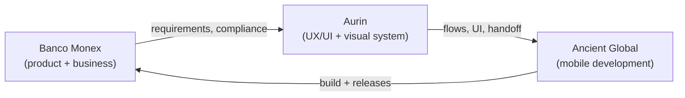
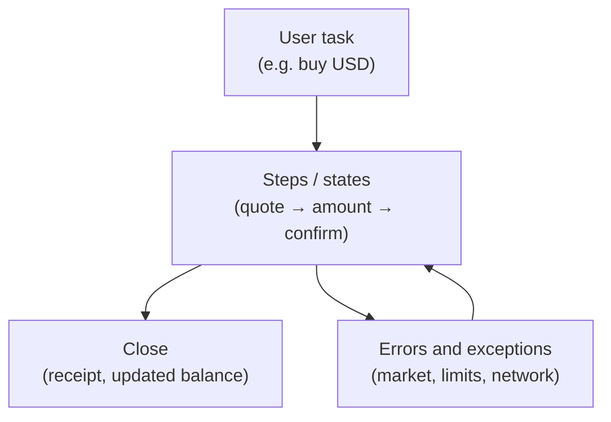

In recent years I have worked with teams living in a very different context from typical SaaS startups: ==corporate banking, multiple currencies, strict regulation, and users who do not forgive a broken flow.== Monex Móvil, Banco Monex's app for checking balances, operating movements, buying and selling FX, paying pre-registered accounts, and contacting an advisor from the phone, is where I truly understood what **product design** means in an enterprise financial environment.

This article is not about how to build a banking app from code. It is about ==how to design a complex financial experience so it makes sense before development starts.== My role was inside Aurin's design team (a product studio in Cuernavaca), coordinating with [Ancient Global](https://www.ancient.global/en) as the development partner for Banco Monex. Eight months of work: low-fidelity wireframes, flow architecture, high-fidelity UI, and handoff. One year later, the app was on the App Store.

> [!info] External grounding
> Product description follows the public listing for [Monex Móvil on the App Store](https://apps.apple.com/uy/app/monex-m%C3%B3vil/id563606880) and the [Monex One](https://www.monex.com.mx/portal/monexone) portal. Ancient documents experience in [Banking & Fintech](https://www.ancient.global/en/industries/banking-fintech) with offices in Cuernavaca and Mexico City. UX frameworks (progressive disclosure, journeys, tokens) cite standard sources in the references table at the end.

## Context: corporate banking from Cuernavaca

> **In plain terms:** Three actors (bank, local design, nearshore development) and a product that had to feel global but operate first in Mexico.

**Banco Monex** is an institution with international presence and strong Mexico operations. Its mobile division does not target users who "download an app and open an account in five minutes": it targets ==clients who already bank with Monex==, have active accounts, an assigned advisor, and need efficiency, not discovery.

**Aurin** was the studio where I worked: product design with a corporate mindset, deliverable rhythm, and coordination across disciplines. That is where I learned institutional UX more than at any other client, not because of fintech startup glamour, but because of ==real constraints at volume: compliance, legal semantics, error states that cannot be ambiguous.==

**Ancient Global** handled development. Founded in 2014, with presence in the US and Mexico (including Cuernavaca and Mexico City), focused on custom software in sectors like banking and fintech. On this project, the design → development contract had to be explicit: what we defined in Figma could not become interpretation in code.

The design team was not small: ==six UI designers, two UX designers, and a graphic design team dedicated to assets.== That changes the problem: it is not "make screens", it is **governing consistency** when many people paint at once.

## The product challenge: prestige, complexity, and Mexico-first focus

> **In plain terms:** The app had to signal institutional solidity without feeling like 2010 web banking squeezed onto an iPhone.

Monex Móvil, per its public description, enables:

- Access to Banco Monex accounts with **real-time balance and movement** queries.
- **FX buy/sell** with updated quotes.
- **Payments to pre-registered accounts** at Mexican banks and national/international payment management.
- **Contact with the assigned advisor** and connection to Monex Digital Banking as the primary channel.

That sounds like four bullets. In product design they are ==four different risk domains==: reading (low friction), trading (high attention), payments (irreversible), and human support (trust). Mixing them badly in navigation is how banking apps become "everything in a hamburger menu."

The project's central tension was positioning:

| Dimension | Business pressure | Design pressure |
| --- | --- | --- |
| **Scope** | Cover full corporate client operations | Keep daily tasks in few taps |
| **Trust** | Global brand, visible security | UI that does not shout marketing over utility |
| **Market** | Mexico operations first | Flows that scale without redesigning identity |
| **Team** | Many designers in parallel | One visual and semantic language |

In banking, ==designing well is not decorating flows; it is reducing cognitive risk in sensitive operations.== Every intermediate screen, confirmation label, and empty state is a product decision, not decoration.

## From "FX super app" to banking MVP

> **In plain terms:** The initial vision was wide; launch had to protect what clients use every day.

Early on, the conversational scope pointed to something more ambitious: a mobile experience concentrating FX, payments, and queries in one "complete" product, almost a financial super app for the Monex client. That is common in banking discovery: ==the business wish map is always larger than the first safe release.==

Product design entered when we had to **cut without amputating trust**. Not "remove features until it fits the sprint." Identify:

1. **Core journeys**: balance/movement query, FX operation, payment to registered beneficiary.
2. **Support journeys**: advisor contact, digital banking access.
3. **Deferred journeys**: features needing more regulatory validation, error states, or user education.

That cut is product design at its most honest. [Qubstudio](https://qubstudio.com/blog/banking-app-ux-design/) and banking redesign studies repeat the pattern: ==teams that retain users do not ship the whole roadmap; they ship journeys that sustain the daily relationship with the bank.==

What we protected in the MVP:

- **Money legibility**: clear balances and movements, no currency ambiguity.
- **FX with explicit steps**: buy/sell as a sequence, not a single form.
- **Payments only to registered accounts**: reduces fraud and simplifies confirmation.
- **Bridge to the advisor**: mobile does not pretend to be self-sufficient for everything.

What explicitly evolved post-launch (visible today in App Store version history: statements, credit, reinforced security, identity validation) reinforces the thesis: ==a well-designed banking MVP is not static; it is a trust platform that can grow.==

## Flow architecture and experience semantics

> **In plain terms:** Before high fidelity, we validated that each screen answered a task, not a line item in a business document.

My work started at the layer many teams skip: ==semantics and screen-to-screen connection.== Low-fidelity wireframes to agree on:

- **What task starts the flow** (query, operate, pay, get help).
- **What information is mandatory at each step**, and what can wait.
- **What states exist**: success, pending, rejected, market closed, offline, session expired.
- **How the flow closes**: confirmation, receipt, return to home.

In banking, semantics are contract. If a button says "Continue" when the user believes they already executed the operation, the problem is not copy, it is ==lost trust.== We defined consistent vocabulary across UX and UI: same verbs for same intentions in FX, payments, and service onboarding.

**Card requests, identity verification, and token activation**, flows that appeared or strengthened in later releases, follow the same pattern: long tasks split into legible states. Design does not "simplify" by hiding regulatory steps; it ==sequences them with visible progress.==

## Progressive disclosure in sensitive flows

> **In plain terms:** Show only what is needed at each step, especially when money and exchange rates are involved.

[Progressive disclosure](https://www.nngroup.com/articles/progressive-disclosure/), Nielsen Norman Group's classic pattern, recommends revealing information and controls gradually to avoid overload. In fintech it applies in three variants we used at Monex:

| Type | What it is | Mobile banking example |
| --- | --- | --- |
| **Contextual** | Detail on demand | Fee or FX rate breakdown |
| **Staged** | Wizard / stepper | FX buy/sell in steps |
| **Progressive enabling** | Controls appear when relevant | Beneficiary fields after currency choice |

FX buy/sell is the perfect internal case study. One form with quote, amount, source account, destination account, legal disclaimer, and CTA would meet the functional requirement, and ==fail usability.== The stepper is not decoration: it is **attention control**. Each step has one dominant question:

1. What do you want to do (buy / sell)?
2. What amounts and quote do you accept?
3. Where does money move from and to?
4. Do you confirm you understand the outcome?

[LogRocket](https://blog.logrocket.com/ux-design/progressive-disclosure-ux-types-use-cases/) summarizes why staged disclosure reduces errors in complex tasks, aligned with what survives banking usability audits.

The same applies to **errors**: a red technical message is not UX. We designed error hierarchy, what happened, what the user can do, what requires an advisor, because in corporate banking =="try again" is not always valid.==

## Research, journeys, and usability testing

> **In plain terms:** In banking, "we think it's clear" is not enough; you validate tasks, not isolated screens.

[UXDA](https://theuxda.com/blog/5-user-research-methods-for-banking-services) groups financial research methods: interviews, surveys, usability tests, support analysis, and usage data. At Monex, the corporate context limited some open research, but the design team could:

- **Map journeys** by client type (frequent operator vs occasional query).
- **Validate wireframes** with product and business stakeholders before high fidelity.
- **Review semantics** with compliance, not as a final blocker, but as design input.
- **Test prototypes** on critical tasks: "check balance", "buy USD", "pay beneficiary X".

A journey map in banking is not marketing illustration. It is a ==prioritization tool:== where users hesitate, abandon, or call the advisor. [Qubstudio](https://qubstudio.com/blog/customer-journey-mapping-for-banking-apps/) insists on mapping journeys before redesign, exactly the sequence we followed: map → wireframe → UI → handoff.

**A/B testing** inside UX/UI in regulated environments is narrower than e-commerce, but not absent. Safe hypotheses: confirmation information order, summary density, state iconography, error microcopy. What is rarely tested freely: flows affecting financial execution without safeguards. ==Mature product design distinguishes what is experimentable from what is contractual.==

## Components, Atomic Design, and thinking in systems

> **In plain terms:** With six UI designers, the enemy is visual drift, not lack of talent.

[Atomic Design](https://atomicdesign.bradfrost.com/chapter-2/) (Brad Frost) proposes five levels: atoms, molecules, organisms, templates, pages. At Monex we used it as a **coordination language**, not a buzzword:

| Level | Monex Móvil example |
| --- | --- |
| **Atoms** | Amount typography, currency icon, field state |
| **Molecules** | Movement row, amount input with currency |
| **Organisms** | FX operation summary, confirmation module |
| **Templates** | Stepper screen with fixed action slot |
| **Pages** | Full buy-USD flow with real data |

Frost insists: ==build systems, not pages.== In a bank that means payment confirmation and FX confirmation share the same "summary + risk + CTA" organism, the user learns once.

With six UI designers, the Figma system was the social contract: which components exist, which variants are allowed, which states are mandatory (loading, disabled, error, success). Without that, each designer solves the same problem differently, and Ancient receives inconsistent handoffs.

## Design tokens and system reproducibility

> **In plain terms:** Tokens are how design survives time, and large teams.

The [Design Tokens Community Group (DTCG)](https://www.designtokens.org/) defines tokens as named design decisions, color, spacing, typography, radius, tool-agnostic. In 2024 token work at Monex did not aim for an open-source design system like my later projects ([the design system that ships itself](/en/articulos/design-system-that-ships-itself)), but the logic was the same:

- **Semantic color**: surface, primary text, success, error, warning; not "nice blue."
- **Density spacing**: mobile banking needs figure legibility; whitespace is scanning, not aesthetics.
- **Role typography**: amount, label, legal, helper; each role with agreed weight and size.
- **Interactive states**: pressed, disabled, focus; critical for accessibility and unambiguous handoff.

==Reproducibility== means if another squad designs "Monex Business Web" tomorrow, they inherit semantics even if the platform changes. Tokens bridge graphic design (assets), UI (Figma), and development (iOS), without renegotiating hex codes every sprint.

## How this project would change today: MCP and augmented product

> **In plain terms:** Monex was not built with MCP; but the standard explains how I would design contextual assistance without breaking trust.

The [Model Context Protocol (MCP)](https://modelcontextprotocol.io/) standardizes how agents and LLMs connect to data and tools with context, not as generic chat, but as a **product layer**. Monex Móvil today connects to a human advisor; a 2026 product could add AI assistance **without replacing** that channel.

From product design, not engineering, MCP would enable:

- **Contextual FX help**: "market closed" explained with real hours, not static copy.
- **Pre-confirmation validation**: the system summarizes risk in natural language before the final tap.
- **New feature onboarding**: statements, credit, 2FA token with guidance by user profile.

The design constraint is the same as in payments: ==the agent does not invent flows that do not exist.== Component contracts and documented journeys are the boundary, the same philosophy I apply today in anti-hallucination systems for AI. MCP does not replace UX research; it amplifies it when data and permissions are clear.

## Product design lessons for banking apps

> **In plain terms:** If you start a corporate banking app tomorrow, this is what Monex left me.

**Would do again:**

1. **Low-fidelity wireframes with closed semantics** before final UI.
2. **Steppers on irreversible operations**: FX, payments, service enrollment.
3. **A shared visual system** when more than three designers touch the same product.
4. **Error state vocabulary** agreed with business and compliance.
5. **Explicit MVP**: daily journeys first; visible roadmap without promising everything in v1.

**Would tighten:**

1. **Research with real users** across more iterations, corporate context limited it.
2. **Task metrics** (task success, time-on-task) per flow, not only stakeholder opinions.
3. **Journey documentation** as a living artifact, not only a discovery deliverable.
4. **Tokens in DTCG format** from day one, dev interoperability from the start.
5. **Moderated usability tests** before each major release, App Store history shows constant evolution; design should follow with evidence.

**The thesis I keep:**

Monex Móvil is not a case of "pretty screens for a bank." It is a case of ==how product design orders institutional complexity and makes it operable in your pocket.== Ancient built; Aurin and the bank defined what had to exist; the design team translated constraints into flows that still run in production.

If you work in fintech, corporate products, or want to understand mobile banking design for demanding clients, use this project as a **practice map**: research, journeys, progressive disclosure, systems, and tokens, not just a logo on a portfolio.

## References (external)

> **In plain terms:** Sources to go deeper or brief your team, product and UX, not only implementation.

| Topic | Source |
| --- | --- |
| Monex Móvil (public product) | [App Store: Monex Móvil](https://apps.apple.com/uy/app/monex-m%C3%B3vil/id563606880) |
| Monex One portal | [monex.com.mx: Monex One](https://www.monex.com.mx/portal/monexone) |
| Ancient Global (dev partner) | [Ancient: Banking & Fintech](https://www.ancient.global/en/industries/banking-fintech) |
| Ancient: about | [Ancient: About Us](https://www.ancient.global/en/about-us) |
| Progressive disclosure (theory) | [NN/g: Progressive Disclosure](https://www.nngroup.com/articles/progressive-disclosure/) |
| Progressive disclosure (types) | [LogRocket: Progressive disclosure UX](https://blog.logrocket.com/ux-design/progressive-disclosure-ux-types-use-cases/) |
| Research in financial services | [UXDA: 5 user research methods](https://theuxda.com/blog/5-user-research-methods-for-banking-services) |
| Customer journeys in banking | [Qubstudio: Banking app UX](https://qubstudio.com/blog/banking-app-ux-design/) |
| Atomic Design | [Brad Frost: Atomic Design](https://atomicdesign.bradfrost.com/chapter-2/) |
| Design tokens (standard) | [Design Tokens Community Group](https://www.designtokens.org/) |
| MCP (product context) | [Model Context Protocol](https://modelcontextprotocol.io/) |
| Design systems + AI (later work) | [The design system that ships itself](/en/articulos/design-system-that-ships-itself) |

## Closing

> **In plain terms:** Designing mobile banking is reducing cognitive risk, App Store success is proof the approach worked in production.

Monex Móvil keeps iterating: security, statements, international payments, identity validation. That confirms what the design team bet on from the MVP: ==a clear flow architecture can grow without unraveling.== My role was one among many, but the learning is mine: in Cuernavaca, with Aurin and Ancient, I learned corporate design is not about polishing screens. It is about **making serious operations feel inevitable, not intimidating**.

**Live:** [Monex Móvil on the App Store](https://apps.apple.com/uy/app/monex-m%C3%B3vil/id563606880) · **Portal:** [monex.com.mx/portal/monexone](https://www.monex.com.mx/portal/monexone)