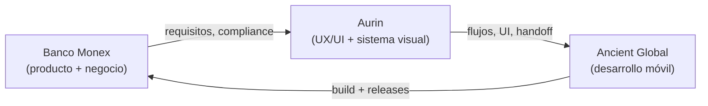
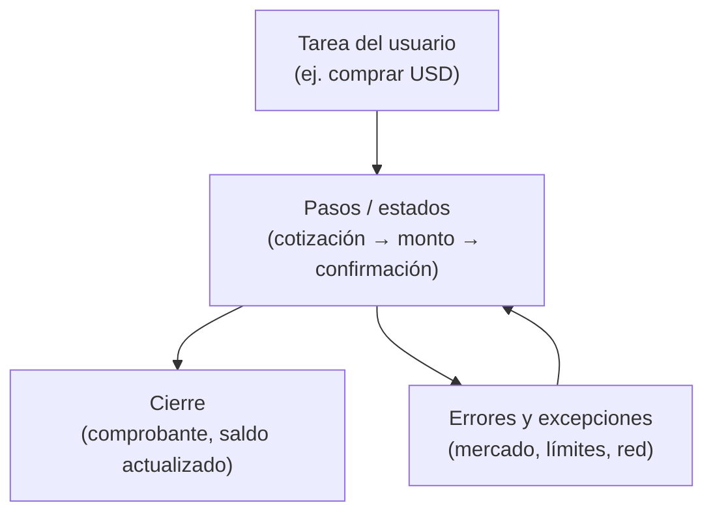
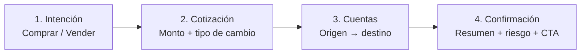
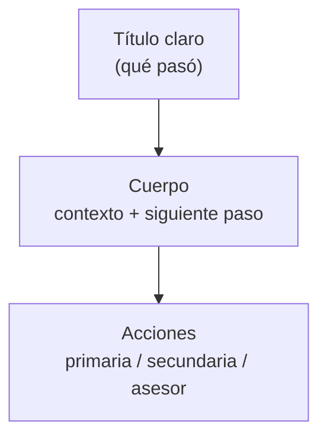
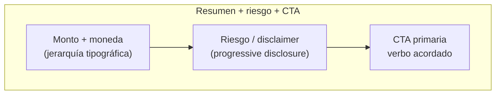

En los últimos años he trabajado con equipos que viven en un contexto muy distinto al de las típicas startups SaaS: ==banca corporativa, múltiples divisas, regulaciones estrictas y usuarios que no perdonan un flujo roto.== Monex Móvil, la app de Banco Monex para consultar saldos, operar movimientos, comprar y vender divisas, pagar a cuentas registradas y contactar al asesor desde el teléfono, fue el proyecto donde entendí de verdad qué significa **diseñar producto** en un entorno financiero empresarial.

Este artículo no trata sobre cómo construir una app bancaria desde código. Trata sobre ==cómo diseñar una experiencia financiera compleja para que tenga sentido antes de llegar a desarrollo.== Mi participación fue dentro del equipo de diseño de Aurin (estudio de producto en Cuernavaca), en coordinación con [Ancient Global](https://www.ancient.global/en) como partner de desarrollo para Banco Monex. Ocho meses de trabajo: wireframes de baja fidelidad, arquitectura de flujos, UI de alta fidelidad y handoff. Un año después, la app estaba en App Store.

> [!info] Fundamento externo
> La descripción de producto sigue la ficha pública de [Monex Móvil en App Store](https://apps.apple.com/uy/app/monex-m%C3%B3vil/id563606880) y el portal [Monex One](https://www.monex.com.mx/portal/monexone). Ancient documenta experiencia en [Banking & Fintech](https://www.ancient.global/en/industries/banking-fintech) y oficinas en Cuernavaca y CDMX. Los marcos de UX (progressive disclosure, journeys, tokens) citan fuentes estándar en la tabla de referencias al final.

## Contexto: banca corporativa desde Cuernavaca

> **En pocas palabras:** Tres actores (banco, diseño local, desarrollo nearshore) y un producto que tenía que sentirse global pero operar primero en México.

**Banco Monex** es una institución con presencia internacional y operación fuerte en México. Su división móvil no apunta al usuario que “descarga una app y abre cuenta en cinco minutos”: apunta a ==clientes que ya operan con el banco==, tienen cuentas activas, asesor asignado y necesitan eficiencia, no descubrimiento.

**Aurin** fue el estudio donde trabajaba: diseño de producto con mentalidad corporativa, ritmo de entregables y coordinación entre varias disciplinas. Ahí aprendí el UX institucional más que en cualquier otro cliente, no por glamour de fintech startup, sino por ==volumen de restricciones reales: compliance, semántica legal, estados de error que no pueden ser ambiguos.==

**Ancient Global** asumió el desarrollo. Empresa fundada en 2014, con presencia en EE.UU. y México (incluyendo Cuernavaca y CDMX), orientada a software a medida en sectores como banca y fintech. En este proyecto, el contrato de diseño → desarrollo tenía que ser explícito: lo que definíamos en Figma no podía quedar como interpretación en código.

El equipo de diseño no era pequeño: ==seis UI designers, dos UX y un equipo de diseño gráfico dedicado a assets.== Eso cambia el problema: no es “hacer pantallas”, es **gobernar consistencia** cuando muchas personas pintan al mismo tiempo.

## El reto de producto: prestigio, complejidad y foco en México

> **En pocas palabras:** La app tenía que transmitir solidez institucional sin sentirse como banca web del 2010 comprimida en un iPhone.

Monex Móvil, según su descripción pública, permite:

- Acceder a cuentas de Banco Monex con **consulta de saldos y movimientos** en tiempo real.
- Realizar **compra-venta de divisas** con cotizaciones actualizadas.
- Ejecutar **pagos a cuentas previamente registradas** en bancos de México y gestionar operaciones nacionales/internacionales.
- **Contactar al asesor asignado** y conectar con la Banca Digital Monex como canal principal.

Eso suena como cuatro bullets. En diseño de producto son ==cuatro dominios de riesgo distinto==: lectura (baja fricción), trading (alta atención), pagos (irreversibles) y soporte humano (confianza). Mezclarlos mal en navegación es cómo las apps bancarias se vuelven “todo en un menú hamburguesa”.

La tensión central del proyecto era de posicionamiento:

| Dimensión | Presión del negocio | Presión del diseño |
| --- | --- | --- |
| **Alcance** | Cubrir operaciones de un cliente corporativo completo | Mantener tareas diarias en pocos toques |
| **Confianza** | Marca global, seguridad visible | UI que no grite “marketing” sobre utilidad |
| **Mercado** | Operación México primero | Flujos que escalen sin re-diseñar identidad |
| **Equipo** | Muchos diseñadores en paralelo | Un solo lenguaje visual y semántico |

En banca, ==diseñar bien no es adornar flujos; es reducir riesgo cognitivo en operaciones sensibles.== Cada pantalla intermedia, cada label de confirmación y cada estado vacío es una decisión de producto, no de decoración.

## Del “super app de divisas” al MVP bancario

> **En pocas palabras:** La visión inicial era amplia; el lanzamiento tuvo que proteger lo que el cliente usa todos los días.

Al inicio, el alcance conversacional apuntaba a algo más ambicioso: una experiencia móvil que concentrara operaciones de divisas, pagos y consulta en un solo producto “completo”, casi un super app financiero para el cliente Monex. Eso es común en discovery bancario: ==el mapa de deseos del negocio siempre es más grande que el primer release seguro.==

El diseño de producto entró cuando hubo que **recortar sin amputar confianza**. No se trataba de “quitar features hasta que quepa en el sprint”. Se trataba de identificar:

1. **Journeys núcleo**: consulta de saldo/movimientos, operación FX, pago a beneficiario registrado.
2. **Journeys de soporte**: contacto con asesor, acceso a banca digital.
3. **Journeys diferidos**: funcionalidades que requieren más validación regulatoria, más estados de error o más educación al usuario.

Ese recorte es diseño de producto en su forma más honesta. [Qubstudio](https://qubstudio.com/blog/banking-app-ux-design/) y estudios de rediseño bancario repiten el patrón: ==los equipos que retienen usuarios no shippean todo el roadmap; shippean los journeys que sostienen la relación diaria con el banco.==

Lo que protegimos en el MVP:

- **Legibilidad de dinero**: saldos y movimientos claros, sin ambigüedad de moneda.
- **FX con pasos explícitos**: compra/venta como secuencia, no como formulario único.
- **Pagos solo a cuentas registradas**: reduce fraude y simplifica confirmación.
- **Puente al asesor**: el producto móvil no finge ser autosuficiente en todo.

Lo que quedó explícitamente como evolución post-lanzamiento (visible hoy en el historial de versiones de App Store: estados de cuenta, crédito, seguridad reforzada, validación de identidad) refuerza la tesis: ==un MVP bancario bien diseñado no es estático; es una plataforma de confianza que puede crecer.==

## Resultados después del lanzamiento

> **En pocas palabras:** No tengo métricas públicas del banco; sí señales cualitativas de que el enfoque de flujos sostuvo producción y evolución.

| Señal | Qué indica para diseño de producto |
| --- | --- |
| **App Store en ~12 meses** tras 8 meses de diseño | El handoff flujo → UI → dev fue ejecutable; no quedó en deck |
| **Releases posteriores sin rehacer navegación** | La arquitectura de journeys del MVP escaló (estados de cuenta, seguridad, identidad) |
| **Menos ida y vuelta en FX y pagos** tras cerrar semántica en wireframes | Stakeholders de negocio dejaron de pedir “otra pantalla” cuando el problema era vocabulario |
| **Iteraciones visibles en App Store** | El producto sigue creciendo sobre la misma lógica de steppers y confirmación |

En retrospectiva, el outcome más valioso no fue una pantalla hero: fue ==que operaciones sensibles compartieran el mismo patrón mental== (resumen, riesgo, confirmación, comprobante). Eso redujo fricción interna entre diseño, negocio y desarrollo, y dejó un lenguaje común para priorizar lo que entraba en cada release.

## Arquitectura de flujos y semántica de la experiencia

> **En pocas palabras:** Antes de alta fidelidad, validamos que cada pantalla respondiera a una tarea, no a un requerimiento del documento de negocio.

Mi trabajo empezó en la capa que muchos equipos saltan: ==semántica y conexión entre pantallas.== Wireframes de baja fidelidad para acordar:

- **Qué tarea inicia el flujo** (consultar, operar, pagar, pedir ayuda).
- **Qué información es obligatoria en cada paso**, y cuál puede esperar.
- **Qué estados existen**: éxito, pendiente, rechazado, mercado cerrado, sin conexión, sesión expirada.
- **Cómo se cierra el flujo**: confirmación, comprobante, retorno al inicio.

En banca, la semántica es contrato. Si un botón dice “Continuar” cuando el usuario cree que ya ejecutó la operación, el problema no es copy, es ==pérdida de confianza.== Por eso definimos vocabulario consistente entre UX y UI: mismos verbos para mismas intenciones en FX, pagos y onboarding de servicios.

### Micro-historia: el FX que “ya estaba comprado”

En wireframes de compra USD, el CTA del paso de cotización decía **“Continuar”**. En prueba interna con el equipo de producto, varios participantes dijeron que “ya habían comprado” y buscaban el comprobante. No fallaba el layout: fallaba el contrato semántico.

Lo que cambiamos:

- CTA a **“Revisar operación”** en el paso de cotización.
- Indicador explícito **paso 2 de 4** en el stepper.
- **Resumen sticky** con monto, par de divisas y tipo de cambio antes del tap final.

Negocio aceptó el ajuste cuando lo planteamos como ==menos llamadas al asesor por dudas post-pantalla==, no como “preferencia de diseño”. Esa conversación me enseñó que en banca corporativa el copy es infraestructura.

El flujo **Transferir dinero** muestra cómo se veía esa arquitectura en artefactos de UX: contacto MonexONE, revisión de datos, confirmación, detalle de movimiento y ramas de error (sin acceso, autenticación, cuenta nueva). Datos anonimizados; la lógica es la que importa.

### Acceso: login, token OTP y recuperación

Antes de operar dinero, el usuario cruza una capa de autenticación que no puede sentirse como fricción gratuita. Documentamos tres escenarios en UI: **login recurrente** (segunda vez en adelante), **verificación con token OTP** (con temporizador y estados de error como “El token no coincide”) y **reinstalación de la app**, cuando el usuario borra Monex Móvil y debe reactivar credenciales sin perder confianza en el banco.

El patrón es el mismo que en pagos o FX: pasos legibles, errores accionables y cierre claro. La seguridad no compite con la usabilidad; la secuencia las alinea.

**Solicitud de tarjeta, verificación de identidad y activación de token**, flujos que aparecieron o se reforzaron en releases posteriores, siguen el mismo patrón: tareas largas partidas en estados legibles. El diseño no los “simplifica” ocultando pasos regulatorios; los ==secuencia con progreso visible.==

## Progressive disclosure en flujos sensibles

> **En pocas palabras:** Mostrar solo lo necesario en cada paso, especialmente cuando hay dinero y tipo de cambio de por medio.

[Progressive disclosure](https://www.nngroup.com/articles/progressive-disclosure/), el patrón clásico de Nielsen Norman Group, recomienda revelar información y controles de forma gradual para no sobrecargar. En fintech aplica tres variantes que usamos en Monex:

| Tipo | Qué es | Ejemplo en banca móvil |
| --- | --- | --- |
| **Contextual** | Mostrar detalle bajo demanda | Desglose de comisión o tipo de cambio |
| **Por etapas (staged)** | Wizard / stepper | Compra-venta de divisas en pasos |
| **Habilitación progresiva** | Controles que aparecen cuando aplica | Campos de beneficiario tras elegir moneda |

La compra-venta de divisas es el caso de estudio interno perfecto. Un solo formulario con cotización, monto, cuenta origen, cuenta destino, disclaimer legal y CTA habría cumplido el requerimiento funcional, y habría ==fallado en usabilidad.== El stepper no es decoración: es **control de atención**. Cada paso tiene una pregunta dominante:

1. ¿Qué quieres hacer (comprar / vender)?
2. ¿Con qué montos y a qué cotización estás de acuerdo?
3. ¿Desde y hacia dónde se mueve el dinero?
4. ¿Confirmas que entiendes el resultado?

[LogRocket](https://blog.logrocket.com/ux-design/progressive-disclosure-ux-types-use-cases/) resume por qué staged disclosure reduce errores en tareas complejas, coincide con lo que vemos en apps bancarias que sobreviven auditoría de usabilidad.

Lo mismo aplica a **errores**: un mensaje técnico en rojo no es UX. Diseñamos jerarquía en tres capas:

| Capa | Ejemplo | Acción del usuario |
| --- | --- | --- |
| **Qué pasó** | “Mercado de divisas cerrado” | Entiende el bloqueo sin código de error |
| **Qué puede hacer** | “Programar para mañana 9:00” o “Ver horario” | Tiene salida sin llamar aún |
| **Cuándo escalar** | “Contactar a tu asesor” | Solo si la operación no tiene workaround digital |

En corporativo ==“intenta de nuevo” no siempre es válido.== El organismo de error compartía tokens y estructura con el resumen de confirmación: el usuario reconoce el mismo “marco” en éxito y fracaso.

## Research, journeys y pruebas de usabilidad

> **En pocas palabras:** En banca no alcanza con “creemos que está claro”; hay que validar tareas, no pantallas sueltas.

[UXDA](https://theuxda.com/blog/5-user-research-methods-for-banking-services) agrupa métodos de research financiero: entrevistas, encuestas, pruebas de usabilidad, análisis de soporte y datos de uso. En Monex, el contexto corporativo limitaba research abierto con clientes finales, pero el equipo sí podía:

- **Mapear journeys** por tipo de cliente (operador frecuente vs consulta ocasional).
  - *Ejemplo:* el operador FX entraba por “operar”; el consultor ocasional por “saldos”. Dos entradas, mismo home.
- **Validar wireframes** con stakeholders de producto y negocio antes de alta fidelidad.
  - *Ejemplo:* negocio pidió “más datos” en confirmación; research interno mostró que el exceso aumentaba abandono en paso 3.
- **Revisar semántica** con compliance como input de diseño, no como veto final.
  - *Ejemplo:* disclaimers legales movidos a progressive disclosure contextual, no bloque de texto fijo en cada paso.
- **Probar prototipos** en tareas críticas: “consulta saldo”, “compra USD”, “paga a beneficiario X”.

Un journey map en banca no es ilustración de marketing. Es ==herramienta de priorización:== dónde el usuario duda, dónde abandona, dónde llama al asesor. [Qubstudio](https://qubstudio.com/blog/customer-journey-mapping-for-banking-apps/) insiste en mapear journeys antes de rediseñar: mapa → wireframe → UI → handoff.

**A/B testing** en entornos regulados es más estrecho que en e-commerce. Hipótesis relativamente seguras:

- Orden de información en confirmación (monto antes vs después del disclaimer).
- Densidad del resumen de operación.
- Iconografía de estados y microcopy de error.

Lo que casi nunca se testea sin salvaguardas: ejecución financiera real. ==El diseño maduro distingue qué es experimentable de qué es contractual.==

## Componentes, Atomic Design y pensar en sistemas

> **En pocas palabras:** Con seis UI designers, el enemigo es la deriva visual, no la falta de talento.

[Atomic Design](https://atomicdesign.bradfrost.com/chapter-2/) (Brad Frost) propone cinco niveles: átomos, moléculas, organismos, templates, páginas. En Monex lo usamos como **lenguaje de coordinación**, no como buzzword:

| Nivel | Ejemplo en Monex Móvil |
| --- | --- |
| **Átomos** | Tipografía de monto, icono de moneda, estado de campo |
| **Moléculas** | Fila de movimiento, input de monto con moneda |
| **Organismos** | Resumen de operación FX, módulo de confirmación |
| **Templates** | Pantalla de stepper con slot de acción fija |
| **Páginas** | Flujo completo compra USD con datos reales |

La capa de **UI en alta fidelidad** muestra cómo esos organismos y templates se ven en producción: home multi-divisa, tarjetas física/virtual, actividad con filtros y paridad claro/oscuro. Mismo sistema visual, distintos dominios de riesgo.

Frost insiste: ==construye sistemas, no páginas.== En un banco eso se traduce en que la pantalla de confirmación de un pago y la de una operación FX comparten el mismo organismo de “resumen + riesgo + CTA”, el usuario aprende una vez.

Con seis UI designers, el sistema en Figma era el acuerdo social: qué componentes existen, qué variantes están permitidas, qué estados son obligatorios (loading, disabled, error, success). Sin eso, cada diseñador resuelve el mismo problema de forma distinta, y Ancient recibe handoffs inconsistentes.

FX, pagos y altas de servicio usaban el mismo organismo. El usuario aprende una vez; el equipo documenta una vez.

## Design tokens y reproducibilidad del sistema

> **En pocas palabras:** Tokens son cómo el diseño sobrevive al tiempo, y a equipos grandes.

El [Design Tokens Community Group (DTCG)](https://www.designtokens.org/) define tokens como decisiones con nombre y valor, independientes de la herramienta. En Monex no buscábamos un design system open source como en proyectos posteriores ([design system que se shippea solo](/es/articulos/design-system-that-ships-itself)), pero la lógica era la misma:

| Familia | Token (ejemplo) | Por qué importa en banca |
| --- | --- | --- |
| **Color semántico** | `text.amount`, `surface.error` | El monto y el error se leen igual en FX y pagos |
| **Espaciado** | `space.stack.tight` / `loose` | Densidad para cifras, no solo estética |
| **Tipografía por rol** | `type.amount`, `type.legal` | Legal no compite con el monto en confirmación |
| **Estados** | `state.disabled`, `state.focus` | Handoff a iOS sin interpretar “gris a ojo” |

==Reproducibilidad== significa que otra squad puede heredar semántica aunque cambie plataforma. Los tokens conectan diseño gráfico, Figma e iOS sin renegociar hex en cada sprint.

## Exploración futura: asistencia contextual (no parte del release)

> **En pocas palabras:** Monex no se construyó con MCP. Esto es lente de producto para la siguiente capa, no el core del case.

Hoy el asesor humano es el respaldo correcto. Con [MCP](https://modelcontextprotocol.io/), la pregunta sería: ¿dónde la IA **aclara contexto** sin ejecutar dinero?

- **FX:** “mercado cerrado” con horario real y próxima ventana, no copy estático.
- **Pre-confirmación:** resumen en lenguaje natural antes del tap irreversible.

La restricción no cambia: ==journeys documentados y contratos de componente son el límite.== El agente no inventa flujos.

## Lecciones de diseño de producto para apps bancarias

> **En pocas palabras:** Si mañana empiezas una app bancaria corporativa, esto es lo que Monex me dejó.

**Haría de nuevo:**

1. **Wireframes de baja fidelidad con semántica cerrada** antes de UI final.
2. **Steppers en operaciones irreversibles**: FX, pagos, altas de servicio.
3. **Un sistema visual compartido** cuando más de tres diseñadores tocan el mismo producto.
4. **Vocabulario de estados de error** acordado con negocio y compliance.
5. **MVP explícito**: journeys diarios primero; roadmap visible sin prometer todo en v1.

**Apretaría más:**

1. **Research con usuarios reales** en más iteraciones, el contexto corporativo lo limitó.
2. **Métricas de tarea** (task success, time-on-task) por flujo, no solo opiniones de stakeholder.
3. **Documentación de journeys** como artefacto vivo, no solo entregable de discovery.
4. **Tokens en formato DTCG** desde el inicio, interoperabilidad con dev desde el día uno.
5. **Pruebas de usabilidad moderadas** antes de cada release mayor, el historial de App Store muestra evolución constante; el diseño debería acompañarla con evidencia.

**La tesis que me quedo:**

Monex Móvil no es un caso de “pantallas bonitas para un banco”. Es un caso de ==cómo el diseño de producto ordena complejidad institucional y la vuelve operable en el bolsillo.== Ancient construyó; Aurin y el banco definieron qué debía existir; el equipo de diseño tradujo restricciones en flujos que hoy siguen en producción.

## Referencias clave

> **En pocas palabras:** Lo esencial para profundizar o briefear a tu equipo.

| Tema | Fuente |
| --- | --- |
| Producto en producción | [App Store: Monex Móvil](https://apps.apple.com/uy/app/monex-m%C3%B3vil/id563606880) |
| Progressive disclosure | [NN/g: Progressive Disclosure](https://www.nngroup.com/articles/progressive-disclosure/) |
| UX bancario y journeys | [Qubstudio: Banking app UX](https://qubstudio.com/blog/banking-app-ux-design/) |
| Atomic Design | [Brad Frost: Atomic Design](https://atomicdesign.bradfrost.com/chapter-2/) |
| Design tokens | [Design Tokens Community Group](https://www.designtokens.org/) |
| Partner de desarrollo | [Ancient: Banking & Fintech](https://www.ancient.global/en/industries/banking-fintech) |

**Lectura seleccionada:** [LogRocket (tipos de disclosure)](https://blog.logrocket.com/ux-design/progressive-disclosure-ux-types-use-cases/) · [UXDA (research financiero)](https://theuxda.com/blog/5-user-research-methods-for-banking-services) · [Monex One portal](https://www.monex.com.mx/portal/monexone) · [MCP](https://modelcontextprotocol.io/) · [Design system + IA (mi trabajo posterior)](/es/articulos/design-system-that-ships-itself)

## Cierre

> **En pocas palabras:** Diseñar banca móvil es reducir riesgo cognitivo, el éxito en App Store es la prueba de que el enfoque funcionó en producción.

Monex Móvil sigue iterando: seguridad, estados de cuenta, pagos internacionales, validación de identidad. Eso confirma lo que el equipo de diseño apostó desde el MVP: ==una arquitectura de flujos clara puede crecer sin deshacerse.== Mi rol fue uno entre muchos, pero el aprendizaje es mío: en Cuernavaca, con Aurin y Ancient, aprendí que el diseño corporativo no se trata de pulir pantallas. Se trata de **hacer que operaciones serias se sientan inevitables, no intimidantes**.

Si necesitas este enfoque en tu banco o fintech, arquitectura de flujos, design system móvil, research con compliance o handoff con equipos nearshore, **[cuéntame sobre tu proyecto](/#contact)**. Puedo entrar como lead UX/UI, diseñadora de producto embebida en tu squad, o para auditar flujos críticos antes de un release mayor.

**Live:** [Monex Móvil en App Store](https://apps.apple.com/uy/app/monex-m%C3%B3vil/id563606880) · **Portal:** [monex.com.mx/portal/monexone](https://www.monex.com.mx/portal/monexone)