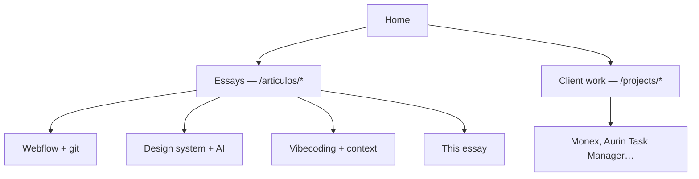
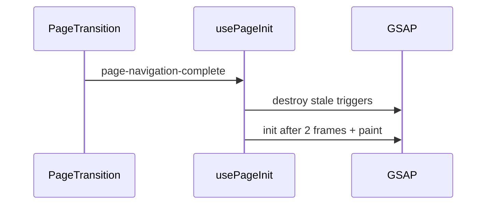
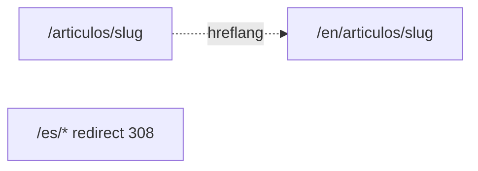
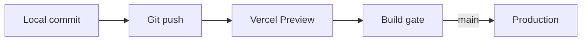
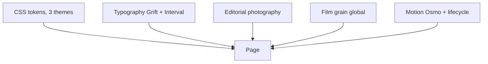

There is a specific moment in almost every engineering portfolio. It is not choosing Next.js or Astro. It shows up when you finish the hero, the three project cards, and the footer—and realize ==the site looks great but does not show how you think.==

You can keep tuning the title animation. Or you can write a 3,000-word essay on why Webflow and git should not fight over the same territory. But if you only do the first, you look like a designer. If you only do the second without the site supporting it, you look like a blogger. ==A product engineer portfolio is the hardest client you will ever have:== you cannot say "that is out of scope."

I went through that building this site. The other essays you see here—[Webflow in production](/en/articulos/atom-webflow), [The design system an AI can't hallucinate](/en/articulos/design-system-that-ships-itself), [Context-driven development](/en/articulos/context-driven-development-vibecoding)—document real client work. This piece documents ==the container that lets them coexist.== And it is written with the same markdown pipeline you are reading now, because anything else would be hypocrisy.

> [!info] External grounding
> Routing and motion decisions follow [Next.js App Router](https://nextjs.org/docs/app), [next-intl routing](https://next-intl.dev/docs/routing), and [GSAP with React](https://gsap.com/resources/React/). Code lives in [Portfolio2026](https://github.com/karenrebecag/Portfolio2026); the references table at the end is what I send when someone wants to replicate the approach.

## The hardest client is you

> **In plain terms:** Without a PM to cut scope, the portfolio becomes an infinite side project—unless you set rules.
On client work, someone eventually says "ship." On your own portfolio, nobody does. You can spend two weeks on a button hover because ==there is no stakeholder to stop you.==

The trap has two faces:

- **Motion perfectionism.** Every transition could be slightly smoother. Every heading could split better. The site is never "ready."
- **Content paralysis.** Writing long essays is slower than laying out sections. It is tempting to ship pretty placeholders and promise the text later.

The rule that saved me was treating the portfolio as a product with two mandatory deliverables, not one:

| Deliverable | What it proves | If missing, you look like |
| --- | --- | --- |
| **The interface** | Craft, motion, typography, visual judgment | A designer without depth |
| **The essays** | How you think under real constraints | An engineer without a voice |

==One is not enough.== A pretty theme with generic copy is indistinguishable from hundreds on Dribbble. An ugly technical blog does not convince someone hiring product engineers. This site had to win on both—with a time budget that did not explode.

## Two bands, one home: essays vs. client work

> **In plain terms:** Long thinking and client outcomes share a list but not the same depth—and that is a product decision, not a folder structure.
The home page shows two bands under the same visual language:

| Band | Route | What it is |
| --- | --- | --- |
| **Ensayos de producto** | `/articulos/[slug]` | Architecture, AI, design systems—teachable pieces |
| **Client work** | `/projects/[slug]` | Shipped products—outcome first |

It is not just file organization. It is ==a promise to the reader:== if you click an essay, you expect depth and argument. If you click client work, you expect what you built and what changed for the team.

Five long pieces live at `/articulos/`. The rest—Monex, Aurin Task Manager, [decoupled architecture by ownership](/en/projects/decoupled-ownership-non-technical-teams)—lives at `/projects/`. When a project has an essay, the short route redirects to the canonical one. One URL per intent; no competing in SEO or in the visitor's head.

The question I asked was not "Next.js or Astro?" It was: ==how does someone landing from LinkedIn understand in ten seconds what kind of piece they are opening?==

## No CMS: the same contract I preach for Webflow

> **In plain terms:** If I tell clients long-form copy lives in git, my portfolio cannot depend on an admin panel.
In [Webflow in production](/en/articulos/atom-webflow) the argument is explicit: marketing and engineering should not fight over the same surface without a contract. Here I am both sides—but ==the principle does not change.==

Each essay is markdown in git, imported at build, parsed into a custom renderer with blocks for Mermaid, highlighted code, and callouts. No login. No headless CMS. If I want to change a paragraph, I open a PR. If I want to add a diagram, I write it in the `.md`.

That has a real cost: publishing a new essay is slower than Notion. But it has a benefit no CMS gives me: ==essays ship like code review.== Prose and code in the same diff. Bilingual side by side (`-es.md` / `-en.md`). Versioned with the rest of the product.

And there is a non-negotiable stress test: ==if the renderer cannot handle 3,000 words with TOC, scroll highlight, and diagrams, the home page motion proves nothing.== Essays are the stress test. Home is the storefront.

## Real motion and the credit Osmo deserves

> **In plain terms:** Osmo solved the motion. I kept the design. Honest division of labor.
I will be direct: ==most of the motion on this site did not come from my head.== It came from [Osmo Supply](https://www.osmo.supply/), the platform by [Dennis Snellenberg](https://dennissnellenberg.com/) and [Ilja van Eck](https://www.iljavaneck.com/). Their [Vault](https://www.osmo.supply/product/vault) is not an npm library: it is real code behind award-winning sites, with the awkward detail blog posts never include.

Osmo gave me a ton of motion. I designed. ==That split is the point.== I did not rewrite the navbar, footer, page transitions, or entry animation from scratch. I adapted Vault patterns to React/Next and kept palette, typography, photography, and section rhythm. That is not cheating: it is the same physics I preach for clients.

| Osmo resource | Where it lives here | What it saved me |
| --- | --- | --- |
| [Button 061](https://www.osmo.supply/product/button-pack) | `Button061` across the site | Weeks on hover and focus easings |
| [Scaling Hamburger Navigation](https://www.osmo.supply/) | `navbar.tsx` + `navbar-scroll.ts` | Full-screen menu with GSAP timeline already solved |
| [Footer Parallax Effect](https://www.osmo.supply/) | `footer.tsx` (`data-footer-parallax`) | Closing depth without fighting scroll |
| [Table of Contents for Article](https://www.osmo.supply/) | `article-toc.tsx` + `article-case-study-page.tsx` | Long-read layout with sticky TOC |
| Mount animation (panel stagger) | `transition-overlay.tsx` | First impression: falling columns and `page-ready` |
| [Lenis Smooth Scroll Setup](https://www.osmo.supply/) | `lenis-provider.tsx` | Smooth scroll without war with ScrollTrigger |
| [Check Section Theme on Scroll](https://www.osmo.supply/) | `section-theme-observer.tsx` | Nav and `theme-color` follow the active section |
| [Page Transition Course](https://www.osmo.supply/product/page-transition-course) | `page-transition.tsx` | Wipe, prefetch, mid-animation navigation |
| Marquee / Draggable patterns | `additional-work`, stickers, logo wall | Desktop interaction with believable physics |

[Cassie Evans](https://gsap.com/resources/React/), GSAP's education voice, says it better than I can: even if you know the library, ==applying abstract animation to real scenarios is a different discipline.== Dennis and Ilja did that work in public; I ported it to App Router and wired lifecycle.

The ugly problem still exists on any GSAP SPA: you navigate to an essay, go back, titles vanish. Osmo gives you *what* to animate; ==you still own *when* to re-init.==

`usePageInit` listens for `page-ready` on first load (after the overlay mount animation) and `page-navigation-complete` on every route. Cleanup before re-init. `prefers-reduced-motion` cuts the wipe: reading an essay must work without spectacle.

> [!tip] The test I use: five round trips between home and an essay without refresh. If motion survives that, ship. If not, it is decoration.

## i18n and routing architecture

> **In plain terms:** One site, two languages, two voices. Spanish as home; English as the door for hiring managers outside LATAM.

**i18n** (internationalization) is not an "EN" button in the corner. It is an architecture decision about how the product lives in more than one context: which URL a recruiter in Berlin shares, which tone someone in Mexico City reads, and what happens to SEO when two versions compete for the same slug.

The classic mistake is treating language as skin: mirroring `/es/...` and `/en/...` out of habit, or worse, bolting on Google Translate at runtime and calling it bilingual. ==That produces ugly URLs, robotic copy, and essays that lose their argument in auto-translation.==

### Three decisions from fundamentals

**1. Default locale with business sense.** I work in LATAM; my natural voice is Spanish. But many hiring managers and European clients read in English. The default is not chauvinism: it is ==honoring the primary reader without hiding the other language.==

**2. One canonical URL per language, no ghost prefixes.** [next-intl](https://next-intl.dev/docs/routing) with `localePrefix: 'as-needed'`: Spanish at `/` and `/articulos/...`; English under `/en/...`. Any `/es/*` redirects with 308 to the clean route. Google understands the pair; users do not see duplicates.

**3. Content written twice, not translated on the fly.** Short UI copy in `messages/es.json` and `en.json`. Long essays in `-es.md` and `-en.md` in the same commit. ==An English essay is not the Spanish version run through DeepL: it is the same argument reworked for a different audience.== [Frank Chimero](https://frankchimero.com/blog/) says it in *The Shape of Design*: design is the space between context and form. In i18n, context *is* the language.

### How it wires up (without getting lost in folders)

Next routes separate intent, not just language: `(main)` groups home, about, and articles; `(project)` groups case studies. A registry (`article-projects.ts`) decides whether a slug lives at `/articulos/` or `/projects/`. ==Same discipline I use in client martech: one URL, one intent, zero ambiguity.== Applied to my own house.

| Architecture question | Answer on this site |
| --- | --- |
| Where does locale live? | `[locale]` segment + next-intl middleware |
| Who decides the canonical URL? | Routing config + 308 redirects |
| Where does long copy live? | Per-language markdown in git |
| What I do not do | Runtime auto-translation |

## Deployment and the pipeline that does not distract you

> **In plain terms:** Push to git, build in the cloud, site in production. Validation happens before a visitor sees the error.

I chose **not** to run my own infra. No Postgres, no CMS, no midnight Docker compose. ==That is not laziness: it is spending attention budget on design and essays, not babysitting servers.==

### Why Vercel and a small monorepo

`apps/web` lives in a Turbo + pnpm monorepo; `packages/shared` only shares types. [Vercel](https://vercel.com/docs) is wired to the repo: every push triggers a production Next.js build. For a static-heavy portfolio with a few route handlers (contact via Resend), ==Vercel's edge is the sweet spot: SSR where needed, static where possible, zero machines to patch.==

[Tobias van Schneider](https://vanschneider.com/blog/) has treated his personal site as a living product for years. The lesson I took: the pipeline should be so boring you never think about it.

### How the pipeline works (CI/CD lite)

I do not have corporate Jenkins. I have a pipeline with the same logic, trimmed to what a portfolio needs:

| Stage | What it validates | Why it matters |
| --- | --- | --- |
| **Local** | `pnpm build` before push | Catches TypeScript and broken routes without burning CI minutes |
| **Preview (any branch)** | Full Next.js build on Vercel | Every branch gets its own URL to review motion, i18n, and essays |
| **Build gate** | TS compile, static generation, markdown imports, i18n messages | If an essay fails to parse or a key is missing in `messages/en.json`, deploy fails |
| **Production (`main`)** | Same gate, canonical domain | What ships is what already passed build |

The real CI/CD here is ==the Next.js build as final judge==. No Playwright E2E yet. But a green deploy means: correct types, resolvable routes, consistent bilingual content, and the essay renderer survives the stress test described above.

SEO and metadata (`llms.txt`, JSON-LD, sitemap) shipped on first deploy. Contact form is a route handler with Resend: one server boundary, no Formspree. Boring. Correct.

## What actually kept me up at night: design

> **In plain terms:** Motion impresses in ten seconds. Palette, typography, and photography are what make someone stay.
If you ask what I did (not Osmo, not Next.js, *me*), the answer is ==design.== I did not pick colors because they "look good in Figma." I built a visual world because I wanted the site to say something before you read the first line of an essay. Motion is the host; design is the party.

### Why three themes (not a generic dark mode)

Most portfolios have light/dark and call it a day. I needed ==three emotional temperatures== for three reading modes: warm editorial (my LATAM voice), deep night (long scroll, high contrast), cold magazine (typography and photography lead). Not aesthetic caprice: home, essays, and About do not ask for the same climate.

| Theme | Background | Text | Accent | Why it exists |
| --- | --- | --- | --- | --- |
| **Plantation** | `#fdf9ed` | `#11221f` | `#366B5E` | Warm cream + forest green: editorial, LATAM without tropical cliché |
| **Night** | `#0c0e0a` | `#ECDFCC` | `#5FA28F` | Night reading; accent breathes without shouting |
| **Mono Slate** | `#e8e6e1` | `#1c2028` | `#6a9dae` | Cold magazine; photo and type are protagonists |

### Color harmony (swatches do not lie)

The palette is not "three pretty colors." It is a relationship: background, text, and accent that hold contrast and temperature together. `--plantation` is the through-line: ==one semantic accent== that shifts hue with the theme but keeps the same role (hover, highlight, service number, rotating text).

| Role | Plantation | Night | Mono Slate |
| --- | --- | --- | --- |
| Background | `#fdf9ed` | `#0c0e0a` | `#e8e6e1` |
| Text | `#11221f` | `#ECDFCC` | `#1c2028` |
| Accent | `#366B5E` | `#5FA28F` | `#6a9dae` |
| Dark surface | `#11221f` | `#070806` | `#14171d` |

Look at the accent row: forest green → mint green → steel blue. ==Same function, different temperature.== That is colorimetry with intent, not loose hex values. Tokens live in `globals.css`; [W3C Design Tokens](https://www.designtokens.org/) formalizes the format, but the rule here is simpler: few variables, names that mean something.

### Typography: three voices, one system

I did not use Inter everywhere because ==Inter everywhere is the typographic equivalent of not deciding anything.== I wanted the site to sound like how I talk on a call and how I write in an essay: direct in titles, precise in metadata, vulnerable only where it belongs.

| Family | Role | Why I chose it |
| --- | --- | --- |
| **Grift** | Display / headings | Weight and character; the name in the hero has to feel editorial, not startup |
| **TBJ Interval** | Labels, pills, metadata | Technical but human voice; service numbers and TOC read "engineer who designs" |
| **Gantol** | About only | Handwritten, different temperature; a personal page deserves another skin |

[Jesper Landberg](https://twitter.com/jesperlandberg) talks about sites where typography *is* the interface. I did not go that far, but typographic hierarchy is the first thing you notice after motion: ==Grift shouts, Interval whispers, Gantol confesses.==

### Photography: Vogue editorial + Japanese calm

The hero photo is not "woman at laptop smiling" stock. It is a portrait in a field, diffused light, composition with air. The conscious reference is double: ==Vogue-style editorial== (presence, gaze, skin and fabric texture that holds at large screen size) and ==Japanese calm aesthetic== (negative space, small subject in wide landscape, nothing fights the visual silence).

That is why the hero is dark even though the photo is daytime: the gradient is not decoration, it is legibility without killing the atmosphere. And why in **Mono** theme marquee and gallery photos get hand-tuned filters: not to "fix" the image, but so ==they all speak the same visual language== even when they come from different shoots.

Over the whole site there is **film grain** at 3.5% opacity. Almost invisible. Without it, cream backgrounds felt too digital; with it, they feel like a surface you can touch. That detail showed up when I stared at the site at 11pm and said "something is missing."

### Rhythm: why dark home and light projects

I did not alternate light and dark sections because "it looks dynamic." Each home band has a different job: ==hero introduces (dark, cinematic), projects teach (light, readable), contact closes (dark, intimate).== Osmo's observer syncs nav and `theme-color` as you scroll so browser chrome does not fight the active section.

As in Frank Chimero's [Everything Easy is Hard Once You've Run Out of Money](https://frankchimero.com/blog/2018/everything-easy/): what looks like flow is accumulated decision. Here, decisions about color, type, and photo before another animation.

## References (external, bookmark these)

> **In plain terms:** Sources behind the craft: motion, design, i18n, deploy.
| Topic | Source |
| --- | --- |
| Osmo Supply (Vault, motion, layout) | [osmo.supply](https://www.osmo.supply/) |
| Page Transition Course (Dennis & Ilja) | [osmo.supply/product/page-transition-course](https://www.osmo.supply/product/page-transition-course) |
| GSAP + real scenarios | [Cassie Evans, GSAP resources](https://gsap.com/resources/React/) |
| Design as craft | [Frank Chimero, The Shape of Design](https://shapeofdesignbook.com/) |
| Personal site as product | [Tobias van Schneider, blog](https://vanschneider.com/blog/) |
| Bilingual routing | [next-intl, routing](https://next-intl.dev/docs/routing) |
| Design Tokens (format) | [designtokens.org](https://www.designtokens.org/) |
| Deploy | [Vercel Docs](https://vercel.com/docs) |
| Source code | [github.com/karenrebecag/Portfolio2026](https://github.com/karenrebecag/Portfolio2026) |

## The real lesson

> **In plain terms:** The portfolio is not your animated CV. It is the smallest product where you show which side you stood on.
I love building interfaces. I do not say that as a tagline. I say it because ==I spent more hours choosing the `--plantation` green than debating Turbopack.== And that is fine. That is the work.

Osmo bought me time for that. next-intl bought me bilingual credibility without hacks. Vercel bought me forgetting about deploy. But design (the cream palette that is not boring beige, the grain nobody notices on purpose, the photo that in Mono stops looking like stock) ==no Vault sells that.== You do it or it does not exist.

The other essays on this site cover Webflow, design systems, vibecoding, and architecture by ownership. This one covers the container and the uncomfortable truth of building your own house: motion impresses, but ==people stay for taste.==

If you are building yours, hire help where it makes sense (Osmo, a typeface, a transitions course). Keep what only you can contribute. And set a ship date, because the hardest client is you, and that client loves a perfect hover more than they should.