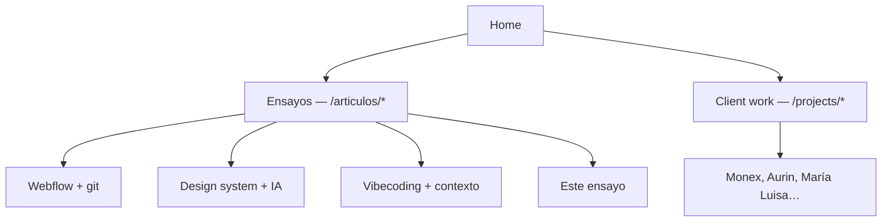
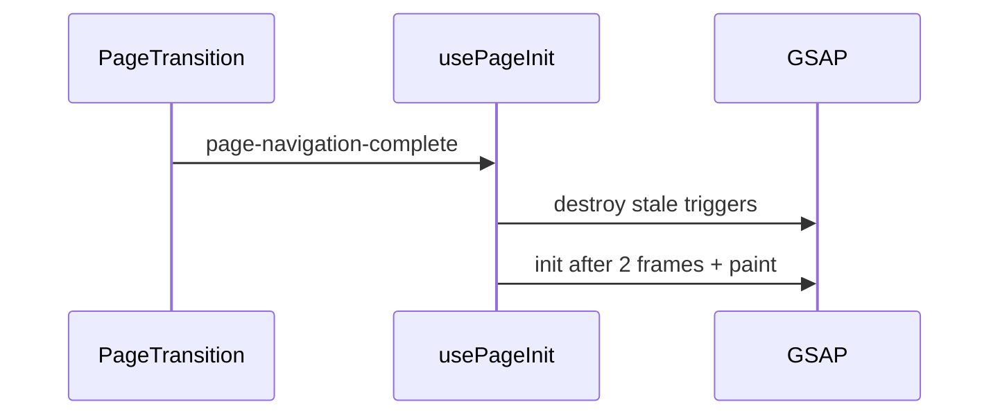
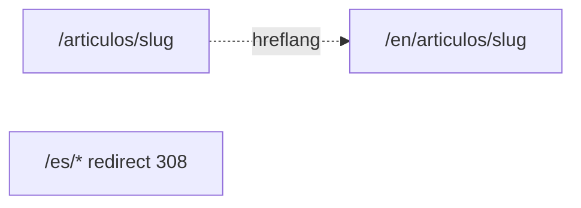
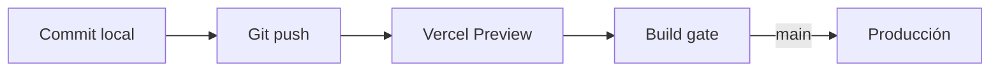
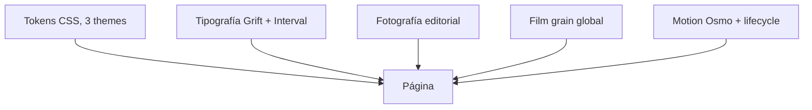

Hay un momento específico en casi todo portfolio de ingeniería. No está en elegir Next.js o Astro. Aparece cuando terminas el hero, las tres cards de proyecto y el footer — y te das cuenta de que ==el sitio se ve bien pero no demuestra cómo piensas.==

Puedes seguir afinando la animación del título. O puedes escribir un ensayo de 3.000 palabras sobre por qué Webflow y git no deberían pelear el mismo territorio. Pero si haces solo lo primero, pareces diseñadora. Si haces solo lo segundo sin que el sitio lo soporte, pareces blogger. ==Un portfolio de product engineer es el cliente más difícil que vas a tener:== no puedes decir "eso queda fuera de scope."

Pasé por eso construyendo este sitio. Los otros ensayos que ves aquí — [Webflow en producción](/es/articulos/atom-webflow), [El design system que una IA no puede alucinar](/es/articulos/design-system-that-ships-itself), [Desarrollo guiado por contexto](/es/articulos/context-driven-development-vibecoding) — documentan trabajo con clientes reales. Este texto documenta ==el contenedor que los hace coexistir==. Y está escrito con el mismo pipeline markdown que estás leyendo ahora, porque si no, sería hipocresía.

> [!info] Sustento externo
> Las decisiones de routing y motion siguen [App Router de Next.js](https://nextjs.org/docs/app), [routing de next-intl](https://next-intl.dev/docs/routing) y [GSAP con React](https://gsap.com/resources/React/). El código vive en [Portfolio2026](https://github.com/karenrebecag/Portfolio2026); la tabla de referencias al final es lo que envío cuando alguien quiere replicar el enfoque.

## El cliente más difícil eres tú

> **En pocas palabras:** Sin PM que corte scope, el portfolio se convierte en un side project infinito — a menos que pongas reglas.
En clientes, alguien eventualmente dice "ship." En tu propio portfolio, nadie lo dice. Puedes pasar dos semanas en un hover de botón porque ==no hay stakeholder que te frene.==

La trampa tiene dos caras:

- **Perfeccionismo de motion.** Cada transición puede ser un poco más suave. Cada heading puede splittearse mejor. El sitio nunca está "listo."
- **Parálisis de contenido.** Escribir ensayos largos es más lento que maquetar secciones. Es tentador publicar placeholders bonitos y prometer el texto después.

La regla que me salvó fue tratar el portfolio como producto con dos entregables obligatorios, no uno:

| Entregable | Qué demuestra | Si falta, qué pareces |
| --- | --- | --- |
| **La interfaz** | Craft, motion, tipografía, criterio visual | Diseñadora sin profundidad |
| **Los ensayos** | Cómo piensas bajo presión real | Ingeniera sin voz |

==No basta con uno.== Un theme bonito con copy genérico es indistinguible de cientos en Dribbble. Un blog técnico feo no convence a quien contrata product engineers. Este sitio tenía que ganar en ambos — con un presupuesto de tiempo que no explotara.

## Dos bandas, una home: ensayos vs. client work

> **En pocas palabras:** Pensamiento largo y resultados para clientes comparten lista pero no la misma profundidad — y eso es decisión de producto, no de carpetas.
La home muestra dos bandas bajo el mismo lenguaje visual:

| Banda | Ruta | Qué es |
| --- | --- | --- |
| **Ensayos de producto** | `/articulos/[slug]` | Arquitectura, IA, design systems — piezas enseñables |
| **Client work** | `/projects/[slug]` | Productos entregados — outcome primero |

No es solo organización de archivos. Es ==una promesa al lector:== si haces click en un ensayo, esperas profundidad y argumento. Si haces click en client work, esperas qué construiste y qué cambió para el equipo.

Cinco piezas largas viven en `/articulos/`. El resto — Monex, Aurin Task Manager, María Luisa, [arquitectura desacoplada por ownership](/es/projects/decoupled-ownership-non-technical-teams) — vive en `/projects/`. Cuando un proyecto tiene ensayo, la ruta corta redirige a la canónica. Un URL por intención; sin competir en SEO ni en la cabeza del visitante.

La pregunta que me hice no fue "¿Next.js o Astro?" Fue: ==¿cómo hago que alguien que llega desde LinkedIn entienda en diez segundos qué tipo de pieza está abriendo?==

## Sin CMS: el mismo contrato que predico en Webflow

> **En pocas palabras:** Si le digo a clientes que el copy largo vive en git, mi portfolio no puede depender de un panel de admin.
En [Webflow en producción](/es/articulos/atom-webflow) el argumento es explícito: marketing y ingeniería no deberían pelear la misma superficie sin contrato. Aquí soy las dos partes — pero ==el principio no cambia.==

Cada ensayo es markdown en git, importado en build, parseado a un renderer propio con bloques para Mermaid, código resaltado y callouts. Sin login. Sin CMS headless. Si quiero cambiar un párrafo, abro un PR. Si quiero añadir un diagrama, lo escribo en el `.md`.

Eso tiene un costo real: publicar un ensayo nuevo es más lento que en Notion. Pero tiene un beneficio que ningún CMS me da: ==los ensayos salen como code review.== Prosa y código en el mismo diff. Bilingüe lado a lado (`-es.md` / `-en.md`). Versionado con el resto del producto.

Y hay una prueba de fuego que no negocié: ==si el renderer no aguanta 3.000 palabras con TOC, scroll highlight y diagramas, el motion de la home no demuestra nada.== Los ensayos son el stress test. La home es el escaparate.

## Motion de verdad y el crédito que merece Osmo

> **En pocas palabras:** Osmo resolvió el motion. Yo me quedé con el diseño. División de trabajo honesta.
Voy a ser directa: ==la mayor parte del motion de este sitio no salió de mi cabeza.== Salió de [Osmo Supply](https://www.osmo.supply/), la plataforma de [Dennis Snellenberg](https://dennissnellenberg.com/) e [Ilja van Eck](https://www.iljavaneck.com/). Su [Vault](https://www.osmo.supply/product/vault) no es una librería npm: es el código real detrás de sitios premiados, con el detalle incómodo que un blog post nunca incluye.

Osmo me aportó un montón de motion. Yo diseñé. ==Esa división es el punto.== No reescribí navbar, footer, transiciones de página ni la animación de entrada desde cero. Adapté patrones del Vault a React/Next y me quedé con paleta, tipografía, fotografía y ritmo de secciones. Eso no es trampa: es la misma física que predico en clientes.

| Recurso Osmo | Dónde vive aquí | Qué me ahorró |
| --- | --- | --- |
| [Button 061](https://www.osmo.supply/product/button-pack) | `Button061` en todo el sitio | Semanas en easings de hover y focus |
| [Scaling Hamburger Navigation](https://www.osmo.supply/) | `navbar.tsx` + `navbar-scroll.ts` | Menú full-screen con timeline GSAP ya resuelto |
| [Footer Parallax Effect](https://www.osmo.supply/) | `footer.tsx` (`data-footer-parallax`) | Cierre con profundidad sin pelear el scroll |
| [Table of Contents for Article](https://www.osmo.supply/) | `article-toc.tsx` + `article-case-study-page.tsx` | Layout de lectura larga con TOC sticky |
| Mount animation (panel stagger) | `transition-overlay.tsx` | Primera impresión: columnas que caen y `page-ready` |
| [Lenis Smooth Scroll Setup](https://www.osmo.supply/) | `lenis-provider.tsx` | Scroll suave sin guerra con ScrollTrigger |
| [Check Section Theme on Scroll](https://www.osmo.supply/) | `section-theme-observer.tsx` | Nav y `theme-color` siguen la sección activa |
| [Page Transition Course](https://www.osmo.supply/product/page-transition-course) | `page-transition.tsx` | Wipe, prefetch, navegación mid-animation |
| Marquee / Draggable patterns | `additional-work`, stickers, logo wall | Interacción desktop con física creíble |

[Cassie Evans](https://gsap.com/resources/React/), la voz educativa de GSAP, lo dice mejor que yo: incluso si conoces la librería, ==aplicar animación abstracta a escenarios reales es otra disciplina.== Dennis e Ilja hicieron ese trabajo en público; yo lo porté a App Router y cableé el lifecycle.

El problema feo sigue existiendo en cualquier SPA con GSAP: navegas a un ensayo, vuelves atrás, los títulos desaparecen. Osmo te da el *qué* animar; ==tú sigues debiendo el *cuándo* reiniciar.==

`usePageInit` escucha `page-ready` en el primer load (tras el mount animation del overlay) y `page-navigation-complete` en cada ruta. Cleanup antes de re-init. `prefers-reduced-motion` corta el wipe: leer un ensayo tiene que funcionar sin espectáculo.

> [!tip] La prueba que uso: cinco idas y vueltas entre home y un ensayo sin refresh. Si el motion sobrevive eso, ship. Si no, es decoración.

## i18n y arquitectura de rutas

> **En pocas palabras:** Un sitio, dos idiomas, dos voces. Español como casa; inglés como puerta para quien contrata fuera de LATAM.

**i18n** (internacionalización) no es poner un botón "EN" en la esquina. Es decidir, desde la arquitectura, cómo vive el producto en más de un contexto: qué URL comparte un recruiter en Berlín, qué tono lee alguien en Ciudad de México, y qué pasa con el SEO cuando dos versiones compiten por el mismo slug.

El error clásico es tratar el idioma como skin: duplicar `/es/...` y `/en/...` por reflejo, o peor, pegar Google Translate en runtime y llamarlo "bilingüe". ==Eso produce URLs feas, copy que suena a robot, y ensayos que pierden el argumento en la traducción automática.==

### Tres decisiones desde fundamentos

**1. Locale por defecto con sentido de negocio.** Trabajo en LATAM; mi voz natural es español. Pero muchos hiring managers y clientes europeos leen en inglés. El default no es chauvinismo: es ==honrar al lector principal sin esconder la versión en otro idioma.==

**2. Una URL canónica por idioma, sin prefijos fantasma.** [next-intl](https://next-intl.dev/docs/routing) con `localePrefix: 'as-needed'`: español en `/` y `/articulos/...`; inglés bajo `/en/...`. Cualquier `/es/*` redirige con 308 a la ruta limpia. Google entiende el par; el usuario no ve duplicados.

**3. Contenido escrito dos veces, no traducido en caliente.** Copy corto de UI en `messages/es.json` y `en.json`. Ensayos largos en `-es.md` y `-en.md` en el mismo commit. ==Un ensayo en inglés no es la versión española pasada por DeepL: es el mismo argumento rehecho para otra audiencia.== [Frank Chimero](https://frankchimero.com/blog/) lo dice en *The Shape of Design*: el diseño es el espacio entre contexto y forma. En i18n, el contexto *es* el idioma.

### Cómo se cablea (sin perderse en carpetas)

Las rutas de Next separan intención, no solo idioma: `(main)` agrupa home, about y artículos; `(project)` agrupa case studies. Un registry (`article-projects.ts`) decide si un slug vive en `/articulos/` o `/projects/`. ==Es la misma disciplina que uso en martech con clientes: una URL, una intención, cero ambigüedad.== Aplicada a mi propia casa.

| Pregunta de arquitectura | Respuesta en este sitio |
| --- | --- |
| ¿Dónde vive el locale? | Segmento `[locale]` + middleware de next-intl |
| ¿Quién decide la URL canónica? | Config de routing + redirects 308 |
| ¿Dónde vive el copy largo? | Markdown por idioma en git |
| ¿Qué no hago? | Traducción automática en runtime |

## Despliegue y el pipeline que no te distrae

> **En pocas palabras:** Push a git, build en la nube, sitio en producción. La validación ocurre antes de que un visitante vea el error.

Elegí **no** montar infra propia. No hay Postgres, CMS ni Docker compose de medianoche. ==Eso no es pereza: es invertir el presupuesto de atención en diseño y ensayos, no en babysitting de servidores.==

### Por qué Vercel y un monorepo chico

`apps/web` vive en un monorepo Turbo + pnpm; `packages/shared` solo comparte tipos. [Vercel](https://vercel.com/docs) está cableado al repo: cada push dispara un build de producción de Next.js. Para un portfolio estático-heavy con route handlers puntuales (contacto vía Resend), ==el edge de Vercel es el sweet spot: SSR donde hace falta, estático donde puede serlo, cero máquina que parchear.==

[Tobias van Schneider](https://vanschneider.com/blog/) lleva años tratando su sitio personal como producto vivo. La lección que tomé: el pipeline debe ser tan aburrido que nunca pienses en él.

### Cómo funciona el pipeline (CI/CD lite)

No tengo un Jenkins corporativo. Tengo un pipeline con la misma lógica, recortado a lo que un portfolio necesita:

| Etapa | Qué valida | Por qué importa |
| --- | --- | --- |
| **Local** | `pnpm build` antes de push | Atrapa errores de TypeScript y rutas rotas sin gastar minutos de CI |
| **Preview (cualquier branch)** | Build completo de Next.js en Vercel | Cada branch tiene URL propia para revisar motion, i18n y ensayos |
| **Build gate** | Compilación TS, generación estática, imports de markdown, mensajes i18n | Si el ensayo no parsea o falta una key en `messages/en.json`, el deploy falla |
| **Producción (`main`)** | Mismo gate, dominio canónico | Lo que shippea es lo que ya pasó build |

El CI/CD real aquí es ==el build de Next.js como juez final==. No hay tests E2E de Playwright todavía. Sí hay la disciplina de que un deploy verde significa: tipos correctos, rutas resolubles, contenido bilingüe consistente, y el renderer de ensayos aguanta el stress test que describí arriba.

SEO y metadata (`llms.txt`, JSON-LD, sitemap) salieron en el primer deploy. El formulario de contacto es un route handler con Resend: una frontera server, sin Formspree. Aburrido. Correcto.

## Lo que de verdad me robó el sueño: diseño

> **En pocas palabras:** El motion impresiona en diez segundos. La paleta, la tipografía y la fotografía son lo que hacen que alguien se quede.
Si me preguntas qué hice yo (no Osmo, no Next.js, *yo*), la respuesta es ==diseño.== No elegí colores porque "se ven bien en Figma". Elegí un mundo visual porque quería que el sitio dijera algo antes de que leyeras la primera línea de un ensayo. El motion es el anfitrión; el diseño es la fiesta.

### Por qué tres themes (y no un dark mode genérico)

La mayoría de portfolios tienen light/dark y ya. Yo necesitaba ==tres temperaturas emocionales== para tres modos de lectura: editorial cálido (mi voz en LATAM), noche profunda (scroll largo, contraste alto), revista fría (tipografía y fotografía mandan). No es capricho estético: es que la home, los ensayos y el About no piden el mismo clima.

| Theme | Fondo | Texto | Acento | Por qué existe |
| --- | --- | --- | --- | --- |
| **Plantation** | `#fdf9ed` | `#11221f` | `#366B5E` | Crema cálida + verde bosque: editorial, LATAM sin cliché tropical |
| **Night** | `#0c0e0a` | `#ECDFCC` | `#5FA28F` | Lectura nocturna; el acento respira sin gritar |
| **Mono Slate** | `#e8e6e1` | `#1c2028` | `#6a9dae` | Revista fría; la foto y la tipografía son protagonistas |

### Armonía de color (los cuadritos no mienten)

La paleta no es "tres colores bonitos". Es una relación: fondo, texto y acento que se sostienen en contraste y temperatura. `--plantation` es el hilo conductor: ==un solo acento semántico== que cambia de matiz con el theme pero mantiene el mismo rol (hover, highlight, número de servicio, rotating text).

| Rol | Plantation | Night | Mono Slate |
| --- | --- | --- | --- |
| Fondo | `#fdf9ed` | `#0c0e0a` | `#e8e6e1` |
| Texto | `#11221f` | `#ECDFCC` | `#1c2028` |
| Acento | `#366B5E` | `#5FA28F` | `#6a9dae` |
| Superficie oscura | `#11221f` | `#070806` | `#14171d` |

Mira la fila de acentos: verde bosque → verde menta → azul acero. ==Misma función, distinta temperatura.== Eso es colorimetría con intención, no hex sueltos. Los tokens viven en `globals.css`; [W3C Design Tokens](https://www.designtokens.org/) formaliza el formato, pero aquí la regla es más simple: pocas variables, nombres que significan algo.

### Tipografía: tres voces, un sistema

No usé Inter para todo porque ==Inter para todo es la tipografía equivalente a no decidir nada.== Quería que el sitio sonara como yo hablo en una call y como escribo en un ensayo: directa en los títulos, precisa en los metadatos, vulnerable solo donde toca.

| Familia | Rol | Por qué la elegí |
| --- | --- | --- |
| **Grift** | Display / headings | Peso y carácter; el nombre en el hero tiene que sentirse editorial, no startup |
| **TBJ Interval** | Labels, pills, metadata | Voz técnica pero humana; los números de servicio y el TOC leen "ingeniera que diseña" |
| **Gantol** | Solo About | Manuscrita, otra temperatura; una página personal merece otra piel |

[Jesper Landberg](https://twitter.com/jesperlandberg) habla de sitios donde la tipografía *es* la interfaz. No llegué a ese extremo, pero la jerarquía tipográfica es lo primero que notas después del motion: ==Grift grita, Interval susurra, Gantol confiesa.==

### Fotografía: Vogue editorial + calma japonesa

La foto del hero no es stock de "mujer en laptop sonriendo". Es un retrato en campo, luz difusa, composición con aire. La referencia consciente es doble: ==editorial tipo Vogue== (presencia, mirada, textura de piel y tela que aguanta pantalla grande) y ==estética japonesa de calma== (espacio negativo, sujeto pequeño en paisaje amplio, nada compite con el silencio visual).

Por eso el hero es oscuro aunque la foto sea de día: el gradiente no es decoración, es legibilidad sin matar la atmósfera. Y por eso en theme **Mono** las fotos del marquee y la galería llevan filtros ajustados a mano: no para "arreglar" la imagen, sino para que ==todas hablen el mismo idioma visual== aunque vengan de sesiones distintas.

Sobre todo el sitio hay **film grain** al 3.5% de opacidad. Casi invisible. Sin eso, los fondos crema se sentían digitales de más; con eso, parecen una superficie que puedes tocar. Ese detalle salió de mirar el sitio a las 11pm y decir "algo falta."

### Ritmo: por qué la home oscura y los proyectos claros

No alterné secciones claras y oscuras porque "se ve dinámico". Lo hice porque ==cada banda de la home tiene un trabajo distinto:== el hero introduce (oscuro, cinematográfico), los proyectos enseñan (claro, legible), el contacto cierra (oscuro, íntimo). El observer de Osmo sincroniza nav y `theme-color` mientras scrolleas para que el browser chrome no luche con la sección activa.

Como en [Everything Easy is Hard Once You've Run Out of Money](https://frankchimero.com/blog/2018/everything-easy/) de Chimero: lo que parece fluidez es decisión acumulada. Aquí, decisión de color, tipo y foto antes que otra animación.

## Referencias (externas, para guardar)

> **En pocas palabras:** Fuentes detrás del craft: motion, diseño, i18n, deploy.
| Tema | Fuente |
| --- | --- |
| Osmo Supply (Vault, motion, layout) | [osmo.supply](https://www.osmo.supply/) |
| Page Transition Course (Dennis & Ilja) | [osmo.supply/product/page-transition-course](https://www.osmo.supply/product/page-transition-course) |
| GSAP + escenarios reales | [Cassie Evans, GSAP resources](https://gsap.com/resources/React/) |
| Diseño como oficio | [Frank Chimero, The Shape of Design](https://shapeofdesignbook.com/) |
| Sitio personal como producto | [Tobias van Schneider, blog](https://vanschneider.com/blog/) |
| Routing bilingüe | [next-intl, routing](https://next-intl.dev/docs/routing) |
| Design Tokens (formato) | [designtokens.org](https://www.designtokens.org/) |
| Deploy | [Vercel Docs](https://vercel.com/docs) |
| Código fuente | [github.com/karenrebecag/Portfolio2026](https://github.com/karenrebecag/Portfolio2026) |

## El aprendizaje real

> **En pocas palabras:** El portfolio no es tu CV animado. Es el producto más chico donde demuestras de qué lado te paraste.
Me encanta construir interfaces. No lo digo como slogan. Lo digo porque ==pasé más horas eligiendo el verde `--plantation` que debatiendo si usar Turbopack.== Y está bien. Eso es el trabajo.

Osmo me compró tiempo para eso. next-intl me compró credibilidad bilingüe sin hacks. Vercel me compró olvidarme del deploy. Pero el diseño (la paleta crema que no es beige aburrido, el grain que nadie nota a propósito, la foto que en Mono deja de parecer stock) ==no lo venden en ningún Vault.== Eso lo haces tú o no existe.

Los otros ensayos de este sitio cubren Webflow, design systems, vibecoding y arquitectura por ownership. Este cubre el contenedor y la verdad incómoda de armar tu propia casa: el motion impresiona, pero ==la gente se queda por el gusto.==

Si estás construyendo el tuyo, contrata ayuda donde tenga sentido (Osmo, un typeface, un curso de transiciones). Quédate con lo que solo tú puedes aportar. Y ponle fecha de entrega, porque el cliente más difícil eres tú, y ese cliente adora un hover perfecto más de lo que debería.