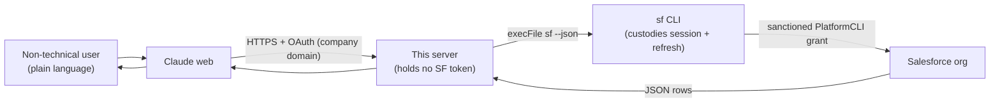
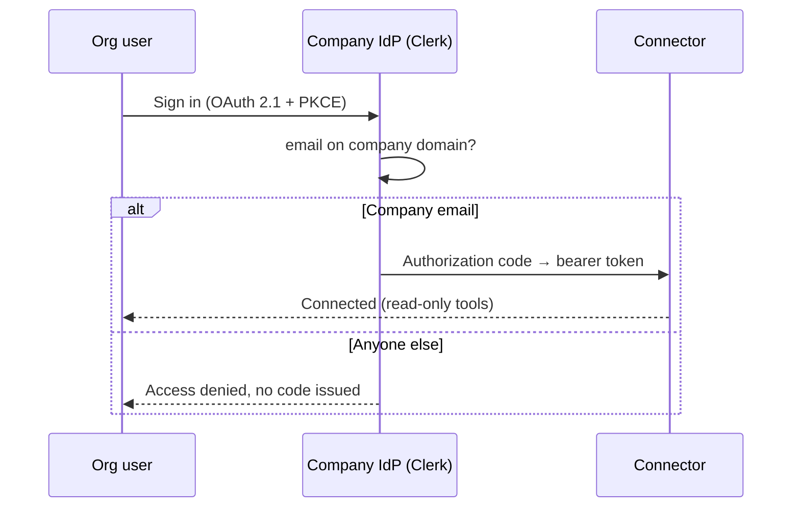
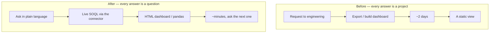

> [!tip] In 30 seconds
> - **The outcome:** Non-technical sales, ops, and marketing at a brokerage regulated across nine jurisdictions now query a live Salesforce org in plain language inside Claude web. Cross-cuts that meant a two-day dashboard request to engineering are self-served in minutes. **No new Salesforce credential was issued and the org's OAuth attack surface did not grow.**
> - **The constraint:** A regulated brokerage, by design, does not let arbitrary integrations create OAuth clients (Connected Apps). The standard remote-connector recipe was off the table on purpose, not by accident. The question was never "how do I get admin," it was "how do I ship this without weakening a control the org has for good reasons."
> - **The design:** Reuse the OAuth grant Salesforce already sanctions for its own CLI instead of minting a new long-lived secret; gate connection behind a company-domain OAuth flow so only org members can add the connector; enforce read-only and a SELECT-only allow-list in code; hold zero Salesforce credentials in the app; ground the model in a curated schema so it cannot invent the data model.

At a brokerage regulated across nine jurisdictions, the CRM *is* the business: hundreds of thousands of leads and accounts, dozens of BDMs across 24 locations, campaigns running on several continents. The data was rich and the access was narrow. Every cross-cut, *"live accounts in Singapore this quarter, by BDM,"* was a SOQL job or a two-day dashboard request that landed on engineering.

I shipped a connector that lets the commercial side ask those questions in plain language, in Claude web, against live data. It ==holds no Salesforce credential, can only read, and required the org to provision no new OAuth client and widen no trust.== The engineering that made that safe, not a workaround, is the subject of this piece.

This is the fourth piece in a series about where the boundaries go when humans and AI share a system. The other three are about context for *product*, *brand*, and *visual delivery*. This one is about context for ==enterprise data under a security model you respect rather than route around.==

## The problem: rich data, narrow access, a control you don't get to bypass

> **In plain terms:** A regulated firm's data is valuable precisely because access is locked down. The job was to widen access for people without loosening the locks.
The commercial teams were blocked on engineering for nearly every question. A new segment, a campaign read, a BDM leaderboard: each was a ticket, and each ticket was roughly two days of someone's time. Years of historical records sat effectively out of reach for anyone who didn't write SOQL.

The obvious fix, a Claude-web remote connector, runs into a wall that is itself a feature. A remote connector authenticates over OAuth. OAuth against Salesforce needs a **Connected App**. Creating one needs the `Manage Connected Apps` permission, an admin capability a regulated brokerage restricts on purpose. ==That is the org working as intended, not an obstacle to be escalated away.==

There was a second reason not to want a Connected App even if I could have had one. A new OAuth client is a new long-lived secret to store, rotate, and defend. It is more attack surface and more audit burden on a firm that already answers to nine regulators. So the question that actually mattered was sharper than "how do I get access": ==how do I deliver this without creating a new credential or asking the org to relax a control it holds for good reasons?==

## The design: reuse a credential that already exists, mint nothing

> **In plain terms:** Borrow the session Salesforce already issued to its own command-line tool, so the connector introduces no new secret to leak.
Salesforce already sanctions exactly one OAuth grant that fits: the pre-installed `PlatformCLI` connected app behind the `sf` CLI. The asymmetry that the whole design turns on is small. ==Authorizing an *existing* connected app is a normal API-user action; *creating* one needs admin.== Running `sf org login device` authorizes `PlatformCLI` as that user, inside their existing rights, through an already-audited flow. Nothing new is provisioned.

So the server mints no credential and stores none. It shells out to the CLI, which custodies and refreshes the session; the application's secret-holding surface is ==zero.==

```typescript src/salesforce.ts — the server never holds a token
/**
 * The server shells out to the locally-authenticated Salesforce CLI instead of
 * holding any OAuth token itself. The CLI owns the session (it transparently
 * refreshes the access token from the refresh token in its keychain), so this
 * process never sees or stores a credential.
 *
 * execFile (no shell) is used so query/sobject arguments cannot be interpreted
 * by a shell — no command injection.
 */
export function query(soql: string): Promise<unknown> {
  return runSf(['data', 'query', '--query', soql, '--target-org', targetOrg()]);
}
```

The `execFile` choice is part of the security posture, not a detail. The SOQL text originates from an LLM, which originates from a human typing prose. Routing that through a shell would be a command-injection surface. ==`execFile` passes arguments as a vector, never as a shell string,== so untrusted input is data, never code.



This rides the supported CLI OAuth refresh flow, not the username/password flow Salesforce restricts from 2026. The one credential involved stays where Salesforce already put it: in the CLI's keychain on the host, refreshed by the tool that owns it, never touched by my code.

## Why it runs as a hardened service, not serverless

> **In plain terms:** Where the credential is allowed to live dictates the runtime. It isn't an infrastructure preference, it's a custody decision.
The custody model is the constraint. The OAuth session has to live in the host's keychain, never in application code or environment variables. That single requirement rules out serverless: Vercel and Cloudflare Workers can neither custody a refreshing CLI session nor keep it warm between requests.

So the connector runs as a ==hardened, long-lived service behind TLS,== on deliberately minimal and isolated infrastructure. The point of the host is custody and isolation, not scale. The credential never enters the application's memory or config; the process only ever handles JSON results coming back out.

> [!note] The runtime is a consequence of the threat model, not a leftover. Once you decide the app will never hold a Salesforce secret, you have also decided it cannot be serverless. The architecture follows from where the credential is allowed to live.

## The access model: only the company can connect

> **In plain terms:** Adding the connector in Claude web requires a company login; only an org email on the company domain gets through. A stranger who finds the URL can't connect.
The endpoint is not open. To add it in Claude web, a user goes through an OAuth 2.1 flow with PKCE against the company identity provider, and the gate opens only for an email on the company domain. Random internet users cannot complete it even if they discover the URL. This is the same ==domain-gated MCP auth I built for [my design-system MCP](/en/articulos/design-system-that-ships-itself):== identity through Clerk, a company-email check before any token is minted, OAuth discovery at `/.well-known/oauth-authorization-server`, and a short-lived authorization code exchanged for a bearer token at `/api/token`.

```typescript The gate that runs before any token is issued
// Same pattern as the design-system MCP: company identity, company domain
const email = user?.primaryEmailAddress?.emailAddress;
if (!email?.endsWith(COMPANY_DOMAIN)) {
  return new Response('Access denied. Only company accounts can connect.', { status: 403 });
}
```



Behind that gate, the containment is structural and holds even for a valid user. The connector is ==read-only by construction:== no create, update, or delete path exists in the code, and the query tool refuses anything that is not a `SELECT`.

```typescript src/tools/soql-query.ts — SELECT or nothing
const SELECT_ONLY = /^\s*SELECT\s/i;

if (!SELECT_ONLY.test(soql)) {
  return {
    isError: true,
    content: [{ type: 'text', text: 'Only read-only SOQL SELECT queries are allowed.' }],
  };
}
```

| An attacker, or a curious insider | The design's answer |
|-----------------------------------|---------------------|
| Isn't on the company domain | The OAuth gate never issues a token; they cannot connect at all |
| Connects, then tries to write or delete | No write path exists; only `SELECT` reaches the org |
| Injects through the query string | `execFile`, no shell, so the query is an argument, not code |
| Tries to steal the Salesforce credential | The app holds none; the token lives in the host keychain |
| Reads data | Bounded to exactly what one least-privilege service account can already see |

==The worst case is a company user making a read a single limited account was already entitled to make.== Connection is per-user and company-only; execution is read-only and least-privilege. The two together are what make this safe to share.

I am precise about what remains rather than hiding it: the OAuth gate authenticates *who connects*, but the Salesforce session underneath is still a single shared service identity, so org-side audit ties to the service account, not the individual. That is the one open item, and it has a clear path: ==per-user Salesforce identity the day a Connected App can be provisioned through proper change control.== A roadmap, not a gap I'm papering over.

## Grounding the model: a schema it can't invent

> **In plain terms:** Even with access solved, the model confidently queried tables and fields that don't exist in this org. It needed a small, true map.
Access was the first half. The first real queries still failed, not with errors but with ==confident nonsense.==

The model asked for an `Opportunity` object. There isn't one: this org's pipeline is **Lead → Account**, conversion-based, and `Opportunity` does not exist here. It grouped by `OwnerId` when "BDM" in this business *is* the record owner, reached through the `Owner.Name` relationship. It guessed a generic `Country__c` when every object carries its own ISO-3 picklist: `Country_of_Residence_Lead__c` on Lead, `Country_of_Residence_Account__c` on Account. None of that is in the model's training data; it is specific to this org.

The naive fix, letting the model call `describe` and read the real fields, backfires. ==`Lead` alone has 418 fields.== Dumping that into context bloats the window and *raises* the odds of a plausible-but-wrong guess. More schema, worse answers.

The fix is the same discipline I apply everywhere AI meets a system: give it a ==small, true surface== instead of a large, ambiguous one. I published a curated data dictionary as an MCP resource (`schema://atfx`) and put the highest-signal facts directly in the server instructions the model reads on connect.

```typescript src/schema.ts — curated, not exhaustive
/**
 * This is intentionally NOT the full schema: Lead alone has 418 fields. Dumping
 * everything would bloat context and mislead the model. Listed here are the
 * high-signal fields and picklist values for the objects users actually query.
 */
```

The instructions lead with the three facts that kill the three failures:

> [!note] From the server's own instructions
> - Pipeline is **Lead → Account**. **No Opportunity object exists**, never query it.
> - **"BDM" = record Owner.** Group/filter by the `Owner.Name` relationship, not OwnerId.
> - **Country = ISO-3 picklists, per object** (`Country_of_Residence_Lead__c`, `Country_of_Residence_Account__c`, …).

Alongside the facts, a handful of verified SOQL patterns the model leans on instead of improvising:

```sql Leads this month by BDM
SELECT Owner.Name, COUNT(Id) FROM Lead
WHERE CreatedDate = THIS_MONTH
GROUP BY Owner.Name ORDER BY COUNT(Id) DESC
```

This is the same lesson as [the design system an AI can't hallucinate](/en/articulos/design-system-that-ships-itself): the cure for hallucination is not a smarter model, it is ==removing the surface where invention was possible.== There it meant separating what an agent can know from what it can do. Here it means a curated dictionary, with `describe` kept in reserve for the rare case that genuinely needs exhaustive detail. Same discipline, different system.

## The outcome: from two-day dashboards to minutes

> **In plain terms:** What changed for the business, concretely, and what it cost the org's security posture: nothing.
The connector was never the point. The point is what stops being slow, and what stays safe, once it exists.

**For data work**, the team moved from building presentation dashboards *on top of* Salesforce to ==generating dashboards in HTML directly in Claude web== and pulling records straight into Python with pandas for real analysis. Query, shape, and chart stop being three tools and three handoffs and become one conversation. A dashboard that took ==two days now takes minutes.==

**For marketing**, huge historical records became something to ==reason with conversationally:== BDM performance, campaign outcomes, cohort behavior across countries, explored at a high level in plain language without a SQL analyst in the loop. That feeds simple, data-backed strategy, draft reports, and automation triggers, all argued against live numbers instead of a stale export.

And the part a security reviewer cares about, stated as an outcome rather than a footnote: ==only company accounts can connect, no new Salesforce credential was issued, the org's OAuth attack surface did not grow, and every path is read-only by construction.== Access widened for people without a single control being loosened.



## What I'd do again (and what I'm tightening)

> **In plain terms:** The decisions that made this considered engineering rather than a clever bypass.
**Would repeat:**

- Deliver inside the security model, not around it. ==Reusing a sanctioned grant beat acquiring a new one,== even when a new Connected App would have been the faster recipe.
- No new credential, no new secret in the app. The smallest credential surface is no credential surface.
- Gate connection behind company-domain OAuth, reusing a pattern I'd already shipped, so only the org can add the connector.
- Read-only and a SELECT-only allow-list at the tool boundary, so containment held even for a valid, authenticated user.
- A curated schema resource over raw `describe`: less context, fewer hallucinations, better answers.

**Tightening next:**

- Per-user Salesforce identity and org-side per-user audit the moment a Connected App can be provisioned through change control, the one thing the shared service session still gives up.
- Query-cost guards (row caps and timeouts are in; spend caps next) so an expensive aggregate can't degrade the service.
- A typed cache in front of `describe` so repeated lookups don't re-hit the org.
- A sanitized public reference repo; operational specifics stay private.

## References (worth bookmarking)

> **In plain terms:** The sources behind the architecture and the company facts.
| Topic | Source |
|-------|--------|
| Model Context Protocol (resources + tools) | [modelcontextprotocol.io](https://modelcontextprotocol.io/specification/2025-11-25/server/tools) |
| MCP launch + motivation | [Anthropic — Model Context Protocol](https://www.anthropic.com/news/model-context-protocol) |
| Salesforce CLI (`sf`) auth & device login | [Salesforce CLI docs](https://developer.salesforce.com/docs/atlas.en-us.sfdx_cli_reference.meta/sfdx_cli_reference/cli_reference_org_commands_unified.htm) |
| ATFX — who they are | [ATFX — About us](https://www.atfx.com/en/about-us) |
| ATFX — regulation & footprint | [FXEmpire — ATFX review](https://www.fxempire.com/brokers/atfx) |

## The real lesson

> **In plain terms:** The move wasn't a clever bypass. It was refusing to widen the attack surface to ship a feature.
The most defensible decision in this project was ==declining to create a new credential to solve an access problem.== The fast recipe wanted a Connected App and per-user OAuth. Even with admin in hand, that would have meant a new long-lived secret on a firm that answers to nine regulators. So I asked a smaller, harder question: what is the *most* a normal, already-trusted API user can do, and how little do I have to add on top of that to make it safe to share?

The answer was a session Salesforce already grants its own CLI, wrapped in read-only, SELECT-only, least-privilege boundaries, fed a curated map so the model can't invent the territory. ==The constraint didn't shrink the design. It chose it, and the result is more defensible than the recipe I was "supposed" to build.==

An integration boundary is a security boundary wearing a different hat. You don't earn the value by skipping the boundary. You earn it by designing the smallest, safest thing the access you already have can support, and proving it can only do what you say it can.
