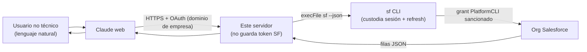
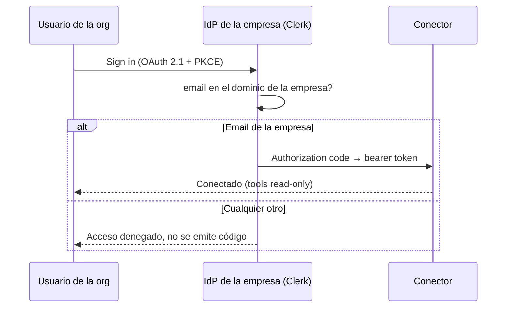
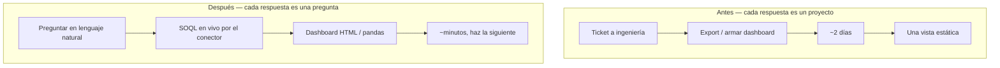

> [!tip] En 30 segundos
> - **El outcome:** Ventas, ops y marketing no técnicos de una brokerage regulada en nueve jurisdicciones ahora consultan un Salesforce en vivo en lenguaje natural dentro de Claude web. Cruces de datos que eran un reporte de dos días para ingeniería se autoatienden en minutos. **No se emitió ninguna credencial nueva de Salesforce y la superficie de ataque OAuth de la org no creció.**
> - **La restricción:** Una brokerage regulada, por diseño, no deja que integraciones arbitrarias creen clientes OAuth (Connected Apps). La receta estándar de conector remoto estaba descartada a propósito, no por accidente. La pregunta nunca fue "cómo consigo admin", fue "cómo envío esto sin debilitar un control que la org tiene por buenas razones".
> - **El diseño:** Reutilizar el grant OAuth que Salesforce ya sanciona para su propio CLI en lugar de acuñar un secreto nuevo de larga vida; proteger la conexión detrás de un flujo OAuth con gate de dominio para que solo miembros de la org puedan agregar el conector; forzar read-only y un allow-list de solo SELECT en el código; cero credenciales de Salesforce en la app; anclar al modelo en un schema curado para que no pueda inventar el modelo de datos.

En una brokerage regulada en nueve jurisdicciones, el CRM *es* el negocio: cientos de miles de leads y cuentas, decenas de BDMs en 24 ubicaciones, campañas corriendo en varios continentes. La data era rica y el acceso era angosto. Cada cruce, *"cuentas Live en Singapur este trimestre, por BDM,"* era un trabajo de SOQL o un reporte de dos días que caía en ingeniería.

Envié un conector que deja al lado comercial hacer esas preguntas en lenguaje natural, en Claude web, contra data en vivo. ==No guarda ninguna credencial de Salesforce, solo puede leer, y no requirió que la org aprovisionara ningún cliente OAuth nuevo ni ampliara ninguna confianza.== La ingeniería que hizo eso seguro, no un atajo, es el tema de esta pieza.

Esta es la cuarta pieza de una serie sobre dónde van los límites cuando humanos e IA comparten un sistema. Las otras tres tratan el contexto para *producto*, *marca* y *entrega visual*. Esta trata el contexto para ==datos empresariales bajo un modelo de seguridad que respetas en lugar de rodear.==

## El problema: data rica, acceso angosto, un control que no te toca saltarte

> **En pocas palabras:** La data de una firma regulada vale precisamente porque el acceso está cerrado. El trabajo era ampliar el acceso para personas sin aflojar los cerrojos.
Los equipos comerciales estaban bloqueados en ingeniería para casi cualquier pregunta. Un segmento nuevo, la lectura de una campaña, un ranking de BDMs: cada uno era un ticket, y cada ticket era cerca de dos días del tiempo de alguien. Años de registros históricos quedaban prácticamente fuera de alcance para quien no escribía SOQL.

El arreglo obvio, un conector remoto de Claude web, choca con un muro que es en sí mismo una feature. Un conector remoto se autentica por OAuth. OAuth contra Salesforce necesita un **Connected App**. Crear uno necesita el permiso `Manage Connected Apps`, una capacidad de admin que una brokerage regulada restringe a propósito. ==Eso es la org funcionando como debe, no un obstáculo que se escala para quitarlo de en medio.==

Había una segunda razón para no querer un Connected App aun pudiendo crearlo. Un cliente OAuth nuevo es un secreto nuevo de larga vida que almacenar, rotar y defender. Es más superficie de ataque y más carga de auditoría sobre una firma que ya responde a nueve reguladores. Así que la pregunta que de verdad importaba era más afilada que "cómo consigo acceso": ==cómo entrego esto sin crear una credencial nueva ni pedirle a la org que relaje un control que tiene por buenas razones.==

## El diseño: reutiliza una credencial que ya existe, no acuñes nada

> **En pocas palabras:** Pide prestada la sesión que Salesforce ya le emitió a su propia herramienta de línea de comandos, para que el conector no introduzca ningún secreto nuevo que filtrar.
Salesforce ya sanciona exactamente un grant OAuth que encaja: la connected app preinstalada `PlatformCLI` detrás del `sf` CLI. La asimetría sobre la que gira todo el diseño es pequeña. ==Autorizar una connected app *existente* es una acción normal de un usuario de API; *crear* una necesita admin.== Correr `sf org login device` autoriza `PlatformCLI` como ese usuario, dentro de sus derechos existentes, por un flujo ya auditado. No se aprovisiona nada nuevo.

Así que el servidor no acuña credencial y no almacena ninguna. Hace `shell out` al CLI, que custodia y refresca la sesión; la superficie de la aplicación que guarda secretos es ==cero.==

```typescript src/salesforce.ts — el servidor nunca guarda un token
/**
 * El servidor hace shell out al Salesforce CLI autenticado localmente en lugar
 * de guardar él mismo un token OAuth. El CLI es dueño de la sesión (refresca de
 * forma transparente el access token desde el refresh token en su keychain), así
 * que este proceso nunca ve ni almacena una credencial.
 *
 * Se usa execFile (sin shell) para que los argumentos de query/sobject no puedan
 * ser interpretados por un shell — sin inyección de comandos.
 */
export function query(soql: string): Promise<unknown> {
  return runSf(['data', 'query', '--query', soql, '--target-org', targetOrg()]);
}
```

La elección de `execFile` es parte de la postura de seguridad, no un detalle. El texto SOQL se origina en un LLM, que se origina en un humano tecleando prosa. Pasar eso por un shell sería una superficie de inyección de comandos. ==`execFile` pasa los argumentos como vector, nunca como string de shell,== así que la entrada no confiable es data, nunca código.



Esto va sobre el flujo soportado de refresh OAuth del CLI, no el flujo usuario/contraseña que Salesforce restringe desde 2026. La única credencial involucrada se queda donde Salesforce ya la puso: en el keychain del CLI en el host, refrescada por la herramienta que es su dueña, nunca tocada por mi código.

## Por qué corre como servicio endurecido, no serverless

> **En pocas palabras:** Dónde se le permite vivir a la credencial dicta el runtime. No es una preferencia de infraestructura, es una decisión de custodia.
El modelo de custodia es la restricción. La sesión OAuth tiene que vivir en el keychain del host, nunca en código de aplicación ni en variables de entorno. Ese solo requisito descarta serverless: Vercel y Cloudflare Workers no pueden custodiar una sesión de CLI que se refresca ni mantenerla caliente entre requests.

Así que el conector corre como un ==servicio endurecido y de larga vida detrás de TLS,== en infraestructura deliberadamente mínima y aislada. El propósito del host es custodia y aislamiento, no escala. La credencial nunca entra a la memoria ni a la config de la aplicación; el proceso solo maneja los resultados JSON que salen de vuelta.

> [!note] El runtime es consecuencia del threat model, no una sobra. Una vez que decides que la app nunca va a guardar un secreto de Salesforce, también decidiste que no puede ser serverless. La arquitectura se desprende de dónde se le permite vivir a la credencial.

## El modelo de acceso: solo la empresa puede conectar

> **En pocas palabras:** Agregar el conector en Claude web requiere un login de la empresa; solo pasa un email de la org en el dominio de la compañía. Un extraño que encuentre la URL no puede conectar.
El endpoint no es abierto. Para agregarlo en Claude web, el usuario pasa por un flujo OAuth 2.1 con PKCE contra el proveedor de identidad de la empresa, y la puerta abre solo para un email en el dominio de la compañía. Usuarios random de internet no pueden completarlo aunque descubran la URL. Este es el mismo ==auth MCP con gate de dominio que construí para [mi MCP del design system](/es/articulos/design-system-that-ships-itself):== identidad por Clerk, un chequeo de email de la empresa antes de emitir cualquier token, discovery OAuth en `/.well-known/oauth-authorization-server`, y un authorization code de corta vida que se intercambia por un bearer token en `/api/token`.

```typescript La puerta que corre antes de emitir cualquier token
// Mismo patrón que el MCP del design system: identidad y dominio de la empresa
const email = user?.primaryEmailAddress?.emailAddress;
if (!email?.endsWith(COMPANY_DOMAIN)) {
  return new Response('Access denied. Only company accounts can connect.', { status: 403 });
}
```



Detrás de esa puerta, la contención es estructural y se sostiene aun para un usuario válido. El conector es ==read-only por construcción:== no existe vía de create, update ni delete en el código, y la herramienta de query rechaza cualquier cosa que no sea un `SELECT`.

```typescript src/tools/soql-query.ts — SELECT o nada
const SELECT_ONLY = /^\s*SELECT\s/i;

if (!SELECT_ONLY.test(soql)) {
  return {
    isError: true,
    content: [{ type: 'text', text: 'Only read-only SOQL SELECT queries are allowed.' }],
  };
}
```

| Un atacante, o un insider curioso | La respuesta del diseño |
|-----------------------------------|-------------------------|
| No está en el dominio de la empresa | El gate OAuth nunca emite token; no puede conectar en absoluto |
| Conecta y luego intenta escribir o borrar | No existe vía de escritura; solo `SELECT` llega a la org |
| Inyecta por el string de la query | `execFile`, sin shell, así que la query es argumento, no código |
| Intenta robar la credencial de Salesforce | La app no guarda ninguna; el token vive en el keychain del host |
| Lee data | Acotado a exactamente lo que una cuenta de servicio de menor privilegio ya podía ver |

==El peor caso es un usuario de la empresa haciendo una lectura que una sola cuenta limitada ya estaba autorizada a hacer.== La conexión es por usuario y solo de la empresa; la ejecución es read-only y de menor privilegio. Las dos juntas son lo que lo hace seguro de compartir.

Soy precisa sobre lo que queda en vez de esconderlo: el gate OAuth autentica *quién conecta*, pero la sesión de Salesforce por debajo sigue siendo una sola identidad de servicio compartida, así que la auditoría del lado de la org se ata a la cuenta de servicio, no al individuo. Ese es el único pendiente, y tiene una vía clara: ==identidad por usuario en Salesforce el día que un Connected App pueda aprovisionarse por control de cambios apropiado.== Un roadmap, no un hueco que estoy tapando.

## Anclar al modelo: un schema que no puede inventar

> **En pocas palabras:** Aun con el acceso resuelto, el modelo consultaba con confianza tablas y campos que no existen en esta org. Necesitaba un mapa chico y verdadero.
El acceso era la primera mitad. Las primeras queries reales igual fallaban, no con errores sino con ==tonterías seguras de sí mismas.==

El modelo pedía un objeto `Opportunity`. No hay: el pipeline de esta org es **Lead → Account**, basado en conversión, y `Opportunity` no existe aquí. Agrupaba por `OwnerId` cuando "BDM" en este negocio *es* el dueño del registro, alcanzado por la relación `Owner.Name`. Adivinaba un `Country__c` genérico cuando cada objeto carga su propio picklist ISO-3: `Country_of_Residence_Lead__c` en Lead, `Country_of_Residence_Account__c` en Account. Nada de eso está en los datos de entrenamiento del modelo; es específico de esta org.

El arreglo ingenuo, dejar que el modelo llame a `describe` y lea los campos reales, sale por la culata. ==Solo `Lead` tiene 418 campos.== Volcar eso en el contexto infla la ventana y *sube* las probabilidades de una adivinanza creíble pero incorrecta. Más schema, peores respuestas.

El arreglo es la misma disciplina que aplico en todos lados donde la IA toca un sistema: darle una ==superficie chica y verdadera== en vez de una grande y ambigua. Publiqué un diccionario de datos curado como recurso MCP (`schema://atfx`) y puse los hechos de mayor señal directamente en las instrucciones del servidor que el modelo lee al conectar.

```typescript src/schema.ts — curado, no exhaustivo
/**
 * Esto a propósito NO es el schema completo: solo Lead tiene 418 campos. Volcar
 * todo inflaría el contexto y confundiría al modelo. Aquí están los campos de
 * alta señal y los valores de picklist de los objetos que la gente sí consulta.
 */
```

Las instrucciones abren con los tres hechos que matan los tres fallos:

> [!note] De las propias instrucciones del servidor
> - El pipeline es **Lead → Account**. **No existe objeto Opportunity**, nunca lo consultes.
> - **"BDM" = Owner del registro.** Agrupa/filtra por la relación `Owner.Name`, no por OwnerId.
> - **País = picklists ISO-3, por objeto** (`Country_of_Residence_Lead__c`, `Country_of_Residence_Account__c`, …).

Junto a los hechos, un puñado de patrones SOQL verificados en los que el modelo se apoya en vez de improvisar:

```sql Leads de este mes por BDM
SELECT Owner.Name, COUNT(Id) FROM Lead
WHERE CreatedDate = THIS_MONTH
GROUP BY Owner.Name ORDER BY COUNT(Id) DESC
```

Esta es la misma lección de [el design system que una IA no puede alucinar](/es/articulos/design-system-that-ships-itself): la cura contra la alucinación no es un modelo más listo, es ==quitar la superficie donde la invención era posible.== Allá fue separar lo que un agente puede saber de lo que puede hacer. Aquí es un diccionario curado, con `describe` en reserva para el caso raro que de verdad necesita detalle exhaustivo. La misma disciplina, distinto sistema.

## El outcome: de dashboards de dos días a minutos

> **En pocas palabras:** Qué cambió para el negocio, concretamente, y qué le costó a la postura de seguridad de la org: nada.
El conector nunca fue el punto. El punto es qué deja de ser lento, y qué se mantiene seguro, una vez que existe.

**Para trabajo de datos**, el equipo pasó de construir dashboards de presentación *encima de* Salesforce a ==generar dashboards en HTML directo en Claude web== y jalar registros directo a Python con pandas para análisis real. Query, moldeado y gráfica dejan de ser tres herramientas y tres handoffs y se vuelven una conversación. Un dashboard que tomaba ==dos días ahora toma minutos.==

**Para marketing**, los registros históricos enormes se volvieron algo con lo que ==razonar conversacionalmente:== performance de BDMs, resultados de campañas, comportamiento de cohortes entre países, explorado a alto nivel en lenguaje natural sin un analista de SQL en el medio. Eso alimenta estrategia simple respaldada por datos, borradores de reportes y triggers de automatización, todo argumentado contra números vivos en lugar de un export viejo.

Y la parte que a un revisor de seguridad le importa, dicha como outcome y no como nota al pie: ==solo cuentas de la empresa pueden conectar, no se emitió ninguna credencial nueva de Salesforce, la superficie de ataque OAuth de la org no creció, y toda vía es read-only por construcción.== El acceso se amplió para personas sin aflojar un solo control.



## Las decisiones que lo sostienen

> **En pocas palabras:** Las elecciones sobre las que descansa el diseño, y el trabajo que falta.
Cinco decisiones sostienen la arquitectura:

- Entregar dentro del modelo de seguridad, no alrededor de él. ==Reutilizar un grant sancionado le ganó a adquirir uno nuevo,== aun cuando un Connected App nuevo habría sido la receta más rápida.
- Cero credencial nueva, cero secreto nuevo en la app. La superficie de credencial más chica es ninguna superficie de credencial.
- Proteger la conexión detrás de OAuth con gate de dominio, reutilizando un patrón que ya había enviado, para que solo la org pueda agregar el conector.
- Read-only y un allow-list de solo SELECT en el límite de la herramienta, para que la contención se sostuviera aun para un usuario válido y autenticado.
- Un recurso de schema curado sobre `describe` crudo: menos contexto, menos alucinaciones, mejores respuestas.

En el roadmap:

- Identidad por usuario en Salesforce y auditoría por usuario del lado de la org en cuanto un Connected App pueda aprovisionarse por control de cambios, lo único que la sesión de servicio compartida todavía cede.
- Guardas de costo de query (límites de filas y timeouts ya están; topes de gasto siguen) para que un agregado caro no degrade el servicio.
- Un caché tipado frente a `describe` para que lookups repetidos no vuelvan a pegarle a la org.
- Un repo de referencia público y saneado; los detalles operativos quedan privados.

## Referencias (vale la pena marcar)

> **En pocas palabras:** Las fuentes detrás de la arquitectura y los datos de la empresa.
| Tema | Fuente |
|------|--------|
| Model Context Protocol (recursos + tools) | [modelcontextprotocol.io](https://modelcontextprotocol.io/specification/2025-11-25/server/tools) |
| Lanzamiento de MCP + motivación | [Anthropic — Model Context Protocol](https://www.anthropic.com/news/model-context-protocol) |
| Salesforce CLI (`sf`) auth y device login | [Docs de Salesforce CLI](https://developer.salesforce.com/docs/atlas.en-us.sfdx_cli_reference.meta/sfdx_cli_reference/cli_reference_org_commands_unified.htm) |
| ATFX — quiénes son | [ATFX — About us](https://www.atfx.com/en/about-us) |
| ATFX — regulación y presencia | [FXEmpire — ATFX review](https://www.fxempire.com/brokers/atfx) |

## La lección real

> **En pocas palabras:** El movimiento no fue un atajo ingenioso. Fue negarme a ampliar la superficie de ataque para enviar una feature.
La decisión más defendible de este proyecto fue ==negarme a crear una credencial nueva para resolver un problema de acceso.== La receta rápida quería un Connected App y OAuth por usuario. Aun con admin en mano, eso habría significado un secreto nuevo de larga vida sobre una firma que responde a nueve reguladores. Así que me hice una pregunta más chica y más difícil: ¿cuál es *lo máximo* que un usuario de API normal, ya confiable, puede hacer, y qué tan poco tengo que agregar encima para que sea seguro compartirlo?

La respuesta fue una sesión que Salesforce ya le concede a su propio CLI, envuelta en límites read-only, solo SELECT y de menor privilegio, alimentada con un mapa curado para que el modelo no pueda inventar el territorio. ==La restricción no encogió el diseño. Lo eligió, y el resultado es más defendible que la receta que "debía" construir.==

Un límite de integración es un límite de seguridad con otro sombrero. El valor no se gana saltándose el límite. Se gana diseñando la cosa más chica y segura que el acceso que ya tienes puede sostener, y demostrando que solo puede hacer lo que dices que hace.
